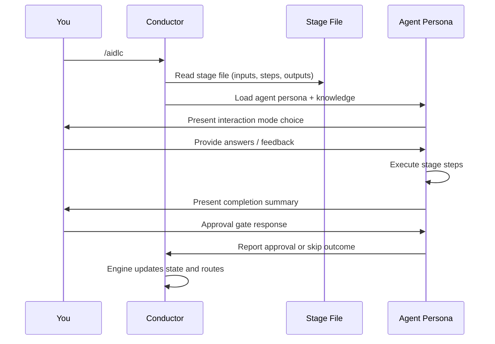
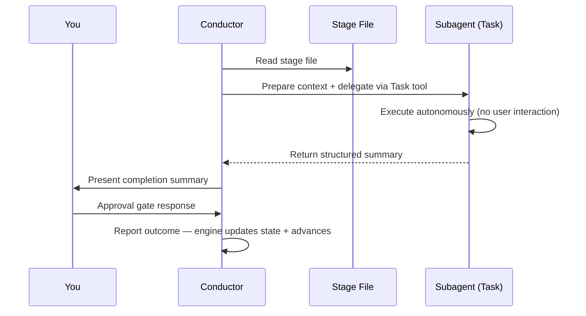

# 最初のワークフロー

この章では、AI-DLC のワークフローを一通り走らせ、各ステップで何が見えて、何を決めるかを追います。例は `feature` スコープで REST API を作る流れです。Classic、Express、Feature などの選び方は、利用者向けの比較として [ワークフロープロファイル](workflow-profiles.md) を見てください。

> **注**: この章のログは **Claude Code** のものです。Kiro CLI、Kiro IDE、Codex CLI、opencode でも、ワークフローそのもの（ステージ、エージェント、ゲート、成果物）は同じです。Claude 専用の歓迎バナーとカスタム AI-DLC ステータスラインは出ません。Kiro と opencode では `/aidlc --status`、Codex では `$aidlc --status` と組み込みの `update_plan` 進捗表示を使います。差分の一覧は、各ハーネスの章（[他ハーネスで動かす](harnesses/README.md)）にあります。

---

## ワークフローを始める

```
/aidlc Build a REST API for inventory management
```

セッション開始時、Claude Code は `settings.json` の `companyAnnouncements` で AI-DLC の歓迎メッセージを出します。仕組みの説明、ステージマップ、スコープの選択肢が並びます。（`companyAnnouncements` は Claude Code だけの設定です。他ハーネスに相当はなく、バナーは出ず、すぐ下の Initialization から始まります。）

```
# Welcome to AI-DLC

**AI-DLC** (AI-Driven Development Life Cycle) is an adaptive methodology that
structures AI-assisted software development into repeatable, traceable phases
while keeping you in control at every decision point.

## How It Works

- **You decide, AI executes.** Every material decision goes through an approval gate.
- **Adaptive scope.** Choose a scope or let AI auto-detect from your intent.
- **Traceable artifacts.** Every stage produces versioned documents in the intent's record dir.
- **11 domain experts.** Specialized agent personas guide each stage.
```

### 既存の文書から始める

ビジョン文書、PRD、ブリーフの置き場所に決まりはありません。テキストや Markdown を直接読ませるときは、最初の依頼でパスを一つだけ指定します。例: `/aidlc Read ./vision.md and build what it describes`。相対パスはプロジェクトルート基準です。ファイル名での探索、シンボリックリンクの追跡、プロジェクト外の読み取りはしません。パスが無い、または曖昧だと、確認のために止まります。

文書の中身を依頼に貼ることもできます。方向と文書データを分けるため、文書ブロックは末尾に一つだけ置きます:

```text
/aidlc Build the product described below.
<document>
...vision document content...
</document>
```

区切られた中身は信頼できないデータであり、指示ではありません。複数行の入力は、行指向の状態ファイルの外、コミット対象の `<record>/project-description.json` に JSON 文字列として 1 本で残ります。`Project` フィールドは、文書ブロックの外にある依頼の一行プレビューだけなので、ワークフロー欄に似た Markdown 行がスコープやライフサイクル状態を書き換えられません。マーカーの不一致、入れ子、繰り返し、閉じマーカーのあとに続く内容、ブロック外に方向が無い文書は、ワークフローレコードを作る前に拒否されます。

PDF、Word、大きすぎるファイル、そのほか直接読めない形式は DocumentKB を使います。ファイルを `aidlc/spaces/<space>/knowledge/documents/` に置き、`/aidlc knowledge onboard <path>` を走らせ、できた document id を使います。文書のパス、ファイル名、中身は常に信頼できないデータとして扱い、指示にはしません。詳細は [DocumentKB](documentkb.md) です。

---

## Initialization フェーズ（自動）

Initialization の 3 ステージは `aidlc-utility intent-create` の中で決定論的に走ります。ツール呼び出しは 1 回、1 秒もかかりません。Initialization に人は関わりません。アクティブなスペースへ最初のインテントを自動作成し、ワークフロー用のレコードディレクトリを用意します。

### ステージ 0.1: Workspace Scaffold

フレームワークは最初のインテントと、そのレコードディレクトリ `aidlc/spaces/<space>/intents/<YYMMDD>-<label>/` を作ります（名前付きスペースを使わなければ `<space>` は `default`）。フォルダは、そのスコープが実際に走るフェーズだけです。存在する全フェーズではなく、計画がレコードに現れます。`feature` スコープは 5 つ全部。`bugfix` スコープは Ideation を飛ばしますがデプロイ系は残すので、`ideation/` は無く `operation/` はあります:

```
Intent created, record dir at aidlc/spaces/default/intents/<YYMMDD>-<label>/
  initialization/
  inception/
  construction/
  operation/
  verification/
Space-level dirs ensured:
  aidlc/spaces/default/knowledge/    (team knowledge, empty; you add files)
```

ステージごとのフォルダは最初からは作りません。ステージのフォルダ（例: `inception/requirements-analysis/`）は、そのステージが初めて成果物を書いたときに現れます。レコードには、何かを出した仕事だけが並びます。

### ステージ 0.2: Workspace Detection

決定論的なルールベースのスキャナが、プロジェクトの直下 1 段と、既知のソースディレクトリ（`src/`、`app/`、`lib/`、`pages/`、`components/`、`tests/`）を見ます。ソースファイル、フレームワーク設定、パッケージマニフェストから greenfield か brownfield かを分けます。トップレベルの合図が無いときは、名前が任意のサブディレクトリにも 1 段降りて探すので、ソースがコンテナフォルダ（例: `wordbook/`、`backend/`）に入っていても brownfield と判定されます。

### ステージ 0.3: State Initialization

オーケストレータは、インテントの `aidlc-state.md`（レコードディレクトリの下）に、スコープ、深度、テスト戦略、スキャナの分類に基づくステージ計画一式を書きます。入力も解析してスコープを確認します:

```
─── Scope Detection ───────────────────────────────────────────────────────────
Detected scope: feature (Standard depth, Standard test strategy, all 33 stages)
▸ Approve scope? [Yes / Change scope / Change depth / Change test strategy]
> Yes
```

判定されたスコープをそのまま使う、別のスコープ（例: `mvp`）に変える、深度やテスト戦略を調整する、が選べます。案内は [スコープ・深度・テスト戦略](05-scopes-and-depth.md) です。

---

## Ideation フェーズ（対話）

Initialization のあと、ワークフローは Ideation に入ります。ここからの各ステージは対話で、承認ゲートがあります。

### ステージ 1.1: Intent Capture (aidlc-product-agent)

Claude Code では、ターミナル下部のカスタム AI-DLC ステータスラインが更新されます（Kiro と opencode は `/aidlc --status`、Codex は `$aidlc --status` と組み込みの `update_plan` 進捗表示）:

```
[AIDLC] IDEATION > Intent Capture [▓▓▓▓▓░░░░░] 4/7 -- product
```

表示は、いまのフェーズ、ステージの表示名、フェーズ進捗バー、フェーズ進捗比、リードエージェントです。バーと比の範囲は同じで、いまのフェーズ内の `[x]` ステージを数えます。比が進むたびにバーも進みます。残りコンテキスト（`ctx:N%`）は右端に常に出ます。減るにつれて色が変わります。Claude Code では、最初の使用量畳み込みのあと `↑<in> ↓<out> $<usd>` も出ます。対象はアクティブなワークフローと、いまのトランスクリプト／セッションだけで、以前のワークスペース作業は含めません。使用量追跡（とこの区間）を止めるには `AIDLC_DISABLE_USAGE_TRACKING=1` を設定します。

aidlc-product-agent が、やり取りのモードを選ばせます:

```
▸ Choose interaction mode:
  (1) Guide Me — agent asks structured questions
  (2) Edit File — write directly to the artifact
  (3) Chat — freeform discussion
```

- **Guide Me** は、質問を一つずつ進める
- **Edit File** は、成果物を直接編集する
- **Chat** は、自由に話し、エージェントが決定を取り出す

各モードの詳細は [やり取りのモード](07-interaction-modes.md) です。ステージの途中でも切り替えられます。

### 承認ゲート

エージェントの仕事が終わると、完了サマリと承認ゲートが出ます:

```
# Intent Capture & Framing Complete

| Artifact | Contents |
|----------|----------|
| intent-statement.md | Problem statement, target users, success criteria |
| intent-capture-questions.md | 5 questions, all answered |

**Stage:** Intent Capture & Framing
**Review outcome:** One concern remains for your decision.
**Why now:** First review completed.

| ID | Severity | Location | Finding | Required action | Status |
|---|---|---|---|---|---|
| R-01 | Minor | aidlc/spaces/default/intents/260820-checkout/ideation/intent-capture/intent-statement.md > Success Criteria | The adoption target has no deadline | Add the date by which the adoption target should be reached | New |

**Decision options:**
- **Approve** - continue with the open findings accepted.
- **Request Changes** - return to the listed artifacts so the required actions can be addressed.

**Review:** `<record>/ideation/intent-capture/` (the intent's record dir)

▸ How would you like to proceed?
  (1) Approve — Continue to Market Research with open findings accepted
  (2) Request Changes — Return to the listed artifacts
```

安定した finding ID があるので、あとから同じ指摘が解消されたか、未解消か、リスクとして受け入れたかが分かります。**Approve** で未解消の指摘を受け入れて進めるか、**Request Changes** で列挙された成果物に戻ります。承認すると、レビューした成果物の外に `Accepted risk` が残るので、あとからの再検査でもその判断が保たれます。指摘を対象外として退けるときは、ID と理由を出します。普通の修正フィードバックでは未解消のままです。直し方の詳細は [やり取りのモード](07-interaction-modes.md) です。

承認のあと、進捗行が出ます:

```
Progress: 4/33 overall | 1/7 IDEATION stages complete. Next: Market Research
```

### 残りの Ideation ステージ

ワークフローは Market Research、Feasibility & Constraints、Scope Definition、Team Formation、Rough Mockups、Approval & Handoff と続きます。どれも同じ型です。エージェントが働き、人が見て、承認します。

一部のステージは **条件付き** で、スコープによって飛ばされます。飛ばすときは、オーケストレータが理由を出して自動で進みます。

---

## Inception フェーズ

Inception は要件を掘り下げ、解を設計します。ステージ 2.1（Reverse Engineering）は **パイプライン**（2 リンクの鎖）として走る点が目立ちます。コンダクターがコードスキャンを aidlc-developer-agent に委譲し、続けて aidlc-architect-agent が統合と成果物の書き出しをします。このステージが走るのは **brownfield**（既存コードベース）だけです。条件と 9 成果物は [Reverse Engineering と CodeKB](codekb.md) です。

```
─── Stage 2.1: Reverse Engineering (pipeline) ─────────────────────────────
Delegating to aidlc-developer-agent for code scan...
[Running in background — no interaction needed]
...
Developer scan complete. Delegating to aidlc-architect-agent for synthesis...
...
✓ 9 reverse engineering artifacts produced
```

残りの Inception ステージ（Requirements Analysis から Delivery Planning まで）は、人と一緒にインラインで走ります。

---

## Construction フェーズ

Construction は、レビューできるスライスで解を作ります。[ボルト](glossary.md) は、Delivery Planning (2.9) が計画した Construction の配達スライスです。1 つ以上のユニットに、Definition of Done、確信度の仮説、オーナーが付きます。**既定のウォークは stage-major**（あるステージを全ユニットに走らせてから次のステージ）で、その計画を実行時の境界としてはまだ使いません。**ウォーキングスケルトン** は計画上の最初のボルトです。既定のウォークでは、対象になる最初の Construction EXECUTE ステージがそのゲートになります。

```
Starting the first Bolt now: one build pass over the code, tests and
checks for a piece of the work. First step is Functional Design.
```

ウォーキングスケルトンは **常にゲート付き** です。Construction の最初のステージを人が見てから、残りの Construction が走ります。承認の直後、**ラダープロンプト** が一度だけ出ます:

```
The walking skeleton shipped. How should the remaining Bolts run?
  ▸ Continue autonomously
  ▸ Gate every Bolt
```

答えは `aidlc-state.md` の `Construction Autonomy Mode` に残り、このワークフローの残りの Construction *ステージ* ゲートを支配します（セッション再開でも尊重されます）。ステージ 3.5（Code Generation）はユニットごとにサブエージェントとして走ります。そのステージファイルにあるユニット単位の完了ゲートは抑えられ、最後のユニットが落ち着いたあとにステージ単位のゲートが 1 回代わります（スウォームでは、最後の DAG バッチのあと）。

依存が満たされ、互いに依存しないユニットは **並行バッチ** で走ります。オーケストレータは 1 ターンで複数の `Task` 呼び出しを出します。失敗したときは、自律モードを選んでいても、必ず止まって retry / skip / abort を尋ねます。

全ユニットの per-unit ステージが落ち着いたあと、ステージ 3.6（Build and Test）と 3.7（CI Pipeline）が解全体に対して一度走ります。

---

## Operation フェーズ

Operation は解をデプロイし、監視します。7 ステージすべてが条件付きです。`mvp` や `poc` のような小さいスコープでは、フェーズごと飛ばすことがあります。

最後のステージ（4.7 Feedback & Optimization）のあと、ワークフローは完了です。

---

## 実行モードの仕組み

ワークフロー全体を通して、実行モードは二つあります。

### インライン実行

ほとんどのステージはインラインです。コンダクターがエージェントのペルソナを載せ、会話の中でステージ手順を実行します。人とリアルタイムでやり取りします。



<!-- Text fallback: You invoke /aidlc. The conductor reads the stage file and loads the agent persona with knowledge. The agent presents an interaction mode, you provide input, the agent executes steps and presents a completion summary. You respond at the approval gate, and the conductor reports the outcome so the engine advances state. -->

### サブエージェントへの委譲

バックグラウンドのサブエージェントに出すのは 4 ステージです。2.1 Reverse Engineering（パイプライン: 開発者スキャン、続けてアーキテクトの統合と書き出し）、2.2 Practices Discovery（サブエージェントのハブ＆スポーク: リード下書き、互いに見えない 3 つの支援レビュー、人へのインタビュー、リード統合）、2.4 User Stories（モブ: 協力者が並行で寄与し、判断が分かれたものはステージ途中で人に出ることがある）、3.5 Code Generation（サブエージェント）。Practices Discovery は、スポークと最終統合のあいだで人を部屋に入れます。User Stories のモブも、判断をステージ途中で出すことがあります。ワークスペース検出（0.2）はサブエージェントではなく、`aidlc-utility intent-create` の中で決定論的に走ります。



<!-- Text fallback: The conductor reads the stage file, prepares context, and delegates via the Task tool. The subagent executes autonomously without user interaction and returns a structured summary. The conductor presents the summary to you, you respond at the approval gate, and the conductor reports the outcome so the engine advances state. -->

---

## できる成果物

`feature` スコープのワークフローが終わると、インテントのレコードディレクトリ（`aidlc/spaces/<space>/intents/<YYMMDD>-<label>/`）には次があります:

```
aidlc/spaces/<space>/intents/<YYMMDD>-<label>/
├── aidlc-state.md          # Workflow state (all stages marked [x])
├── audit/                  # Full decision audit trail (per-clone shards, merged by timestamp)
├── ideation/               # Intent, market research, scope, mockups
├── inception/              # Requirements, stories, design, units
├── construction/           # Per-unit code + test artifacts
├── operation/              # Deployment, observability, incident plans
└── verification/           # Phase boundary verification reports
```

（チームナレッジは一段上、スペース単位の `aidlc/spaces/<space>/knowledge/` にあります。`intents/` の兄弟なので、どのインテントでも積み上がります。チームが確認したプラクティスと学びは、アクティブスペースのメモリ層 `aidlc/spaces/<active-space>/memory/` に並び、こちらもインテントをまたいで残ります。）

---

## ステータスライン

Claude Code では、カスタム AI-DLC ステータスラインがいまの位置を示します（Kiro と opencode は `/aidlc --status` と各ゲートの進捗行、Codex は `$aidlc --status` と組み込みの `update_plan` 進捗表示）:

```
[AIDLC] IDEATION > Intent Capture [▓▓▓▓▓░░░░░] 4/7 -- product
```

| 区間 | 意味 |
|---------|---------|
| `IDEATION` | いまのフェーズ |
| `> Intent Capture` | いまのステージの表示名 |
| `[▓▓▓▓▓░░░░░]` | フェーズ進捗バー（10 文字。`n/m` 比と同じ範囲） |
| `4/7` | フェーズ内のステージ進捗 |
| `-- product` | このステージのリードエージェント |
| `ctx:N%` | 残りコンテキスト（常に表示。減るにつれて色が変わる） |
| `↑<in> ↓<out> $<usd>` | アクティブなワークフローと、いまのトランスクリプト／セッションのトークン使用量と課金可能なコスト（Claude Code のみ。使用量が取れるまで省略。`AIDLC_DISABLE_USAGE_TRACKING=1` で無効） |

---

## 次に読む

- [スペースとインテント](03-spaces-and-intents.md) — ワークスペースが複数の実行をどう抱え、始め、切り替えるか
- [フェーズとステージ](04-phases-and-stages.md) — 5 フェーズ・33 ステージの内訳
- [やり取りのモード](07-interaction-modes.md) — Guide Me、Edit File、Chat の説明
- [セッション管理](11-session-management.md) — 再開、やり直し、ステージ間のジャンプ
- [用語集](glossary.md) — 用語の定義
