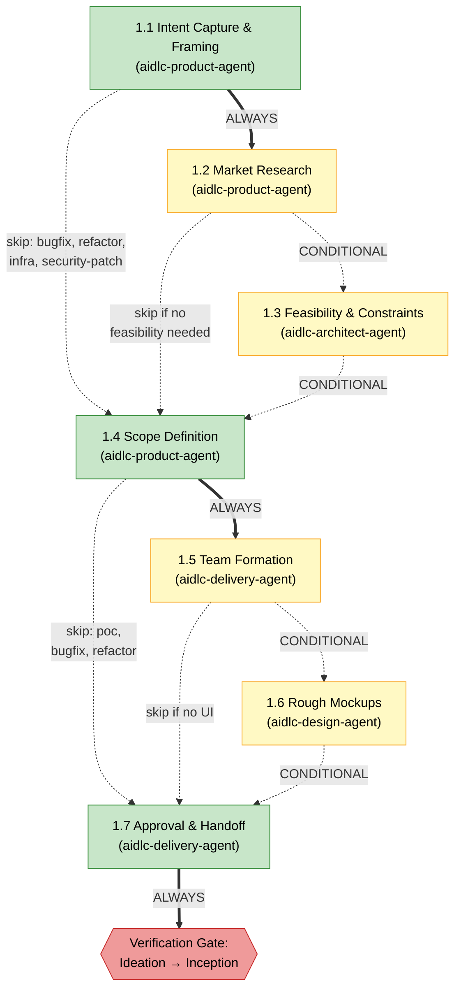
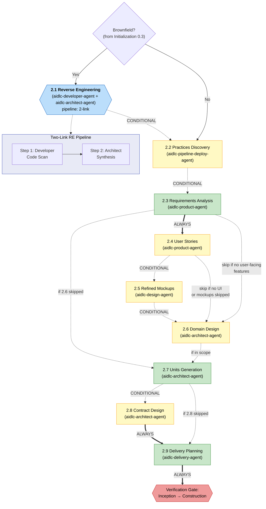
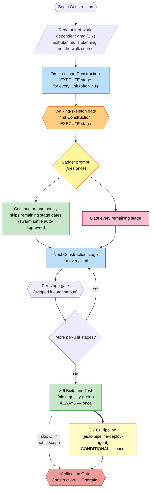
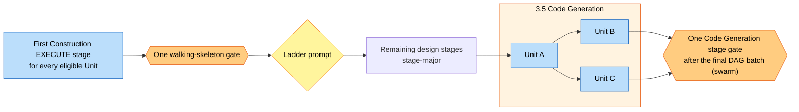
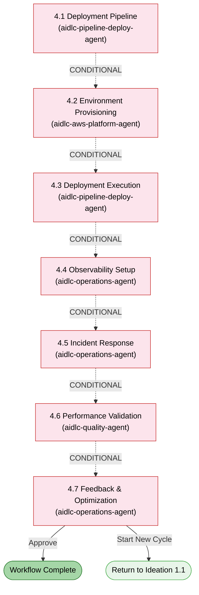

# Phases and Stages

AI-DLC のライフサイクルは 5 フェーズ、33 ステージです。この章ではフェーズごとに中身を並べ、つながりを示します。

> **Harness note.** 方法論 — フェーズ、ステージ、エージェント、ゲート — はどのハーネスでも同じです。ゲートの出方、サブエージェントの出し方、設定の置き場所など、ハーネスで違うところは、そのハーネスの章に表でまとめています: [Running on other harnesses](harnesses/README.md)。例は注記がなければ Claude Code です。

---

## Lifecycle Overview

```mermaid
graph LR
    subgraph INITIALIZATION["INITIALIZATION (0.1-0.3)"]
        Z1["Workspace Scaffold"]
        Z4["State Init"]
        Z1 -.->|"3 stages"| Z4
    end

    subgraph IDEATION["IDEATION (1.1-1.7)"]
        I1["Intent Capture"]
        I7["Approval & Handoff"]
        I1 -.->|"7 stages"| I7
    end

    subgraph INCEPTION["INCEPTION (2.1-2.9)"]
        N1["Reverse Engineering"]
        N7["Delivery Planning"]
        N1 -.->|"9 stages"| N7
    end

    subgraph CONSTRUCTION["CONSTRUCTION (3.1-3.7)"]
        C1["Functional Design"]
        C7["CI Pipeline"]
        C1 -.->|"3.1–3.5 stage-major per Unit; 3.6–3.7 once after all Units"| C7
    end

    subgraph OPERATION["OPERATION (4.1-4.7)"]
        O1["Deployment Pipeline"]
        O7["Feedback & Optimization"]
        O1 -.->|"7 stages"| O7
    end

    Z4 -->|"auto-proceed"| I1
    I7 -->|"Verification Gate 1"| N1
    N7 -->|"Verification Gate 2"| C1
    C7 -->|"Verification Gate 3"| O1
    O7 -.->|"Feedback Loop"| I1

    style INITIALIZATION fill:#f3e5f5,stroke:#9c27b0,color:#000
    style IDEATION fill:#e8f5e9,stroke:#4caf50,color:#000
    style INCEPTION fill:#e3f2fd,stroke:#2196f3,color:#000
    style CONSTRUCTION fill:#fff3e0,stroke:#ff9800,color:#000
    style OPERATION fill:#fce4ec,stroke:#e91e63,color:#000
```

<!-- Text fallback: 線形の流れ。INITIALIZATION (0.1-0.3) は自動で IDEATION (1.1-1.7) へ進む。Ideation は Verification Gate 1 を通って INCEPTION (2.1-2.9) へ、Verification Gate 2 を通って CONSTRUCTION (3.1-3.7) へ、Verification Gate 3 を通って OPERATION (4.1-4.7) へ。4.7 から 1.1 へ戻るフィードバックループがある。 -->

フェーズは順に進みます。フェーズの境（Initialization → Ideation を除く）では **検証ゲート** が自動でトレーサビリティを見ます。欠けたリンク、孤立した成果物、不整合を、下流が積み上げる前に拾います。

---

## Phase 0: Initialization

**目的:** ワークスペースを立ち上げる — docs ディレクトリを足場にし、ワークスペースを検出し、状態を初期化する。ウェルカムメッセージはステージではなく、セッション開始時に `settings.json` の `companyAnnouncements` で出します。

Initialization のステージは承認ゲートなしで **自動** に走ります。3 つとも、1 秒もかからない決定論的なツール呼び出し（`aidlc-utility intent-create`）の中で完了します。

| # | Stage | Lead | Key Artifacts | Condition |
|---|-------|------|---------------|-----------|
| 0.1 | Workspace Scaffold | orchestrator | 最初のインテントのレコードディレクトリ（`aidlc/spaces/<space>/intents/<YYMMDD>-<label>/`） | ALWAYS |
| 0.2 | Workspace Detection | orchestrator | `aidlc-state.md`（ワークスペース状態） | ALWAYS |
| 0.3 | State Initialization | orchestrator | `aidlc-state.md`、`audit/` シャード | ALWAYS |

**実行の補足:**
- 3 ステージとも `aidlc-utility intent-create` の中でインラインに走る。LLM サブエージェントへの委譲も、ステージごとのプロンプトも無い
- ワークスペース検出はルールベースのスキャナ（拡張子、既知の設定ファイル名、パッケージマニフェスト）
- このフェーズでは人の操作は要らない

---

## Phase 1: Ideation

**目的:** 取り組みを確かめる — インテントを捉え、実現性を見、スコープを決め、チームを組み、進めてよいか承認を取る。

<!-- Text fallback: 1.1 Intent Capture（ALWAYS）は 1.2 Market Research（CONDITIONAL）へ、または直接 1.4 へ。1.2 は 1.3 Feasibility（CONDITIONAL）へ、または 1.4 へ。1.3 は 1.4 Scope Definition（ALWAYS）へ。1.4 は 1.5 Team Formation（CONDITIONAL）へ、または 1.7 へ。1.5 は 1.6 Rough Mockups（CONDITIONAL、UI が無ければ飛ばす）へ、または 1.7 へ。1.6 は 1.7 Approval & Handoff（ALWAYS）へ、そのあと Verification Gate 1。 -->

| # | Stage | Lead | Supporting | Key Artifacts | Condition |
|---|-------|------|-----------|---------------|-----------|
| 1.1 | Intent Capture & Framing | aidlc-product-agent | aidlc-architect-agent | インテント声明、ステークホルダーマップ | ALWAYS |
| 1.2 | Market Research | aidlc-product-agent | — | 競合分析、build-vs-buy | CONDITIONAL |
| 1.3 | Feasibility & Constraints | aidlc-architect-agent | aidlc-aws-platform-agent、aidlc-compliance-agent | 実現性評価、制約レジスタ、RAID ログ | CONDITIONAL |
| 1.4 | Scope Definition | aidlc-product-agent | aidlc-delivery-agent | スコープ定義、インテントバックログ | ALWAYS |
| 1.5 | Team Formation | aidlc-delivery-agent | — | チーム評価、モブ編成計画 | CONDITIONAL |
| 1.6 | Rough Mockups | aidlc-design-agent | aidlc-product-agent | ワイヤーフレーム、ユーザーフロー、コンセプトデッキ | CONDITIONAL |
| 1.7 | Approval & Handoff | aidlc-delivery-agent | aidlc-product-agent | イニシアチブブリーフ、意思決定ログ | ALWAYS |

**ステージの色:** 緑 = ALWAYS（選んだスコープに入っていれば走る）。黄 = CONDITIONAL（スコープ、プロジェクト種別、計画によって飛ばすことがある）。スコープごとの所属は [Stage-by-Scope Matrix](05-scopes-and-depth.md#stage-by-scope-matrix) を見てください。

Intent Capture は最初の説明、ワークフローで選んだスコープ、使ったメモリルールを questions ファイルに残します。インテント声明とステークホルダーマップの主張にはインラインのソースタグが付き、どちらも前提と未決の問いを表に出します。残す前提は、Product Lead のレビューと承認ゲートの前に、明示の確認が要ります。

---

## Phase 2: Inception

**目的:** 要件を膨らませる — コードベースを読み、要件を引き出し、アーキテクチャを設計し、作業ユニットに分解し、デリバリーを計画する。

<!-- Text fallback: brownfield 判定（ステージ 0.3 から）。Yes なら 2.1 Reverse Engineering が 2 段パイプラインで走る（開発のコードスキャン、そのあとアーキテクトの合成と書き出し）。続けて 2.2 Practices Discovery が、入っているスコープすべてでハブ＆スポークとして走る（リード下書き、互いに見えない quality / developer / devsecops のスポーク、人へのインタビュー、リード統合）。確認した仕事はアクティブスペースのメモリへ昇格する。次は 2.3 Requirements Analysis（ALWAYS）、任意の 2.4 User Stories モブ、任意の 2.5 Refined Mockups、任意の 2.6 Domain Design、2.7 Units Generation（ALWAYS）、任意の 2.8 Contract Design、2.9 Delivery Planning（ALWAYS）。そのあと Verification Gate 2。 -->

| # | Stage | Lead | Supporting | Key Artifacts | Condition |
|---|-------|------|-----------|---------------|-----------|
| 2.1 | Reverse Engineering | aidlc-developer-agent | aidlc-architect-agent | RE 成果物 9 点 | brownfield プロジェクト |
| 2.2 | Practices Discovery | aidlc-pipeline-deploy-agent | aidlc-quality-agent、aidlc-developer-agent、aidlc-devsecops-agent | `team-practices.md`、`discovered-rules.md`、`evidence.md`（確認後に `aidlc/spaces/<active-space>/memory/team.md` / `project.md` へ昇格） | CONDITIONAL |
| 2.3 | Requirements Analysis | aidlc-product-agent | — | `requirements.md` | ALWAYS |
| 2.4 | User Stories | aidlc-product-agent | aidlc-design-agent、aidlc-developer-agent、aidlc-quality-agent | `stories.md`、`personas.md` | ユーザー向け機能があるとき |
| 2.5 | Refined Mockups | aidlc-design-agent | aidlc-product-agent | ハイファイモック、インタラクション仕様 | UI プロジェクト |
| 2.6 | Domain Design | aidlc-architect-agent | aidlc-aws-platform-agent、aidlc-design-agent | `components.md`、`decisions.md`（ADR） | 実行計画に従う |
| 2.7 | Units Generation | aidlc-architect-agent | aidlc-delivery-agent | `unit-of-work.md`、`unit-of-work-dependency.md`（DAG）、`unit-of-work-story-map.md` | ALWAYS |
| 2.8 | Contract Design | aidlc-architect-agent | aidlc-aws-platform-agent | `contract-summary.md` | CONDITIONAL |
| 2.9 | Delivery Planning | aidlc-delivery-agent | aidlc-architect-agent | `bolt-plan.md`、`team-allocation.md`、`risk-and-sequencing-rationale.md`、`external-dependency-map.md` | ALWAYS |

**動きの要点:** ステージ 2.1 は **パイプライン**（2 段チェーン）です。先に aidlc-developer-agent がコードをスキャンし、続けて aidlc-architect-agent が合成して成果物を書きます。戻るたびに順序付きの永続レシートが残り、複数リポジトリでは承認の前にリポジトリごとに鎖が 1 本完走する必要があります。走るのは brownfield だけです。ステージ 2.2 は greenfield / brownfield とも **サブエージェントのハブ＆スポーク** です。リードが下書きし、quality / developer / devsecops が互いに見えないまま点検し、人へのインタビューで穴を埋め、リードが統合します。ステージ 2.4 は **モブ** です。リードが下書きし、design / developer / quality が寄与ファイルで並行に足します。

---

## Phase 3: Construction

**目的:** 解を作る — 設計、実装、テストを、レビューできる薄さで進める。

### Why Construction works the way it does

Construction は以前、[作業ユニット](glossary.md) ごとにステージを順に回し、ステージのたびに承認ゲートを置いていました。ユニット 3 つの案件なら、テスト済みのコードが 1 行も出る前にゲートが 15 回です。利用者はお守りだ、と言いました。

最初の直しは、質問も設計成果物もコード生成も全ユニットまとめて、最後に一度レビューする形でした。今度は逆に振り切れます。ユニット 15 の実行では、Build and Test のゲートに 15,000 行が一度に落ちる。一度のレビューでは見切れません。

いまの形はその中間です。Construction の **既定ウォークは stage-major** — あるステージを全ユニットに走らせてから、次のステージへ。[ボルト](glossary.md) は 2.9 で計画する Construction のデリバリーのまとまりです（ユニット 1 つ以上、DoD、確信度の仮説、オーナー）。`bolt-plan.md` は計画の中身であり、エンジンはユニットのまとまりやウォーク順には使いません。実行時バッチは `unit-of-work-dependency.md`（2.7）から出ます。`Construction Iteration: unit-major` は任意のウォークで、昔の文書が既定として書いていたものです。**ウォーキングスケルトン** は計画上の最初のボルトです。既定ウォークでは、対象になる最初の Construction EXECUTE ステージがそのゲートです。そのゲートが承認されたあと、**ラダープロンプト** がちょうど一度出ます。答えは状態に残り、残りの Construction *ステージ* ゲートを支配します。ステージ 3.6（Build and Test）と 3.7（CI Pipeline）は最後に、全体に対して一度だけ走ります。

この形は、早い確信度の点検と、自律するかどうかの意図した選択をくれます。レビューできるまとまりは、いまでも 2.9 でボルトとして計画します。配布のウォークは、まだそのまとまりを実行時の境界としては使いません。

### Construction flow

<!-- Text fallback: Construction 開始 → ユニット DAG のために unit-of-work-dependency.md を読む（bolt-plan.md は計画） → 対象の最初の Construction EXECUTE ステージを全ユニットに走らせる → walking-skeleton ゲート → ラダープロンプト（自律なら残りのステージゲートを飛ばす、gated なら残す） → 残りは stage-major、Code Generation が最後 → 3.6 Build and Test、任意で 3.7 CI Pipeline → Verification Gate 3。 -->

### Parallel Unit batches

2 つのユニットが同じ依存前提を共有し（例: ユニット B と C がどちらも A にだけ依存する）、互いに依存していなければ **バッチ** になります。設計ステージはそのバッチに `directive.wave` を出せます。Code Generation は兄弟ユニットを同時に出せます。自律スウォームでは、エンジンが DAG バッチをすべて収束させてから、Code Generation のステージゲートを **1 回** 出します。中間バッチごとではありません。

<!-- Text fallback: 対象になる全ユニットに最初の Construction EXECUTE ステージを走らせ、walking-skeleton ゲート 1 回とラダープロンプト。残りの設計ステージは stage-major のまま。Code Generation ではユニット A が B と C の封鎖を解けば、その 2 つは並行バッチになり得る。自律スウォームでは、最後の DAG バッチが収束したあと、Code Generation のステージゲートが 1 回、そのステージを覆う。 -->

コンダクター（生きている `/aidlc` セッション）は、1 ターンで複数の `Task` を出して、並行の Code Generation ユニットを派遣します。設計ステージはエンジン駆動のユニットごと（または wave）の経路に残ります。`BOLT_STARTED` / `BOLT_COMPLETED` はスウォーム経路でユニット／worktree ごとに発火し、`SWARM_COMPLETED` がバッチを閉じます。既定の gated 実行では、これらの `BOLT_*` 行は残りません。

### Halt-and-ask on failure

失敗は、自律モードでも Construction を止めます。自律で止まるもう一つの場合は、Build-and-Test ループバックの 4 段目です。

- 単独ユニットの Code Generation が失敗したら、Construction はすぐ止まり、**retry**（そのユニットだけ再実行）、**skip**（`[S]` を付けて続ける — 依存側も失敗しやすい）、**abort** を出します。
- 並行バッチの 1 ユニットが失敗し、ほかが成功したら、コンダクターはバッチ全体の完了を待ち、成功したユニットの成果物はディスクに残し、失敗したユニットだけに同じ retry / skip / abort を出します。

### Stage reference

| # | Stage | Lead | Supporting | Key Artifacts | Runs |
|---|-------|------|-----------|---------------|------|
| 3.1 | Functional Design | aidlc-architect-agent | aidlc-developer-agent | `entities.md`、`rules.md`、`functional-spec.md` | ユニットごと（実行計画で CONDITIONAL） |
| 3.2 | NFR Requirements | aidlc-architect-agent | aidlc-devsecops-agent、aidlc-compliance-agent、aidlc-quality-agent | 性能、セキュリティ、スケーラビリティ、信頼性、可観測性の NFR | ユニットごと（CONDITIONAL） |
| 3.3 | NFR Design | aidlc-architect-agent | aidlc-aws-platform-agent | NFR 設計仕様 | ユニットごと（CONDITIONAL） |
| 3.4 | Infrastructure Design | aidlc-aws-platform-agent | aidlc-devsecops-agent、aidlc-compliance-agent | インフラ仕様、IaC 設計 | ユニットごと（CONDITIONAL） |
| 3.5 | Code Generation | aidlc-developer-agent | — | アプリケーションコード + コード文書 | ユニットごと（ALWAYS） |
| 3.6 | Build and Test | aidlc-quality-agent | aidlc-devsecops-agent | テスト結果、品質レポート | ALWAYS、最後に一度 |
| 3.7 | CI Pipeline | aidlc-pipeline-deploy-agent | — | CI 設定、品質ゲート | CONDITIONAL、最後に一度 |

**動きの要点:**

- 既定ウォークは stage-major。あるステージの質問と成果物を全ユニットに走らせてから、次のステージへ。配布のウォークにボルト単位の answers ゲートは無い
- `stages/construction/code-generation.md` の中のユニット完了ゲートは、通常の Construction では **コンダクターが抑える**。最後のユニットが落ち着いたあとに、ステージ単位のゲート 1 回が代わりになる。スウォームでは、そのゲートは最後の DAG バッチを待つ
- ラダープロンプトはワークフローにつきちょうど一度 — 最初の Construction EXECUTE ステージゲートのあと。答えは `aidlc-state.md` の `Construction Autonomy Mode` に残り、セッション再開でも守られる。既定ウォークでは、`autonomous` は残りのステージゲートを飛ばす（halt-and-ask、Build-and-Test ループバックの 4 段目、スウォーム settle 再入場は除く。自律では settle 再入場は自動承認）。unit-major はスウォームを抑えるが、ステージごとのゲート連鎖は **残す**
- 並行の Code Generation バッチには、`Task` を複数出せるサブエージェント枠が要る。同時実行の制約は [Agents](06-agents.md)

---

## Phase 4: Operation

**目的:** デプロイして回す — デプロイパイプライン、環境の用意、可観測性、フィードバックループを置く。

<!-- Text fallback: Operation のステージはすべて CONDITIONAL。4.1 から 4.7 は順に進む。ステージ 4.7 はワークフローを完了するか、Ideation 1.1 から新しいサイクルを始める。 -->

| # | Stage | Lead | Supporting | Key Artifacts | Condition |
|---|-------|------|-----------|---------------|-----------|
| 4.1 | Deployment Pipeline | aidlc-pipeline-deploy-agent | — | CD 設定、デプロイ戦略、ロールバックランブック | CONDITIONAL |
| 4.2 | Environment Provisioning | aidlc-aws-platform-agent | aidlc-devsecops-agent、aidlc-compliance-agent | 環境インベントリ、検証レポート | CONDITIONAL |
| 4.3 | Deployment Execution | aidlc-pipeline-deploy-agent | aidlc-developer-agent | デプロイログ、スモークテスト、ヘルスチェック | CONDITIONAL |
| 4.4 | Observability Setup | aidlc-operations-agent | — | ダッシュボード、アラーム、SLO 設定 | CONDITIONAL |
| 4.5 | Incident Response | aidlc-operations-agent | — | SSM ランブック、インシデント計画、エスカレーションマトリクス | CONDITIONAL |
| 4.6 | Performance Validation | aidlc-quality-agent | — | 負荷試験結果、NFR 検証マトリクス | CONDITIONAL |
| 4.7 | Feedback & Optimization | aidlc-operations-agent | aidlc-aws-platform-agent | SLO レポート、コスト分析、フィードバックループ文書 | CONDITIONAL |

**動きの要点:**
- 7 ステージすべて **conditional** — `mvp` と `poc` スコープではフェーズごと飛ばせる
- ステージ 4.7 は **終端ステージ** — 承認でワークフロー完了
- 4.7 から 1.1 へ戻る **フィードバックループ** で、開発サイクルを繰り返せる

---

## Phase Transitions and Verification Gates

フェーズの境（Ideation → Inception、Inception → Construction、Construction → Operation）では、フレームワークが **フェーズ境界検証** を走らせます。自動検査の対象は次です。

- 終わるフェーズの必須成果物が揃っている
- 成果物間のトレーサビリティリンクが切れていない（例: 要件がストーリーに対応している）
- 孤立した成果物や欠けた参照が無い
- 関連する成果物同士が矛盾していない

検証が落ちたら、コンダクターは問題を報告し、進めるか戻って直すかを聞きます。

---

## Stage Execution Modes Reference

| Mode | Stages | User Interaction | Description |
|------|--------|-----------------|-------------|
| Inline（自動進行） | 0.1、0.2、0.3 | なし | `aidlc-utility intent-create` の中で決定論的に走る。承認ゲート無し |
| Inline | 29 ステージ | 全部 | エージェントが会話の中で進み、末尾に承認ゲート |
| Subagent | 2.2、3.5 | 2.2 はプラクティスインタビュー + 最終ゲート。3.5 は承認ゲート | ハブ＆スポークの Practices Discovery。集中した Code Generation |
| Pipeline（2 段） | 2.1 | 承認ゲートだけ | 開発のスキャン、そのあとアーキテクトの合成と書き出し |
| Mob | 2.4 | ステージ途中の判断質問 + 承認ゲート | リードが下書き。design / developer / quality が寄与ファイルで並行に協働 |

33 ステージ全体のトポロジは **インライン 29 / サブエージェント 2 / パイプライン 1 / モブ 1** です。

---

## Next Steps

- [Scopes, Depth, and Test Strategy](05-scopes-and-depth.md) — どのステージが走るかはスコープが決める。全表は [Stage-by-Scope Matrix](05-scopes-and-depth.md#stage-by-scope-matrix)
- [Agents](06-agents.md) — エージェント 14 体の編成。領域、レビュー、コンポーズの役
- [Your First Workflow](02-your-first-workflow.md) — 注釈付きの通し
- [Glossary](glossary.md) — 用語
