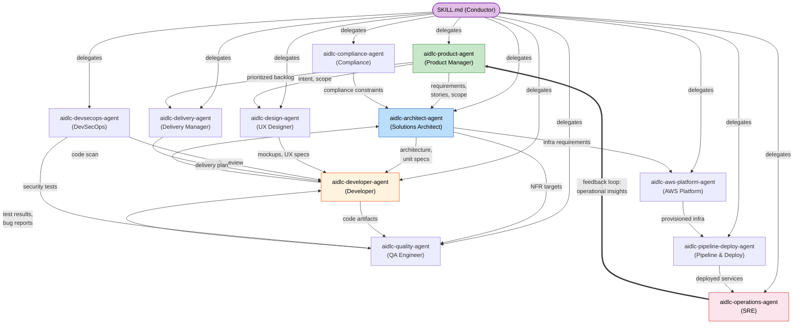

# エージェント

AI-DLC が配るペルソナは 14 体です。領域の専門家 11 がステージを進め、レビュー専用が 2、適応型ワークフローのコンポーザーが 1 です。この章は編成の全体です。領域エージェントから入り、レビュアーとコンポーザーへ進みます。

---

## 考え方: 少人数のモブ、守備の広いエージェント

狭い専門家を何十人も置くと、ウォーターフォールの受け渡しが再現されます。AI-DLC は **守備の広いエージェント 11** が、複数のステージとフェーズにまたがって働きます。

### なぜ 11 で、30 ではないのか

人間の開発チームでは、3〜5 人のモブが要件からデプロイまで一機能を持ちます。一人が一つの専門だけ、にはしません。AI-DLC も同じです。

- **一体が、領域全体を多くの仕事で持つ。** `aidlc-architect-agent` は feasibility、domain design、units generation、contract design、functional design、NFR requirements、NFR design まで、3 フェーズ・7 ステージです。狭い専門家モデルなら、ほぼ同じナレッジを持つエージェントが 7 体要ります。

- **エージェントが少なければ、引き継ぎも少ない。** 境界は毎回、情報が落ちる場所です。Domain Design も Functional Design も同じ `aidlc-architect-agent` がリードすれば、文脈は自然に残ります。引き継ぎ用の成果物を別途用意しなくて済みます。

- **サポート役で、増やさずに協働する。** セキュリティ専用、コンプライアンス専用、コスト専用のレビュアーを別体にせず、`aidlc-devsecops-agent` と `aidlc-compliance-agent` が、他エージェントがリードするステージでサポートとして入ります。入り方はステージの `mode`（通信トポロジ）です。`inline` ではコンダクターが自分の文脈でサポートのペルソナをまといます。`subagent`（ハブ＆スポーク）と `mob`（メッシュ）では、サポートを独立した協力者として出し、各自が寄与ファイルを書き、リードが統合します（書くのは全員、最終成果物の所有はリード。配布のモブ見本は user-stories）。`pipeline`（チェーン）ではリンクが成果物を順に進め、戻るたびに完了の証拠を順に残します（配布のチェーンは reverse-engineering）。どのトポロジでも委譲するのはコンダクターです。エージェント同士は呼び合いません。

- **ナレッジの読み込みはエージェント単位。** 方法論ナレッジは `.claude/knowledge/<agent-name>/`、チームナレッジはスペースの `aidlc/knowledge/<agent-name>/`（チームが作っていれば）です。エージェントが少なければ、管理するナレッジディレクトリも少なく、矛盾した案内も入りにくいです。

---

## エージェントの協働マップ

ワークフロー中にエージェントが情報を渡す様子です。実線は主成果物の流れ、破線は助言やレビューです。operations から product へのフィードバックが、ライフサイクルを閉じます。

<!-- テキスト代替: SKILL.md のコンダクターが 11 体すべてに委譲する。主な流れ: aidlc-product-agent が要件とストーリーを aidlc-architect-agent へ渡し、そこから仕様が aidlc-developer-agent へ行く。aidlc-developer-agent がコードを aidlc-quality-agent へ渡し、テスト結果が戻る。aidlc-aws-platform-agent がインフラを用意し、aidlc-pipeline-deploy-agent がデプロイし、aidlc-operations-agent が運用する。フィードバック: aidlc-operations-agent の運用知見が aidlc-product-agent に戻り、一周する。 -->

---

## 領域エージェント 11

> **配布エージェントの知識を寄せたいとき。** `.claude/agents/*.md` の 14 ファイルは触らないでください。フレームワークファイルで、アップグレード時に上書きされます。会社の標準はスペースの `aidlc/knowledge/<agent-name>/` に足します。手順は [ナレッジ](08-knowledge.md) です。*新しい*エージェントが欲しいチームは、必須 frontmatter 付きで `.claude/agents/<slug>.md` を置けばよく、そのファイルは利用者の所有です。[コントリビュート: エージェントの追加](../reference/11-contributing.md#adding-an-agent) を見てください。

各エージェントには **詳細ページ** があります。担当、リードとサポートのステージ、読むナレッジです。[エージェント詳細の索引](agents/README.md) に 11 体すべてがあり、各見出しからもリンクしています。

### [aidlc-product-agent](agents/product-agent.md)

**領域:** 要件、ユーザーストーリー、スコープ、市場調査

プロダクトマネージャ兼ビジネスアナリストです。意図を取り、市場を調べ、スコープを決め、要件を引き出し、ユーザーストーリーを書きます。Ideation と Inception でいちばん動きます。

- **リード:** intent-capture, market-research, scope-definition, requirements-analysis, user-stories
- **サポート:** rough-mockups, approval-handoff, refined-mockups
- **専用ツール:** WebSearch（市場調査）

### [aidlc-design-agent](agents/design-agent.md)

**領域:** UX/UI、ワイヤーフレーム、インタラクション、アクセシビリティ

ワイヤーフレーム、モック、インタラクション仕様を作ります。ユーザー向け機能では `aidlc-product-agent` と、実装可能性では `aidlc-developer-agent` と組みます。

- **リード:** rough-mockups, refined-mockups
- **サポート:** user-stories, domain-design
- **専用ツール:** WebSearch（デザイン調査）

### [aidlc-delivery-agent](agents/delivery-agent.md)

**領域:** チーム編成、キャパシティ、デリバリの順序

エンジニアリングマネージャです。チームの余力を見、モブの構成を決め、デリバリの順序を計画し、フェーズの引き継ぎを持ちます。

- **リード:** team-formation, approval-handoff, delivery-planning
- **サポート:** scope-definition, units-generation
- **専用ツール:** 共有セット以外なし

### [aidlc-architect-agent](agents/architect-agent.md)

**領域:** ドメイン設計、ドメインモデリング、NFR、コンポーネント分解

設計の中心です。ステージ関与がいちばん広く（3 フェーズ・10 ステージ）、`judgment` ティアを持ちます。同じティアは product、design、developer、quality、devsecops、compliance、aws-platform の 7 体です。`judgment` エージェントはセッションのモデルと effort を継ぐので、選んだ水準より下げられません。`templated` ティアなのは delivery、pipeline-deploy、operations だけです（Claude Code、Codex、opencode では中規模モデル・低 effort。Kiro、Cursor、Copilot では全ティアがセッションのモデルと effort を継ぐ）。出力の大半が、型にはまった計画、CI/CD YAML、ランブックの足場だからです。

- **リード:** feasibility, domain-design, units-generation, contract-design, functional-design, nfr-requirements, nfr-design
- **サポート:** intent-capture, reverse-engineering（synthesis）、delivery-planning

### [aidlc-aws-platform-agent](agents/aws-platform-agent.md)

**領域:** AWS インフラ、CDK/CloudFormation、コスト最適化

インフラを設計し、環境を用意し、コストを詰めます。AWS CLI と CDK のために Bash を持ちます。

- **リード:** infrastructure-design, environment-provisioning
- **サポート:** feasibility, domain-design, contract-design, nfr-design, feedback-optimization
- **専用ツール:** Bash（`aws`、`cdk`）

### [aidlc-compliance-agent](agents/compliance-agent.md)

**領域:** 規制スキャン、データ分類、リスク評価

助言だけです。リードするステージはありません。規制の拘束を、他エージェント（特に `aidlc-architect-agent` と `aidlc-devsecops-agent`）がリードするステージへ入れます。

- **リード:** なし（サポートのみ）
- **サポート:** feasibility, nfr-requirements, infrastructure-design, environment-provisioning
- **専用ツール:** WebSearch（規制調査）

### [aidlc-devsecops-agent](agents/devsecops-agent.md)

**領域:** 脅威モデリング、セキュリティスキャン、DevSecOps パイプライン

設計のセキュリティを見、セキュリティ要件を決め、CI/CD にセキュリティを載せます。`aidlc-compliance-agent` と同じくサポート役です。

- **リード:** なし（サポートのみ）
- **サポート:** practices-discovery, nfr-requirements, infrastructure-design, build-and-test, environment-provisioning
- **専用ツール:** Bash（セキュリティスキャン）

### [aidlc-developer-agent](agents/developer-agent.md)

**領域:** 実装、コード分析、データモデリング

3 フェーズにまたがります。Inception のリバースエンジニアリングから、Operation のデプロイ支援までです。既存コードベースを走査し、実装コードを生成します。

- **リード:** reverse-engineering（コード走査）、code-generation
- **サポート:** practices-discovery, user-stories, functional-design, deployment-execution

ワークスペース検出（workspace-detection）は以前、`aidlc-developer-agent` のサブエージェントでした。いまは `aidlc-utility intent-create` の中で、ファイルとマニフェストをルールで見る決定論的処理です。
- **専用ツール:** Bash（ビルドと実行）

### [aidlc-quality-agent](agents/quality-agent.md)

**領域:** テスト戦略、テスト生成、性能検証

テスト戦略を決め、スイートを生成し、品質ゲートを検証し、性能テストを走ります。

- **リード:** build-and-test, performance-validation
- **サポート:** practices-discovery, user-stories, nfr-requirements
- **専用ツール:** Bash（テスト実行）

### [aidlc-pipeline-deploy-agent](agents/pipeline-deploy-agent.md)

**領域:** CI/CD、デプロイ戦略、リリース実行

CI/CD を組み、デプロイ戦略を立て、ロールバック付きでリリースします。

- **リード:** practices-discovery, ci-pipeline, deployment-pipeline, deployment-execution
- **サポート:** なし
- **専用ツール:** Bash（パイプラインとデプロイ）

### [aidlc-operations-agent](agents/operations-agent.md)

**領域:** オブザーバビリティ、インシデント対応、SLO、フィードバックループ

監視を入れ、インシデント手順を決め、運用知見を `aidlc-product-agent` に戻して次の反復へつなぎ、ライフサイクルを閉じます。

- **リード:** observability-setup, incident-response, feedback-optimization
- **サポート:** performance-validation
- **専用ツール:** Bash（オブザーバビリティと監視）

---

## フェーズへの参加

どのエージェントがどのフェーズで動くか、リード (L) かサポート (S) かです。

| Agent | Phase 0 | Phase 1 | Phase 2 | Phase 3 | Phase 4 |
|-------|---------|---------|---------|---------|---------|
| aidlc-product-agent | — | L (intent-capture, market-research, scope-definition), S (rough-mockups, approval-handoff) | L (requirements-analysis, user-stories), S (refined-mockups) | — | — |
| aidlc-design-agent | — | L (rough-mockups) | L (refined-mockups), S (user-stories, domain-design) | — | — |
| aidlc-delivery-agent | — | L (team-formation, approval-handoff), S (scope-definition) | L (delivery-planning), S (units-generation) | — | — |
| aidlc-architect-agent | — | L (feasibility), S (intent-capture) | L (domain-design, units-generation, contract-design), S (reverse-engineering, delivery-planning) | L (functional-design, nfr-requirements, nfr-design) | — |
| aidlc-aws-platform-agent | — | S (feasibility) | S (domain-design, contract-design) | L (infrastructure-design), S (nfr-design) | L (environment-provisioning), S (feedback-optimization) |
| aidlc-compliance-agent | — | S (feasibility) | — | S (nfr-requirements, infrastructure-design) | S (environment-provisioning) |
| aidlc-devsecops-agent | — | — | S (practices-discovery) | S (nfr-requirements, infrastructure-design, build-and-test) | S (environment-provisioning) |
| aidlc-developer-agent | — | — | L (reverse-engineering), S (practices-discovery, user-stories) | L (code-generation), S (functional-design) | S (deployment-execution) |
| aidlc-quality-agent | — | — | S (practices-discovery, user-stories) | L (build-and-test), S (nfr-requirements) | L (performance-validation) |
| aidlc-pipeline-deploy-agent | — | — | L (practices-discovery) | L (ci-pipeline) | L (deployment-pipeline, deployment-execution) |
| aidlc-operations-agent | — | — | — | — | L (observability-setup, incident-response, feedback-optimization) |

### 読み取れること

- **aidlc-architect-agent** の関与がいちばん広い（3 フェーズ・10 ステージ）。`judgment` ティア（セッションのモデルと effort を継ぐ）で、同じティアの高判断エージェントはほか 7 体。`templated` ティアなのは **aidlc-delivery-agent**、**aidlc-pipeline-deploy-agent**、**aidlc-operations-agent** だけ
- **aidlc-developer-agent** は 3 フェーズにまたがる: Inception、Construction、Operation
- **aidlc-compliance-agent** と **aidlc-devsecops-agent** はサポートだけ。他エージェントがリードするステージに入る
- **aidlc-operations-agent** が運用知見を `aidlc-product-agent` に戻し、ライフサイクルを閉じる

---

## エージェントのツール

Claude Code では、どのエージェントも **セッションのツール一式** と載った MCP を継ぎます。ネストした委譲は `disallowedTools: Task` で止めます。他ハーネスは同じ境界をネイティブのツール方針で切ります。Kiro のデリゲート許可リストは `subagent` を外し、投影したエージェント Markdown に Claude 専用の未対応キーは載せません。下の表は、各ペルソナが仕事で *使うと想定する* ツールです。エージェント単位の付与ではありません。

| ツール | 使うと想定するもの |
|------|-------------|
| Read, Edit, Write, Glob, Grep, AskUserQuestion | 全 14 体 |
| Bash | aidlc-aws-platform-agent, aidlc-devsecops-agent, aidlc-developer-agent, aidlc-quality-agent, aidlc-pipeline-deploy-agent, aidlc-operations-agent |
| WebSearch | aidlc-product-agent, aidlc-design-agent, aidlc-compliance-agent |
| Task / native delegation tool | なし（各ハーネスの投影エージェント方針で遮断） |

Claude のペルソナを狭めるときは、frontmatter に任意の `tools:` 許可リストを足します。ただし継いだ MCP は落ちます。残したいなら完全修飾の `mcp__<server>__<tool>` id も列挙してください。他ハーネスはネイティブのエージェント設定です。

### MCP サーバーは共有。エージェント単位ではない

上の表は、各ペルソナが使うと想定する組み込みツールです。実際には全部を継ぎます。MCP サーバーも同じ「全部継ぐ」です。この実装はプロジェクトルートの `.mcp.json`（`.claude/` の隣）で一度宣言し、Claude Code がセッションに載せ、全エージェントが全部継ぎます。エージェント単位の付与はありません。14 体は宣言済みサーバ（`context7` と AWS 系 4 つ）に、追加設定なしで届きます。認証の無いサーバは使えないだけで、ブロッカーにはなりません。特定エージェントからサーバを外すときは、そのエージェントの `tools:` を残したい `mcp__<server>__<tool>` id まで狭めます（例: `mcp__context7__<tool>`）。配布時点では、そのような制限はありません。

サーバ一覧と認証は [導入](01-getting-started.md)、Claude Code のネイティブツールへの写し方は [Harness Primitives Mapping](../reference/14-claude-features.md#mcp-servers) です。

---

## レビュアーエージェント

領域の専門家 11 体のほかに、**品質ゲートのレビュアーが 2** います。成果物は作りません。ビルダーが出したものを読み、疑い、ゲートで顧客（または審査会）の側に立ちます。

| レビュアー | 見るもの | Tier |
|----------|---------|------|
| `aidlc-product-lead-agent` | 要件、ユーザーストーリー、UX/モック。完全性、ビジネス整合、テスト可能性 | balanced |
| `aidlc-architecture-reviewer-agent` | 技術設計成果物。妥当性、実装可能性、壊れた相互参照、達成不能な NFR 目標 | balanced |

## コンポーザーエージェント

どちらにも属さないもう一体が `aidlc-composer-agent` です。適応型ワークフローのコンポーザーです。コンダクターは編成の依頼でこれを出します（`/aidlc compose`、コールドスタート時の編成提案、`--report`、`--new-scope`）。タスクの実装エントロピーを見積もります（成分は 5 つ。意図の曖昧さ、構造の不確かさ、検証エントロピー、リスク、未解消の仮定。CodeKB MCP があればその分析、なければワークスペース走査）。最小の EXECUTE/SKIP 格子を、スコア内訳とステージごとの根拠付きで出し、承認ゲートで人が認めたあとだけ、編成スコープを書きます（front/report）。進行中なら、決定論的な `recompose` が適用する pending-stage の反転を提案します。ペルソナはエントロピーの姿に対して、出す理由も出さない理由も書きます。EXECUTE は減らす成分を、SKIP はすでに足りているものを名指しし、背骨（core、verification、支えになっている discovery ステージ）を切るのは危険な失敗として扱います。詳細は [スコープ・深度・テスト戦略 — The Adaptive Composer](05-scopes-and-depth.md#the-adaptive-composer) です。

レビュアーが走るのは、ステージが `reviewer:` を宣言しているときだけです。いま product lead が見るのは `rough-mockups`、`refined-mockups`、`requirements-analysis`、`user-stories`。architecture reviewer が見るのは `domain-design`、`units-generation`、`functional-design`、`nfr-requirements`、`nfr-design`、`infrastructure-design`、`code-generation` です。

**レビュアーの段。** ステージ本体が成果物を出したあと、ラーニングの儀式と承認ゲートの前に、コンダクターは指名されたレビュアーを **別のサブエージェント** として出します。レビュアーはステージ定義、Q&A、成果物を読みます（ビルダーの `memory.md` や計画は読まない。独自の判断を立てるためです）。そして `## Review` 節を追記し、判定は **READY** か **NOT-READY** です。判定の扱い方は、ステージのレビュークラスで決まります。

- **Advisory**（人がゲートする Ideation / Inception の散文ステージ）: 判定にかかわらず、通常フローのレビューは 1 回。所見は承認ゲートで原文のまま、重大度順に出します。判断材料です。仕分けするのは人で、ゲートで Request Changes すれば所見が直しになります。あとからの出力書き込みで終端レシートが無効になったときは、次の序数で上限付きの復旧依頼が 1 回走ります。
- **Adversarial**（Construction の設計・実装ステージ）: NOT-READY ならビルダーが所見に応えて再実行し、レビュアーが再確認します。上限は `reviewer_max_iterations` 回（既定 2、エンジンが強制）。上限後も所見が残れば、未解消の所見を付けて承認ゲートへ進みます。

レビュアーには硬いターン上限もあります。`maxTurns: 60`。ペルソナ frontmatter に書き、Claude Code ではネイティブに効き、opencode ではエージェントごとの `steps: 60` に投影します。ほかではペルソナの散文です。使える判定が返らないとき（`## Review` が無い、READY / NOT-READY の正規行が一つに定まらない。上限切れ、クラッシュ、途中切断）は、コンダクターが同じレビューをもう一度出します。二度目も未完了なら NOT-READY として記録し、所見は "review did not complete within its turn budget" です。静かな切断が、判定欠落ではなくゲートで見える所見になります。ディスパッチの直前に、残っている `## Review` 節は消します。直し前の古い判定が、新しい仕事を覆っているように読まれないためです。

スコープでもクラスを上限できます（`bugfix`、`poc`、`classic`、`workshop` は全ステージを advisory に。`express` はレビューなし）。`/aidlc --review <class>` なら実行単位です。どちらでもレビュアーは止めません。最後に決めるのは常に人です。

（重要: 上のとおりエージェント名はバッククォートの平文にしてください。Markdown リンクにしないでください。レビュアーごとのドキュメントページはまだありません。）

---

## 次の章

- [フェーズとステージ](04-phases-and-stages.md) — ステージ全体の流れの中でのエージェント
- [ナレッジ](08-knowledge.md) — 方法論とチームナレッジの載せ方
- [ルールとラーニングループ](09-rules-and-the-learning-loop.md) — エージェントの振る舞いを縛るルール
- [用語集](glossary.md) — 用語の定義
