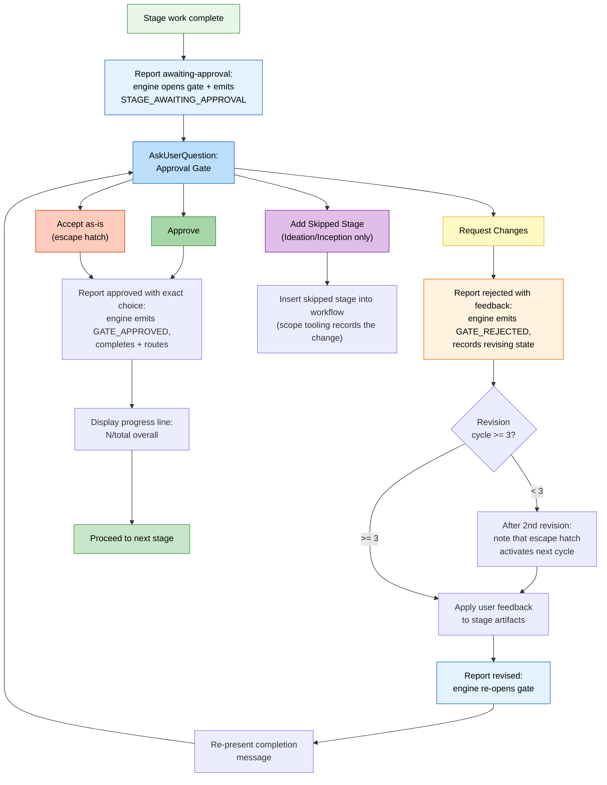

# やり取りのモード

ステージ中のエージェントとのやり取りは 3 通りです。加えて承認ゲートがあり、決める場面では常に人が持てます。

> **ハーネスの注記。** ゲートと質問の見え方はハーネスごとに違います。Claude Code はネイティブの質問ピッカー、Codex は有効ならそのピッカーです。Kiro、opencode、GitHub Copilot は番号付きの散文選択肢です（Copilot のピッカー結果は、信頼できる人の存在イベントを発火しません）。正本は questions ファイルです。*意味*（いつゲートが出るか、何を聞くか、決めるのは人）は同じです。エンジン側にあるからです。[他ハーネスで動かす](harnesses/README.md) を見てください。

---

## 三モードの質問フロー

ステージが入力を取るとき、エージェントはやり取りのモードを 3 つ出します。今のステージに合うものを選びます。

```
▸ Choose interaction mode:
  (1) Guide Me — agent asks structured questions
  (2) Edit File — write directly to the artifact
  (3) Chat — freeform discussion
```

### Guide Me

エージェントが構造化したプロンプトで、質問を一つずつ案内します。会話をエージェントに預け、漏れを防ぎたいときに向きます。

- 質問は一つずつ（またはまとめて）出る
- その場で答える
- 答えは追跡のため、ステージの questions ファイルに残る

### Edit File

エージェントが questions ファイルを作り（または開き）、直接書きます。聞き取りより、自分で書きたい・中身がもう決まっているときに向きます。

- インテントのレコードディレクトリに、答え欄が空の questions ファイルが出る
- 自分のペースで埋める
- エージェントが完成したファイルを読んで先へ進む

### Chat

エージェントとの自由な会話です。アイデアを探るとき、要件がまだ固まっていないときに向きます。

- 自由に話す
- エージェントが会話から決定を取り出す
- 取り出した決定を questions ファイルへ書き戻す。正本はそこ

### ステージ途中での切り替え

ステージの途中でもモードは切り替えられます。3 モードとも、決定の正本は questions ファイルです。切り替えで進捗は消えません。すでに取った答えはファイルに残ります。

---

## 承認ゲート

Initialization の 3 ステージ以外は、末尾に承認ゲートがあります。ワークフローが進む前に、エージェントの仕事を見る確認点です。

### 標準ゲート

既定の承認ゲートは選択肢が 2 つです。

```
▸ How would you like to proceed?
  (1) Approve — Continue to [next stage]
  (2) Request Changes — Provide revision feedback
```

`[next stage]` には、実際に次に走るステージ名が入ります（例: "Continue to NFR Requirements"）。最終ステージなら "Complete workflow" です。エンジンが計算するので、推測ではなく常に正しい次です。

- **Approve** は結果を報告する。エンジンがステージを完了にし、`aidlc-state.md` を更新し、進捗行を出し、次のステージへ進む
- **Request Changes** では具体的な直しを渡す。エージェントが直し、承認ゲートを出し直す

表示されている選択肢に合わない返信は受け取り、有効な選択肢をもう一度出します。記録はせず、ゲートは開いたままです。

ゲートには、観測された人の操作の継ぎ目が要ります。プロンプトを打つ、またはネイティブの質問ピッカーに答えると、監査台帳に人のターン（`HUMAN_TURN` イベント）が残ります。承認（と確認質問への回答）は、直前のゲート解決以降にその記録が無ければ拒否します。証明するのは存在と順序です。あとから呼び出し側が渡す決定文の著者ではありません。信頼できるプロンプト／ウィジェット本文を出さないハーネスもあります。多層防御の細いトリップワイヤは、コンダクター／モデルの自己帰属として認識できる明示表現を拒みますが、ラベルの無い文言は認証しません。ピッカーが人のターンを残さないハーネスでは、短いメッセージを一度打ってください（例: "approve"）。記録が付きます。（台帳に人のターンがまだ無いハーネスでは、ゲートはフェイルオープンで、この要求はしません。）

人がいない状態でプロンプトを送る自動化は、駆動プロセスで `AIDLC_UNATTENDED=1` を立てます。宣言はオプトインです。無人かどうか分かるのはドライバだけだからです。無ければ、プロンプト送信は対話の振る舞いになります。立てると、どのハーネスも権限のある `HUMAN_TURN` を出さないので、承認ゲートとインタビューゲートは待ち続けます。人が引き継いだら `AIDLC_UNATTENDED` を外し、新しい応答を送ってください。存在まわりの拒否メッセージは、フラグがまだ立っていればその名前を出します。

### 承認ゲートの流れ



<!-- テキスト代替: ステージ作業が終わり、awaiting-approval の報告でゲートが開く（エンジンが STAGE_AWAITING_APPROVAL を残す）。AskUserQuestion が承認ゲートを出す。Approve: 選んだラベルどおりに承認を報告し、エンジンが GATE_APPROVED を残して完了・経路選択。進捗を出し、次へ。Request Changes: Request Changes という選択そのものと、別のフィードバックで拒否を報告（エンジンが GATE_REJECTED）。直し回数を見る（3 未満なら次サイクルで逃げ道が出る旨を記し、直して revised を報告してゲートを再開し、出し直す。3 以上なら Accept as-is が使える）。Accept as-is: そのラベルどおりに承認を報告。Add Skipped Stage（Ideation / Inception のみ）: 計画を再編成。ゲートの監査証跡は報告呼び出しが持つ。ゲートのプロンプトや選択のための別ログ行は足さない。 -->

---

## 3 回直しの逃げ道

同じステージで Request Changes を 3 回以上すると、3 つ目の選択肢が出ます。

```
▸ This is revision cycle 4. How would you like to proceed?
  (1) Approve — Continue to [next stage]
  (2) Request Changes — Provide revision feedback
  (3) Accept as-is — Archive current version and move on
```

**Accept as-is** は、今のステージ成果物をアーカイブしてワークフローを進めます。完璧を追いすぎて直しが終わらないのを防ぎます。

### いつ出るか

| 直しサイクル | 動き |
|----------------|-------------|
| 1 回目 | 標準の 2 択ゲート |
| 2 回目 | 標準の 2 択ゲートに加え、注記: "After one more revision, an 'Accept as-is' option will become available." |
| 3 回目以降 | Accept as-is 付きの 3 択ゲート |

直し回数は、次のステージへ進むとリセットされます。

---

## スキップしたステージを足す

**Ideation** と **Inception** では、承認ゲートに条件付きで、以前スキップしたステージをワークフローへ戻す選択肢が出ることがあります。

```
▸ How would you like to proceed?
  (1) Approve — Continue to Scope Definition
  (2) Request Changes — Provide revision feedback
  (3) Add Market Research — Include Market Research which was skipped
```

出る条件は次のすべてです。

- 今のステージが Ideation または Inception
- 先のステージがスコープ経路でスキップされている
- そのスキップが今の文脈に関係する

選ぶと、スキップしていたステージがワークフロー計画に入ります。あとはそのステージを通って普通に進みます。

---

## ステージのスキップと移動

承認ゲート以外にも、移動の手段があります。

| コマンド | 効果 |
|---------|--------|
| `/aidlc --stage <name>` | 指定ステージへジャンプ（間のステージは `[S]`） |
| `/aidlc --phase <name>` | フェーズ先頭へジャンプ |

詳細は [セッション管理](11-session-management.md) と [CLI コマンド](12-cli-commands.md) です。

---

## 進捗の表示

承認のたびに、進捗行が出ます。

```
Progress: 13/33 overall | 3/7 IDEATION stages complete. Next: Approval & Handoff
```

見えるのは次です。

- 全ステージに対する進捗
- 今のフェーズ内の進捗
- 次のステージ名

---

## 次の章

- [最初のワークフロー](02-your-first-workflow.md) — やり取りのモードを流れの中で
- [状態と監査](10-state-and-audit.md) — 決定の残し方
- [セッション管理](11-session-management.md) — 再開、やり直し、ジャンプ
- [用語集](glossary.md) — 用語の定義
