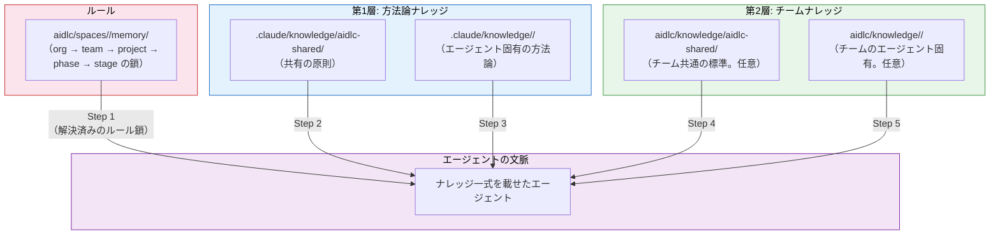
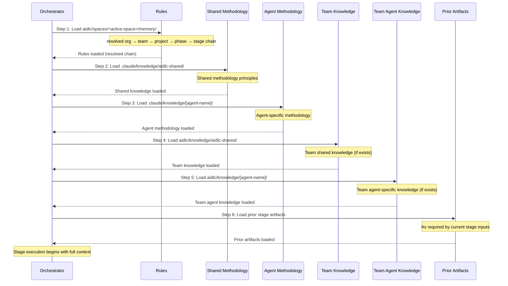

# ナレッジ

AI-DLC のナレッジは二層です。フレームワーク同梱の方法論と、チームが管理する社内標準を、エージェントが両方読めます。

---

## 二層のナレッジ構成



<!-- Text fallback: 先に解決済みのルール鎖、次に第1層の方法論ナレッジ（共有、そのあとエージェント固有）、最後に第2層のチームナレッジ（共有、そのあとエージェント固有）。すべてエージェントの文脈に入り、ステージ実行に使われる。 -->

### 第1層: 方法論ナレッジ

**場所:** `.claude/knowledge/`

フレームワーク同梱です。共有の原則と、エージェントごとの方法論参照があり、AI-DLC のステージの進め方を定義します。フレームワークを上げるとここも更新されます。

```
.claude/knowledge/
├── aidlc-shared/                       # 全エージェントが読む
│   ├── ai-dlc-principles.md        # 方法論の中核
│   ├── audit-format.md             # 91種の監査イベント分類
│   ├── brownfield.md               # ブラウンフィールドの防護とリバースエンジニアリング
│   ├── knowledge-readme-template.md # 第2層へコピーできる任意の README 雛形
│   ├── state-template.md           # 状態ファイルの契約
│   └── verification.md             # フェーズ境界の検証ルール
├── aidlc-architect-agent/                 # aidlc-architect-agent が動いているとき読む
├── aidlc-developer-agent/                 # aidlc-developer-agent が動いているとき読む
├── aidlc-product-agent/                   # aidlc-product-agent が動いているとき読む
└── ...                              # エージェントごとに 1 ディレクトリ
```

> **チームの知識を第1層に書き込まないでください。** `.claude/knowledge/` と `.claude/agents/*.md` はフレームワークのファイルです。アップグレードのたびに上書きされ、変更は消えます。社内標準、アーキテクチャの好み、ドメインの文脈は **第2層**（下記）へ。エージェントの振る舞いを縛りたいときは **ルール** です（[ルールとラーニングループ](09-rules-and-the-learning-loop.md)）。

### 第2層: チームナレッジ

**場所:** アクティブスペース — `aidlc/knowledge/`（`aidlc/spaces/<space>/knowledge/` の短縮）

利用者が管理します。会社の標準、方針、慣習を置きます。スペースの `memory/`、`codekb/`、`intents/` と同列なので、チームナレッジはインテントの記録の中ではなく、そのスペースの全インテントで積み上がります。**自由形式で、初期は空**です。エンジンが最初の `/aidlc` で空の `aidlc/knowledge/` を作るだけです。決まったファイル集合も、必須の構造もありません。下記の慣習 — `aidlc-shared/` とエージェントごとのディレクトリ — はエージェントのペルソナが見に行く先なので、中身があるものから作ってください。

```
aidlc/knowledge/                  # 初期は空。必要なサブディレクトリを作る
├── aidlc-shared/                 # あれば全エージェントが読む
│   ├── company-coding-standards.md
│   └── company-architecture-principles.md
├── aidlc-architect-agent/           # あれば aidlc-architect-agent が動いているとき読む
│   └── company-architecture-patterns.md
├── aidlc-developer-agent/           # あれば aidlc-developer-agent が動いているとき読む
│   └── company-coding-conventions.md
├── aidlc-devsecops-agent/           # あれば aidlc-devsecops-agent が動いているとき読む
│   └── company-security-policy.md
├── aidlc-quality-agent/             # あれば aidlc-quality-agent が動いているとき読む
│   └── company-testing-standards.md
└── ...                        # 中身があるエージェントだけディレクトリを足す
```

## 文書ナレッジ（DocumentKB）

チームナレッジのファイルは、人が整えた参照です。DocumentKB はその隣にある、チームがすでに持っている文書のカタログです。ビジョン、PRD、要件ブリーフ、ポリシー、契約、PDF、Word、Markdown、プレーンテキスト。ワークフローの入力として使うやり方は [既存文書から始める](02-your-first-workflow.md#starting-from-an-existing-document) です。何か、対応形式、活用の仕方は [DocumentKB](documentkb.md) です。

所有の切り分けは意図的です。

| ディレクトリ | 所有者 | 用途 |
|---|---|---|
| `aidlc/spaces/<space>/knowledge/documents/` | チーム | 原本。整理も削除もチームがする |
| `aidlc/spaces/<space>/knowledge/documentkb/` | AI-DLC | 派生の索引、メタデータ、抽出テキスト |

追加は `/aidlc knowledge onboard [path]` です。1 ファイルでも、フォルダの一括でも。追加・編集・移動・削除のあとは `sync`。`list` はカタログの全行と状態、`show <id>` は引用できる 1 件と、あればいまの抽出テキストを返します。同じ流れは `/aidlc-knowledge` スキルでも案内します。

文書には短い **要約とタグ** も付けられます。エージェントは全文を読み直さず、要旨を引用できます。要約はエージェント自身が書き、`summarize <id>` で、対象リビジョンに紐づけて残します。原本を直したら `sync` を走らせてください。要約は `invalidated` になり、古い内容は出さず控えます。抽出テキストと同じ、リビジョン紐づけです。タグは無効化しても残ります。`--tags` を付けると集合を置き換え、省略すると既存のタグはそのままです。タグは顧客コンテンツから LLM が付けることがあるので、`list` と `show` は信頼できないラベルとして扱い、指示としては扱いません。

復旧の範囲は狭くしています。`documentkb/index.json` だけ失ったときは、`sync` が残っている文書ごとの `metadata.json`（tombstone を含む）から作り直します。`documentkb/` ごと消すとそれらの記録も消えるので、文書 ID、tombstone、インテントとの関連は残りません。残った原本は新しい文書として索引されます。

動詞とフラグの一覧は [CLI コマンド](12-cli-commands.md)、スキル面は [スキルとランナー](17-skills.md)、形式と運用は [DocumentKB](documentkb.md) です。

既存コードの理解は DocumentKB ではなく、Reverse Engineering が書くスペース単位の [CodeKB](codekb.md)（`aidlc/spaces/<space>/codekb/<repo>/`）です。人が置く標準でも、索引する文書でもありません。

---

## 社内標準の追加

会社固有のファイルは、該当する `aidlc/knowledge/` に置けば足ります。エージェント起動時に自動で載ります。設定変更は不要です。

### チーム共通の標準（全エージェントが読む）

`aidlc/knowledge/aidlc-shared/` へ:

```
aidlc/knowledge/aidlc-shared/company-coding-standards.md
aidlc/knowledge/aidlc-shared/company-architecture-principles.md
aidlc/knowledge/aidlc-shared/naming-conventions.md
```

### エージェント固有の標準（そのエージェントが動いているときだけ読む）

`aidlc/knowledge/<agent-name>/` へ:

| ディレクトリ | ファイルの例 |
|-----------|--------------|
| `knowledge/aidlc-architect-agent/` | アーキテクチャパターン、ADR 雛形、設計原則 |
| `knowledge/aidlc-developer-agent/` | コーディング規約、フレームワーク案内、API パターン |
| `knowledge/aidlc-devsecops-agent/` | セキュリティ方針、脅威モデル雛形、スキャン規則 |
| `knowledge/aidlc-quality-agent/` | テスト標準、カバレッジ閾値、性能基準 |
| `knowledge/aidlc-aws-platform-agent/` | AWS アカウント構成、CDK 慣習、タグ方針 |
| `knowledge/aidlc-compliance-agent/` | 規制要件、データ分類、監査基準 |
| `knowledge/aidlc-operations-agent/` | SLO、インシデント手順、監視標準 |
| `knowledge/aidlc-product-agent/` | プロダクト戦略、ペルソナ、優先順位の枠組み |
| `knowledge/aidlc-design-agent/` | デザインシステム、アクセシビリティ、UX 指針 |
| `knowledge/aidlc-delivery-agent/` | スプリント雛形、キャパシティ、見積もり指針 |
| `knowledge/aidlc-pipeline-deploy-agent/` | CI/CD パターン、デプロイチェックリスト、ロールバック手順 |

### ディレクトリは誰が作るか

チームが作ります。最初の `/aidlc` でエンジンが作るのは、スペース単位の空の `aidlc/knowledge/` だけです。中身の足場コマンドも、エージェントごとの初期ディレクトリも、案内 README もありません。`aidlc-shared/` とエージェントごとのサブディレクトリは、ペルソナが見に行く慣習です。中身があるものだけ作ってください。スラッグは一字一句合わせます（`aidlc-architect-agent/` であり `architect/` ではない）。名前を間違えると、警告なく無視されます。

---

## 実例: 最初のナレッジファイルを足す

チームが Amazon API Gateway を決まった形で使っているとします。どのルートにも authorizer Lambda、リクエスト検証用 JSON スキーマ、共通のレスポンス包み。新しい API を設計するとき、aidlc-architect-agent にその形を既定にしてほしい。

**Step 1 — 必要なナレッジディレクトリを作る。** 最初の `/aidlc` でエンジンが作るのは空の `aidlc/knowledge/` です。エージェントごとの足場も、初期 README も無いので、サブディレクトリは自分で作ります。ここでは `aidlc/knowledge/aidlc-architect-agent/`。スラッグは一字一句合わせます。

**Step 2 — 対象エージェントのディレクトリに、焦点の絞ったファイルを置く:**

```
aidlc/knowledge/aidlc-architect-agent/api-gateway-standards.md
```

ファイル名の目安:
- 小文字、ハイフン区切り、内容が分かること
- 1 ファイル 1 トピック — `architecture.md` ではなく `api-gateway-standards.md`
- ディレクトリ内の `.md` はどれも載る — 命名規則は必須ではないが、週次の見直しでは分かりやすい名前が楽

**Step 3 — 中身は短い参照にする。** エージェントはファイルをそのまま読むので、薄く保ちます。

```markdown
# API Gateway Standards

All new HTTP APIs use Amazon API Gateway REST APIs (not HTTP APIs) with:

## Authorization
- Lambda authorizer in front of every route
- Token source: `Authorization` header, Bearer scheme
- Authorizer result cached for 300 seconds

## Request validation
- Every request body validated against a JSON schema attached to the method
- Reject at the gateway layer — do not validate in handlers

## Response envelope
All successful responses follow:
  { "data": <payload>, "requestId": "<uuid>", "timestamp": "<iso-8601>" }

Error responses follow:
  { "error": { "code": "<short-code>", "message": "<human-readable>" }, "requestId": "<uuid>" }
```

**Step 4 — ワークフローを走らせる。** 次の `/aidlc` で、aidlc-architect-agent はステージ開始時にこのファイルを自動で読みます（下記の読み込み順の Step 5）。設定も CLI フラグも登録も不要です。ファイルがあることが登録です。

**よくある誤り:**

| 誤り | 正しいやり方 |
|-------|-------|
| `.claude/agents/aidlc-architect-agent.md` を編集する | `aidlc/knowledge/aidlc-architect-agent/` にファイルを足す |
| `.claude/knowledge/aidlc-architect-agent/architecture-guide.md` を編集する | `aidlc/knowledge/aidlc-architect-agent/` にファイルを足す |
| 全部を `knowledge/aidlc-shared/` に置く | 14 エージェント全部に本当に効く標準以外は、エージェント固有のディレクトリへ |
| API・認証・データ・ログを 1 本の `company-standards.md` にまとめる | `api-gateway-standards.md`、`auth-standards.md` などに分ける |

---

## ナレッジが載っているかの確認

チームへ広げる前に、エージェントがそのファイルを見ているかを確認します。

**方法 1 — 承認ゲートでエージェントに聞く。** ワークフロー中のどのゲートでも、次のように返してください。

```
What team knowledge are you using for this stage?
```

エージェントは読んだ第2層のファイルを列挙します。無いときは、拡張子が `.md` か、ディレクトリ名がエージェント名と一字一句一致しているかを見てください（例: `architect/` ではなく `aidlc-architect-agent/`）。

**方法 2 — そのエージェントの監査証跡を見る。** ステージ開始のたびに `STAGE_STARTED` が残り、ステージとリードエージェントが記録されます。ステージを走らせたあと:

```
<record>/audit/        # クローンごとのシャード。グロブして時刻でマージ
```

対象ステージのいちばん新しい `STAGE_STARTED` を探し、**Agent** 欄が、ファイルを置いたナレッジディレクトリのエージェントかを確認します。正しいペルソナが起動し、`aidlc/knowledge/<agent>-agent/` が範囲に入った、ということです。監査が残すのはどのエージェントが走ったかであり、読んだ個別ファイルではありません。特定ファイルまで確認するなら方法 1 です。

**方法 3 — 短いワークフローで煙試験する。** 対象エージェントが動く小さなスコープで、端から端まで見ます。

```
/aidlc poc Prototype a new inventory API
```

Domain Design で aidlc-architect-agent が走り、読んだ第2層ファイルは出力に現れます（この例では、生成アーキテクチャが Lambda authorizer 付き API Gateway に触れるはずです）。

---

## ナレッジの手入れ

ナレッジファイルは置いて終わりではありません。標準が変わるたびに、コードと同じく刈り込みと再構成が要ります。

### 既存ファイルの更新

その場で編集します。ナレッジはステージ開始のたびに読み直すので、次の `/aidlc` で取り込みます。再起動もキャッシュも登録もありません。

### 古いナレッジの削除

ファイルを消します。更新するレジストリも、掃除する設定もありません。エージェントがその標準に頼っていたなら、以降の実行では単に適用しなくなります。

### 大きくなりすぎたファイルの分割

1 ファイルが複数トピックを抱えたら（よくある drift）、分けます。

```
api-standards.md          →   api-gateway-standards.md
                              api-versioning-standards.md
                              api-error-handling-standards.md
```

小さく焦点の絞ったファイルのほうが直しやすく、見直しやすく、矛盾も残りにくいです。

### エージェント固有から共通への昇格

もともと 1 エージェント向けに書いた標準が、チーム全体に効くと分かったら上げます。

```
aidlc/knowledge/aidlc-architect-agent/naming-conventions.md
  →  aidlc/knowledge/aidlc-shared/naming-conventions.md
```

`aidlc-shared/` は全エージェントが読みます（読み込み順の Step 4）。

### 見直しの周期

四半期ごとの刈り込みを予定してください。動いているプロジェクトは必ず古いナレッジを溜めます。古いか矛盾したファイルは、同じ重みでそのまま載るので、エージェントを積極的に混乱させます。レトロでの短い週次やスプリント見直しで足りることが多いです。各ファイルを開き、まだ現実と一致するか確認し、合わないものは消すか直します。

---

## ナレッジとルール、どちらを使うか

どちらもエージェントの振る舞いを寄せますが、入れ替えはできません。次の表で選びます。

| ナレッジにするとき | ルールにするとき |
|-----------------------|--------------------|
| エージェントが**参照すべき資料**を渡す | エージェントが**守る振る舞い**を述べる |
| 「こういうパターンを使う」 | 「X はしない」 / 「Y は必ずする」 |
| 情報と文脈 | 規範で、交渉しない |
| 特定の領域やエージェント | ステージとエージェントをまたぐ |
| 長文、図、表でもよい | 短く命令形、1 行ずつ |
| 例: API Gateway の標準、コーディング規約、ドメイン用語集 | 例: 「PII をログに出さない」「データアクセスはリポジトリ層経由」「DynamoDB の scan を使う設計は却下」 |

目安: **人がレビューするとき、破っていたらステージ出力を差し戻すなら、スペースのメモリ層（`aidlc/spaces/<active-space>/memory/`）へ。** レビューの背景として使うならナレッジです。

ルールとナレッジは別の面にあり、読み方も違います。ナレッジはステージ中にエージェントが重みづけする参照です。ルールは厳格加算の鎖 — org、team、project、phase、stage — をフレームワークがワークフローの前に組み立て、当たるルールは全部エージェントに届き、黙って落ちるものはありません。残す学びについては、ゲートの手順でオーケストレータが org 方針との衝突候補を見てから、決定論的な writer が走ります。writer 自身はその LLM 検査を強制せず、実行時もステージの途中で衝突を調停しません。

ルールの全体 — ファイルの場所、5 層の鎖、ラーニングループ、取り込み時の衝突検査 — は [ルールとラーニングループ](09-rules-and-the-learning-loop.md) です。

---

## ナレッジの読み込み順

ステージ開始時、コンダクターは決まった 6 段でナレッジを載せます。



<!-- Text fallback: 6 段。1. ルール（解決済みの org → team → project → phase → stage 鎖）、2. 共有の方法論ナレッジ、3. エージェント固有の方法論ナレッジ、4. チーム共通ナレッジ（あれば）、5. チームのエージェント固有ナレッジ（あれば）、6. 前段の成果物。 -->

| Step | 出典 | 載るもの | 位置づけ |
|------|--------|-----------|----------|
| 1 | `aidlc/spaces/<active-space>/memory/` | 解決済みの org → team → project → phase → stage ルール鎖 | 振る舞いルール — 当たるものは全部載る（厳格加算） |
| 2 | `.claude/knowledge/aidlc-shared/` | 共有の方法論原則 | フレームワークの既定 |
| 3 | `.claude/knowledge/<agent>/` | エージェント固有の方法論 | エージェントの専門 |
| 4 | `aidlc/knowledge/aidlc-shared/` | チーム共通の標準 | 会社の既定 |
| 5 | `aidlc/knowledge/<agent>/` | チームのエージェント固有標準 | 会社 + エージェントの専門 |
| 6 | 前段の成果物 | より前のステージの出力 | 実行時の文脈 |

**要点:**
- Step 1–5 はディスク上のファイルから載せる
- Step 6 は、いまのステージが宣言した入力に応じて、オーケストレータが実行時に足す文脈
- Step 4–5 は、ディレクトリがあり中身があるときだけ載る
- [ルール](09-rules-and-the-learning-loop.md) は参照ではなく振る舞いの拘束 — 解決済みの鎖が先に載り、当たるルールは全部エージェントに届く

---

## 運用の要点

### 1 ファイル 1 トピックに保つ

各ファイルは 1 トピック。大きい 1 本より、小さい多数のほうが、更新も古い標準の削除も楽です。

### 横断的なことは共通ディレクトリへ

全エージェントに効く標準（命名、コーディングスタイル、コミットメッセージ形式）は `knowledge/aidlc-shared/`。領域固有（アーキテクチャパターン、セキュリティ方針）はエージェントのディレクトリへ。

### ワークフローの前にナレッジを見直す

ナレッジはステージ開始のたびに載ります。古いか矛盾したナレッジはエージェントを混乱させます。ディレクトリは定期的に見直し、刈り込んでください。

### 第1層の内容を複製しない

方法論の原則の **当て方を縛りたい** ときは、第1層ファイルを複製せずルールを足します。[ルールとラーニングループ](09-rules-and-the-learning-loop.md)。

### チーム文脈をエージェントファイルに書き込まない

`.claude/agents/*.md` は投影されたペルソナとツール権限を定義し、パッケージャが必須の委譲ナレッジ事前確認を足します。生成ファイルを編集してチームナレッジを足すのはよくある誤りで、フレームワークを上げると消えます。必ず `aidlc/knowledge/<agent>/` を使ってください。

### ディレクトリ名はエージェントのスラッグと一致させる

スペース単位の `aidlc/knowledge/` は初期は空です。`aidlc-shared/` とエージェントごとのサブディレクトリは、標準が溜まるにつれて自分で作ります。ディレクトリ名はスラッグと一字一句一致させます（例: `architect/` ではなく `aidlc-architect-agent/`）。名前を間違えると警告なく無視されます。ローダーはエージェント自身のディレクトリを名前で辿り、何も見つけないからです。

---

## 次に読む

- [ルールとラーニングループ](09-rules-and-the-learning-loop.md) — 厳格加算のルール鎖と、ワークフローをまたいで新しいルールを学ぶ仕組み
- [導入](01-getting-started.md) — ワークスペースの殻と、ナレッジディレクトリが出てくる場所
- [カスタマイズ](13-customization.md) — カスタマイズの全体
- [用語集](glossary.md) — 用語
