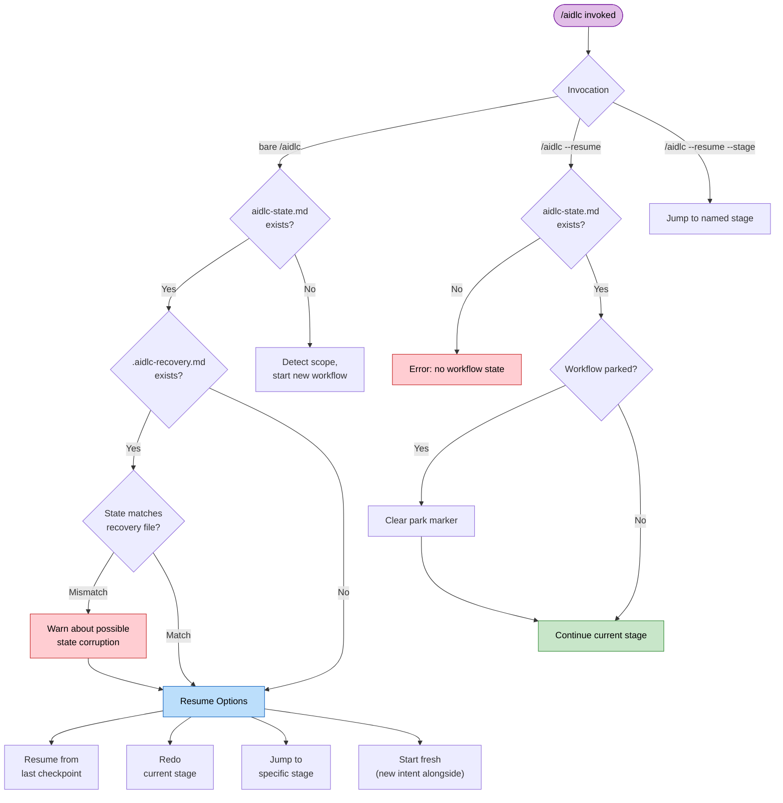

# セッション管理

ワークフローはハーネスのセッションをまたげます。進捗はすべてディスクに残るので、いつでも再開、やり直し、ジャンプ、新規開始ができます。

> **ハーネスについて。** セッション再開はどのハーネスでも同じです（状態はハーネスではなく、インテントのレコードディレクトリにあります）。セッションの *寿命イベント* は違います。Claude Code は `SESSION_STARTED` / `RESUMED` / `ENDED` と `SESSION_COMPACTED` を出します。Kiro は `SESSION_STARTED` だけです。Codex は `SESSION_ENDED` を推測し、コンパクト元の `SessionStart` でミッションを入れ直します。[他ハーネスで動かす](harnesses/README.md)。

---

## 再開の流れ

新しいセッションで素の `/aidlc` を走らせ、アクティブインテントの `aidlc-state.md` があるとき、AI-DLC は状況の要約を出し、再開を 4 択で提示します。保存済みチェックポイントから続けると分かっているときは `/aidlc --resume` です。メニューを飛ばし、いまのステージへ直接向かいます。



<!-- Text fallback: 素の /aidlc で状態があるときは復旧パンくずを見て再開 4 択。状態が無いときはスコープ判定から始める。/aidlc --resume で状態があるときは、必要ならパーク印を消して直接続ける。状態が無いときはエラー。/aidlc --resume --stage は指定ステージへジャンプ。 -->

### 再開の 4 択

| 選択肢 | 動き | 残るもの | 失うもの |
|--------|-------------|-------------------|-------------|
| **最後のチェックポイントから再開** | 進行中、または次の未着手ステージから続ける。タスクサイドバーは状態ファイルから組み直す | 成果物、状態、監査証跡の全部 | 前セッションのメモリ上の会話文脈 |
| **いまのステージをやり直す** | いまのステージのチェックボックスを戻し（`aidlc-jump.ts execute --direction redo`）、最初から再実行する | ほかの成果物と状態 | いまのステージの完了状態と途中作業 |
| **ステージへジャンプ** | 指定ステージへ飛ばす（`next --stage <slug>`）。スキップするステージと、下流成果物が無効になりうることを警告する | 既存の成果物すべて | いまの位置と目標の間のステージは `[S]`（スキップ） |
| **新規開始** | 既存の横に新しいインテントを始める（スコープと説明の確認のあと `next --new-intent`） | 既存ワークフローの成果物、状態、監査証跡（その場に残る） | なし。前のインテントは再開できる |

`/aidlc --resume --stage <slug>` は明示ステージを目標にし、通常のジャンプ経路を取ります。

ディスパッチした編成作業は、ディスク上の証跡から再開します。Practices Discovery では、コンダクターがリード下書きと既存の寄与ファイルを残し、足りない quality / developer / devsecops スポークだけ出し、人へのインタビューとリード統合へ進みます。終わったスポークは繰り返しません。

---

## 復旧パンくず

Claude Code が会話文脈をコンパクトする前に、`validate-state.ts` フックが隠し復旧ファイル `.aidlc-recovery.md` を、アクティブインテントのレコードディレクトリに書きます。中身は次です。

- 最後に検証した時刻
- いまのステージ名（`aidlc-state.md` から抽出）
- 状態ファイルが妥当かどうか

次の `/aidlc` で、AI-DLC は `.aidlc-recovery.md` と `aidlc-state.md` を比べます。「Current stage」が食い違っていれば、コンパクション由来の状態壊れの可能性を警告します。

---

## コンテキストのコンパクション

Claude Code はコンテキスト窓が埋まると、それまでの会話を自動で要約します。これが **コンパクション** です。この実装は、コンパクションをまたいでもワークフロー状態が残る防護を持ちます。

### 残るもの、消えるもの

| 残る | 消える |
|-----------|------|
| レコードディレクトリの成果物（ディスク上のファイル）全部 | メモリ上の会話文脈（それまでの議論） |
| `aidlc-state.md`（ステージ進捗、スコープ、プロジェクト情報） | まだファイルに書いていない途中作業 |
| `audit/` シャード（判断と動作の全履歴） | タスク ID（再開時に状態ファイルから組み直す） |
| `.aidlc-recovery.md`（ステージのチェックポイント） | エージェントのペルソナ文脈（エージェントファイルから読み直す） |

### コンパクション後の復旧

1. `/aidlc` を走らせる — AI-DLC が状態ファイルを読み、再開の選択肢を出す
2. 復旧パンくずが食い違いを警告したら、**いまのステージをやり直す** を選び、コンパクション中に進んでいたステージを再実行する
3. 警告が無ければ **最後のチェックポイントから再開** で通常どおり続ける

長いセッションではコンパクションは普通です。状態ファイルとディスク上の成果物があるので、完了した作業は失われません。

---

## ステージジャンプ

ユーティリティコマンドで、ワークフローを前にも後ろにも飛べます。

### 特定ステージへのジャンプ

```
/aidlc --stage code-generation
/aidlc --stage 3.5
```

前へ飛ぶとき、いまの位置と目標の間のステージは `[S]`（スキップ）になります。オーケストレータは次を警告します。

- スキップするステージ
- 下流が期待するが見つからない成果物
- 追跡への影響

後ろへ飛ぶとき、目標ステージは `[ ]`（未着手）に戻り、再実行します。より下流の完了ステージは `[x]` のままですが、成果物は古くなることがあります。

### フェーズ先頭へのジャンプ

```
/aidlc --phase construction
/aidlc --phase 3
```

指定フェーズの最初のステージへ飛びます。スキップと成果物の無効化についての警告は同じです。

### ジャンプとスコープの併用

状態ファイルが無いプロジェクトでは、`--stage` または `--phase` を `--scope` と組み合わせられます。

```
/aidlc --stage code-generation --scope bugfix
```

指定スコープで新しいワークフローを作り、目標ステージへ直接飛びます。

---

## セッションスキル

読み取り専用のスキルが 3 つ、いまのワークフローを変えずに報告します。コマンドと同じ打ち方で、`/` スキルピッカーに出ます。

| スキル | すること | 出力 |
|-------|--------------|--------|
| `/aidlc-session-cost` | 決定論的なコスト表示 — 所要時間、ステージ結果、メモリ件数、センサー発火、残した学び | 端末のみ |
| `/aidlc-replay` | その場にいなかった人向けの、読めるセッション物語 — 何をなぜ決めたか | 端末のみ |
| `/aidlc-outcomes-pack` | チームがワークフローを再実行せずシステムを引き継げる引き渡し文書 | `OUTCOMES.md` を書く |

**読み取り専用です。** どれもワークフローのステージポインタを進めず、監査イベントも出さないので、ステージの途中を含めいつでも安全です。`/aidlc-session-cost` と `/aidlc-replay` は端末に出して何も書きません。ファイルを書くのは `/aidlc-outcomes-pack` だけです（ワークスペースルートの `OUTCOMES.md`）。

**数字はすべてデータプレーンからです。** 各スキルは `bun .claude/tools/aidlc-runtime.ts summary --json` — `runtime-graph.json` の実体化ビュー — から数値を読みます。見積もりも数え直しもしません。数字の周りの散文（物語、判断の理由）だけが、監査証跡と成果物から合成されます。トークン見積もりは意図的にありません。かつてのファイルサイズからトークンを推すヒューリスティックは当て推量だったので、外しています。

```
/aidlc-session-cost      # いまどこか、いつでも短いスナップショット
/aidlc-replay            # 非同期レビュー向けにセッションを語る
/aidlc-outcomes-pack     # ワークフロー終了時 — 引き渡し文書を書く
```

どれもコンパイル済みの `runtime-graph.json` が要ります。最初のステージが始まる前に走らせると、「no session data yet」と短く出して止まります。

---

## 次に読む

- [状態と監査](10-state-and-audit.md) — 状態ファイルの構造とチェックポイント表記
- [スキルとランナー](17-skills.md) — 読み取り専用のセッションビュー（`/aidlc-session-cost`、`/aidlc-replay`、`/aidlc-outcomes-pack`）とランナー一式
- [CLI コマンド](12-cli-commands.md) — `--stage`、`--phase`、そのほかのフラグ
- [トラブルシュート](15-troubleshooting.md) — コンパクション復旧と状態壊れ
- [用語集](glossary.md) — コンパクション、復旧パンくず、セッション
