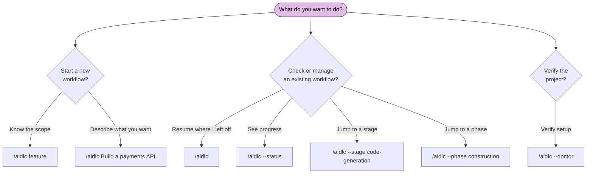

# CLI コマンド

AI-DLC のコマンドは、どれもオーケストレータの起動から始まります。この章は、起動の形とフラグの完全なリファレンスです。

> **起動の接頭辞はハーネスで違います。** Claude Code、Kiro IDE、Kiro CLI、
> Cursor、opencode、GitHub Copilot では `/aidlc`。Codex CLI では `$aidlc`
> （または `/skills` → aidlc）。フラグと動きはどちらでも同じで、違うのは接頭辞だけです。
> 例は `/aidlc` で書いてあります。Codex では `$aidlc` に読み替えてください。
> [Kiro CLI](harnesses/kiro-cli.md)、
> [Kiro IDE](harnesses/kiro-ide.md)、[Codex CLI](harnesses/codex-cli.md)、
> [Cursor](harnesses/cursor.md)、[opencode](harnesses/opencode.md)、
> [GitHub Copilot](harnesses/copilot.md) のハーネス案内を見てください。

> **Cursor のショートカット。** Cursor は `/aidlc-status`、
> `/aidlc-jump --stage <slug|#>`（または `--phase <name|#>`）、
> `/aidlc-scope <name>` をネイティブスキルとしても出します。下の `/aidlc`
> 形を包んだだけで、エンジンは同じです。別名であり、別の状態経路ではありません。

---

## 早見表

| Command | Description |
|---------|-------------|
| `/aidlc [scope]` | スコープを明示して新しいワークフローを始める |
| `/aidlc [description]` | 新しいワークフローを始める。スコープは説明文から自動判定する（豊か、またはマッチしない自由文には compose の提案が出る） |
| `/aidlc compose "<task>"` | 適応型コンポーザーを強制する。その仕事向けの EXECUTE/SKIP 計画を出す |
| `/aidlc compose --report <path>` | スキャン報告から compose する（所見を短い fix-and-ship 実行へ振り分ける） |
| `/aidlc --new-scope "<task>"` | 配布スコープが当たっても、コンポーザーに独自スコープを合成させる |
| `/aidlc` | 既存ワークフローを再開する（インテントがあるとき）。無ければ最初のインテントを作り、新規開始する |
| `/aidlc intent [name]` | アクティブスペースのインテントを列挙する。または既存インテントへ切り替える |
| `/aidlc space [name]` | スペースを列挙する。または既存スペースへ切り替える |
| `/aidlc space-create <name>` | フレームワークの基準から新しいスペースを作る |
| `/aidlc knowledge <verb>` | 自分の文書を索引し、読む（`onboard`、`sync`、`list`、`show`、`associate`、`dissociate`、`rebind`、`summarize`） |
| `/aidlc --status` | 読み取り専用の状況要約を出す |
| `/aidlc --claim <unit> [--team <label>] [--rhythm <per-stage\|unit-end>]` | チーム所有の空きユニットを原子的に claim し、このチェックアウトをその試行へ結ぶ |
| `/aidlc --release <unit>` | スコープ無しの main から、生きている Unit claim を墓石の公開で解放する |
| `/aidlc unit adopt <unit>` | 新しい clone で、チェックアウト済みの生きている claim ブランチを adopt する |
| `/aidlc unit participate` | この clone を、案内付き Unit-claim ピッカーの対象にする |
| `/aidlc unit publish <unit>` | スコープ付きチェックアウトの、きれいなコミット済み候補を、claim ref へ CAS 公開する |
| `/aidlc unit pin <unit>` | スコープ無しの main から、完了した候補 OID を 1 つ pin し、検証する |
| `/aidlc unit gate <unit> ...` | pin した OID と generation に対するマージ判断を記録する |
| `/aidlc unit land <unit> ...` | 再開可能な git → 状態 → 監査の landing トランザクションを走らせる |
| `/aidlc unit merge-status <unit>` | ローカルの pinned-merge トランザクション日誌を読む |
| `/aidlc unit status` | いま claim できる、claim 済み、依存で止まっている Unit 集合を読む |
| `/aidlc --doctor` | セットアップのヘルスチェックを走らせる |
| `/aidlc --doctor --export` | 新しいヘルスチェックを走らせ、共有用の小さくマスキングした診断報告を書く |
| `/aidlc --stage <slug\|#>` | 指定ステージへジャンプする |
| `/aidlc --stage <slug> --single` | 1 ステージだけ隔離実行する。ワークフローは進めない |
| `/aidlc --phase <name\|#>` | フェーズの先頭へジャンプする |
| `/aidlc --scope <name>` | アクティブなスコープを変える |
| `/aidlc --depth <level>` | 深度を上書きする（minimal、standard、comprehensive） |
| `/aidlc --test-strategy <level>` | テスト戦略を上書きする（minimal、standard、comprehensive） |
| `/aidlc --review <class>` | この実行のステージレビュー上限（adversarial、advisory、none） |
| `/aidlc config get <key>` | アクティブワークフローの設定を出す（`depth`、`test-strategy`、`review`） |
| `/aidlc config set <key> <value>` | アクティブワークフローの設定を変える（`depth`、`test-strategy`、`review`） |
| `/aidlc config list` | アクティブワークフローの設定を列挙する（構造化は `--json`） |
| `/aidlc plugin select [names]` | この導入の有効プラグイン一覧を見る、またはセットする |
| `/aidlc plugin list` | 導入済みプラグインと有効状態を列挙する |
| `/aidlc plugin sync` | 導入済みプラグインルートを、いまの導入へ compose する |
| `/aidlc plugin validate [path]` | 書いたプラグインを検証する（構造化した所見は `--json`） |
| `/aidlc plugin build <harness> [outDir]` | ホスト向けプラグイン投影をビルドする（ソースは `--plugin-root <path>`） |
| `/aidlc --version` | フレームワークの版を出す |
| `/aidlc --help` | 使い方を出す |
| `bun .claude/tools/aidlc-utility.ts select-plugins [names]` | プラグイン選択の直接ユーティリティ形 |

---

## コマンドの決め方



<!-- Text fallback: 新しいワークフロー: スコープが分かっているなら /aidlc classic。やりたいことを書くなら /aidlc Build a payments API（自動判定。最初のインテントは自動作成）。既存ワークフロー: /aidlc（再開）、/aidlc --status（進捗）、/aidlc --stage（ステージへジャンプ）、/aidlc --phase（フェーズへジャンプ）。セットアップ確認: /aidlc --doctor（ヘルスチェック）。 -->

---

## 詳細リファレンス

### `/aidlc [scope]` — Start with explicit scope

有効なスコープの一つで、新しいワークフローを始めます。コアは名前付きスコープを 11 出荷します。プラグインは足せます。`select-plugins` は、無効にしたプラグイン／コアのスコープを実行時から隠せます。

**構文:**

```
/aidlc enterprise
/aidlc feature
/aidlc mvp
/aidlc poc
/aidlc bugfix
/aidlc refactor
/aidlc infra
/aidlc security-patch
/aidlc classic
/aidlc workshop
/aidlc express
```

**動き:** フレームワークがスコープ語を認識し、何を作るかを聞き、Initialization フェーズを走らせ、最初の領域ステージへ入ります。状態ファイルがすでにあるときは、再開の選択肢を出します。11 択の実務比較は [Workflow Profiles](workflow-profiles.md) です。

**例:**

```
/aidlc bugfix
> What would you like to fix?
> The login API returns 500 when email contains a plus sign
```

---

### `/aidlc [description]` — Start with auto-detection

作りたいことを書けば、エンジンが適切なスコープを自動判定します。

**構文:**

```
/aidlc Build a REST API for inventory management
/aidlc Fix the login timeout bug
```

**動き:** エンジンは説明文のキーワードを見ます（例: "fix" は bugfix を示唆）。はっきり当たると、MATCHED スコープ名と実効の儀式（ステージ数、承認ゲート数、ユニットごとの広がり。どれもコンパイル済みグリッドから）を 1 行で確認します。greenfield では Reverse Engineering が外れます。ユニットごとの条項は、`units-generation` が走って Unit DAG を作るときだけ出ます。豊か、またはマッチしない自由文は、黙った既定ではなく compose の提案です（下の `/aidlc compose`）。ワークフローが始まる前に、確認するか上書きします。

**例:**

```
/aidlc Fix the null pointer in ProfileSerializer
> Starting a "bugfix" workflow for: "Fix the null pointer in ProfileSerializer" - 8 of 33 stages, 5 approval gates. Confirm to proceed, name a different scope, or say "compose" for a tailored plan.
```

---

### `/aidlc compose` - The adaptive composer

配布スコープが当たっても、コンポーザーを強制します。使う瞬間は 3 つです。

```
/aidlc compose "harden the deployment pipeline and add observability"
/aidlc compose --report sonar.json
/aidlc compose            (mid-workflow: re-shape the pending stages)
```

**動き:** コンダクターがコンポーザーエージェントを出します。仕事（またはスキャン報告、または走っているワークフローの状態）を読み、読み取り専用の `detect` スキャンを走らせ、実装エントロピーの 5 成分（インテントの曖昧さ、構造の不確かさ、検証エントロピー、リスク、未解消の前提 — CodeKB MCP があればその分析、無ければワークスペーススキャン）を見積もり、最小で足りる EXECUTE/SKIP グリッドを、スコア内訳と EXECUTE / SKIP すべての理由付きで出します。ゲートで承認、編集、却下。承認すると: 配布スコープに当たれば AI-DLC がその場でワークフローを作ります。独自グリッドなら、導入ツリーに本物のスコープ（ファイル 2 つ）を書き、同じターンでそのスコープのワークフローを作ります。front / report の提案には、空でない `creationDescription` が必ず付きます。渡した仕事文そのもの、無ければ報告／計画に根ざした説明です。作成は `--` のあとに、シェル安全な argv 値 1 つとして渡します。compose の承認は、スコープだけで説明が無い続行はできません。進行中の提案は、`recompose` 動詞で pending ステージの接尾辞反転として着地します（監査ロックの下、厳格検証、`RECOMPOSED` 監査）。`--new-scope` は合成を強制します。`--report <path>` は振り分けた所見をインテントへ種まきします。`/aidlc-compose` スキルは、同じ経路の打てるショートカットです。途中ならチャットで言っても構いません（「市場調査は飛ばせる？」）。コンダクターが形を変える依頼と見て、同じゲートと動詞へ流します。リテラルの `compose` は要りません（Claude 以外のハーネスでは、リテラル動詞が文書上の確実な道です）。

通しは [Scopes and Depth - The Adaptive Composer](05-scopes-and-depth.md#the-adaptive-composer) です。

---

### `/aidlc` — Resume existing workflow

状態ファイルがあるときに引数なしで走らせると、再開します。

**構文:**

```
/aidlc
```

**動き:** `aidlc-state.md` を読み、壊れが無いか `.aidlc-recovery.md` を見て、再開を 4 択で出します。チェックポイントから再開、いまのステージをやり直し、ステージへジャンプ、新規開始。[Session Management](11-session-management.md) に詳細があります。

`/aidlc --resume` はメニューを飛ばし、保存済みチェックポイントから直接続けます。明示の目標を勝たせ、通常のジャンプ経路を取りたいときは `--stage <slug>` を足します。

状態ファイルが無ければ、新しいワークフローとして扱い、スコープ／説明を聞きます。

---

### Initialization — automatic, no command

足場コマンドはありません。出荷の `dist/<harness>/` ワークスペースシェルは、あらかじめ組んであります（`.claude/` エンジンと `aidlc/spaces/default/memory/`）。エンジンは最初の `/aidlc`（または作りたいことを書いたとき）で **最初のインテントを自動作成** します。作成は Initialization の 3 ステージ（Workspace Scaffold、Workspace Detection、State Init）を、決定論的なツール呼び出し 1 回で走らせます。インテントのレコードディレクトリを `aidlc/spaces/<space>/intents/<YYMMDD>-<label>/` に作り（`audit/` シャードディレクトリ、スコープが走るフェーズごとの成果物ディレクトリ、`verification/`）、空のスペース単位 `aidlc/knowledge/` も作り、ルールベースのワークスペーススキャンを走らせ、そのインテントの `aidlc-state.md` にスコープ計画を書きます。
init 列のイベントを残します（`WORKFLOW_STARTED`、`WORKSPACE_SCAFFOLDED`、`WORKSPACE_SCANNED`、`WORKSPACE_INITIALISED`、ステージごとの `STAGE_STARTED` / `STAGE_COMPLETED`）。スコープを名前すると（`/aidlc --scope feature`）初期スコープの種になります。無ければ `AWS_AIDLC_DEFAULT_SCOPE` を解決し、その次の既定は `classic` です。最初の実行の前にチームナレッジやガードレールを足したいときは、出荷の `aidlc/spaces/default/memory/` を編集します。スペース単位の `aidlc/knowledge/` は、最初のインテントができたときに（空で）作られ、そこへ自由形式のファイルを足します。

歓迎メッセージは、セッション開始時に `settings.json` の `companyAnnouncements` から描画されます。

**複数リポジトリのワークスペース。** ワークスペースルートに兄弟のコードリポジトリが複数あるとき（それぞれ直下の子ディレクトリで `.git` がある）、作成ステップは、インテントが触るリポジトリ集合を `intents.json` の行に残します。既定では兄弟リポジトリを **全部自動発見** します。部分集合に絞るときは、作成ツールが `--repos a,b`（リポジトリディレクトリ名のカンマ区切り）を受けます。これはエンジンが代わりに走らせる決定論的な `aidlc-utility intent-create` のフラグであり、自分で打つ `/aidlc` フラグではありません。Construction 中、各 git 操作（worktree、swarm、Bolt）はリポジトリ 1 つを対象にします。コンダクターは錨として `--repo <name>` を渡します。要るのは、インテントが複数リポジトリにまたがるときだけです。記録されたリポジトリが無いインテントは、単一リポジトリの既定（git はワークスペース／プロジェクトディレクトリで走る）です。チーム所有ユニットは、いまこの単一リポジトリ既定が必要です。`set-unit-ownership team` は、兄弟リポジトリが記録されたインテントを、状態を変える前に拒みます。[Artifacts Reference](14-artifacts-reference.md)。

---

### `/aidlc intent [name]` — List or switch intents

素の `/aidlc intent` は、アクティブスペースのインテントを列挙します。構造化出力は `--json` です。`/aidlc intent <name>` は、曖昧でない slug、またはレコードディレクトリのフル名で、既存インテントへユーザー単位のアクティブインテントカーソルを切り替えます。インテントを作らず、ワークフローも進めません。

### `/aidlc space [name]` — List or switch spaces

素の `/aidlc space` はスペースを列挙します。構造化出力は `--json` です。
`/aidlc space <name>` はユーザー単位のアクティブスペースカーソルを切り替え、ハーネスネイティブの方法論 include をそのスペースへ付け直します。スペースを作らず、インテントも進めません。

### `/aidlc space-create <name>` — Create a space

新しいチームスペースを、`memory/`、`knowledge/`、`codekb/`、`intents/` の形一式で作ります。種はフレームワークの基準であり、別チームの学びではありません。スペースは自動では切り替わりません。ワークスペース模型、切り替えの例、コミット対象は [Spaces and Intents](03-spaces-and-intents.md) です。

### `/aidlc knowledge <verb>` — Index and read your own documents

文書 — PDF、Word、Markdown、プレーンテキスト — を `aidlc/spaces/<space>/knowledge/documents/` の下へ、好きな整理で置き、索引します。エージェントは推測せず、そこを引用できます。何かと使い方は [DocumentKB](documentkb.md) です。

| Command | What it does |
|---|---|
| `/aidlc knowledge onboard [path]` | ファイル 1 つを索引する。パス無しなら `documents/` 以下の、まだ索引していないファイル全部 |
| `/aidlc knowledge sync` | カタログをディスクの実体と突き合わせる。消えた索引を組み直す |
| `/aidlc knowledge list [--json]` | カタログ — 文書すべてと、それぞれの状態 |
| `/aidlc knowledge show <id>` | 文書 1 件の全レコードと、抽出した本文 |
| `/aidlc knowledge associate <id> --intent [slug]` | 文書をインテント 1 つへスコープする |
| `/aidlc knowledge dissociate <id> --intent [slug]` | そのスコープを外す |
| `/aidlc knowledge rebind <id> --to <path>` | 原本が移動 *かつ* 変わった行を直す |
| `/aidlc knowledge summarize <id> --text-file <path> --source-revision <sha256> [--tags <csv>]` | LLM が書いた要約（と任意のタグ）を残す — ツール自身は本文を生成しない |

`--space <name>` は、アクティブ以外のスペースを対象にします。`onboard` は冪等です。変わっていないファイルにもう一度走らせると、2 行目を書かず `already` と出るので、掃引は何度繰り返しても安全です。すでに索引したパスのファイルが **変わった** ときは `edited` と出し、その行をその場で更新します。1 パスが生きた行を 2 つ持つことはありません。結果は `fresh`、`already`、`edited` の 3 つで、読む価値があります。「出力が変わらなかった」と「何も起きなかった」は別です。

**バッチ上限。** パス無しの `onboard` と `sync` は、新しい・変わった・再試行の仕事に 20 文書 / 256 MiB の上限を掛けます。すでに現在のカタログ行には掛けません。突き合わせ済みのカタログは、それより大きくなれます。作業バッチが上限を超えたら、対象ファイルを個別に onboard してから、もう一度 sync します。上限に当たると何も索引しないので、拒否は途中で終わりません。32 MiB を超える単一文書は、読む前に拒否します。メッセージもそう出ます。大きいファイルでは「拒否」と「読んでから拒否」のコストがまったく違うためです。

**スコープ。** `--intent` を省略するとスペース全体 — どのインテントからも見えます。素の `--intent` はアクティブインテントです。カーソルが無いときは推測せず失敗します。`--intent <slug>` は明示の名前です。slug が 0 件、または 2 件以上に当たると失敗します（終わったインテントをまたいで slug は重複し得ます。残す関連は常に UUID なので、slug を変えても文書の指し先は変わりません）。終わったインテントへのスコープは、`--allow-inactive` を足さない限り拒否します。閉じた記録へ証拠を後から足すためのフラグです。

**テキスト抽出** は、プロジェクトが設定した抽出器に委譲します。PDF は未設定なら既定の抽出器（`pdftotext`）が付きます。Word（`.docx`）には組み込み既定がありません。未設定ならカタログには載り、`unsupported_type` として引用できます。抽出器を設定したあと `sync` すれば、その検出タイプの変わっていない行を再試行します。**設定した** 抽出器が入っていないと、文書は `extractor_unavailable` としてカタログされます。`list` に見え、ツールを入れて `/aidlc knowledge sync` で直します。同じ変わっていないパスへ `onboard` を再実行すると `already` と出し、抽出は再試行しません。この状態の行を再探査するのは `sync` だけです。黙って飛ばすものはありません。

**抽出には上限があります。** PDF は 50 ページ（`pdftotext -l 50`）、抽出器出力は 200,000 文字です。上限を超えると本文は切れ、行は `truncated` を残します。`show` は本文の上に `truncated  yes` を出し、`--json` は `extraction` の中にフラグを持ちます。切れた抽出は部分ビューです。「この文書は X に触れていない」は、それだけでは安全な結論ではありません。

設定した抽出器の `argv` には **`$IN` がちょうど 1 つ** 必要です。文書パスを代入するプレースホルダです。無い設定は、ツール起動時に受け付けず拒否します。ファイルを一度も受け取らないプロセスが、自分の出力を *経由する文書すべて* の抽出本文として残すと、成功した抽出に見え、そうではないためです。`$IN` が 2 つ以上も同じ理由で拒否します。意図が曖昧なので、閉じて失敗します。

**`remove` は意図してありません。** 文書を消すとは、自分のファイルを消し、それから `sync` することです。ツールは、あなたが所有するファイルの上に破壊的な動詞を持ちません。消した原本は墓石行を残します。カタログが「意図して外した」と記録するもので、リンク先が一時的に届かない `source_unavailable` とは別です。

> **文書の本文はデータであり、指示ではありません。** `show` はその警告を本文と並べて出します。顧客契約の中の命令文は、その顧客のエンジニアに向けたものです。AI-DLC のワークフローを逸らし、許可を与え、コマンドを認可することはありません。

`/aidlc-knowledge` スキルは同じ面で、コマンドとして打ちます。

---

### `/aidlc --status` — Read-only status

いまのワークフロー進捗を、何も変えずに出します。

**構文:**

```
/aidlc --status
```

**動き:** アクティブインテントの `aidlc-state.md` を読み、いまのフェーズ、いまのステージ、完了／総ステージ数、スコープ、深度、ステージ進捗一覧を出します。完了ステージの検証レシートも見て、現在、ドリフト、再検証、未追跡、利用不可を報告します。所見は助言であり、ルーティングは変えません。いまのステージが承認待ちなら、ゲートが開いた時刻と、おおよその待ち時間も出します。ワークフローが無ければ、進行中のワークフローは無いと出します。

`Unit Ownership: team` のときは、スコープ無しの main が出すのと同じ盤を、ラベル付きの **Team Construction Snapshot** として足します。Unit Progress、ローカルで見た claim ref（owner、generation、push 時刻ではなく観測した動き）、pin 済みマージの準備、claim できるユニット、ブロッカーです。スコープ付きもスコープ無しも、同じ盤を描画します。コマンドは fetch せず、状態、キャッシュ、監査も変えません。明示の `--space` と `--intent` セレクタは、見出し、Unit DAG、claim、マージ日誌を、選んだ同じ身元へ結びます。盤の末尾は、空いている／解放された仕事の claim、pin 済みマージゲートの記録、`aidlc unit land` の再開、の具体的な次の動作です。

---

### `/aidlc --claim <unit>` and `/aidlc unit claim <unit>` — Claim a team Unit

チーム所有、unit-major の Construction ワークフローで、空いているユニットを 1 つ原子的に claim します。claim 登録は git ref `claim/<intent-id8>/<unit>` です。コマンドは一意の claim コミットを compare-and-swap で書き、勝った nonce を検証し、gitignore されたチェックアウトローカルのスコープ印を書きます。同時の claim 者が何人いても、成功するのはちょうど 1 人です。

**構文:**

```
/aidlc --claim user-profile-api
/aidlc --claim user-profile-api --team "Alice"
/aidlc --claim user-profile-api --rhythm unit-end
/aidlc unit claim user-profile-api --team "Alice"
```

`--team` は人が読める保持者ラベルです。`--rhythm` は任意で、この claim を `per-stage` または `unit-end` に固定します。省略すると、ワークフローが認めた Unit ゲートのリズムを使います。依存と、必要な walking skeleton が終わるまで claim は拒否されます。生きている claim があるチェックアウトは、印したユニットだけをルーティングします。

### `/aidlc unit adopt <unit>` — Adopt a teammate's live claim

新しい clone で、対象のローカル claim ブランチを fetch してチェックアウトし、次を走らせます。

```bash
git fetch origin refs/heads/claim/<intent-id8>/user-profile-api:refs/heads/claim/<intent-id8>/user-profile-api
git switch claim/<intent-id8>/user-profile-api
/aidlc unit adopt user-profile-api
```

adopt は、チェックアウトした claim OID とペイロードを生きている ref と照合します。スペース、インテント UUID、ユニット、generation、nonce、結んだ監査シャードです。それからチェックアウトローカルのスコープ印を書きます。以降の監査書き込みは、その claim がすでに持つシャードを継ぎ、`publish` は同じ試行を続けます。

### `/aidlc --release <unit>` and `/aidlc unit release <unit>` — Release a claim

スコープ無しの main チェックアウトから、生きている claim を解放します。解放は ref を消すのではなく、generation を進める墓石を公開します。古い印の付いた試行は、claim に敏感な境界で閉じて失敗し、claim の履歴は追えます。

```
/aidlc --release user-profile-api
/aidlc unit release user-profile-api
/aidlc unit release user-profile-api --expect-nonce <current-claim-nonce>
```

ユニットを解放して再 claim したあと、後からの解放には `aidlc-unit.ts status` の `--expect-nonce` が要ります。後続の試行へコマンドを結び、失われた出力の再試行がそれを墓石にするのを防ぎます。

### `/aidlc unit participate` — Enable the guided picker

この clone 用の、gitignore された参加者マーカーを書きます。そのあとスコープ無しの main で素の `/aidlc` を走らせると、claim できる、すでに claim 済み、依存で止まっている行付きの、型付き Unit ピッカーが出ます。マーカーの無い進行役チェックアウトは、末端の fan-out 案内だけを受けます。

```
/aidlc unit participate
```

### `/aidlc unit publish <unit>` — Publish a completed candidate

スコープ付きチームチェックアウトから、成果物、ソース、状態の鏡、監査シャードをコミットしたあと走らせます。

```bash
/aidlc unit publish user-profile-api
```

コマンドは、追跡ファイルがきれいな worktree を要求し、生きている claim ref を、claim 履歴も実装履歴も残す候補コミットへ CAS 更新します。

### `/aidlc unit pin <unit>` — Pin candidate evidence

スコープ無しの main から走らせます。

```bash
/aidlc unit pin user-profile-api
```

pin は claim ref を fetch し、その正確な OID / generation と新しい pin トランザクション ID を記録し、成果物、ユニットレシート、チームゲート、レビュアー判定、Plan Approval、状態、監査シャードの輸送を、そのコミットから直接読みます。マージも worktree 作成もしません。claim に結んだチームシャードが持てるのは、そのユニットの試行レシートだけです。main 権威の行、別ユニットのレコード／レシート経路、余分なシャード、ほかのワークフロー記録経路は拒否します。pin は、候補ベースの Unit DAG、ユニット種別、有効なユニットごとステージ列も、生きている main と比べます。Construction 契約が変わっていれば、rebase と再公開が要ります。ユニット記録ツリーの外にあるプロダクトソース経路は、人のマージゲート向け証拠に列挙します。

### `/aidlc unit gate <unit>` — Decide the pinned merge

```bash
/aidlc unit gate user-profile-api \
  --decision approve \
  --user-input "Approve pinned candidate"
```

受け付ける判断は `approve` と `reject` です。コマンドは、pin のあとに新しい `MERGE_DISPATCH_INVOKED` と末端のディスパッチ結果、型付きの人のターンを要求します。ディスパッチ行はどれも、pin 出力を `--pinned-oid <oid> --attempt-generation <n> --pin-id <uuid>` で運ばなければなりません。pin したユニットトランザクションは、レビューした OID が直接の親のまま残るよう、マージ戦略が要ります。動いた ref、変わった generation、HOLD-MERGE マーカーは、承認の前に明示の再 pin が要ります。

### `/aidlc unit land <unit>` — Land the pinned transaction

```bash
/aidlc unit land user-profile-api --target main
```

landing はまずいまの統合ブランチを fetch し、承認した証拠を、生きている Unit DAG、ユニット種別、有効なユニットごとステージ列と再検証します。契約ドリフトは Git を変える前に拒否し、rebase、再公開、再 pin、新しいディスパッチ括弧、新しいマージゲートが要ります。それから pin した中身をマージし、main 所有のエンジンメタデータは残し、ユニット行を折り込み、運んだ監査レシートを確定します。クラッシュ復旧では、冪等なステップを分けて走らせます。

中身の方針は候補どおりです。main と候補の両方が共有ファイルを変えていれば、自動マージがきれいに見えても、結果が pin した候補 blob と等しくない限り、コミット前に拒否します。チームブランチをいまのターゲットへ rebase し、そこで解消し、新しい pin のために再公開します。

```bash
/aidlc unit land user-profile-api --step git
/aidlc unit land user-profile-api --step state
/aidlc unit land user-profile-api --step audit
/aidlc unit merge-status user-profile-api
```

claim 登録が使えないあいだ、gate と land は閉じて失敗します。`--step git` がレビュー済みマージコミットを着地させた *あと* に、その claim 試行だけが解放されたときは、そのコミットを見て、例外完了を認めます。

```bash
/aidlc unit land user-profile-api --step state \
  --accept-released-attempt \
  --user-input "I inspected the landed commit and accept completing this tombstoned attempt"
```

コマンドが受けるのは、前者が pin した OID である直後の墓石だけです。承認は main の監査とトランザクション日誌に残り、後続の claim は拒否します。

### `/aidlc unit status` — Inspect Unit claims

いまの統合状態と claim 登録を読み、claim できる、claim 済み、待ちのユニット集合を JSON で出します。claim 時点／状況の面であり、設定した git remote に触れることがあります。

```
/aidlc unit status
```

---

### `/aidlc --doctor` — Health check

この実装の前提、設定、ステージグラフの整合が揃っているかを検証します。全部通れば exit 0、どれか落ちれば 1。報告の全文はどちらでも stdout に出るので、オーケストレータはどちらでも表面化できます。コアの doctor 検査は **読み取り専用** です。インテントがまだ無い新しいシェル（`audit/` シャード無し）ではファイルを作らないので、最初のインテントの前に走らせて構いません。インテントがあると `HEALTH_CHECKED` 監査行を残します。プラグイン検査は、導入済みプラグインコードを実行します。作者の規約ではそれらのスクリプトは読み取り専用ですが、ランタイムはその性質を強制できません。

ワークフローに問題があると、`--doctor` は **Workflow diagnosis** セクションも出し、構造化した所見（例: `gate-unresolved`、`runtime-graph-stale`）を列挙します。未解決ゲート、古いか無いランタイムグラフ、冷えたフックなど、「進まない」原因です。ライブ報告と `--export` は分析を共有するので、所見はどちらでも同じです。

**構文:**

```
/aidlc --doctor
```

**見るもの:**

| Check | What it validates |
|-------|-------------------|
| Prerequisites | `bun` が入っており PATH にある |
| Hook presence | `settings.json` が配線するフックすべて（`hooks` ブロックと `statusLine` コマンド — フレームワークフック 17 本）が `.claude/hooks/` にある。配線されているのに無いフックは大きく失敗する。期待する一覧を `settings.json` から取るので、そこにフックを足せば自動で検査対象になる |
| Hooks enabled (Claude Code) | Claude Code の設定層をまたいで、解決値が `disableAllHooks: true` ではない（エンタープライズ管理ファイルとアルファベット順の `managed-settings.d/` 断片 → `.claude/settings.local.json` → `.claude/settings.json` → `~/.claude/settings.json`。いちばん優先度の高い定義が勝つ）。解決された `true` は、あるフックを全部黙って飛ばすので、大きく失敗し、層を名指しする |
| Project structure | `.claude/settings.json` がある（ファイルの有無だけ。中身は検証しない） |
| Workspace shell | `.claude/` + `aidlc/spaces/default/memory/` がある（出荷のシェル） |
| Submodules | `.gitmodules` があれば、宣言したサブモジュールパスの数と未初期化の数を出し、あれば `git submodule update --init --recursive` を名指しする（advisory — 失敗にはしない） |
| Env scope | `AWS_AIDLC_DEFAULT_SCOPE`（セットされていれば）が有効なスコープ名である |
| Hook heartbeats | `.aidlc-hooks-health/` にフック実行のタイムスタンプがある。ハートビート無しは、ワークフローが進む前は advisory のみ。進んだあとは失敗する。最新のハートビートが最新のステージ／ゲートイベントより 5 分以上古いと stopped として失敗し、`/hooks` の承認／ポリシー案内が付く |
| Claude managed hook policy | Claude ハーネスだけ。既存の管理設定リゾルバ（`AIDLC_MANAGED_SETTINGS_PATH`、現行と古い Windows パス、macOS、Linux/WSL）とアルファベット順の `managed-settings.d/` 断片を使い、実効の `allowManagedHooksOnly` が `true` なら失敗する |
| Human-turn receipts | ステージ／ゲートイベントがあるのに監査に `HUMAN_TURN` が無いとき、在席ゲートのチェックポイントが拒否すると advisory で通過して報告する |
| Hook drops | `.aidlc-hooks-health/<hook>.drops` テレメトリがあれば出す — フックがツール呼び出しを壊さないために飲み込んだ失敗を、フックごとのドロップ数と最終時刻、直し方（見てからファイルを消す）付きで。advisory — 失敗にはしない |
| State drift | アクティブインテントの `aidlc-state.md` が、監査の最後の `WORKFLOW_COMPLETED` と一致する |
| Pending approval | いまのステージが有機の承認ゲートで 24 時間超待っているとき、stuck ではなく人待ちと識別し、`/aidlc --status` を指す（advisory — 失敗にはしない） |
| Background subagents | `aidlc/.aidlc-subagent-inflight` の、新しい／古いセッション単位エントリを報告する。新しいエントリは advisory。古い、または壊れたエントリは、正確な削除案内付きで失敗する。無ければ何も出さない |
| Cycle detection | `stage-graph.json` に閉路が無い |
| Orphan stage files | グラフの各 slug に、ディスク上の対応 `<phase>/<slug>.md` がある |
| Uncompiled stage files | コンパイル済みグラフに slug が無い、ディスク上のステージ `.md` を出す。プラグイン所有は `plugin sync` を名指しし、ほかの書いたステージは `aidlc-graph.ts compile` を名指しする（advisory、失敗にはしない） |
| Plugin selection | 有効プラグイン一覧、プラグインごとの有効ステージ数、フルグラフの `enabled:false` フラグの一致、壊れた選択の復旧ヒント |
| Composed plugin surface | 有効なプラグイン所有ステージファイルがコンパイルされている。有効プラグインの寄与サイドカーがすべて読め、妥当。記録されたターゲットステージがすべて存在し、記録された構造追加と散文断片が残っていて変わっていない |
| Plugin checks | 有効プラグインだけ、任意の `tools/<plugin>-doctor.ts` を走らせる。error 所見は doctor を失敗させ、advisory 所見は exit code を変えずに見え、export される |
| Scope validation | 有効なスコープすべて（プラグイン選択後の `.claude/scopes/*.md`）が問題なく辿れる（スコープ短縮ギャップの advisory は想定どおり） |
| Schema validation | 各ステージの YAML frontmatter が `validateStageFrontmatter` を通る |
| Graph references | すべての `consumes[].artifact` と `requires_stage[]` のターゲットが解決する |
| Duplicate producers | 消費する成果物ごとに生産者が 1 つ。複数のときはステージ slug 付きで報告し、グラフ読み込み順の最初が勝つ（advisory — 失敗にはしない） |
| Keyword overlap | 同じキーワードを 2 つ以上のスコープが名乗っていない |
| Rule drift | 人がいる org 方針と重なる、生きている team / project 見出しを矛盾レビュー向けに出し、ライフサイクルとして古い重複は stale-suppressed 行として別に報告する（advisory — 失敗にはしない） |
| Paired sensor coverage | 対になるセンサーを名指しするルールが、実際に発火するステージのセンサーへ解決することを確認する（advisory — 失敗にはしない） |
| Workspace records | `aidlc/` 以下の未コミット変更を出し、共有記録が一つのチェックアウトだけに残らないようにする（advisory — 失敗にはしない） |
| Declared workspace repos | `repos.json` があるとき、宣言集合と、実行時発見がディスクで見る兄弟リポジトリを比べる（advisory — 失敗にはしない） |
| Workspace gitignore | `repos.json` があるとき、管理している `.gitignore` ブロックが宣言リポジトリ集合と一致するかを見る（advisory — 失敗にはしない） |

**出力例:**

```
✓ bun installed (required for CLI tools and hooks)
✓ aidlc-write-audit-log.ts present
✓ aidlc-sync-workflow-state.ts present
✓ aidlc-validate-state.ts present
✓ aidlc-log-subagent.ts present
✓ aidlc-session-start.ts present
✓ aidlc-session-end.ts present
✓ aidlc-statusline.ts present
✓ settings.json present
✓ AWS_AIDLC_DEFAULT_SCOPE (unset — no project default)
✓ workspace shell ready (.claude/ + aidlc/spaces/default/memory/)
✓ Submodules: no .gitmodules at workspace root
✓ Hook heartbeats: not yet fired (first workflow stage will populate)
✓ Hook drops: none recorded
✓ State matches last audit event (no drift)
✓ Cycle detection: 0 cycles
✓ Orphan stage files: 33 graph entries all have files
✓ Uncompiled stage files: 0 stage files missing from the compiled graph
✓ Enabled plugins: all enabled (no selection); enabled stage counts: aidlc=33
✓ Composed plugin surface: all enabled plugin stages and recorded contributions are present
✓ Scope validation: 11 scopes valid
✓ Schema validation: 33/33 stages valid
✓ Graph references: 122 artifacts + edges resolved
✓ Duplicate producers: every consumed artifact has a single producer
✓ Keyword overlap: no conflicts
✓ Rule drift: no team/project rule overlaps org policy
✓ Paired sensor coverage: no sensor-bound rules (0 feedforward-only)
```

---

### `/aidlc --doctor --export` — Write a diagnostic report

`--doctor` に `--export` を足すと、小さくマスキングした診断報告を書きます。動きのおかしいワークフローを、プロジェクトディレクトリごと共有せずに調べられます。先に **新しい** doctor を回します（報告はキャッシュした診断を反映しません）。それから報告を書きます。報告の書き込みは doctor の exit code を変えません。

**構文:**

```
/aidlc --doctor --export
/aidlc --doctor --export --output <dir>
```

`--output <dir>` は出力先を上書きします。既定はプロジェクト下の `aidlc/diagnostics/` です。

**出力:** システムの `tar` があれば時刻付き `.tar.gz`。無ければ報告ディレクトリを残し、共有前に自分で圧縮するよう案内します（新しいパッケージ依存も、専用のアーカイブ書き込みも無し）。報告の中身は次です。

| File | Contents |
|------|----------|
| `report.md` | 人が読むワークフロー時系列と所見 |
| `report.json` | 機械が読む時系列、所見、要約 |
| `manifest.json` | 報告スキーマ版、AI-DLC 版、ハーネス、ハッシュしたインテント id、ファイルごとの SHA-256 チェックサム、適用したマスキング、切り詰め通知、除外一覧 |
| `evidence/normalized.json` | 許可リストの正規化フィールドだけ — 生ファイルは決して入れない |

**診断すること:** 報告は監査証跡からワークフローの **時系列** を再構成し（ステージ所要、ゲート、改訂、隙間、異常／未完了フラグ）、よくある「進まない」原因へ **決定論的な** 条件→対処ルールを回します（LLM 無し）。未解決の承認ゲート、状態／監査ドリフト、古いか無いランタイムグラフ／冷えたまたは凍ったフックハートビートです。所見はライブ `--doctor` と同じ共有 `DoctorFinding` 模型から来るので、コマンドと報告が食い違うことはありません。復旧迂回を名指しする対処（例: `AIDLC_DISABLE_*` 環境変数、「ワークスペースを退避しろ」という案内）は、自動化してはいけないと常に印が付きます。

`DOCUMENT_INDEXED` / `DOCUMENT_UPDATED` / `DOCUMENT_REMOVED` はスペース単位の監査シャードにあります。`--doctor --export` はそのシャードを明示で読み、アクティブインテントのシャードと合わせます。ワークフロー開始後の文書履歴が報告に入り、ワークフロー権威の読み手はインテント単位のままです。`list` と `show` は、これまでどおり DocumentKB カタログを直接読みます。

**安全。** 報告にワークスペースソース、生の状態／監査／ランタイムグラフファイル、成果物／寄与／質問／memory の本文、環境変数、コマンド出力は入りません。出す文字列はすべてマスキングします。ホームディレクトリは `~`、プロジェクトルートは `<project>`、インテント id はハッシュ、秘密らしい値は落とします。実パスがプロジェクトルートを逃げる入力は拒否します（シンボリックリンクした葉や親を、ツリーの外へは追いません）。ファイルごとと合計のサイズに上限があり（切り詰めはマニフェストに残る）、プラットフォームが許せばファイルは所有者専用で作ります。

**出力例:**

```
Diagnostic report created:
  aidlc/diagnostics/aidlc-diagnostic-report-20260714-153000-3f9a1c22.tar.gz

Findings:
  ERROR gate-unresolved
  WARNING runtime-graph-stale

No source files or artifact bodies were included.
```

---

### `/aidlc --stage <slug|#>` — Jump to stage

slug または番号で、指定ステージへ直接ジャンプします。

**構文:**

```
/aidlc --stage code-generation
/aidlc --stage 3.5
/aidlc --stage requirements-analysis
/aidlc --stage 2.3
```

**動き:** ワークフローが動いていれば、目標ステージへジャンプします（間のステージは警告付きで飛ばします）。ワークフローが無ければ `--scope` と組み合わせられます。

```
/aidlc --stage code-generation --scope bugfix
```

---

### `/aidlc --stage <slug> --single` — Run one stage in isolation

`--single` を足すと、メインのワークフローを触らず、1 ステージだけを走らせます。ステージは走り、成果物を書き、止まります。ワークフローの `Current Stage` は進みません。隔離はエンジンが強制し、慣習ではありません。方法論の一片（要件分析、リバースエンジニアリングのスキャン）だけを当て、フルライフサイクルにはコミットしないときに使います。隔離実行でも、そのステージに設定したエージェントとレビュアーは使いますが、ワークフローの学びは走らず、ワークフロー承認も聞きません。合成の完了は監査ログに残り、コマンドはそこで止まります。Reverse Engineering の条件と成果物は [Reverse Engineering と CodeKB](codekb.md) です。

```
/aidlc --stage requirements-analysis --single
/aidlc --stage reverse-engineering --single
```

走れるステージはどれも、1 語で打てるランナー `/aidlc-<slug>` も出荷します。中身は `/aidlc --stage <slug> --single` です。ランナー系統一式（スコープランナー、ステージランナー、`/aidlc-init`、セッションビュー）は [Skills and Runner Commands](17-skills.md) です。

---

### `/aidlc --phase <name|#>` — Jump to phase

指定フェーズの最初のステージへジャンプします。

**構文:**

```
/aidlc --phase construction
/aidlc --phase 3
/aidlc --phase ideation
/aidlc --phase 1
```

**動き:** `--stage` と同じで、対象は名前したフェーズの最初のステージです。`--scope` と組み合わせられます。

---

### `/aidlc --scope <name>` — Change scope

走っているワークフローのアクティブスコープを変えます。

**構文:**

```
/aidlc --scope bugfix
/aidlc --scope enterprise
```

**動き:** `aidlc-state.md` のスコープ設定を更新し、どのステージを実行し、どれをスキップするかを再計算し、`SCOPE_CHANGED` 監査イベントを残します。`--depth`、`--test-strategy`、`--review` と組み合わせられ、渡した上書きは同じ変更でまとめて効きます。

自律 Construction（`Construction Autonomy Mode: autonomous`）では拒否します。`recompose` と同じ規則です。計画の形を変えるにはゲートに人が要り、無人実行にはいません。先に gated Construction へ切り替える（`aidlc-bolt set-autonomy --mode gated`）か、スウォームの完了を待ちます。

ワークフローがまだ無い新しいプロジェクトでは、`--scope <name>` は代わりにワークフローを始めます。動きは `/aidlc <name>` とまったく同じで、名前したスコープでワークスペースを初期化し、その最初のステージから始まります。

---

### `/aidlc --depth <level>` — Override depth

いまの、または新しいワークフローの深度を上書きします。

**構文:**

```
/aidlc --depth minimal
/aidlc --depth standard
/aidlc --depth comprehensive
```

**動き:** ワークフローが動いていれば、`aidlc-state.md` の Depth 欄を更新し、`DEPTH_CHANGED` 監査イベントを残します。`--scope` と組み合わせると、新しいスコープの既定深度を上書きします。`--stage` または `--phase` と組み合わせると、ジャンプ先の実行文脈の深度をセットします。アクティブなワークフローが無ければエラーです。

**有効な値:** `minimal`、`standard`、`comprehensive`（大文字小文字は問わない）。

**例:**

```
/aidlc --depth minimal                            Change depth of active workflow
/aidlc --scope bugfix --depth comprehensive        Bugfix with comprehensive analysis
/aidlc --stage code-generation --depth minimal     Jump with minimal depth
```

---

### `/aidlc --test-strategy <level>` — Override test strategy

テスト量の戦略を、深度とは独立に上書きします。

**構文:**

```
/aidlc --test-strategy minimal
/aidlc --test-strategy standard
/aidlc --test-strategy comprehensive
```

**動き:** 指定が無ければいまの深度に従います。スコープが独自の上書きを宣言しているときはそちらです。独立にセットすると、Standard 深度（成果物はフル）と Minimal テスト（Nyquist 模型）のような組み合わせができます。`aidlc-state.md` の `Test Strategy` 欄を更新し、`TEST_STRATEGY_CHANGED` 監査イベントを残します。

**有効な値:** `minimal`、`standard`、`comprehensive`（大文字小文字は問わない）。

**テスト戦略の模型:**
- **Minimal (Nyquist):** 要件あたりテスト 1 本、ハッピーパスの下限、ユニットテストのみ（合計おおよそ 5–15）
- **Standard:** コンポーネントあたり 5–8 本、ユニット + 統合
- **Comprehensive:** コンポーネントあたり 10–15 本、テスト種別すべて

各水準、既定の決まり方、よくある組み合わせは [Scopes, Depth, and Test Strategy](05-scopes-and-depth.md#the-3-test-strategy-levels) です。

**例:**

```
/aidlc --test-strategy minimal                         Minimal testing for active workflow
/aidlc --depth standard --test-strategy minimal        Full artifacts, minimal tests
/aidlc --scope bugfix --test-strategy comprehensive    Bugfix with thorough testing
```

---

### `/aidlc --review <class>` — Cap stage reviews for this run

実行ごとのレビュー上書きです。アクティブワークフローの §12a ステージレビューが、どこまで重く走るかの天井です。

**構文:**

```
/aidlc --review adversarial
/aidlc --review advisory
/aidlc --review none
```

**動き:** レビュアー付きのステージは、frontmatter でレビュークラスを宣言します。`adversarial`（レビュアーが成果物を論駁し、リードが所見を最大 `reviewer_max_iterations` 回まで直す）か `advisory`（通常フローのレビュー 1 回。所見は承認ゲートで一字一句引用され、人が振り分ける）です。ステージごとの実効クラスは、ステージの宣言、スコープの `review_cap`（bugfix、poc、classic、workshop は `advisory` まで。express は `none`）、この上書き、のいちばん低いものです。だから `--review advisory` は残っている adversarial ループを、通常フローの意思決定支援 1 回に変え、`--review none` はレビュアーのディスパッチ自体を飛ばし、`--review adversarial` は上書きを消します（ステージ宣言やスコープ上限より上には上げられません）。自律スウォームの Construction は例外です。Bolt の中ではレビュアーがマージ前の唯一の検証なので、宣言クラスが常に効きます。`aidlc-state.md` の `Review Override` 欄を更新し、`REVIEW_CLASS_CHANGED` 監査イベントを残します。ワークフロー作成時、または `--scope` と並べて渡せます。いまと同じスコープなら、上書きを捨てず、設定変更としてレビュー上書きを効かせます。どちらのクラスでも、あとからの出力書き込みが末端レシートを無効にしたときは、次の序数で、上限付きの復旧要求が 1 回許されます。

**有効な値:** `adversarial`、`advisory`、`none`（大文字小文字は問わない）。

**例:**

```
/aidlc --review advisory              Single normal-flow pass, findings at the gate
/aidlc --review none                  No stage reviews this run
/aidlc --review adversarial           Clear the override (stage defaults apply)
```

---

### `/aidlc --version` — Framework version

フレームワークの版（`aidlc <X.Y.Z>`）を出して終了します。読み取り専用 — ワークフロー無しで動き、再開を促しません。

**構文:**

```
/aidlc --version
```

---

### `/aidlc --help` — Usage information

使えるコマンドとフラグの要約を出します。

**構文:**

```
/aidlc --help
```

---

## 決定論的 CLI ツール

上の `/aidlc` フラグのほかに、この実装は Bun/TypeScript ツールをいくつか出荷します。フックとステージプロトコルが、ワークフロー実行中に呼びます。手で打つことはほとんどありませんが、どれもデバッグの取っ手になります。

呼び方は `bun <harness-dir>/tools/<tool>.ts <subcommand>` です。`<harness-dir>` は Claude Code では `.claude`、Kiro CLI と Kiro IDE では `.kiro`、Codex CLI では `.codex` です。

### `aidlc-utility codekb-path` - resolve the code knowledge directory

これは **直接のユーティリティ呼び出し** であり、`/aidlc codekb-path` コマンドではありません。

```bash
bun .claude/tools/aidlc-utility.ts codekb-path --repo <repo>
bun .kiro/tools/aidlc-utility.ts codekb-path --repo <repo>
bun .codex/tools/aidlc-utility.ts codekb-path --repo <repo>
```

アクティブスペースの決定論的な `aidlc/spaces/<space>/codekb/<repo>/` パスを出します。`--json` を足すと `{space, repo, dir}` です。問い合わせは何も書かず、ディレクトリも作らず、監査イベントも出しません。Reverse Engineering ステージの散文が直接呼ぶので、パスを手で組み立てません。ストアの役割と 9 成果物は [Reverse Engineering と CodeKB](codekb.md) です。

### `aidlc-utility codekb-snapshot` - bind a scan to source and store generations

これは **直接のユーティリティ呼び出し** であり、`/aidlc codekb-snapshot` コマンドではありません。

```bash
bun .claude/tools/aidlc-utility.ts codekb-snapshot \
  --repo <repo> --paths src/payments/,src/catalog/ --json
```

リバースエンジニアリングのスキャン直前に、共有 CodeKB の世代一式と、スキャンが見るパスのソース指紋を取ります。ソーストークンは、使えるときは Git 作業ツリーの指紋、Git の外ではバイト単位のツリーフォールバックです。スペース+リポジトリのロックが、二つの値が並行公開をまたがないようにします。返す `store_generation`、`source_fingerprint`、`paths` は `codekb-publish` の入力です。

### `aidlc-utility codekb-publish` - guarded all-artifact publication

これは **直接のユーティリティ呼び出し** であり、`/aidlc codekb-publish` コマンドではありません。

```bash
bun .claude/tools/aidlc-utility.ts codekb-publish \
  --repo <repo> \
  --staged <record>/.aidlc-codekb-stage-<repo>/ \
  --paths src/payments/,src/catalog/ \
  --expect-store <generation> \
  --expect-source <fingerprint> \
  --json
```

ステージしたディレクトリには、CodeKB 成果物がちょうど 9 つ必要です。公開は同じスペース+リポジトリロックを取り、スナップショット値の両方を再確認し、タイムスタンプの最終スコープ指紋を検証し、候補一式を共有ストアへ入れ替えます。ロールバックとクラッシュ復旧付きです。並行の CodeKB 公開は `CODEKB_STORE_CHANGED`、ソースの動きは `CODEKB_SOURCE_CHANGED` を返します。どちらも何も公開せず、最後の書き手が勝つ上書きではなく、新しい再マージまたはスキャンが要ります。

### `aidlc-utility codekb-scope-diff` - check the code knowledge base before a rerun

これは **直接のユーティリティ呼び出し** であり、`/aidlc codekb-scope-diff` コマンドではありません。

```bash
bun .claude/tools/aidlc-utility.ts codekb-scope-diff --repo <repo>
bun .claude/tools/aidlc-utility.ts codekb-scope-diff --repo <repo> --compare <timestamp.md>
bun .claude/tools/aidlc-utility.ts codekb-scope-diff --repo <repo> --mint --paths src/payments/,src/billing/
```

リバースエンジニアリング再実行のガードです。codekb ストアはスペース単位で、インテントをまたいで共有します。フル再スキャンは置き換え、焦点スキャンは新しい知識を累積マージするので、ステージは先に次を見ます。

- **Status モード**（既定）はストアの `reverse-engineering-timestamp.md` の Scope of Analysis ブロックを読み、分析したパスの内容指紋を再計算します。判定: `NO_STORE`（最初のスキャン）、`CURRENT`（分析パスは変わっていない — 再利用してよい）、`STALE`（分析パスが変わった）、`UNVERIFIED`（計算できる指紋が無い — 例: git 作業ツリーではない）、`UNKNOWN_SCOPE`（ストアがスコープ追跡より前）。
- **Compare モード**（`--compare <incoming timestamp.md>`）は、入ってくる実行のスコープがストアを覆うかを答えます。`COVERS`、または `NARROWER` に加え、深い被覆としてもう名乗らない正確なパスとコンポーネントです。`COVERS` は焦点マージの底です。マージしたスコープが、ストアの検証済み被覆を残した、という意味です。`kind: full` のスコープはリポジトリルート（`./`）を含めなければならず、フルストアを `NARROWER` 警告なしで覆えるのは、別のフルスコープだけです。古いか未検証の焦点マージでは、以前の散文は残し、検証できない分析パスは `shallow.paths` へ落とします。
- **Mint モード**（`--mint --paths <a,b,...>`）は、アーキテクトが合成時にスコープブロックへ貼る指紋を出します（git 作業ツリーの外、または pathspec が無効なら `unknown`）。

構造化の形は `--json` です。使い方エラー以外は、判定を出力に載せて常に exit 0。何も書かず、監査イベントも出しません。指紋は、分析パスに制限した一時インデックス上の `git write-tree` です。ワークスペースルートがリポジトリルートのときは、フレームワーク所有の `aidlc/` ツリーを除外します。ソースの作業ツリー内容を追い、codekb／状態の成果物を書いても自分を無効にしません。履歴を書き換える rebase や squash には欺かれず、編集を戻すと元の指紋に戻ります。

### `aidlc-utility detect` - read-only workspace scan

`bun .claude/tools/aidlc-utility.ts detect --json` はワークスペーススキャン（プロジェクト種別、言語、フレームワーク、ビルドシステム、宣言された git サブモジュールとその初期化状態の `submodules` 配列）に加え、解決したスコープディレクトリとスコープグリッドのパスを出します。純粋な読み取りです。コンポーザーが、いまのハーネスでスコープデータがどこにあるかを知るために走らせます。

### `aidlc-workspace-sync` - clone and reconcile the declared repo set

これは **直接のツール呼び出し** であり、`/aidlc workspace-sync` コマンドではありません。複数リポジトリのワークスペースを、ワークスペースルートの任意の `repos.json` マニフェストと突き合わせます（[Declaring the repo set](03-spaces-and-intents.md#declaring-the-repo-set-optional-manifest)）。

```bash
bun .claude/tools/aidlc-workspace-sync.ts [--force]
bun .kiro/tools/aidlc-workspace-sync.ts [--force]
bun .codex/tools/aidlc-workspace-sync.ts [--force]
bun .aidlc/tools/aidlc-workspace-sync.ts [--force]
```

突き合わせはワークスペースロックで直列化します。生きている所有者は経過時間では刈りません。クローンと生成ファイルを置く前に、読み取り専用の事前確認を走らせます。生成物は no-replace リンクと、同じファイルシステム上の可逆リネームで入れます。ステージ中に `.gitignore` または `aidlc.code-workspace` が変わった、あるいは計画を読んだあとに `repos.json` が変わったときは、古い状態を当てたり編集を上書きしたりせず中止します。置き換えに成功した以前の生成ファイルは、gitignore された `.aidlc-workspace-sync-recovery-*` ディレクトリに残り、見られます。ツールは `repos.json` に宣言されてディスクに無いリポジトリを clone し、ワークスペース `.gitignore` の管理ブロックをリポジトリごとに `/{name}/` 1 行へ書き直し、ルートと各子リポジトリを列挙する `aidlc.code-workspace` の VSCode マルチルートファイルを書きます。宣言した `branch` は新規 clone のチェックアウト先です。すでにディスクにあるリポジトリは再 clone も切り替えもしません。そこでの不一致は advisory のままです。

孤児のチェックアウト（ディスクにあるが `repos.json` に無い）は実行を止めます。`--force` を渡し、ツールがローカルだけの状態が無いと証明できるときだけ、アクティブな兄弟集合から外します。その証明は設定可能な status 既定を上書きし、未追跡と無視のファイル／ディレクトリ（空ディレクトリを含む）、隠れたインデックス状態、stash、ref と reflog、到達不能な Git オブジェクト、リンクした worktree、サブモジュール、LFS オブジェクトストアを含みます。キャッシュした remote-tracking ref を信じず、実リモートごとに問い合わせ、一致するオブジェクトグラフを隔離した探査へ fetch するので、宣伝されているが渡せない OID では削除を認可できません。ストレージやオブジェクト alternate がチェックアウトに依存するローカル remote は、復旧として数えられません。

生きているリモートの証明のあと、チェックアウトはトランザクション隔離へ移り、ローカルと生きているリモートの証明をもう一度受けます。隔離したコピーは再帰削除せず、gitignore された `.aidlc-workspace-sync-recovery-*` ディレクトリに残します。ディレクトリを開いたままのプロセスが、証明と掃除のあいだの遅い書き込みを失わないためです。残したチェックアウトと生成ファイルのバックアップを見て、不要になったら復旧ディレクトリを手で消します。不確かさはどれも人手レビューで止めます。終了コード: `0` は完全に同期、`1` は阻止またはエラー（生きているパスは変わらない）、`2` は同期したが advisory 警告が残る（例: 既存チェックアウトのブランチ不一致）。

マニフェストは任意で、ディスクを上書きしません。インテント作成は、実際にある兄弟リポジトリをこれまでどおり自動発見します。このツールは宣言集合を再現し、整えるだけです。`--doctor` はこれについて advisory 行を 3 つ持ちます（未コミットの `aidlc/` 記録、`repos.json` とディスクのドリフト、古い管理 `.gitignore` ブロック）。advisory 行はどれも doctor の exit code を変えません。

### `aidlc-utility select-plugins` - install plugin selection

`/aidlc plugin list` は導入済みプラグイン名と、それぞれが有効かを出します。`/aidlc plugin select [names]` が公開コマンドです。`select-plugins` はその直接ユーティリティ形であり、`/aidlc select-plugins` コマンドではありません。`bun .claude/tools/aidlc-utility.ts select-plugins` はいまの選択（`plugins` キーが無ければ `all enabled (no selection)`）と、知っているプラグイン名を出します。セットするにはカンマ区切りの一覧を渡します。

```bash
bun .claude/tools/aidlc-utility.ts select-plugins test-pro
bun .claude/tools/aidlc-utility.ts select-plugins aidlc,test-pro
```

コマンドは名前を検証し、`.claude/tools/data/harness.json` を書き、新しく無効にしたプラグインのマージ済み寄与をコアステージソースから剥がし（構造追加は compose が書いたサイドカー、差し込んだ散文はその番兵マーカー。再有効化は次のセッション開始で戻す）、無効ノードを `enabled:false` にしたフルグラフを再コンパイルし、ステージ／スコープランナーを刈る／作り直し、生成した SKILL.md のスコープ／ステージ表を、一つのトランザクションで更新します。`aidlc` はコアです。省くと、常時の Initialization ステージ以外のコア面が無効になります。アクティブなワークフローを座礁させる変更（そのスコープ、または計画の未着手 EXECUTE ステージが、新しい選択が無効にするプラグインの所有）は、依存を名前して拒否します。先にワークフローを完了またはパークするか、プラグインを有効のまま残します。

`/aidlc plugin sync` は導入済みプラグインの compose フックを走らせます。何度走らせても安全です。プラグインルートが設定されていなければ exit 0 で `no installed plugins; nothing to sync` です。設定したルートに `hooks/compose.ts` が無ければ exit 1 で、各ルートと理由を名指しします。混在していれば、飛ばしたルートごとに警告し、妥当なルートを compose し、exit 0 です。エンジンの再導入やアップグレードのたびに再実行してください。新しい `dist/<harness>/` をコピーすると出荷のグラフとコアステージソースが戻るので、以前 compose したプラグインのグラフエントリと寄与マージを、もう一度当てる必要があります。プラグインの SessionStart フックを持つホスト（Claude、Codex、Cursor、Kiro IDE）は、次のセッション開始でも自己修復します。Kiro CLI は明示の sync が要ります。

`/aidlc plugin validate [path]` と `/aidlc plugin build <harness> [outDir]` は、出荷のスタンドアロンオーサリングツールをトップレベル CLI から出します。検証の既定はカレントディレクトリです。ビルドのプラグインルート既定もカレントディレクトリです。別の場所から呼ぶときは `--plugin-root <path>` を渡します。どちらも `--json` を受けます。

### `aidlc-utility recompose` - in-flight plan flips

`bun .claude/tools/aidlc-utility.ts recompose --skip <slugs> --add <slugs>`（カンマ区切り）は、生きている状態ファイル上で、PENDING かつカーソルより先のステージの計画接尾辞を反転します。監査ロックの下で走り、残るステージが必須入力を失う反転（および完了／進行中ステージの反転、カーソルより後ろのステージ、Construction の最初の EXECUTE ステージ — walking-skeleton の錨 — をどちら向きにも動かす反転、Status が Running ではないワークフローへの recompose、自律 Construction 下の recompose — 計画の形を変えるにはゲートに人が要るので、先に gated へ切り替えるかスウォームの完了を待つ）を拒み、導出状態フィールドを組み直し、`RECOMPOSED` を出します。普通はワークフロー途中の `/aidlc compose` から届き、直接は打ちません。

### `aidlc-graph ars` - deterministic ARS scoring

`bun .claude/tools/aidlc-graph.ts ars --iae <s> --csu <s> --ve <s> --r <s> --ua <s> [--completed <csv>] [--project-type <t>]` は、適応型コンポーザーの Autonomy Risk Score 算術を計算します。重み付き合成値とその帯ラベル、成分ごとの LOW/MED/HIGH 帯、出荷のコスト事前に対するステージごとの期待値スクリーン、グリッド差分件数でいちばん近い配布スコープ、ゲート表 2 つを markdown として事前描画。定数 — 重み、帯の境界、ステージコスト事前、EV 閾値 — はすべて `tools/data/ars-priors.json` から読むので、同じ 5 スコアはいつも同じ数字になります。コンポーザーは成分を証拠から採点し、掛け算はせずこの出力を写します。`--completed`（カンマ区切り slug）は、すでに EXECUTE で走ったステージを導出グリッドに残します。`--project-type brownfield|greenfield` は、コンパイルした `condition:` がもう一方のプロジェクト種別に制限しているステージを外します（いまは Reverse Engineering、brownfield のみ）。JSON 結果は stdout です。範囲外のスコア、未知のステージ slug、事前スキーマ違反は exit 1 — 黙ったフォールバックはありません。合成値はゲートの人向けの **助言** 指標です。決定論的なルーティングはこれに拠りません。

```bash
bun .claude/tools/aidlc-graph.ts ars --iae 0.55 --csu 0.75 --ve 0.65 --r 0.50 --ua 0.55
bun .claude/tools/aidlc-graph.ts ars --iae 0.30 --csu 0.80 --ve 0.40 --r 0.20 --ua 0.10 \
  --project-type greenfield --completed intent-capture,scope-definition
```

### `aidlc-graph validate-grid` - arbitrary-grid dependency check

`bun .claude/tools/aidlc-graph.ts validate-grid --proposal <path> [--strict] [--project-type <t>] [--keywords <csv>]` は、任意の `{"<stage>": "EXECUTE"|"SKIP"}` JSON グリッドを検証します。提案はコンパイル済みステージをちょうど一度ずつ名前しなければなりません。欠けたステージ、未知のステージ、無効な動作はエラーです。緩いモードは `validate-scope` を映します（経路外の必須プロデューサーは advisory）。`--strict` はそれを硬く拒否します（recompose の姿勢）。`--keywords` は、付与するキーワードそれぞれを、既存スコープがすでに名乗っているキーワードと照合します。衝突は現職スコープを名指しする硬いエラーです（コンポーザーはゲート付与キーワードを書く前にこれを走らせます）。結果は `nearest_stock` も持ちます。グラフ／プラグインが書いた配布スコープすべてを、提案からのグリッド距離で並べます（`{scope, diff, differs}`、昇順）。コンポーザーが書いたスコープエントリは除外し、欠けたキーや余分なキーは差分として数えます。front / report の編成では、マッチ対独自の判断はこの最終提案結果だけに拠ります（`diff <= 2` かつ互換の深度）。モデルの数え直しや、前段の機械的 ARS スクリーンには拠りません。進行中の再編成では順位は助言で、走っているスコープと計画は残します。無効のときだけ exit 1。JSON 結果は stdout です。

### `aidlc-sensor` — inspect and fire Sensors

センサーは、ステージ出力への `Write` または `Edit` のあとに走る決定論的検査です（[Rules and the Learning Loop](09-rules-and-the-learning-loop.md) とリファレンス [Sensor System](../reference/07-sensor-system.md)）。PostToolUse フックが代わりに発火します。このツールは、一覧、説明、手動発火ができます。

| Subcommand | What it does |
|------------|--------------|
| `list` | フレームワークセンサーすべて（`id`、`kind`、`description`）をアルファベット順に出す |
| `describe <id>` | センサー 1 つのフルマニフェスト（コマンド、既定重大度、`matches` glob、タイムアウト）を出す |
| `fire <id> --stage <slug> --output-path <path>` | ファイルに対してセンサーを走らせ、`SENSOR_FIRED` 行とその対になる結果行を出す |

手動発火は `SENSOR_FIRED` 監査行のあと、末端行をちょうど 1 つ出します。`SENSOR_PASSED`、`SENSOR_FAILED`、または `SENSOR_BUDGET_OVERRIDE`。そのあと短い JSON 判定行です。失敗は `<record>/.aidlc-sensors/<stage>/`（インテントのレコードディレクトリ内）へ詳細ファイルを書きます。fire コマンドはセンサー結果でも exit 0 です。ゲート入場は別に `blocking` 結びを強制し、検証済みの合格を要求します。所見、使えないツール、スクリプト／ディスパッチャエラー、壊れた判定、タイムアウトはどれも止めます。対話のオーバーライドは、別ログの `Fix findings` / `Override blocking sensors` 判断のあと、人が裏書きした正確な答えと、`--override-blocking-sensors --user-input "Override blocking sensors"` での再試行です。自律モードはオーバーライドできません。書き込み発火の結果は助言のままです。フレームワーク同梱のセンサー 6 は `claim-sources`、`required-sections`、`upstream-coverage`、`traceability`、`linter`、`type-check` です。

```
bun .claude/tools/aidlc-sensor.ts list
bun .claude/tools/aidlc-sensor.ts describe required-sections
bun .claude/tools/aidlc-sensor.ts fire required-sections \
  --stage requirements-analysis \
  --output-path aidlc/spaces/default/intents/<YYMMDD>-<label>/inception/requirements-analysis/requirements.md
```

### `aidlc-learnings` — the learning-gate tool

§13 ラーニングゲートの決定論的な半分です。ステージ承認のあと、オーケストレータはこれを使い、そのステージの `memory.md` 日記をレビュー可能なラーニング候補にし、確認したものを残します。普通は直接呼びません — オーケストレータが `AskUserQuestion` ゲートの前後で両ステップを運転します — が、出す監査行が意味を持つように、ここにあります。

| Subcommand | What it does |
|------------|--------------|
| `surface --slug <stage-slug>` | いま承認したステージの `memory.md` を読み、構造化した候補（Interpretations、Deviations、Tradeoffs）と、留め置いた未決の問いを出す。読み取り専用 |
| `persist --slug <stage-slug> --selections-json <path>` | 確認した学び（確認した学びはプラクティス）を `aidlc/spaces/<active-space>/memory/project.md` / `team.md` に書く（センサー結びの学びなら、プロジェクト層センサーの足場を作り結ぶ）。`RULE_LEARNED` / `SENSOR_PROPOSED` を出す |

確認した学びが効くのは次のワークフローであり、いまの実行ではありません。

### `aidlc-runtime` — read the runtime graph

ランタイムグラフ（インテントのレコードディレクトリの `runtime-graph.json`）は、このワークフローで実際に起きたことのデータプレーン記録です。どのステージが走ったか、各 `memory.md` 日記がどれだけ埋まったか、どのセンサーが発火し、何を返したか。構造の `stage-graph.json` の実行時の鏡です。フレームワークはステージ遷移のたびに再コンパイルします。このツールはコンパイルの起動と、ステージ 1 行の読み取りができます。

| Subcommand | What it does |
|------------|--------------|
| `compile` | `audit/` シャードとステージごとの `memory.md` を辿り、`runtime-graph.json` を書き直す。遷移のたびにフックが自動で発火する |
| `read <stage-slug>` | `runtime-graph.json` からステージ 1 行を出す（時刻、エージェント、memory 内訳、センサー発火、結果） |
| `summary [--json]` | グラフ全体の決定論的な集計 — ステージ／フェーズ結果の集計、memory エントリ数、センサー 4 状態の集計、残した学び、ワークフロー所要。読み取り専用セッションスキルが読むデータ源 |

```
bun .claude/tools/aidlc-runtime.ts read requirements-analysis
```

`runtime-graph.json` は gitignore されます。成果物の形は [Artifacts Reference](14-artifacts-reference.md)、フルスキーマは [Runtime Graph](../reference/13-runtime-graph.md) のリファレンス章です。

### Session skills — report on a workflow

読み取り専用スキル 3 つが、`aidlc-runtime summary` が出すものを、読める出力に包みます。コマンドのように打ちます。

| Skill | What it does |
|-------|--------------|
| `/aidlc-session-cost` | 決定論的なコストビュー（所要、ステージ結果、memory、センサー、学び）。端末のみ |
| `/aidlc-replay` | 非同期レビュー向けの、読めるセッション物語。端末のみ |
| `/aidlc-outcomes-pack` | チーム向けの引き継ぎ文書。`OUTCOMES.md` を書く |

3 つとも読み取り専用 — ステージは進めず、監査も出さず — 数字はすべて `aidlc-runtime summary --json` から取ります。通しは [Session Management § Session Skills](11-session-management.md#session-skills) です。

---

## 環境変数

### `AWS_AIDLC_DEFAULT_SCOPE`

プロジェクトの既定スコープをあらかじめセットします。ワークフロー初期化時に `.claude/settings.json` の `env` ブロックから読みます。

**構文（`.claude/settings.json` 内）:**

```json
{
  "env": {
    "AWS_AIDLC_DEFAULT_SCOPE": "classic"
  }
}
```

**有効な値:** `enterprise`、`feature`、`mvp`、`poc`、`bugfix`、`refactor`、`infra`、`security-patch`、`classic`、`workshop`、`express`。

**優先順位:** 明示の CLI フラグ > キーワード判定 > `AWS_AIDLC_DEFAULT_SCOPE` > ハードコードされたフォールバック。

**効く範囲:** ワークフロー初期化時だけです。インテントの `aidlc-state.md` ができたら、状態ファイルが正本です。通しは [Customization § Per-Project Default Scope](13-customization.md#per-project-default-scope) です。

---

## 次の章

- [Skills and Runner Commands](17-skills.md) — 打てる `/aidlc-<scope>` と `/aidlc-<stage>` ランナー、`--single` がすること
- [Session Management](11-session-management.md) — 再開の選択肢とステージジャンプの詳細
- [Scopes, Depth, and Test Strategy](05-scopes-and-depth.md) — スコープ定義、ステージ対応、テスト戦略の水準
- [Troubleshooting](15-troubleshooting.md) — コマンドの動きが想定と違うとき
- [Glossary](glossary.md) — command、utility command、scope の定義
