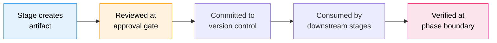

# 成果物リファレンス

AI-DLC のワークフローは、成果物を **インテントのレコードディレクトリ** に置きます。場所は `aidlc/spaces/<space>/intents/<YYMMDD>-<label>/` です（`<space>` は非既定スペースを使っていなければ `default`、`<YYMMDD>-<label>` がインテントディレクトリ。以下では `<record>/` と書きます）。この章は、ディレクトリ構造、成果物ごとの説明、ライフサイクル、git 方針の通しリファレンスです。

---

## ディレクトリツリー

成果物が行き得る場所の全集です。新規レコードの初期状態ではありません。インテント作成時に、スコープが走らせるフェーズごとにフォルダが 1 つでき（加えて `verification/`）、残りは作業が進むにつれて現れ、ステージ用フォルダはそのステージが初めて書いたときに作られます。

```
aidlc/spaces/<space>/intents/<YYMMDD>-<label>/   # one record dir per intent
  aidlc-state.md                    # Workflow state (commit)
  audit/                            # Audit trail — per-clone shards (commit)
    <host>-<clone>.md               # this clone's shard; readers glob + merge by timestamp
  .aidlc-recovery.md                # Recovery breadcrumb (gitignore)
  runtime-graph.json                # Execution telemetry view (gitignore)

  verification/                     # Phase boundary checks (commit)
    phase-check-initialization.md
    phase-check-ideation.md
    phase-check-inception.md
    phase-check-construction.md
    phase-check-operation.md

  initialization/                   # Phase 0 artifacts
    workspace-scaffold/scaffold-report.md
    workspace-detection/workspace-findings.md
    state-init/state-init-summary.md

  ideation/                         # Phase 1 artifacts
    intent-capture/
    market-research/                (conditional)
    feasibility/                    (conditional)
    scope-definition/
    team-formation/                 (conditional)
    rough-mockups/                  (conditional)
    approval-handoff/

  inception/                        # Phase 2 artifacts
    practices-discovery/            (conditional)
    requirements-analysis/
    user-stories/                   (conditional)
    refined-mockups/                (conditional)
    domain-design/             (conditional)
    units-generation/
    contract-design/           (conditional)
    delivery-planning/

  construction/                     # Phase 3 artifacts
    {unit-name}/                    (per unit of work, repeated)
      functional-design/            (conditional)
      nfr-requirements/             (conditional)
      nfr-design/                   (conditional)
      infrastructure-design/        (conditional)
      code-generation/
    build-and-test/
    ci-pipeline/                    (conditional)

  operation/                        # Phase 4 artifacts
    deployment-pipeline/            (conditional)
    environment-provisioning/       (conditional)
    deployment-execution/           (conditional)
    observability-setup/            (conditional)
    incident-response/              (conditional)
    performance-validation/         (conditional)
    feedback-optimization/          (conditional)

  archive/                          (created on-demand)
    {ISO-date}-{stage-name}/
```

**リバースエンジニアリングの成果物 9 点はレコードディレクトリにありません。** `architecture.md`、`code-structure.md`、`technology-stack.md` などは一つ上、スペース単位のリポジトリ別 CodeKB — `aidlc/spaces/<space>/codekb/<repo>/` — に置きます。インテントごとのコピーではなく、リポジトリにつき 1 ストアです。該当するブラウンフィールドのインテントでは、ステージがまずストアに記録されたスコープとワーキングツリーの指紋を見ます。検証済みで新しいストアの被覆がインテントに足りていれば、人が選べば再利用できます。そうでなければ全スキャンが 9 ファイルを置き換え、フォーカススキャンは解析した領域だけをマージし、その外の既存の散文は残します。検証済みの新しい被覆は和集合として積み上がります。古いか検証できない以前の深い被覆は散文として残し、浅い扱いに落とします（`reverse-engineering-timestamp.md` が最後のスキャン時刻と被覆を記録します）。スキャン前のソース / ストア世代と、全成果物のロック付き公開で、ソース変更を「新しい」と誤認せず、並行するフォーカススキャンが互いを黙って上書きしないようにしています。したがってインテントが読むのは、自分のレコードディレクトリができたときのスキャンではなく、そのリポジトリの最新スキャンです。レコードディレクトリに入るのはステージ自身の `memory.md` 日記だけです。エンジンが run-stage ディレクティブを出すときに作ります（下の **ステージごとの memory 日記**）。なので `inception/reverse-engineering/` はそこに現れ得ますが、中身は日記だけです。codekb への書き込みは `codekb > <repo> > <name>` のパンくずで監査に残るので、インテント単位の証跡でも何がいつ変わったかは追えます。オンボーディングは [Reverse Engineering と CodeKB](codekb.md) です。

**チームナレッジもレコードディレクトリにありません。** 一つ上のスペース単位 — `aidlc/spaces/<space>/knowledge/`（`intents/` の兄弟）— に置き、1 インテントに閉じ込めず、そのスペースの全インテントで積み上がります。エンジンは空で作り、チームが任意の `aidlc-shared/` とエージェント別サブディレクトリに自由形式のファイルを足します。[ナレッジ](08-knowledge.md)。

**ステージごとの memory 日記。** 実行した各ステージは、成果物の隣にコミットされる `memory.md` も持ちます（例: `<record>/inception/requirements-analysis/memory.md`）。ステージの観察日記です。エンジンが run-stage ディレクティブを出すときにテンプレートから作り、ステージ中はオーケストレータが維持し、承認ゲートの §13 Learnings Ritual が読みます。手では編集しません。日記がラーニングループにどう入るかは [ルールとラーニングループ](09-rules-and-the-learning-loop.md) です。

**コードは兄弟リポジトリにあり、レコードディレクトリにはありません。** `aidlc/` ツリーが持つのは方法論、状態、監査、成果物だけで、アプリケーションコードは入りません。生成コードはワークスペースの **コードリポジトリ** に落ちます。よくある単一リポジトリではプロジェクトディレクトリそのもの、複数リポジトリワークスペースではワークスペース直下の兄弟（それぞれ `.git` を持つ）です。インテントは作成時に触るリポジトリを `intents.json` の行（`repos: [...]`）に残します。自動発見か、`--repos a,b` で絞る。Construction の git 操作はどれか 1 つに錨を打ちます。`repos` が無いインテントは単一リポジトリの既定です。[CLI コマンド](12-cli-commands.md)。

---

## 成果物のライフサイクル

成果物は、作成から下流ステージの消費まで、決まった流れを通ります。



<!-- テキストフォールバック: ステージが成果物を作り、承認ゲートでレビューし、バージョン管理にコミットし、下流ステージが消費し、フェーズ境界で検証する。 -->

1. **作成** — リードエージェントがステージ実行中に成果物を作り、インテントのレコードディレクトリの該当サブディレクトリへ書く（上で書いたスペース単位の例外あり。Reverse Engineering はリポジトリ別 codekb、チームナレッジは `knowledge/`）
2. **レビュー** — 承認ゲートで見て、承認するか直しを求める
3. **コミット** — 承認後、バージョン管理の対象になる（下の git 方針）
4. **消費** — 下流ステージが入力として読む（下の入力表）
5. **検証** — フェーズ境界の検査が、そのフェーズの全成果物のトレーサビリティを確認する

---

## フェーズ別の成果物

### Initialization（ステージ 0.1–0.3）

| ステージ | 成果物 | 備考 |
|----------|--------|------|
| 0.1 Workspace Scaffold | `scaffold-report.md` | 決定論的（`aidlc-utility intent-create` の中で走る） |
| 0.2 Workspace Detection | `workspace-findings.md`、`aidlc-state.md` を更新 | 決定論的なルールベーススキャナ |
| 0.3 State Init | `state-init-summary.md` | 決定論的 |

ウェルカムメッセージはセッション開始時に `settings.json` の `companyAnnouncements` で描画されます。ステージではなく、成果物も出しません。

### Ideation（ステージ 1.1–1.7）

| ステージ | 主な成果物 | 条件 |
|----------|------------|------|
| 1.1 Intent Capture | `intent-capture-questions.md`（ソース台帳と確定した答え）、`intent-statement.md`、`stakeholder-map.md`（インラインのソースタグと必須の assumptions セクション） | 常時 |
| 1.2 Market Research | `competitive-analysis.md`、`build-vs-buy.md` | 条件付き |
| 1.3 Feasibility | `feasibility-assessment.md`、`constraint-register.md`、`raid-log.md` | 条件付き |
| 1.4 Scope Definition | `scope-document.md`、`intent-backlog.md` | 常時 |
| 1.5 Team Formation | `team-assessment.md`、`mob-composition.md` | 条件付き |
| 1.6 Rough Mockups | `wireframes.md`、`user-flow.md` | 条件付き |
| 1.7 Approval & Handoff | `initiative-brief.md`、`decision-log.md` | 常時 |

### Inception（ステージ 2.1–2.9）

| ステージ | 主な成果物 | 条件 |
|----------|------------|------|
| 2.1 Reverse Engineering | `architecture.md`、`code-structure.md`、`technology-stack.md` を含む 9 ファイル（スペース単位の `aidlc/spaces/<active-space>/codekb/<repo>/` へ書く。リポジトリにつき 1 つの共有ストア。検証済みで新しければ再利用、全スキャンで置き換え、フォーカススキャンで累積拡張。インテントのレコードに入るのはステージの `memory.md` 日記だけ）。オンボーディングは [Reverse Engineering と CodeKB](codekb.md) | ブラウンフィールドのみ |
| 2.2 Practices Discovery | `team-practices.md`、`discovered-rules.md`、`evidence.md`、`practices-discovery-timestamp.md`、加えて quality / developer / devsecops の寄与ファイル（承認後に `aidlc/spaces/<active-space>/memory/team.md` と `project.md` へ昇格） | 条件付き |
| 2.3 Requirements Analysis | `requirements.md` | 常時 |
| 2.4 User Stories | `stories.md`、`personas.md` | 利用者向け機能 |
| 2.5 Refined Mockups | `mockups.md`、`interaction-spec.md`、`accessibility-checklist.md` | UI 案件 |
| 2.6 Domain Design | `components.md`（統合コンポーネントカタログ）、`decisions.md`（ADR ログ） | 新しいコンポーネントが要るとき |
| 2.7 Units Generation | `unit-of-work.md`、`unit-of-work-dependency.md`、`unit-of-work-story-map.md` | 常時 |
| 2.8 Contract Design | `contract-summary.md`（ユニット間契約） | 複数ユニットのシステム |
| 2.9 Delivery Planning | `bolt-plan.md`、`team-allocation.md`、`risk-and-sequencing-rationale.md`、`external-dependency-map.md` | 常時 |

### Construction（ステージ 3.1–3.7）

ステージ 3.1–3.5 は作業ユニットごとに繰り返します。成果物は `construction/{unit-name}/{stage-name}/` です。ステージ 3.6–3.7 は全ユニットのあと一度だけ走ります。

設計 4 ステージ（3.1–3.4）は、各ユニットの **kind**（2.7 のエッジブロックにタグ: `service`、`spec`、`ui`、`packaging`、`library`）に合わせて成果物を削ります。`spec` ユニットにスケーラビリティ文書は不要、`packaging` ユニットに機能仕様は不要。タグが無いユニットは下の表を全部負います。どの成果物がどの kind に付くかはステージ frontmatter の `produces_kinds` です（[Stage definition](../reference/15-stage-definition.md)）。そのステージの成果物が一つも当たらないユニットは、ファイルゼロでそのステージ完了です。

| ステージ | 主な成果物 | 条件 |
|----------|------------|------|
| 3.1 Functional Design | `entities.md`、`rules.md`、`functional-spec.md` | 計画どおり、ユニットごと（kind による） |
| 3.2 NFR Requirements | `security-requirements.md`、`performance-requirements.md` | 計画どおり、ユニットごと（kind による） |
| 3.2 NFR Requirements | `observability-requirements.md` | 計画どおり、service ユニットのみ |
| 3.3 NFR Design | `security-design.md`、`performance-design.md` | 計画どおり、ユニットごと（kind による） |
| 3.3 NFR Design | `observability-design.md` | 計画どおり、service ユニットのみ |
| 3.4 Infrastructure Design | `infrastructure-specification.md`、`monitoring-design.md`、`cicd-pipeline.md` | 計画どおり、ユニットごと（kind による） |
| 3.5 Code Generation | `code-generation-plan.md`、`code-generation-questions.md`、`unit-test-instructions.md`、`code-summary.md`、`traceability.json`、加えてエンジン必須の `source-manifest.json`（コードはワークスペースルートへ） | 常時、ユニットごと |
| 3.6 Build and Test | `build-instructions.md`、`test-results.md` | 常時、全ユニットのあと |
| 3.7 CI Pipeline | `ci-config.md`、`quality-gates.md` | 条件付き、全ユニットのあと |

### Operation（ステージ 4.1–4.7）

| ステージ | 主な成果物 | 条件 |
|----------|------------|------|
| 4.1 Deployment Pipeline | `cd-config.md`、`deployment-strategy.md`、`rollback-runbook.md` | 条件付き |
| 4.2 Environment Provisioning | `environment-inventory.md`、`validation-report.md` | 条件付き |
| 4.3 Deployment Execution | `deployment-log.md`、`smoke-test-results.md` | 条件付き |
| 4.4 Observability Setup | `dashboards.md`、`alarms.md`、`slo-config.md` | 条件付き |
| 4.5 Incident Response | `runbooks.md`、`incident-plan.md`、`escalation-matrix.md` | 条件付き |
| 4.6 Performance Validation | `load-test-plan.md`、`nfr-validation-matrix.md` | 条件付き |
| 4.7 Feedback & Optimization | `slo-report.md`、`cost-analysis.md`、`feedback-loop.md` | 条件付き |

---

## 質問ファイル

利用者入力を取るステージは、同じ場所に `{stage-name}-questions.md` を出します。質問は文字付き選択肢（A–E）に、必須の `X. Other (please specify)` を足し、応答は `[Answer]:` タグに残します。

答え方はステージごとに選べます。

| モード | 動き |
|--------|------|
| **Guide Me** | 対話ウォークスルー。一度に最大 4 問 |
| **I'll Edit the File** | 質問ファイルを直接編集し、終わったら「done」と合図する |
| **Chat** | 自由な会話。判断を抜き出してファイルに書く |

ステージの途中でモードは切り替えられます。正本は常に質問ファイルです。

---

## コミットするものと Gitignore

同梱の `.gitignore` がこの切り分けです（vision §5.1）。共有する仕事（方法論、レジストリ、状態、監査、成果物）はコミットし、利用者ごとのセッションカーソルとマシンローカルの派生状態は無視します。

| コミット | Gitignore |
|----------|-----------|
| `aidlc-state.md` | `aidlc/active-space`、`intents/active-intent`（利用者ごとのカーソル） |
| `audit/*.md`（クローンごとのシャード） | `.aidlc-recovery.md` とそのほかの `intents/*/.aidlc-*`（一時パンくず） |
| 全ステージ成果物 | `runtime-graph.json`（監査シャードから再導出できる） |
| `verification/` のフェーズ検査結果 | `aidlc/.aidlc-clone-id`（このクローンのシャード名。マシンローカルのままにする） |
| スペース単位の `aidlc/knowledge/` チームナレッジ | `aidlc/.aidlc-sessions/`（セッションごとの UUID スタンプ、ワークフロー紐づけ、PID 祖先マップ） |
| ステージごとの `memory.md` 日記、スペースの `memory/` 層 | `.aidlc-hooks-health/`、`.aidlc-sensors/`（ハートビート、advisory 所見） |

---

## 入力と依存

各ステージは先行ステージの成果物を入力として読みます。主な依存の鎖:

- **Intent Capture** の成果物 → Market Research、Feasibility、Scope Definition、Rough Mockups
- **Requirements Analysis** の成果物 → User Stories、Domain Design、Construction の全ステージ
- **Domain Design** と **Units Generation** の成果物 → Construction のユニットごとステージ全部
- **Construction の全成果物** → Build and Test と CI Pipeline
- **Infrastructure Design** の成果物 → Operation のステージ

ステージごとの入力表の全体は [Orchestration Reference](../reference/00-overview.md) です。

---

## フェーズ境界検証

フェーズをまたぐとき、トレーサビリティを確認する検査が走ります。

| 検査ファイル | 遷移 | 見るもの |
|--------------|------|----------|
| `phase-check-initialization.md` | Initialization → Ideation | ワークスペーススキャフォールド、スコープ計画、エージェントの用意 |
| `phase-check-ideation.md` | Ideation → Inception | インテント → スコープ → インテントバックログの一貫性 |
| `phase-check-inception.md` | Inception → Construction | 要件 → ストーリー → アーキテクチャの整合 |
| `phase-check-construction.md` | Construction → Operation | 全ユニットのビルドとテスト、CI の設定 |
| `phase-check-operation.md` | Operation → ワークフロー完了 | デプロイ、オブザーバビリティ、フィードバックループ |

---

## 次の章

- [状態と監査](10-state-and-audit.md) — 状態ファイルと監査証跡
- [フェーズとステージ](04-phases-and-stages.md) — ステージ実行と成果物の出し方
- [用語集](glossary.md) — 成果物、フェーズ境界検証、質問ファイル
