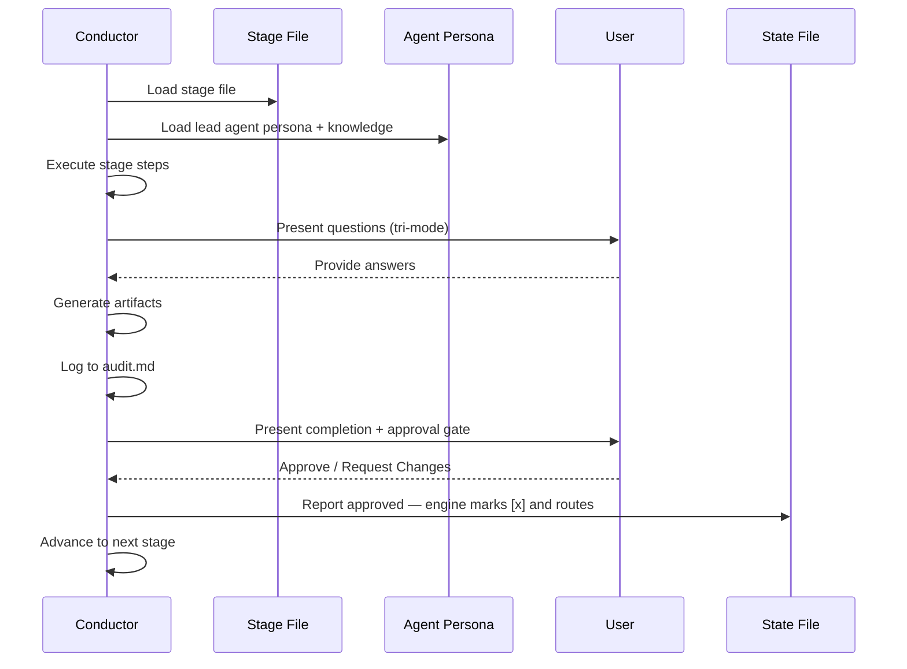
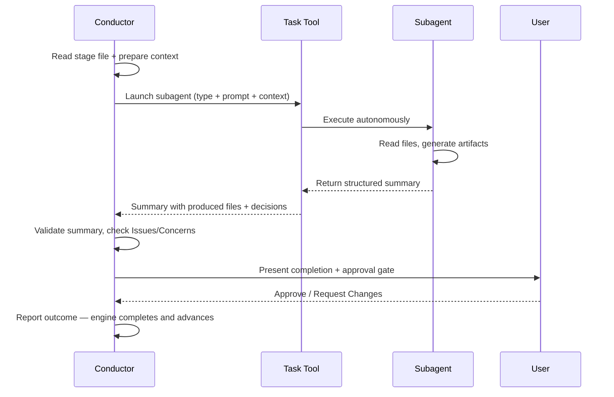

# アーキテクチャ

> **出典**: エンジンとコンダクター（`.claude/tools/aidlc-orchestrate.ts` と `.claude/skills/aidlc/SKILL.md`）および周辺ファイルから起こしたものです。

## 概要

AI-DLC の実行はハイブリッドです。一部のステージはインライン（コンダクターがエージェントのペルソナを載せ、会話の中で直接進める）で、ほかは Claude Code の Task ツール経由でサブエージェントに委譲します。インラインは人とのやりとり（質問、確認、承認）ができます。サブエージェントのステージは自律で走り、構造化した要約を返します。

```mermaid
graph LR
    subgraph INITIALIZATION["INITIALIZATION (0.1-0.3)"]
        Z1["Workspace Scaffold"]
        Z4["State Init"]
        Z1 -.->|"3 stages"| Z4
    end

    subgraph IDEATION["IDEATION (1.1-1.7)"]
        I1["Intent Capture"]
        I7["Approval & Handoff"]
        I1 -.->|"7 stages"| I7
    end

    subgraph INCEPTION["INCEPTION (2.1-2.9)"]
        N1["Reverse Engineering"]
        N7["Delivery Planning"]
        N1 -.->|"9 stages"| N7
    end

    subgraph CONSTRUCTION["CONSTRUCTION (3.1-3.7)"]
        C1["Functional Design"]
        C7["CI Pipeline"]
        C1 -.->|"7 stages per unit"| C7
    end

    subgraph OPERATION["OPERATION (4.1-4.7)"]
        O1["Deployment Pipeline"]
        O7["Feedback & Optimization"]
        O1 -.->|"7 stages"| O7
    end

    Z4 -->|"auto-proceed"| I1
    I7 -->|"Verification Gate 1"| N1
    N7 -->|"Verification Gate 2"| C1
    C7 -->|"Verification Gate 3"| O1
    O7 -.->|"Feedback Loop"| I1

    style INITIALIZATION fill:#f3e5f5,stroke:#9c27b0,color:#000
    style IDEATION fill:#e8f5e9,stroke:#4caf50,color:#000
    style INCEPTION fill:#e3f2fd,stroke:#2196f3,color:#000
    style CONSTRUCTION fill:#fff3e0,stroke:#ff9800,color:#000
    style OPERATION fill:#fce4ec,stroke:#e91e63,color:#000
```



## 五層

**ルール**（`rules/`） — 組織とプロジェクトのガードレール。自己学習します。人の訂正が、残る振る舞いのルールになります。全体で約 35 行に抑えます。AI-DLC 以外の会話でコンテキストが膨らまないようにするためです。

**エージェント**（`agents/*.md`） — 平らなエージェントファイル 14。領域の専門家 11、レビュー専用 2、適応型ワークフローのコンポーザー 1。それぞれ役割、責任、協働の型、ツール、読むメモリの焦点を定義します。コアのペルソナは `disallowedTools: Task` を持ちます。パッケージャは、対応するハーネスではそのネイティブ拒否を残し、ネストした委譲を禁じる同じ境界を各ハーネスのツール方針へ投影します。Kiro のエージェント Markdown は未対応のキーを省き、Kiro CLI のエージェント JSON と Kiro IDE の `tools:` 付与は、委譲先から `subagent` ツールを外します。

**ナレッジ**（`knowledge/`） — 方法論参照の二層です。
- `aidlc-shared/` — 原則、検証、ブラウンフィールドの保護、**監査イベントの分類**（正本のイベントレジストリ）、状態テンプレート
- `aidlc-<agent>-agent/` — エージェントごとの方法論（アーキテクチャパターン、テスト戦略など）

**スキル**（`skills/aidlc/`） — オーケストレータの入口（`SKILL.md`）、静的 / 復旧 / ガバナンスのプロトコルと、条件付きで載るレビュアー / 編成 / Construction / スウォームの 4 モジュール（`aidlc-common/protocols/`）、5 フェーズディレクトリにまたがるステージ 33（`stages/initialization/`、`stages/ideation/`、`stages/inception/`、`stages/construction/`、`stages/operation/`）。

**フック**（`hooks/`） — フレームワークフックです。監査の発行（Write / Edit の PostToolUse）、セッション寿命（SessionStart、SessionEnd）、状態同期（TaskUpdate の PostToolUse）、状態検証（PreCompact）、サブエージェント追跡（SubagentStop）、ステータスライン描画。フレームワークファイルはすべて `aidlc-*.ts` です。

## 設定レイヤ {#configuration-layers}

> **読者**: 新しい関心（ルール、方法論の一片、センサーの結び、領域ナレッジの事実）をどこへ置くか決める人。
> **正本としての位置**: これが振り分けの原則です。コードとこの節が食い違ったら、この節が勝ちます。コードの分類がずれています。

このリポジトリの設定は、一本ではなく**直交する二軸**で切れます。

### 軸 1 — 誰が書くか

- **フレームワークが書く** — AI-DLC 配布に同梱。どのプロジェクトでも同じ。フレームワークのリリースで更新。利用者が自分のワークスペースで編集しない。
- **チームが書く** — 人が書く（またはこのワークスペースで走ったステージが書き、人が確める）。このプロジェクト固有。このワークスペースのワークフローをまたいで残る。編集してよい。

### 軸 2 — いつ読むか

- **常に載る（ハーネス設定）** — セッション開始時に読む。このワークスペースのどのワークフローのどのステージでも使える。`.claude/` の下。
- **ワークフローごとの成果物** — 特定のステージが出力し、後続が入力として読む。インテントのレコードディレクトリ（`aidlc/spaces/<space>/intents/<YYMMDD>-<label>/`、以下 `<record>/`）に置く。ワークフロー実行のたびに作り直す。

### 四象限

二軸を交差すると四象限です。三つは埋まり、一つは意図して空です。

|  | フレームワークが書く | チームが書く |
|---|---|---|
| **常に載る**（ハーネス設定） | `.claude/skills/`、`.claude/agents/`、`.claude/knowledge/`、`aidlc/spaces/<active-space>/memory/org.md`、`aidlc/spaces/<active-space>/memory/phases/*.md`、`.claude/scopes/`、`.claude/tools/data/scope-grid.json`、`.claude/tools/data/stage-graph.json` | `aidlc/spaces/<active-space>/memory/team.md`、`aidlc/spaces/<active-space>/memory/project.md` |
| **ワークフローごとの成果物** | *（設計どおり空）* | `<record>/aidlc-state.md`、`<record>/audit/*.md`（クローンごとのシャード）、`<record>/<phase>/<stage>/*.md`、`.aidlc/worktrees/bolt-*/` |

フレームワークがワークフローごとの成果物を出さないのは、それを配布に同梱することになるからです。それはフレームワークが書いたハーネス設定であり、実行ごとの出力ではありません。空のマスは振り分け規則の署名であり、欠落ではありません。

> **フレームワークが書く = 上流から届く。プロジェクトでは不変として扱う。** git もファイルシステムも強制しません。`.claude/` は編集できる場所で、`org.md` や `phases/*.md` も触ろうと思えば触れます。慣例は、フレームワーク既定をいじらず、`team.md` / `project.md`（右のマス）で上書きすることです。レビュー時に上書きが見え、フレームワークのアップグレードが素直で、同じ版を共有するプロジェクト間のドリフトも防げます。

### 新しい関心の置き場所 — 境界テスト

新しい関心が来たら、二つの問いで行き先が決まります。

1. **どのプロジェクトでも同じか、このプロジェクト固有か。** フレームワークが書くか、チームが書くか。
2. **毎セッションのエージェント文脈に載るか、特定ステージだけが読むか。** ハーネス設定か、ワークフローごとの成果物か。

具体例です。

- *「main への squash マージは常にする」* — プロジェクト固有（別チームは rebase）で、常に載る（ボルトマージのたびにコンダクターが読む）。行き先は `aidlc/spaces/<active-space>/memory/team.md`。
- *「サービス層では必ず Result<T,E>。throw しない」* — プロジェクト固有で、常に載る（コード生成のたびにエージェントが読む）。行き先は `aidlc/spaces/<active-space>/memory/project.md`。
- *「推奨のブランチ戦略はトランクベース」* — どのプロジェクトでも同じ（フレームワークの見解）で、常に載る（デリバリ計画で読む）。行き先は `aidlc/spaces/<active-space>/memory/org.md`。
- *「よくあるブランチ戦略 5 つと、そのトレードオフ」* — どのプロジェクトでも同じ（フレームワークの参照）で、常に載る（`aidlc-pipeline-deploy-agent` がブランチ戦略を探すときに読む）。行き先は `.claude/knowledge/aidlc-pipeline-deploy-agent/branching-strategies.md`。
- *「この実行の要件分析」* — プロジェクト固有で、ワークフローごと（実行のたびに新しい分析）。行き先は `<record>/inception/requirements-analysis/`。
- *「Construction 途中の Bolt-1 をホストしている worktree の状態」* — プロジェクト固有で、ワークフローごと（スウォームモードのボルトごとに作り直す）。行き先はその worktree 内のレコードコピー、`.aidlc/worktrees/bolt-1/<record>/aidlc-state.md`。

### ハーネス設定（上段）の細分

上段は、**中身の形**でさらに切れます。

- **フレームワークのハーネス機構** → frontmatter / JSON。ワークフロー順、ステージ定義、成果物の生成、ゲートの意味。ツールが決定論的に読む。場所は `.claude/skills/`、`.claude/tools/data/`。
- **フレームワークの領域参照** → `.claude/knowledge/aidlc-<agent>-agent/` のエージェント KB 散文。領域の選択肢メニュー（ブランチ戦略 5 つ、デプロイパターン、テスト方法論）。担当エージェントがメニューが要るときに読む。
- **フレームワークの方法論既定** → `aidlc/spaces/<active-space>/memory/org.md` の散文。チームが別を確めるまで、フレームワークが勧めること。チームの口調で書く（上書きしなければ、org 既定がチームの口調になるからです）。
- **チームの流儀** → `aidlc/spaces/<active-space>/memory/team.md` の散文。チームの選択。「こう働く」。practices-discovery の確認ゲートで埋まる。判断点でエージェントが読む（デリバリ計画はブランチ戦略、コンダクターは `SKILL.md` の walking-skeleton 姿勢）。
- **プロジェクトの上書き** → `aidlc/spaces/<active-space>/memory/project.md` の散文。チームと org の既定を覆す、プロジェクト固有の訂正。同じく practices-discovery の確認ゲートで埋まる。
- **ガードレール**（`## Forbidden`、`## Mandated`、`## Corrections`） — `org.md`、`team.md`、`project.md` にある。エージェント向けの矯正規則 — `ALWAYS X`、`NEVER Y`。エージェント文脈に常に載る。

### `.claude/` に直接置かないもの

設定に見えるが、設定ではないものが二つあります。

- **残るリポジトリ分析の出力。** Reverse Engineering のブラウンフィールド成果物 9 つ（`code-structure.md`、`architecture.md` など）は、あるリポジトリの最新スキャンです。場所は `aidlc/spaces/<active-space>/codekb/<repo>/` であり、`.claude/` でもインテント記録でもありません。該当するワークフローのたびに Reverse Engineering が再走し、リポジトリ単位の共有ナレッジを更新します。
- **実行時の状態。** `aidlc-state.md` はワークフローごとの「いま」の正です。インテントのレコードディレクトリに置き、`.claude/` には置きません。`audit/` シャードも同じです。

### 行をまたぐ昇格 — practices-discovery の例外

ほとんどのステージは一方の行にだけ書きます。少数は両方に書き、行をまたぐ書き込みはチームの確認でゲートします。**これをやるのは Practices Discovery（Inception 2.2）だけです。** 出力は次です。

- `<record>/inception/practices-discovery/team-practices.md` — ワークフローごとの監査証跡（下段）。
- 確認したら、スペースのメモリ層へコピーする — `aidlc/spaces/<active-space>/memory/team.md` と `memory/project.md`。チームが書いたハーネス設定（右上のマス）。

監査証跡のコピーは、この実行で何を確めたかの証拠です。`.claude/` 側のコピーは、以後のワークフローが毎回載せる、チームの常設設定になります。

型（スキャン → 下書き → 確認 → 公開）は Reverse Engineering と同じです。違うのは*帰結*です。Reverse Engineering の確認は「このスキャンは正確」です。Practices Discovery の確認は「フレームワークはこれらの文を常設設定に書き、以後のワークフローで毎回載せてよい」です。

確認ゲートが無ければ、フレームワークがチームの口を借り、しかもその文がワークフローをまたいで残ります。ゲートがあれば、書いたのは常にチームです。

この型は稀で、意図して使います。次の三つがすべて真のときだけです。

1. ステージの出力が、チーム・プロジェクト・ワークスペースについての構成的な真実である。
2. その真実は、この実行の下流だけでなく、以後のすべてのワークフロー実行に効くべきである。
3. チームがその真実を書く気がある — ゲートで見て承認する。フレームワークに書かせて終わり、ではない。

三つどれかが偽なら、ワークフローごとの出力だけにします。

### 相互参照

- [Agent System](05-agent-system.md) — エージェントファイルの構造（左上マスの機構）。
- [Knowledge System](10-knowledge-system.md) — `knowledge/` の二層。
- [Stage Definition](15-stage-definition.md) — ステージ frontmatter の仕様（ハーネス機構の形式）。
- [Stage Protocol](04-stage-protocol.md) — ステージごとの実行規則。

## 実行モデル

**インラインステージ** — コンダクターはリードエージェントの平らなファイル（例: `agents/aidlc-architect-agent.md`）と `knowledge/[agent]/` のナレッジを読み、ペルソナの枠を載せ、会話の中でステージを進めます。リアルタイムのやりとりができます。質問、曖昧さの解消、承認前の成果物の反復です。

インラインは 29 ステージです。Initialization の 3 つ全部（Workspace Scaffold、Workspace Detection、State Init — いずれも `aidlc-utility intent-create` の中で決定論的に走る）、Ideation 全部、Inception の 6（Requirements Analysis、Refined Mockups、Domain Design、Units Generation、Contract Design、Delivery Planning）、Construction の 6（Functional Design、NFR Requirements、NFR Design、Infrastructure Design、Build and Test、CI Pipeline）、Operation 全部。注: Build and Test（3.6）は全ユニット完了後に一度だけ走り、ユニットごとではありません。

**サブエージェントステージ** — コンダクターは文脈（先行成果物、プロジェクト説明、ワークスペース所見）を整え、Claude Code の Task ツールへ委譲します。サブエージェントは自律で実行し、構造化した要約を返します。実行中に人とやりとりせず、集中した独立作業が効くステージ向けです。呼び出しが失敗したら、コンダクターは縮小した文脈で一度再試行し、そのあとインライン実行か、飛ばして後で戻るかを人に出します。

委譲する形を使うのは 4 ステージです。Reverse Engineering（2.1、`mode: pipeline` — developer がスキャンし、architect が合成して書く）、Practices Discovery（2.2、`mode: subagent` — pipeline-deploy リードの下書き、互いに見えない quality / developer / devsecops のスポーク、人へのインタビュー、リードの統合）、User Stories（2.4、`mode: mob` — product リードの下書きに design / developer / quality の寄与ラウンド）、Code Generation（3.5、集中した developer サブエージェント）。全体はインライン 29 / サブエージェント 2 / パイプライン 1 / モブ 1 です。Workspace Detection（0.2）は `aidlc-utility intent-create` の中で決定論的に走り、サブエージェントではありません。

```mermaid
flowchart LR
    subgraph INLINE["Mode 1: Inline"]
        direction TB
        IN1["Conductor reads\nstage file"]
        IN2["Load agent persona\n+ knowledge"]
        IN3["Execute stage steps\ndirectly in conversation"]
        IN4["User interaction\navailable"]
        IN5["Approval gate\n(AskUserQuestion)"]
        IN1 --> IN2 --> IN3 --> IN4 --> IN5
    end

    subgraph SUBAGENT["Mode 2: Subagent (simple)"]
        direction TB
        SA1["Conductor reads\nstage file"]
        SA2["Prepare context:\nartifacts + persona"]
        SA3["Task tool call\n(subagent_type specified)"]
        SA4["Subagent executes\n(no user interaction)"]
        SA5["Return structured\nsummary to conductor"]
        SA6["Conductor presents\ncompletion + approval"]
        SA1 --> SA2 --> SA3 --> SA4 --> SA5 --> SA6
    end

    subgraph TWOSTEP["Mode 3: Pipeline (2-link RE chain)"]
        direction TB
        TS1["Conductor reads\nRE stage file"]
        TS2["Task: aidlc-developer-agent\ncode scan"]
        TS3["Developer returns\nscan results"]
        TS4["Task: aidlc-architect-agent\nsynthesis"]
        TS5["Architect produces\n9 artifacts"]
        TS6["Conductor presents\ncompletion + approval"]
        TS1 --> TS2 --> TS3 --> TS4 --> TS5 --> TS6
    end

    style INLINE fill:#e8f5e9,stroke:#4caf50,color:#000
    style SUBAGENT fill:#e3f2fd,stroke:#2196f3,color:#000
    style TWOSTEP fill:#fff3e0,stroke:#ff9800,color:#000
```



### コンダクターのインライン実行



### コンダクターのサブエージェント委譲



## 正本と配布（一つのコア、複数ハーネス）

フレームワークは**一度書いてハーネスごとに生成**します。いまは Claude Code、Kiro CLI、Kiro IDE、Codex CLI、Cursor、opencode、GitHub Copilot、および移植先の有能な CLI です。手で書く正本はハーネス非依存の `core/` と、CLI ごとの薄い `harness/<name>/` です。`bun scripts/package.ts` が、gitignore した局所の `dist/<harness>/` 木を実体化します。

```
core/                  # hand-authored, harness-neutral (tools, aidlc-common,
                       #   agents, rules, scopes, sensors, knowledge, hooks,
                       #   3 session skills); prose uses the {{HARNESS_DIR}} token
harness/<name>/        # per-CLI surface: manifest.ts + orchestrator skill +
                       #   harness files (+ emit.ts for codex)
scripts/package.ts     # the build: copy core (token→.claude/.kiro/.codex) +
                       #   harness, compile the graph, generate runners, emit;
                       #   writes both channels; `--check` builds twice and compares
scripts/build-binaries.ts # release-only binary compiler + smoke gate, writing
                       #   per-target executable + runtime/<harness>/ bundles
                       #   under ignored build/binaries/
dist/<harness>/        # GENERATED + ignored: claude/.claude, kiro/.kiro,
                       #   kiro-ide/.kiro, codex/{.codex,.agents},
                       #   opencode/{.aidlc,.opencode}, copilot/{.aidlc,.github} — never hand-edited
```

`core/` の `.ts` は変換せずバイトコピーします。実行時の `harnessDir()` シーム（`core/tools/aidlc-lib.ts`）は、出荷レイアウトからハーネスディレクトリをその場で導きます。開集合で、ハードコードした一覧ではなくツール自身のパスから取るので、新しいハーネスでもここは直しません。マニフェスト名と rules ディレクトリの改名は、生成される `tools/data/harness.json` で木ごとに出荷します。実行時のパス解決はその名前で共有エンジンディレクトリを区別し、`rulesSubdir()` が改名を読みます。ツールの正本は一式で、どのハーネスでも走ります。[Porting to a New Harness](../harness-engineering/09-porting-to-a-new-harness.md) を見てください。

`dist/` と `dist-release/` は、同じ書いた木の、gitignore した局所投影です。`dist/` のソース / 開発チャネルは、生成 TypeScript ディスパッチャを Bun 経由で呼びます。`dist-release/` のリリースチャネルは、フック、生成コマンド、アダプタ、ホスト信頼エントリをネイティブ `aidlc` ディスパッチャへ通します。ホスト信頼の種のようなネイティブ専用のルート統合は、リリース投影にだけ足します。どちらもコミットしません。`package.ts --check` は完全な投影集合を独立した一時ルートで二度ビルドし、その結果をバイト比較します。CI、テスト、バイナリビルド、リリース梱包は、どちらの局所ルートも消費する前に再生成します。

### 投影の身元と所有 {#projection-identity-and-ownership}

生成したどのハーネスディレクトリも、`tools/data/` の下に三つの別メタデータ契約を運びます。

- `harness.json` は実行時設定です。配布身元、製品名、次の一手の文、ハーネス / ルールディレクトリ、プラグイン選択と任意の `models`、`runtime`、`providers`、`trust`、`flags`、`project` 記録のような、変えられるプロジェクト選択です。
- `agent-tiers.json` は、`core/agents/*.md` frontmatter から生成した、出荷エージェント名から層への写しです。実行時のモデル方針はこのファイルを読み、エージェント名簿をハードコードしません。
- `aidlc-stamp.json` は不変の投影身元です。スキーマ、フレームワーク版、配布、ハーネスディレクトリ。
- `aidlc-projection.json` は網羅的な導入記述子です。トップレベル出力のすべてを、フレームワーク管理ディレクトリか、型付きマージ方針（`managed-block`、`json-map`、`json-array`、`whole-file`）付きのルート統合かに分類します。任意統合と正確なレガシーハッシュをここで宣言します。未分類のトップレベル項目があると、パッケージングまたは読み込みが失敗します。

`aidlc config` は計画の前にスタンプと記述子を検証します。入れたハーネスへ四つ目のファイル `aidlc-manifest.json` を書き、プロジェクト固有の所有ベースラインにします。上流版、ファイルごとのハッシュ、ルート寄与、選んだ任意統合モードです。刷新はそのベースラインを使い、変わっていないフレームワークバイトを更新し、局所変更を保ち、ルート統合をマージし、退役した所有中身を外します。ネイティブ記述子に記録したコピーチャネルハッシュで、正確で未変更のレガシーコピー導入を採用できます。未知バイトをフレームワーク所有と推測することはありません。

### モデル方針の投影 {#model-policy-projection}

`aidlc config models` は既存の公開 `config` コマンドの節であり、七つ目の公開コマンドではありません。方針はハーネスメタデータではなく、共有設定階層にあります。

- マシン導入ルートの `aidlc.settings.json`
- プロジェクトルートの `aidlc.settings.json`
- プロジェクトルートの `aidlc.settings.local.json`

層はその順で葉ごとにマージし、それから環境上書きが勝ちます。局所ファイルは個人で gitignore、プロジェクトファイルはチーム共有です。

```json
{
  "schemaVersion": 1,
  "models": {
    "schemaVersion": 1,
    "preset": "thorough",
    "groups": {
      "reviewing": { "effort": "xhigh" }
    },
    "agents": {
      "architect": {
        "effort": "xhigh",
        "model": { "claude": "provider/raw-id" }
      }
    },
    "profiles": {
      "my-profile": {
        "groups": {
          "reviewing": { "effort": "medium" }
        }
      }
    }
  },
  "flags": {
    "schemaVersion": 1,
    "swarm": true
  }
}
```

解決器は、エージェントごとの例外、グループダイヤル、出荷層既定、それからセッション継承を適用します。出荷既定層は共有の層投影モジュールと、アクティブな層上限解決器を呼びます。モデル表を複製しません。同じ面の書き手が、パッケージ時と config 刷新時の両方で、Claude と Cursor の Markdown、Codex TOML、opencode Markdown、Kiro エージェント JSON と `chat.modelDefaults` に使われます。

刷新は、解決した設定鎖をきれいなステージ投影へ渡し、`planManagedFiles` がステージバイトをハッシュする前にモデルとフラグの面を書き直します。方針キーは `harness.json` へコピーしません。したがってあとの素の `aidlc config` は解決した方針を再適用し、所有エージェント面の手編集は普通の刷新衝突のままです。

未対応方針は明示です。解決器はハーネスの正直さを報告し、語彙のいちばん近い値へ下方向にだけクランプします。選んだハーネスが無視するキーは決して書かず、生きているプロバイダに対して検証せず、モデル方針をステージファイルへ通しません。

### 実行時、プロバイダ、信頼の診断 {#runtime-provider-and-trust-diagnostics}

`core/tools/aidlc-config-diagnostics.ts` は、`aidlc config runtime`、`aidlc config providers`、`aidlc config trust`、および対応する doctor 行の共有実装です。各節はスキーマ版付きの答え記録を `harness.json` に格納します。実行時ローダはこれらの任意兄弟キーを無視します。

実行時探りは、ログイン非依存のフック PATH を導き、入れたフックバイトが要求するコマンドだけを解決し、選んだハーネス CLI を探ります。記録した絶対パスは診断証拠であり、書き直したフックコマンドではありません。ホスト許可リストと Codex 信頼ハッシュは、裸のコマンド接頭辞に結びます。

プロバイダ検出は、局所の AWS 環境、プロファイル、資格、ロール、SSO キャッシュ証拠だけを読みます。Bedrock リージョンとプロファイルの答えは、管理ファイルのハッシュの前にステージ投影へ適用します。Claude はステージした AWS MCP エンドポイントとメタデータも同じリージョンへ書き直します。Codex のモデルと effort キーは触れません。OpenCode のプロバイダ選択肢は、利用者が申し出を受け入れたあとだけ書きます。指示専用ハーネスは、惰性のプロバイダキーではなく、了解を記録します。

オフラインでは検査できないプロバイダ操作は、プロバイダ記録の小さな保留アクション一覧に置きます。config と doctor はアクション ID から人向け文を導き、記録が持つのは ID と pending / done 状態だけです。

信頼診断は既存のホスト面を読みます。Codex は利用者設定の完全なプロジェクト固有種集合を、Kiro IDE は入れた信頼コマンドエントリを、どのハーネスも必須兄弟ディレクトリを検査します。config trust は信頼種も許可規則生成器も呼びません。

成功した非 dry-run の config トランザクションは、そのあと入れたバイトに対して安い適用後走査を走らせます。実行時脚は、対話でない PATH 上の実際のフックコマンドファイルが要るバイナリだけを解決し、ハーネス CLI の版探りは意図して飛ばします。信頼脚はホスト信頼面を読み、プロバイダ脚は記録した保留アクションだけを読みます。人と静かな出力は正確な節の後続を名指し、JSON は構造化した `outstandingActions` 配列を運びます。トランザクションは成功してコミットしたので、終了コードは 0 のままです。

Doctor の指示ファイル行は `tools/data/aidlc-manifest.json` から導きます。managed-block 統合は、順序付きマーカー対一つと記録したブロックハッシュを検査し、フレームワーク所有の whole-file 指示面は記録したファイルハッシュと照合します。行はintact、欠け、局所変更の状態を区別し、複数ハーネスのプロジェクトでは呼び出したハーネスを選びます。

### フラグとプロジェクト選択 {#flags-and-project-choices}

`aidlc config flags` はスキーマ版付きの `flags` 記録を `harness.json` に格納します。`readShippedHarnessData` はその記録を既存のプラグイン選択と並べて解析し、`resolveProjectFlag` が共通の環境優先検索を提供します。既存ツールとフックは本物の環境変数振る舞いを保ちます。変数が無いときだけ記録へ落ちます。オーケストレータスキルは、コンダクター所有のスウォーム選択に同じ優先順位を使います。

フラグ記録は、既定スコープ、スウォーム、フックデバッグ、センサータイムアウト、文書化した迂回環境名の固定目録を含みます。スコープ検証は入れたスコープ frontmatter を読みます。Claude のステージ設定書き手は `AWS_AIDLC_DEFAULT_SCOPE` も更新します。出荷セッション環境が、そうでなければ記録より優先するからです。

`aidlc config project` は MCP と補完の答えをスキーマ版付き `project` 記録に格納し、プラグイン選択は既存のトップレベル `plugins` 配列に置き続けます。入れたプラグインはグラフ、スコープ、プラグインサイドカーデータから発見します。通常の刷新ガードは、どのプロジェクト選択変異も生きているワークフロー計画を変えないように守ります。

記録した MCP 同意は、同じトランザクションと、あとの素の刷新で、既存のルート統合マージモードへ供給します（Claude の同意管理 `.mcp.json`）。MCP 診断は Claude 配置を仮定せず、ホスト面を分類します。Kiro の設定ファイルは常に出荷するので、`defaults` はその存在を検証し、`none` は指示専用です。いま MCP ファイルの無いハーネスは、直せないドリフト無しで答えを記録します。補完の答えは、正確なネイティブまたはコピーチャネルの指示を出します。config はシェルプロファイルも、別のマシン範囲ファイルも書きません。

刷新中、三つの記録はきれいなステージ `harness.json` へマージされます。プロバイダ書き手がそのあと、`planManagedFiles` がハッシュする前にステージしたホストファイルを更新します。したがってあとの素の `aidlc config` は記録したプロバイダ答えを再適用し、reset は変わっていない出荷フォールバックバイトへ戻します。

### ディスパッチャの経路方針 {#dispatcher-route-policy}

`core/tools/aidlc.ts` は両チャネルの経路レジストリであり、コンパイル済みバイナリの入口です。各経路はプロジェクト要件、出力モード、ネットワーク方針、変異範囲、可視性、三つのピン方針の一つを宣言します。

- `active` は、マシン寿命と管理コマンド向けに、いまアクティブなバイナリを走らせます。
- `inspect` もアクティブバイナリに留まり、`doctor`、`init`、`use` が壊れたプロジェクトピンを診断または修理できるようにします。
- `pinned` はプロジェクトエンジン経路です。妥当な `.aidlc-version` があると、プロジェクトデータを読む前にその保持版へ一度再実行します。無い、または不完全な保持版は、導入コマンド付きで fail-close します。

ディスパッチャは解決した経路方針を、委譲先へ `AIDLC_ROUTE_*` 変数で渡します。リリース取得とトランザクションエンジンがネットワークと変異の境界を強制し、セッションごとの指紋キャッシュが、ピン検証を弱めずに完全な保持版検査の繰り返しを避けます。

### 共有トランザクションエンジン {#shared-transaction-engine}

導入機構の変異は `core/tools/aidlc-transaction.ts` を使います。計画は、重ならないルート相対の `write`、`copy`、`tree`、`remove`、`symlink` 操作の集合で、行き先の期待状態付きです。コピー元は内容ハッシュも運びます。エンジンは変異の前に、パス脱出、シンボリックリンク横断、特殊ファイル、ファイルシステム境界越え、ソースドリフト、重なる対象を拒否し、ルートロックを持ったまま検証を繰り返します。

候補は生きた書きの前にステージして fsync し、いまの対象をスナップショットし、コミットはリネーム境界を使います。候補とコミット済みの検証器で、呼び出し側が領域不変を証明できます。ステージ、コミット、検証、監査のどれかが失敗したら、コミット済みパスを逆順で戻します。失敗したロールバックは復旧証拠を残し、次のトランザクションは捨てられたステージングを消さず隔離します。プロジェクト init / 刷新、マシン寿命、プロジェクトピン、プラグイン選択、プラグイン同期はすべて、このエンジン向けに計画を組み立てます。

### リリース組み立てと出自 {#release-assembly-and-provenance}

`scripts/build-binaries.ts` は投影を再生成し、`dist-release/claude/.claude/tools/aidlc.ts` からディスパッチャをコンパイルし、スモークゲート向けに各対象成果物の隣へネイティブ実行時をすべてステージし、`build-results-<target>.json` を一つ書きます。ホストで走れる成果物は、完全なネイティブ / 最終配置ゲート集合のあとだけ `VERIFIED` です。横断成果物は明示 `UNVERIFIED` で、`inspection-only` 証拠です。

`scripts/package-release.ts` は先に局所投影を再生成し、二ビルドのパッケージ決定論ガードを走らせ、それらの記録（リリースモードでは完全な七対象行列）を検証し、各 `dist-release/<harness>/` をアーカイブし、平らな `version.json` と `checksums.txt`、両方のインストーラ、バイナリを出します。ステージングジョブはその候補を再検証して、署名せずにアップロードします。Unix と Windows の寿命ジョブはチェックサムを検証して試験します。`publish` は同じ候補をダウンロードし、再検証し、証跡し、出した `aidlc-release.intoto.jsonl` バンドルを足し、完全な目録を検証し、`attested-release` ワークフロー成果物を一つアップロードします。`release` はタグとチェックサムを再検査し、このリポジトリで `GITHUB_TOKEN` 付き GitHub Release を作り、アップロードした資産目録を検証します。バンドルは別の信頼チャネルであり、意図して `version.json` と `checksums.txt` にはありません。このパイプラインは先送りの npm チャネルを実装しません。[Supply-Chain Security](19-supply-chain-security.md) を見てください。

## ディレクトリ構造

ソース生成の Claude 投影（`dist/claude/.claude/`。`core/` + `harness/claude/` から実体化。リリースアーカイブはネイティブ形を `runtime/claude/.claude/` の下に運ぶ）です。

```
dist/claude/.claude/
+-- CLAUDE.md
+-- settings.json
+-- hooks/
|   +-- aidlc-write-audit-log.ts
|   +-- aidlc-sync-workflow-state.ts
|   +-- aidlc-validate-state.ts
|   +-- aidlc-log-subagent.ts
|   +-- aidlc-session-start.ts
|   +-- aidlc-session-end.ts
|   +-- aidlc-statusline.ts
+-- rules/
|   +-- aidlc.md                  # @-import stub -> ../../aidlc/spaces/<active-space>/memory/ (NOT a copy; re-pointed in place on `space` switch)
+-- agents/
|   +-- aidlc-product-agent.md
|   +-- aidlc-design-agent.md
|   +-- aidlc-delivery-agent.md
|   +-- aidlc-architect-agent.md
|   +-- aidlc-aws-platform-agent.md
|   +-- aidlc-compliance-agent.md
|   +-- aidlc-devsecops-agent.md
|   +-- aidlc-developer-agent.md
|   +-- aidlc-quality-agent.md
|   +-- aidlc-pipeline-deploy-agent.md
|   +-- aidlc-operations-agent.md
+-- knowledge/
|   +-- aidlc-shared/
|   |   +-- ai-dlc-principles.md
|   |   +-- verification.md
|   |   +-- brownfield.md
|   |   +-- audit-format.md
|   |   +-- state-template.md
|   |   +-- knowledge-readme-template.md
|   +-- aidlc-product-agent/
|   |   +-- requirements-guide.md
|   |   +-- product-guide.md
|   |   +-- functional-design-guide.md
|   |   +-- requirements-elicitation.md
|   |   +-- prioritization-frameworks.md
|   |   +-- user-story-patterns.md
|   |   +-- market-research-methods.md
|   +-- aidlc-architect-agent/
|   |   +-- architecture-guide.md
|   |   +-- nfr-design-guide.md
|   |   +-- ddd-patterns.md
|   |   +-- architecture-patterns.md
|   |   +-- nfr-design-patterns.md
|   |   +-- adr-template.md
|   +-- aidlc-developer-agent/
|   |   +-- code-analysis-guide.md
|   |   +-- code-generation-guide.md
|   |   +-- code-generation-patterns.md
|   |   +-- api-design-guide.md
|   |   +-- data-modelling-patterns.md
|   |   +-- re-artifacts.md
|   +-- [... 8 more agent knowledge dirs]
+-- skills/
    +-- aidlc/
        +-- SKILL.md
        +-- stage-protocol.md
        +-- stage-protocol-recovery.md
        +-- stage-protocol-governance.md
        +-- stage-protocol-reviewer.md
        +-- stage-protocol-ensemble.md
        +-- stage-protocol-construction.md
        +-- stage-protocol-swarm.md
        +-- stages/
            +-- initialization/
            |   +-- workspace-scaffold.md
            |   +-- workspace-detection.md
            |   +-- state-init.md
            +-- ideation/
            |   +-- intent-capture.md
            |   +-- market-research.md
            |   +-- feasibility.md
            |   +-- scope-definition.md
            |   +-- team-formation.md
            |   +-- rough-mockups.md
            |   +-- approval-handoff.md
            +-- inception/
            |   +-- reverse-engineering.md
            |   +-- practices-discovery.md
            |   +-- requirements-analysis.md
            |   +-- user-stories.md
            |   +-- refined-mockups.md
            |   +-- domain-design.md
            |   +-- units-generation.md
            |   +-- contract-design.md
            |   +-- delivery-planning.md
            +-- construction/
            |   +-- functional-design.md
            |   +-- nfr-requirements.md
            |   +-- nfr-design.md
            |   +-- infrastructure-design.md
            |   +-- code-generation.md
            |   +-- build-and-test.md
            |   +-- ci-pipeline.md
            +-- operation/
                +-- deployment-pipeline.md
                +-- environment-provisioning.md
                +-- deployment-execution.md
                +-- observability-setup.md
                +-- incident-response.md
                +-- performance-validation.md
                +-- feedback-optimization.md
```

### ワークスペース: スペースとインテント

上の木は**エンジン**です。ハーネス固有で、利用者が眺める場所ではありません。エンジンが*実行時に読み書きする*ものは、プロジェクトルートの中立な `aidlc/` にあります。入れ物は二段です。**スペース → インテント**。利用者向けの向きは User Guide の [スペースとインテント](../guide/03-spaces-and-intents.md) です。この節は、エンジンが解決するデータモデルです。

```
aidlc/                                    # neutral, harness-independent, committed to git
+-- active-space                          # cursor: active space name (gitignored, per-user)
+-- spaces/
    +-- default/                          # one space per team; "default" is auto-resolved
        +-- memory/                        # the method — org.md/team.md/project.md, phases/, templates/
        +-- knowledge/                     # space-level domain knowledge (free-form)
        +-- codekb/<repo>/                 # per-repo code knowledge base
        +-- intents/
            +-- active-intent              # cursor: active intent record dir (gitignored, per-user)
            +-- intents.json               # the registry: [{ uuid, slug, dirName, scope, repos, status }]
            +-- <YYMMDD>-<label>/          # one record dir per intent (date-prefixed, short kebab label; UUIDv7 carries identity in intents.json)
                +-- aidlc-state.md          # per-intent workflow state
                +-- audit/<host>-<clone>.md # per-clone audit shards (glob-and-merge by timestamp)
                +-- <phase>/<stage>/*.md    # artifacts + the per-stage memory.md diary
```

**解決。** ワークフローの身元は、ライブラリの一点で決まります。優先順位は `プロセス内 sessionId > AIDLC_SESSION_OVERRIDE > PID 祖先 > なし` です。フックのペイロード身元はプロセス内オプションが正です。無効な環境値は無視します。有効な環境上書きが祖先と違うときは、結びやワークフロー記録パスを導く前に、型付きの拒否を投げます。明示セレクタと、できたマシン局所のセッション結びが、共有の利用者単位カーソル二つより先です。

- **スペース** — 優先順位は `明示引数 > セッション結び > aidlc/active-space カーソル > "default"`
  （`DEFAULT_SPACE`、`core/tools/aidlc-lib.ts:591`。解決は `activeSpace()`、`aidlc-lib.ts:1300`）。`listSpaces()` はディスクに何も無くても常に `default` を報告します（`aidlc-lib.ts:1973`）。
- **インテント** — 優先順位は `明示引数 > セッション結び > aidlc/spaces/<space>/intents/active-intent カーソル（実在するレコードで aidlc-state.md を持つとき） > 唯一のインテント > null`。`null` は「まだ記録がない」で、オーケストレータが最初のインテントを自動作成する合図です。

セッション結びは `aidlc/.aidlc-sessions/<safe-session-id>.binding.json` です。起動したツールは、`aidlc/.aidlc-sessions/pids/<pid>` の一番近い生きたエントリでセッションを知ります。どちらも gitignore で、最善努力です。カーソルは書き通しのフォールバックとして残ります。エンジンは解決した身元を子ツールへ `AIDLC_SESSION_OVERRIDE` で渡します。ハーネスプロセスにセットすれば、ヘッドレス自動化のシームでもあります。

SessionStart は、プロセス身元を見る前に、訪れた各 PID の前回セッションを退役させます。その検査が成功するまで、`sessionId: null` の記録がその PID で祖先フォールバックを止めます。したがって失敗またはタイムアウトした刷新は、プロセス検査が回復しても前回セッションを戻せません。明示ペイロード身元、環境身元、共有カーソルのフォールバックはまだ効きます。あとの成功した SessionStart が null 記録を置き換えます。

Codex アダプタはさらに、検証済みのペイロード身元をすべての POSIX Bash コマンドとコアフックの子へピンします。サンドボックスの macOS が `ps` 祖先に依存しないためです。Windows では祖先は使えず、POSIX コマンド書き換えも効きません。複数の Kiro IDE チャットが一つのプロセスを共有することもあります。その場合、起動したツールは共有カーソルの振る舞いになり、ハーネスプロセスが `AIDLC_SESSION_OVERRIDE` を渡したときだけ例外です。

プロジェクトを意識したパスヘルパも同じ選択はしごです。明示セレクタ、次にセッション結び、最後に共有カーソル。解決済みの `intent:null` を受け取ったヘルパは、裸のスペースルートを選ぶとき、選ばれたスペースを残します。`/aidlc space <name>` でスペースを切り替えると、各ハーネスネイティブのルール include も、切り替えたスペースの `memory/` を指し直します（上で述べた Claude の `@`-import スタブ、Kiro CLI の resources か IDE の steering、Codex の rules ディレクトリ、opencode の `instructions` グロブ、Copilot の `AGENTS.md` `@`-import）。`default` ではバイト一致の no-op なので、単一チームのコミット済み木は揺れません。SessionStart はその再指しに解決済みセッションスペースを使いますが、include 自体はチェックアウト全体で一つの可変面です。ワークフロー選択はスペースをまたいでセッション結びですが、同時に複数スペースへ常設の方法論を届けると、まだ競合し得ます。

**コミットするものと gitignore するもの。** `aidlc/` はチェックインするので、チームは作業を共有します。切れ目は `harness/claude/dot-gitignore:34-54` です。二つのカーソル（`active-space`、`active-intent`）、クローンごとの実行時（`.aidlc-clone-id`、`.aidlc-sessions/`）、派生状態（レコード下の `runtime-graph.json`、`.aidlc-*`）は **gitignore** です。方法（`memory/**`）、ナレッジ（`knowledge/**`、`codekb/**`）、`intents.json` レジストリ、各レコードの `aidlc-state.md`、`audit/` シャード、成果物は **コミット** します。監査をクローンごとのシャード（`audit/<host>-<clone>.md`）にするのは、git が並行追記をマージしなくてよいためです。`merge=union` 属性は意図してありません。

## 主な設計判断

1. **ハイブリッド実行（インライン + 委譲トポロジ）** — 人とやりとりするステージ（質問、確認、承認の反復）はインラインです。コンダクターが会話に直接触れます。集中した自律作業（コードスキャン、コード生成）や、本当の複数エージェント協働（モブ）は、ステージの `mode` トポロジに従いサブエージェントへ出します。すべてサブエージェントだとステージ途中のやりとりができません。すべてインラインだと、集中した専門や独立した視点の利がありません。

2. **インライン向けのエージェントペルソナ** — インラインでは、コンダクターはエージェントの平らなファイルを文脈として読み、視点の枠を載せます。サブエージェントへ委譲しません。領域の専門家の枠（Domain Design ではコンダクターがアーキテクトとして考える）は得て、サブエージェントへの文脈移送と、人とやりとりできなくなるコストは払いません。

3. **Reverse Engineering の二リンクパイプライン** — Reverse Engineering（`mode: pipeline`）は、developer サブエージェントがコードをスキャンし、architect サブエージェントが合成して成果物を書きます。コンダクターがバスです（Claude Code ではサブエージェントはサブエージェントを出せません）。developer のスキャン結果を architect へ渡します。チェーンのトポロジが設計どおり動きます。

4. **状態追跡は `aidlc-state.md`** — Markdown の状態ファイル一つで、ステージ完了、いまの状態、ワークスペース文脈、スコープ設定、実行計画、実行時状態（改訂回数）を追います。ステージは結果をオーケストレーションエンジンへ報告します。内部の状態遷移がファイルを更新し、ライフサイクルの監査行を出し、原子的にルーティングします。ステージの散文はライフサイクルのチェックボックスを直接いじりません。PostToolUse フックが、書き込みのあと状態ファイルの構造を検証します。ステージ単位のタスク ID は実行時に `TaskList` で解決します（「Inception - Requirements Analysis」のような件名で合わせる）。状態ファイルには置きません。コンテキストコンパクション後も、実際のタスクシステムの状態を映すので頑丈です。

5. **ステージプロトコルは共有契約** — 33 ステージすべてが `stage-protocol.md` を読みます。承認ゲート、質問形式（三モード: Guide Me / Edit File / Chat）、完了メッセージ、状態追跡、§13 の学びの儀式。復旧とフェーズガバナンスは条件付きファイルのままです。レビュアー、編成、Construction、スウォームの機構は、`directive.protocol_modules` が選ぶ追加 4 モジュールです。振る舞いを揃えつつ、稀な経路のコンテキスト代を毎回は払いません。

6. **ナレッジの二層** — 方法論ナレッジはフレームワーク同梱の `knowledge/`（共有原則 + エージェントごとの方法論）。利用者が管理するチームナレッジはスペース単位の `aidlc/knowledge/`（そのスペースの `intents/` の兄弟）。エンジンが空で作り、チームが埋めます。フレームワークのアップグレードとチームのカスタムを分けます。

7. **平らなエージェントファイル** — 各エージェントは `agents/` の `.md` 一つです（`agent.md` + `knowledge/` のサブディレクトリではありません）。構造が単純で、発見しやすいです。方法論ナレッジは別に `knowledge/[agent]/` です。

8. **スコープ駆動の適応深度** — 名前付きスコープ 11（enterprise、feature、mvp、poc、bugfix、refactor、infra、security-patch、classic、workshop、express）と自動判定が、どのステージをどの深度で走らせるかを決めます。各スコープは `.claude/scopes/aidlc-<name>.md`（身元）です。所属はステージごとの `scopes:` frontmatter タグで、コンパイル時に EXECUTE / SKIP グリッド（`.claude/tools/data/scope-grid.json`、正）へ転置し、SKILL.md の要約表（案内）へもコンパイルします。自然言語のキーワード → スコープ推論は、各スコープ `.md` の `keywords` を読みます。どの承認ゲートでも上書きできます。

9. **ルールは最小** — ガードレールだけ（全体で約 35 行）がアクティブスペースのメモリ層（`aidlc/spaces/<active-space>/memory/`。`.claude/rules/aidlc.md` の `@`-import スタブ経由）にあります。ほか（検証、ブラウンフィールドの保護、監査形式、適応パターン）は `knowledge/aidlc-shared/` か、静的 / 条件付きプロトコルファイルです。ルールは常に載るので、AI-DLC 以外の会話でコンテキストが膨らむのを防ぎます。

10. **自己学習ループ** — 人がエージェントの振る舞いを直したら、その訂正は残るルールになり得ます。§13 の学びの儀式（ツールが主体: `aidlc-learnings.ts` が見せて残し、人が確認する）は、確認した学びをプラクティスとしてアクティブスペースのメモリ層へ書きます — 既定は `aidlc/spaces/<active-space>/memory/project.md`、ワンクリックで `memory/team.md` へ昇格 — あるいはセンサーの骨組みを作り、次のワークフローのコンパイルから効きます。[Rule System](08-rule-system.md) を見てください。

11. **フェーズ境界の検証** — フェーズ遷移でトレーサビリティ検査が自動で走ります（Initialization → Ideation は自動進行、Ideation → Inception、Inception → Construction、Construction → Operation）。要件と設計の欠けたリンク、孤立した成果物、不整合を、下流が不完全な土台に積む前に拾います。

12. **フックによる監査ログ** — Write / Edit の PostToolUse フックが、成果物の作成と変更をインテントの `audit/` シャードへ自動で残します。PreCompact フックはコンパクション前に状態ファイルの構造を検証します。SubagentStop フックはサブエージェント完了を残します。98 種の分類（定義は `knowledge/aidlc-shared/audit-format.md`。発行側レジストリは [State Machine](12-state-machine.md)）が事後分析を支えます。主なイベントは `STAGE_STARTED`、`STAGE_COMPLETED`、`DECISION_RECORDED`、`SCOPE_CHANGED`、`RULE_LEARNED` です。

13. **ネストした委譲はしない** — コンダクター（SKILL.md）がエージェントの Task 呼び出しをすべてやります。エージェント同士は呼び合わず、サブエージェントも出しません。委譲グラフは平らで、デバッグしやすいです。

14. **セッション再開は四択** — チェックポイントから再開、いまのステージをやり直す、特定ステージへ飛ぶ、新規開始（アーカイブ確認付き）。状態ファイルを手でいじらず、ワークフローの行き来を細かく制御できます。

15. **ステージ / フェーズのジャンプ** — `--stage <slug|#>` と `--phase <name|#>` で特定のステージやフェーズへ直接飛びます。`--scope <scope>` はワークフロースコープの設定または上書きです。前方ジャンプは途中を `[S]`（スキップ）にし、後方ジャンプは下流を `[ ]` に戻して対象から前方へ再生します。互いに組み合わせられます。

## ディレクトリ構造: テスト

```
tests/
+-- run-tests.ts              # Native Bun test runner (all levels, flag-selectable)
+-- run-tests.sh              # POSIX compatibility wrapper for run-tests.ts
+-- gen-coverage-registry.ts  # Generates .coverage-registry.json from covers: headers
+-- .coverage-registry.json   # Machine-checked coverage index (units x test files)
+-- .coverage-ratchet.json    # Coverage floor the registry --check enforces
+-- README.md                 # Discoverable suite index + quick reference
+-- lib/
|   +-- bun-junit-to-meta.ts  # Bun JUnit -> runner metadata glue
+-- harness/                  # Shared TS helpers: fixtures, sdk-drive, tui-drive, windows/
+-- fixtures/                 # State files, stub projects, RE artifacts
+-- hooks/
|   +-- pre-commit            # Git hook: runs the default levels (smoke + unit + integration)
+-- smoke/                    # Level: structural validation (no LLM, seconds)
+-- unit/                     # Level: single-component isolation (no LLM)
+-- integration/              # Level: cross-component contracts + live stage/CLI utilities
+-- e2e/                      # Level: full lifecycle, worktree, rendered terminal journeys
```

テストはすべて `t*.test.ts` で `bun` が走らせます。シェルのテストファイルはありません。四ディレクトリがスイートの四階層です。

## テスト

プロジェクトのテストスイートは**すべて TypeScript**（`.sh` のテストはゼロ）で、四階層 — `smoke`、`unit`、`integration`、`e2e` — です。古典的な三層ピラミッドに対応します（smoke + unit = L1 Protocol、integration = L2 Stage、e2e = L3 Acceptance）。すべて TS なので、スイートは作った時点でクロスプラットフォームです。同じファイルが macOS、Linux、ネイティブ Windows で同じに走ります。ファイルの有無から描画済みターミナルの旅まで検証し、フック、エージェント、ステージ、設定の変更が回帰を入れないようにします。

### テスト階層

| 階層 | ディレクトリ | 見るもの |
|-------|-----------|----------------|
| **Smoke**（L1） | `tests/smoke/` | ファイルの有無、エージェント / ステージ / プロトコルの構造、SKILL.md グラフの一貫、settings.json のスキーマ。欠けや名前の誤りを拾う速い構造検査。LLM なし。 |
| **Unit**（L1） | `tests/unit/` | フック 17、CLI ツール、ステージ / エージェント frontmatter、ナレッジ目録、オーケストレーションエンジンのハンドラ、その他単体契約。各テストは一つの部品を隔離。LLM なし。 |
| **Integration**（L2） | `tests/integration/` | 部品をまたぐ契約（スコープとステージの対応、ステージとエージェントの交差、プロトコル遵守、監査 / ランタイムグラフの通し）と、`claude` CLI か SDK で駆動するライブのステージ / CLI ユーティリティ。`claude` が無いときはライブファイルはきれいに skip します。 |
| **E2E**（L3） | `tests/e2e/` | ライフサイクルと worktree のプリミティブ全体、それに描画済みターミナル（`tui-drive.ts`）の旅。本物の AskUserQuestion ゲートに答えるとディスク状態が進むことを示します。ライブの旅は `claude` と Bedrock 資格が要り、`AIDLC_TUI_LIVE=1` の後ろにあります。 |

テスト戦略全体、カバレッジレジストリ、テストの足し方は [Testing](09-testing.md) です。

## 相互参照

- [Orchestrator](03-orchestrator.md) — SKILL.md の深掘り
- [Stage Protocol](04-stage-protocol.md) — 振る舞いの契約
- [Agent System](05-agent-system.md) — エージェントの構造と設定
- [Hooks and Tools](06-hooks-and-tools.md) — フック実装
- [Knowledge System](10-knowledge-system.md) — 二層アーキテクチャ
- [Diagrams](diagrams.md) — Mermaid 図を一箇所に集めたもの
