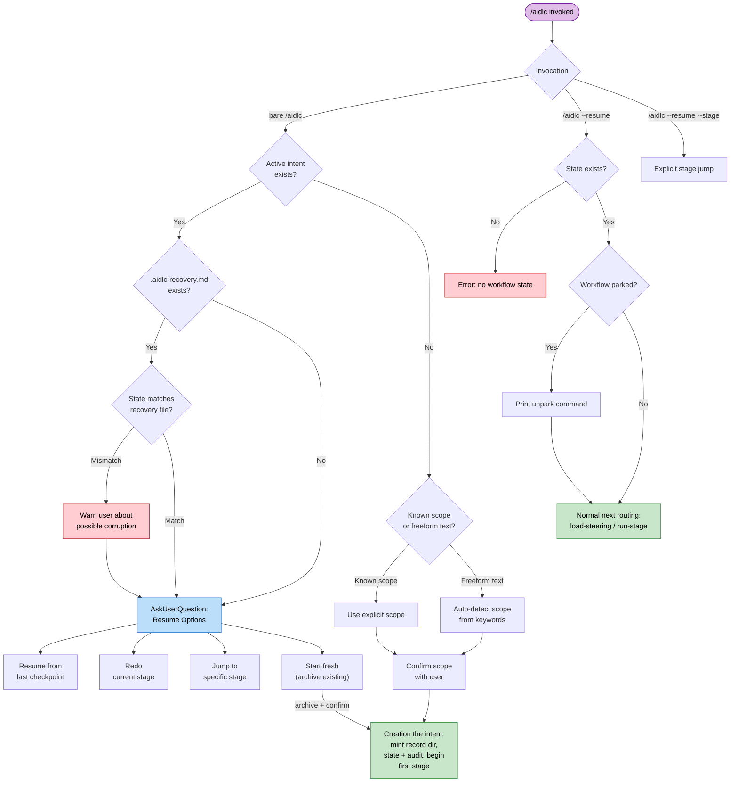
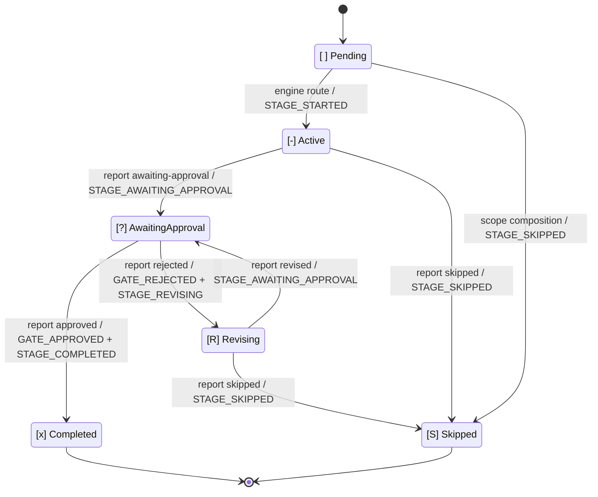

# オーケストレータ

オーケストレーションは二つに分かれます。決定論的な**エンジン**（`aidlc-orchestrate.ts`。サブコマンドはちょうど 5 つ: `next`、`continue`、`report`、`park`、`team-board`。`continue` は内部の操舵輸送、`team-board` は読み取り専用の Team Construction 照会）が、ステージ間の判断をすべて持ちます — スコープ決定、ステージルーティング、ジャンプ解決、再開と init のガード、ゲート状態、ワークフロー完了 — そして各 `next` で型付き**ディレクティブ**を出します。**コンダクター**（`.claude/skills/aidlc/SKILL.md`。起動は `/aidlc`）は薄い転送ループで、各ディレクティブに従います — 指名されたステージを走らせる、人に聞く、スウォームを展開する — そして結果を `report` します。SKILL.md はコントロールプレーンではありません。ルーティングはエンジンと、それが読むコンパイル済みデータ（`tools/data/stage-graph.json`、`tools/data/scope-grid.json`）にあり、SKILL.md が持つのは、エンジンが指名した一手の中の実行の質です。

この章は、コンダクター側から見たワークフローの振る舞いです — 入口、セッション管理、スコープとステージの対応、ステージ実行と進行のプロトコル、意図した逸脱。エンジン内部 — `next` / `report` 契約、型付きディレクティブ共用体、コンダクターペルソナ、複数スキル、スコープの形、スウォームの審判 — は [Engine and Skill System](17-skill-system.md) です。利用者向けのコマンドは [User Guide -- CLI Commands](../guide/12-cli-commands.md) です。

> **所有の注記。** この章で書く振る舞い — 引数解決、スコープ判定、ジャンプ検証、再開の分岐 — は、毎回の `next` で**エンジン**が計算し、ディレクティブとしてコンダクターへ渡します。古い散文が「オーケストレータが X をする」と書いていたところは、「エンジンが X を決めてディレクティブを出し、コンダクターが実行する」と読んでください。判断論理は決定論的なツールコードであり、SKILL.md の散文ではありません。

> **パスの慣例。** 各インテントの状態、監査証跡、インテント単位の
> 成果物は、その**レコードディレクトリ** —
> `aidlc/spaces/<space>/intents/<YYMMDD>-<label>/` にあります。以下では `<record>/` と書きます。
> Reverse Engineering だけ例外です。リポジトリ単位の残る出力は
> `aidlc/spaces/<active-space>/codekb/<repo>/` です。監査証跡は単一ファイルではなく、
> `<record>/audit/` の下のクローンごとのシャードディレクトリです。

---

## 目次

- [入口](#entry-points)
- [セッション管理](#session-management)
- [スコープとステージの対応](#scope-to-stage-mapping)
- [ステージ実行エンジン](#stage-execution-engine)
- [ステージ進行プロトコル](#stage-advancement-protocol)
- [タスク追跡](#task-tracking)
- [意図した逸脱](#deliberate-deviations)
- [エラー処理](#error-handling)
- [付録 A: ステージグラフ参照](#appendix-a-stage-graph-reference)
- [付録 B: フック参照](#appendix-b-hook-reference)
- [付録 C: 承認ゲートの型](#appendix-c-approval-gate-patterns)

---

## 入口 {#entry-points}

コンダクターは `$ARGUMENTS` をエンジンの最初の `next` へそのまま渡します — 事前解析しません。エンジンがフラグと自由文を解析し、下の起動形のどれに当たるかを解決して、対応するディレクティブを出します。パターンはエンジンが解決する入力であり、コンダクター側の分岐ではありません。

### `/aidlc [scope]` -- 明示スコープ

引数が既知スコープ 11 のどれか（`enterprise`、`feature`、`mvp`、`poc`、`bugfix`、`refactor`、`infra`、`security-patch`、`classic`、`workshop`、`express`）に一致するとき:

まだインテントが無い新しいワークスペース（`aidlc/spaces/*/intents/*/` の下に `aidlc-state.md` が無い）でスコープを明示すると、**最初のインテントを作ります**: エンジンの `next` は走らせて続ける `print` ディレクティブを出し、`aidlc-utility.ts intent-create --scope <scope>` を指名します（`--depth` / `--test-strategy` / `--review` があればそのままそのコマンドへ通す）。コンダクターがそれを走らせ、`next` を再走して最初のステージへ着地します。裸の位置引数（`/aidlc bugfix`）も明示フラグ（`/aidlc --scope bugfix`）も、同じ作成 print を出します。何を作るかの説明（`/aidlc "build the auth service"`）も作成します。スコープも説明も無い裸の `/aidlc` は作成しません（環境や既定で解決したスコープは作成の合図ではない）。状態無しエラーを出し、何を作るか書くか、スコープを指名するよう案内します。

1. `aidlc/spaces/<active-space>/memory/` からガードレールを読む。
2. 利用者に「何を作りたいですか？」と聞く。
3. スコープとステージの対応に従い、走るステージを決める。
4. Initialization フェーズ（workspace-scaffold、workspace-detection、state-init）を、決定論的な `aidlc-utility intent-create` 一回で走らせる。歓迎メッセージはセッション開始時に `settings.json` の `companyAnnouncements` で描く。
5. 対象ステージすべてにステージ単位のタスクを作る。最初のステージは `in_progress`、残りは `pending`。対象外のステージにはタスクを作らない。
6. Initialization のあとの最初のステージを始める。

### `/aidlc [freeform]` -- AI スコープ判定

引数が自由文（既知スコープ語ではない）のとき:

1. `aidlc/spaces/<active-space>/memory/` からガードレールを読む。
2. 意図をキーワードパターンに照らす:
   - "fix" / "bug" / "broken" は `bugfix`
   - "refactor" / "clean up" / "simplify" は `refactor`
   - "infrastructure" / "deploy" / "infra" は `infra`
   - "security" / "CVE" / "vulnerability" / "patch" は `security-patch`
   - "proof of concept" / "prototype" / "poc" / "spike" は `poc`
   - "mvp" / "minimum viable" は `mvp`
   - "workshop" / "lab" / "training" は `workshop`
   - "express" / "lightweight" は `express`
   - キーワード無しの解決は既定で `feature`。利用者向けのコールドスタートでは、マッチ無しや豊かな散文に対して、先に合成を提案する
3. 曖昧さ解消: テキストにスコープ語と、5 語を超える長いプロジェクト説明の両方があれば、マッチは偶発とみなし、黙って既定せず COMPOSE OFFER を出す。
4. キーワードがはっきり当たれば、コンパイル済みグリッドとワークスペーススキャンから実効の儀式を名指しして確認する: `Starting a "[scope]" workflow for: "[text]" - [N] of [T] stages, [G] approval gates. Confirm to proceed, name a different scope, or say "compose" for a tailored plan.` グリーンフィールドのプレビューは、インテント作成と同じ Reverse Engineering 飛ばしを適用する。スコープが `units-generation` を走らせ、その Construction ステージができた Unit DAG に展開するときだけ、ユニット単位の一文を付ける。
5. マッチ無し / 豊かな散文では、適応型コンポーザーを提案する: コンポーザーエージェントが仕事の実装エントロピーを見積もり、最小の EXECUTE/SKIP グリッドを出す。人のゲート付き（下の compose 面を参照）。提案の例スコープ一覧にも件数を載せる（`express = 10 of 33 stages, classic = 26, feature = all 33`）ので、選ぶ前に規模の差が見える。
6. 確認したら、明示スコープと同じ流れで進む。元の自由文は `aidlc-state.md` の `Initial Intent` に残る。
7. 利用者が判定スコープを上書きしたら、選んだスコープを使う。

### `/aidlc compose` -- 適応型コンポーザー

compose 面（先頭の `compose` 動詞、`--new-scope`、または `--report <path>`）では、エンジンはスコープ確認ではなく、コンポーザー派遣の `print` を出します。この動詞は意図的にワークスペース動詞ではありません（ワークスペース動詞は、Kiro シームが帯域外で走らせる終端ユーティリティ。compose はコンダクターが派遣するワークフロー仕事です）。状態ファイルで二つのモードに分かれます:

1. **手前 / 報告（まだワークフローが無い）:** コンダクターは `aidlc-composer-agent` を派遣します。読み取り専用の `detect --json` スキャンを走らせ、実装エントロピーの 5 成分を見積もり（設定されていれば CodeKB MCP の証拠、なければワークスペーススキャン）、構造化した提案を返します（`mode matched|custom`、必須の空でない `creationDescription`、成分スコアと証拠方法を持つ `ars` ブロック、`arsRationale`、グリッド、SKIP ごとの根拠、バリデータの `summary` をそのままコピー、それから事前に描いた Markdown 表 2 つ: 帯付き ARS スコアと、根拠付きのステージごとの判断）。`aidlc-graph.ts validate-grid` が検証します。検証はコンパイル済みステージ集合そのものを要求し、グリッドのステージ / ゲート / ユニット単位 `summary` と `nearest_stock` を返します。コンポーザーが書いたスコープは除外し、欠けたキーや余分なキーは差分として数えます。コンポーザーの matched 対 custom は、最終提案の `nearest_stock[0].diff <= 2` だけで決まります。機械的な ARS 画面距離は助言です。ストックグリッドを採用するときはその最終グリッドを再検証し、要約 / 距離を置き換え、影響する判断表の行を全部作り直してから返します。コンダクターは判定を再導出しません。承認 / 編集 / 却下ゲートは三ブロックで描きます: バリデータの要約行（`N stages EXECUTE / M SKIP, G approval gates`）、コンポーザーのステージ判断表をそのまま、それから「Scoring detail (advisory)」の下に ARS スコア表をそのまま。マッチしたストックグリッドへの編集は、改訂提案を custom に変え、検証と表描画を繰り返します。マッチ承認はスコープデータを書かないからです。承認すると、ストックマッチでは AI-DLC がワークフローを直接作ります。カスタムグリッドではスコープデータ（`scopes/aidlc-<name>.md` + `scope-grid.json` エントリ、既定は `keywords: []`）を書き、同じ手番でそのスコープのワークフローを作ります。タスク付き合成は元のタスクを `creationDescription` へそのままコピーします。報告のみ、またはタスク無しの合成は、承認した報告 / 計画から導きます。作成はその値をリテラル `--` 区切りのあとに、シェル安全な argv 値一つとして渡します。シェルの二重引用符は通さず、スコープだけのコマンドにもしません。
2. **飛行中（ワークフロー実行中）:** コンポーザーは、完了したステージが実際に解決したものからエントロピー成分を再見積もりし、`mode: in-flight` を返します。現在のスコープ、保った完全な実効グリッド、PENDING でカーソルより先のステージ向けの正確な `changes.skip` / `changes.add` 配列です。近くのストックグリッドは採用せず、スコープ / 深度も変えず、完了 / 進行中 / スキップ済みのアクションも書き直しません。この枝ではストック距離の一覧はどちらも助言です。各反転の根拠は、スコアを動かした完了ステージの証拠を名指しし、検証は `--strict` なので、飢えた反転はゲートの前に捕まります。コンダクターはゲートの前に保留提案マーカー（`aidlc/.aidlc-compose-pending`）を書き（Stop フックはそれをターン停止の合図として扱う）、解決時に消します。承認すると、その配列そのものを `aidlc-utility.ts recompose --skip <slugs> --add <slugs>` へ渡し、監査ロックの下で計画接尾辞を反転し、新しい飢餓に対して厳格検証し、派生フィールドを作り直し、`RECOMPOSED` を出します。スコープ登録ファイルは書きません。マーカーには期限があります: Stop フックは新しいあいだだけ（mtime から 24 時間未満）扱い、古い孤児（書き込みと解決のあいだにセッションが落ちたもの）は無視して最善で消し、取り残されたマーカーが転送ループ強制を黙って殺さないようにします。`--doctor` も存在するマーカーを年齢付きで報告します（新しい = 助言の合格、古い = 不合格）。`recompose` は自律 Construction の下では拒否します（ゲートに人が要る） — 先に gated へ切り替えるか、スウォームが終わるのを待ちます。検出はチャット優先です: コンダクターの転送前判断（新しい仕事を見つけるのと同じ一歩）が、平文の再形成依頼（「市場調査は飛ばせますか？」）を分類し、そのまま転送せず `next compose "<their words>"` として通します（そのまま転送すると Branch 10 に落ち、いまのステージが走ります）。依頼が特定ステージを命令形で名指しするときは、コンダクターはコンポーザー派遣を飛ばし、自分でゲートを出し、承認で `recompose` を直接走らせてよい — 動詞が飢えた / 凍結 / カーソルより後ろ / スケルトンゲートの反転（と自律 Construction の呼び出し）を、誰が呼んでも拒否するからです。人のゲートとマーカーの規律は、どちらの経路でも同じです。

### `/aidlc --status` -- 進捗確認

いまのワークフローを進めずに見る、読み取り専用コマンドです:

1. アクティブインテントの `aidlc-state.md` を読む（`aidlc/spaces/<space>/intents/<YYMMDD>-<label>/` の下）。
2. 出すもの: いまのフェーズ、いまのステージ、完了率、保留中の判断、アクティブエージェント。
3. 検証が要れば、stage-protocol-governance.md 第 13 節のフェーズ境界検査を走らせる。
4. ワークフローは進めない — 厳密に読み取り専用。

### `/aidlc --stage <id>` / `/aidlc --phase <name>` -- ステージ / フェーズへジャンプ

指定ステージまたはフェーズへ直接飛びます。前方も後方もできます。エンジンが対象を解決し、スコープ所属を検証し、ジャンプ方向を計算し、`aidlc-jump.ts execute` ツールを指名する走らせて続ける `print` ディレクティブを出します。コンダクターはそのツールを走らせ、`next` を再走します — ジャンプの解決も検証も自分ではしません。下の番号付き手順は、ジャンプ計算（エンジン + ツール）が行うことです。

**前方ジャンプ**（対象がいまの位置より先）:
1. 対象を解決する: `--stage` はスラッグ（`code-generation`）または表示番号（`3.5`）。`--phase` は名前（`construction`）または番号（`3`）で、そのフェーズの対象内最初のステージへ解決する。
2. 状態ファイルの有無を見る。無ければ自動初期化する（Initialization 3 ステージを走らせる）。
3. 対象がいまの / 指定したスコープに入っていることを検証する。
4. 途中の対象内ステージを `[S]`（ジャンプでスキップ）にする。すでに完了した `[x]` は変えない。
5. 上流成果物が欠けていることを警告し、確認を取る。
6. ステージ単位のタスクを作り、対象ステージから実行を始める。

**後方ジャンプ**（対象がいまの位置より後ろ）:
1. 前方と同じ解決と検証。
2. 対象より下流のステージをすべて `[ ]`（未開始）に戻す。ディスク上の成果物は残し、消さない。
3. 対象ステージと後続が再実行するとき、既存成果物を検出し、Keep / Modify / Redo from scratch を出す。
4. ステージ単位のタスクを作り、対象ステージから実行を始める。

`--scope`（スコープの設定 / 上書き）、`--depth`（深度の上書き）、`--test-strategy`（テスト量の上書き）と組み合わせられます。

### `/aidlc --scope <scope>` -- スコープの設定 / 上書き

ワークフロースコープを設定します。単独（`/aidlc --scope bugfix`）では `/aidlc bugfix` と同じです。`--stage` や `--phase` と組むと、ジャンプ操作のスコープになります。`--depth` と `--test-strategy` と組んで既定を上書きできます。

### `/aidlc --depth <level>` -- 深度の上書き

深度（minimal、standard、comprehensive）を上書きします。単独ではアクティブワークフローの深度を更新します。`--scope` と組むと、新しいスコープの既定を上書きします。単独変更では `DEPTH_CHANGED` 監査イベントを残します。

### `/aidlc --test-strategy <level>` -- テスト戦略の上書き

テスト量戦略（minimal、standard、comprehensive）を、深度とは独立に上書きします。指定しなければいまの深度に従います。`--depth standard --test-strategy minimal` のように、成果物は厚くテストは薄く、といった組み合わせができます。単独変更では `TEST_STRATEGY_CHANGED` 監査イベントを残します。

### インテント作成 -- Initialization フェーズ

別のスキャフォルドコマンドはありません（かつての `init` フラグは廃止。ワークスペースシェルは `dist/<harness>/` に組み込み済みです）。Initialization 3 ステージ（workspace-scaffold、workspace-detection、state-init）は `aidlc-utility intent-create` の中で決定論的に走ります — 最初の `/aidlc`（または `/aidlc <description>`）で自動起動、または明示の `/aidlc-init` 梱包。作成はインテントのレコードディレクトリを `aidlc/spaces/<space>/intents/<YYMMDD>-<label>/` に切り、状態を初期化し、スコープルーティングを適用し、ワークフローを Initialization のあとの最初のステージへ置きます:

1. レコードディレクトリ木を作る（冪等 — 既存のディレクトリ / ファイルは飛ばす）: `audit/` シャードディレクトリ、スコープが走るフェーズごとに空の成果物ディレクトリ（アクティブスコープの下に EXECUTE ステージが無いフェーズは作らない。ステップ 4 の `PHASE_SKIPPED` イベントと揃える）、検証ディレクトリ。ステージごとのディレクトリは事前に作らない。ステージが初めて成果物を書いたときに現れます。
2. 空のスペース単位 `aidlc/knowledge/` ディレクトリを作る（そのスペースの `intents/` の兄弟）。自由形式で固定ファイル集合は無い — 作成はエージェントごとのサブディレクトリも README も種まきせず、チームが自分で足します。
3. ワークスペースをスキャンし、インテントの `aidlc-state.md` を書く。実際のフェーズ（例: `--scope feature` なら `IDEATION`）、解決したスコープ、コンパイル済みスコープグリッド（`scope-grid.json`。各ステージの `scopes:` frontmatter の転置）から導いたステージ計画。正確な初期説明は、コミットされる `project-description.json` に JSON 文字列一つとして残し、状態はその出典を名指し、安全な一行 `Project` プレビューを保ちます。
4. イベント列を全部出す: `WORKFLOW_STARTED`、`WORKSPACE_SCAFFOLDED`、`WORKSPACE_SCANNED`、`WORKSPACE_INITIALISED`、最初に実行するフェーズの `PHASE_STARTED`、各 Initialization ステージの `STAGE_STARTED` + `STAGE_COMPLETED`、スコープが飛ばすフェーズの `PHASE_SKIPPED`。
5. 自動作成は、インテントがゼロのワークスペースだけで行う。すでにインテントがありアクティブカーソルが無いときは、エンジンは重複を作らず、どれかを選ぶよう促します（`/aidlc intent <slug>`）。再 init フラグはありません。
6. 自動作成 print 経由で作成に至ったときは、コンダクターが `next` を再走し、Initialization のあとの最初のステージへ続けます。明示の `/aidlc-init` 梱包は Initialization で止まり、対話で始めるには利用者がもう一度 `/aidlc` を打ちます。

### 再開（状態ファイルがある）

アクティブインテントの `aidlc-state.md` があり、新しいハーネスセッションが裸の `/aidlc` で入り直すと、セッション開始コンテキストがコンダクターに、標準の Resume / Redo / Jump / Start Fresh メニューを出すよう告げます。コンダクターはその選択を `report --result resumed --user-input` へ渡し、エンジンが選択ごとのルーティングを決定論的に保ちます。

1. セッション開始フックが状態ファイルを読み、残っているスコープ、フェーズ、ステージ、状態、エージェント、次のアクションを注入する。
2. `.aidlc-recovery.md`（インテントのレコードディレクトリ）があれば印を付け、コンダクターがコンパクション由来の状態壊れを見られるようにする。
3. 裸の `/aidlc` 再入場では、コンダクターが四択メニューを出す。
4. エンジンが報告された選択をルーティングする。Resume は通常の `next` を再走し、Redo、Jump、Start Fresh は次の一手そのものを返す。

明示の `/aidlc --resume` は別です。ディスパッチャが `next --resume` を呼び、メニューを飛ばして、裸の `next` と同じ継続経路へ落ちます。park 中のワークフローは先に unpark 案内を出し、状態が無ければエラー、`/aidlc --resume --stage <slug>` は明示ジャンプ経路を取ります。

---

## セッション管理 {#session-management}

### セッション再開の流れ

裸のセッション再入場と明示再開は、意図して分かれます。裸の `/aidlc` ではコンダクターが四択メニューを持ち、明示 `--resume` は選択を先に言い、エンジンの通常継続ルーティングへ入ります。



### 状態ファイルのスキーマ

状態ファイル `aidlc/spaces/<space>/intents/<YYMMDD>-<label>/aidlc-state.md`（インテントのレコードディレクトリ）は、`.claude/knowledge/aidlc-shared/state-template.md` の契約に従い、エンジンが生成します。ステージ行はテンプレートではなく、コンパイル済み `tools/data/stage-graph.json` と `scope-grid.json` から来ます。State Version 8 で、次を含みます:

| Section | Contents |
|---------|----------|
| Project Information | プロジェクト説明、種別（greenfield / brownfield）、スコープ、開始日、ライフサイクルフェーズ、アクティブエージェント、worktree パス、Bolt 参照、プラクティス確認時刻 |
| Scope Configuration | 実行するステージ、飛ばすステージ（理由付き）、深度、テスト戦略 |
| Workspace State | プロジェクトルート、検出した言語、フレームワーク、ビルドシステム |
| Execution Plan Summary | ステージ総数、完了数、進行中ステージ |
| Runtime State | 改訂回数と、任意の Construction 反復、Unit 所有、Unit ゲートリズム |
| Phase Progress | フェーズごとの状態 |
| Stage Progress | コンパイル済みグラフから生成したステージごとのチェックボックス。フェーズで整理（下を参照） |
| Unit Progress | チーム所有の unit-major Construction のときだけ。派生の DAG / 成果物 / レシート / ゲート投影。毎回の `next` で書き直す |
| Current Status | ライフサイクルフェーズ、いま / 次のステージ、状態、最終更新時刻 |
| Session Resume Point | 最後に完了したステージ、次のアクション、保留中の成果物 |

**Stage Progress** は 6 状態のチェックボックスです:
- `[ ]` 未開始
- `[-]` 進行中
- `[?]` あなたの承認待ち（ゲートが開いている）
- `[R]` 改訂中（ゲートを却下し、ステージを直している）
- `[x]` 完了（利用者が承認した）
- `[S]` スキップ（init 時にスコープ外、`skip` で切った、または `--stage` / `--phase` ジャンプで迂回した）

Construction フェーズ節は特別です。既定の歩きは stage-major
（下の [Construction Execution](#construction-execution)）なので、Unit ごとの
Construction ステージは `unit-of-work-dependency.md` の Unit ごとにチェックボックスを持ちます。
`bolt-plan.md` は計画の中身であり、チェックボックスの出典ではありません。厳密に
`Unit Ownership: team` のとき、別の Unit Progress 表が Unit ごとに 1 行、適用する
Unit ごとの Construction ステージとその Unit ゲートごとに 1 セルを持ちます。
Stage Progress の行はステージにつき 1 行のままで、それらの列から派生します。`Construction Autonomy Mode: [unset|autonomous|gated]` は
**Current Status** に残ります — ラダープロンプトのあとに書き、セッション再開で守ります。

チーム展開の最中、スコープ無しの main はターン終端の `notice` を出し、その
メッセージは決定論的な Team Construction ボードです: Unit Progress、局所で見た claim の動き、マージ準備、claim できる Unit、ブロッカー。Stop
フックは同じ枝を、キャッシュも状態書きもせずに探ります。`/aidlc --status`
は同じ純粋ボード照会をスナップショットモードで呼びます。

### 復旧パンくず

復旧パンくず（インテントのレコードディレクトリの `.aidlc-recovery.md`）は、`validate-state.ts` PreCompact フックが書きます。コンテキストコンパクションの前に、ワークフローの最後の既知良好状態のスナップショットを残します。

セッション再開時、オーケストレータはパンくずの "Current stage" と状態ファイルの "Current Stage" を比べます。違えば、コンパクションが状態を壊したかもしれないと警告します。PreCompact フックは情報専用で、コンパクション自体は止められないからです。

### 再開の選択肢

裸の `/aidlc` セッション再入場では、コンダクターが四択を出します。コンダクターは人の答えを `report --result resumed --user-input "<answer>"` で報告し、エンジンが選択を照合して、一手そのものを指名するディレクティブを返します（未知の答えは、受け付ける選択を付けてエラー）。明示の `/aidlc --resume` はこのメニューを飛ばし、選択肢 1 を直接行います:

**1. Resume from last checkpoint** -- 進行中ステージから続ける: `next` を再走し、`aidlc-state.md` を読んで完了 / 進行中 / 未開始を決める。

**2. Redo current stage** -- ディレクティブが `aidlc-jump.ts execute --target <current> --direction redo --scope <scope>` を指名し、いまのステージのチェックボックスを戻す。次の `next` が最初から再走する。

**3. Jump to stage** -- ディレクティブがコンダクターに対象を聞かせ、`next --stage <slug>` へ通す（エンジンが方向を解決し、対象を検証する）。

**4. Start fresh** -- ディレクティブが第二インテントの流れへ通す: スコープと説明を確認し、`next --new-intent --scope <scope> "<description>"`。既存ワークフローはそのまま残り、新しいインテントと並ぶ。

### セッション再開のコンテキスト読み込み

| Phase / Stage Type | Context Loaded |
|---|---|
| INITIALIZATION (0.1-0.3) | ガードレールだけ（ワークスペースはまだ検出していない） |
| IDEATION (1.1-1.7) | これまでに完了した `<record>/ideation/` 成果物 + ガードレール |
| INCEPTION -- RE stages | `aidlc/spaces/<active-space>/codekb/<repo>/` + ideation 成果物 |
| INCEPTION -- Requirements stages | リポジトリごとの `codekb/` 成果物（行った場合）+ requirements 成果物 |
| INCEPTION -- Design stages | Requirements + user stories + domain design 成果物 |
| INCEPTION -- Delivery Planning | Inception 成果物すべて |
| CONSTRUCTION -- Code Generation | いまのユニットの設計成果物 + ストーリー設計 + 受け入れ基準 + 先行コード |
| CONSTRUCTION -- Build/Test | いまのユニットのコード出力 + テスト計画 + ビルド設定 |
| CONSTRUCTION -- CI/Infra | インフラ設計 + コード生成出力 |
| OPERATION (4.1-4.7) | Construction 出力 + operation 成果物。後段（4.4 以降）は 4.1-4.3 のデプロイ出力も読む |

---

## スコープとステージの対応 {#scope-to-stage-mapping}

スコープが、33 ステージのうちどれが、どの深度で走るかを決めます。対象外のステージは完全に飛ばします — タスクも作らず、承認ゲートも出しません。どのスコープも Initialization フェーズ（0.1-0.3）から始まります。

### 完全な対応

正本は `.claude/scopes/aidlc-<name>.md` と、各ステージの `scopes:` frontmatter で、`.claude/tools/data/scope-grid.json` にコンパイルされます。いまのコンパイル済み件数は `bun .claude/tools/aidlc-utility.ts scope-table` です。

| Scope | Stages Included | EXECUTE / Total | Depth | Test Strategy |
|---|---|---|---|---|
| `enterprise` | All: 0.1-0.3, 1.1-1.7, 2.1-2.9, 3.1-3.7, 4.1-4.7 | 33 / 33 | Comprehensive | Comprehensive |
| `feature` | All: 0.1-0.3, 1.1-1.7, 2.1-2.9, 3.1-3.7, 4.1-4.7 | 33 / 33 | Standard | Standard |
| `mvp` | 0.1-0.3, 1.1, 1.3 (light), 1.4, 2.1 (if brownfield), 2.2, 2.3, 2.4, 2.5 (if UI), 2.6, 2.7, 2.8, 2.9, 3.1-3.7 | 23 / 33 | Standard | Standard |
| `poc` | 0.1-0.3, 1.1 (minimal), 2.1 (if brownfield), 2.3 (minimal), 3.5, 3.6 | 8 / 33 | Minimal | Minimal |
| `bugfix` | 0.1-0.3, 2.1 (always), 2.3 (minimal), 3.5, 3.6, 4.1, 4.3 | 9 / 33 | Minimal | Minimal |
| `refactor` | 0.1-0.3, 2.1 (always), 2.3 (minimal), 3.1 (refactoring plan), 3.5, 3.6, 4.1, 4.3 | 10 / 33 | Minimal | Minimal |
| `infra` | 0.1-0.3, 2.2, 2.3 (infra requirements), 3.2, 3.3, 3.4, 3.7, 4.1, 4.2, 4.3, 4.4 | 13 / 33 | Standard | Standard |
| `security-patch` | 0.1-0.3, 2.1 (find vulnerability context), 2.3 (minimal), 3.2, 3.5, 3.6, 4.1, 4.3 | 10 / 33 | Minimal | Minimal |
| `classic` | 0.1-0.3, 2.1-2.9, 3.1-3.7, 4.1-4.7 (skips all ideation 1.1-1.7) | 26 / 33 | Standard | Standard |
| `workshop` | 0.1-0.3, 2.1-2.9, 3.1-3.7, 4.1-4.7 (skips all ideation 1.1-1.7) | 26 / 33 | Standard | Minimal |
| `express` | 0.1-0.3, 2.1 (if brownfield), 2.3, 3.5, 3.6, 4.1, 4.3, 4.4 | 10 / 33 | Minimal | Minimal |

### スコープの内訳

- **enterprise** -- 33 ステージすべて、comprehensive 深度。どのステージも成果物を厚く、分析を深く、任意ステージも含める。完全なトレーサビリティが要る規制対象のエンタープライズ機能向け。
- **feature** -- ライフサイクル全体: 33 ステージすべて、standard 深度。enterprise と同じステージ集合だが、成果物の詳しさは中くらい。`--scope feature` と `/aidlc-feature` で明示でき、`AWS_AIDLC_DEFAULT_SCOPE=feature` でプロジェクト既定にもできる。
- **mvp** -- Ideation の大半を飛ばす（Intent Capture、軽い Feasibility、Scope Definition だけ残す）。Inception と Construction は全部走る。Operation ステージは任意。
- **poc** -- Ideation は最小（Intent Capture だけ）。Inception の核。Construction は Code Generation と Build and Test だけ。Operation は無し。
- **bugfix** -- Ideation 無し。Reverse Engineering は常に含める（バグを見つけるため）+ 最小の Requirements Analysis。Code Generation、Build and Test、Deployment Pipeline、Deployment Execution で修正経路を閉じる。
- **refactor** -- Ideation 無し。Inception の始まりは bugfix と同じ。Functional Design（リファクタ計画として）を足し、あとのビルド、テスト、デプロイの尾は同じ。
- **infra** -- Ideation 無し。インフラ寄りの Requirements Analysis。Construction の NFR ステージ + Infrastructure Design + CI Pipeline。Operation の Deployment と Observability。
- **security-patch** -- Ideation 無し。脆弱性の文脈を見つける Reverse Engineering + 最小の Requirements Analysis（脆弱性と是正基準の監査可能な声明）。NFR Requirements、Code Generation、Build and Test。Operation の Deployment Pipeline と Deployment Execution。
- **classic** -- 暗黙の既定（利用者も `AWS_AIDLC_DEFAULT_SCOPE` もスコープを指名しないとき）: v1 型のライフサイクル。Ideation 無し、グリッド上の Inception、Construction、Operation は全部。ALWAYS なのは Initialization、Requirements Analysis、Units Generation、Delivery Planning、Code Generation、Build and Test だけ。残りは自己選択。Standard 深度と Standard テスト戦略で、本番テストの床を保つ。
- **workshop** -- 互換のファシリテートセッション用ライフサイクル: Classic と同じステージグリッド。確立した `workshop` / `lab` / `training` キーワードと、Minimal テスト戦略の上書き。
- **express** -- いちばん軽い要件からデプロイまでの経路: 条件付き Reverse Engineering、Requirements Analysis、ゼロ Unit の Code Generation 反復 1 回、Build and Test、条件付きのデプロイ / 可観測性の尾。Units Generation を飛ばすので、Bolt、skeleton、ladder、Unit ごと、スウォームの経路は構造上届きません。Code Generation の成果物パスと妥当性レシートは、ステージ単位の Construction ディレクトリを使います。`review_cap: none` でレビュアーを止めます。

### 深度

| Depth | Scopes | Characteristics |
|---|---|---|
| Minimal | poc, bugfix, refactor, security-patch, express | 成果物は最小、分析は短く、任意ステージは飛ばす |
| Standard | feature, mvp, infra, classic, workshop | 成果物は揃えるが、詳しさは中くらい |
| Comprehensive | enterprise | 成果物は厚く分析は深く、ステージは全部走る |

---

## ステージ実行エンジン {#stage-execution-engine}

どのステージも、いま動いている実行パターン 4 つのどれかです: inline、subagent、pipeline、mob（出荷グラフでは 29 / 2 / 1 / 1）。コンパイル済みステージグラフ（`tools/data/stage-graph.json`）が各ステージのモードを持ち、エンジンが読んで `run-stage` ディレクティブの `directive.mode` として届けます。SKILL.md の Stage Graph 表は人が読む鏡であり、ディスパッチの出典ではありません。

### ステージ寿命の全体

```mermaid
sequenceDiagram
    participant O as Orchestrator
    participant SF as Stage File
    participant A as Agent (.md)
    participant K as Knowledge (6 steps)
    participant U as User
    participant S as aidlc-state.md
    participant AU as audit/ shard

    O->>A: 1. Apply load-steering parts, then read inline_context_paths
    Note over A: Rules arrive as content; persona and knowledge remain path-loaded

    O->>SF: 2. Read stage file
    Note over SF: directive.stage_file

    O->>K: 3. Read resolved inputs
    Note over K: directive.consumes

    O->>S: 4. Engine activates stage as [-]
    S->>AU: Emit STAGE_STARTED

    alt Inline Stage (29 of 33)
        O->>U: Execute stage work in conversation
        U-->>O: Answer questions, provide feedback
        O->>U: Present 5-part completion message
        O->>U: AskUserQuestion: Approval Gate
        U-->>O: Approve / Request Changes
    else Fully Dispatched Stage (3 of 33: subagent or pipeline)
        O->>O: Bundle context into Task prompt
        O->>O: Call Task tool (subagent_type set to the named agent)
        O-->>O: Receive structured summary
        O->>U: Present completion message from summary
        O->>U: AskUserQuestion: Approval Gate
        U-->>O: Approve / Request Changes
    else Mob Stage (1 of 33)
        O->>U: Execute lead draft inline
        O->>O: Dispatch blind support-agent contributions
        O->>U: Integrate as lead and present Approval Gate
        U-->>O: Approve / Request Changes
    end

    O->>S: 5. Report approved
    S->>AU: Atomically emit STAGE_COMPLETED
    O->>O: 6. Transition tasks, route to next stage
```

### インライン実行

インラインステージは、オーケストレータの会話の中で直接走ります。利用者はステージとリアルタイムにやりとりできます。33 のうち 29 がインライン。残り 4 は委譲です（practices-discovery と code-generation のサブエージェント、reverse-engineering のパイプライン、user-stories のモブ）。

6 ステップ:

1. **ステージ操舵を載せる。** `run-stage` までの順の `load-steering` 列に従う。実質あるアクティブスペースルールをすべて中身として届ける。それから `inline_context_paths` のエントリを全部読む。ペルソナとナレッジはパス読みのまま。欠けた、読めない、不正 UTF-8 の任意ファイルは名簿から外し、個別または集約の `context_warnings` で報告する。
2. **ステージファイルを読む。** コンダクターは正確な `directive.stage_file` を読む。
3. **解決済み入力を読む。** コンダクターは `directive.consumes` の既存成果物を読み、想定どおり無い入力にはステージの文書化したフォールバックを適用する。
4. **条件付きプロトコルモジュールを載せる。** `directive.protocol_modules` が指名するファイルを全部読む。セッションですでに載せたモジュールは飛ばす。フィールドが選ぶのはレビュアー、編成、Construction、スウォームの契約。SKILL の散文トリガーは互換のフォールバック。
5. **会話の中でステップを直接実行する。** オーケストレータがステージ仕事をインラインで行う: 質問し、答えを分析し、成果物を作り、利用者とやりとりする。
6. **承認ゲートは stage-protocol.md に従う。** インラインステージはどれも（Initialization 3 ステージを除く）、5 部の完了メッセージと `AskUserQuestion` 承認ゲートで終わる。
7. **制御をエンジンへ返す。** 承認のあと、コンダクターが結果を報告する。エンジンが状態を原子的に更新し、完了を記録し、次のステージへルーティングする。

### 委譲とハイブリッド実行

三つのステージはリード仕事を別エージェントタスクへ委ねます。モブは
リードをインラインに残し、サポートエージェントだけを派遣します:

| Stage | Mode | Claude Code Subagent Type | Agent | Reason |
|-------|------|---------------------------|-------|--------|
| 2.1 Reverse Engineering | pipeline | `aidlc-developer-agent` then `aidlc-architect-agent` (2-link chain) | aidlc-developer-agent + aidlc-architect-agent | 深いコード分析は中間出力が大きい。最後のリンクが成果物を書く |
| 2.2 Practices Discovery | subagent | `aidlc-pipeline-deploy-agent`, then three parallel spokes, then the lead again | pipeline-deploy + quality + developer + devsecops | ハブ＆スポークの発見で、人へのインタビューとリード統合の前に、証拠の視点を独立に保つ |
| 2.4 User Stories | mob | lead inline; `aidlc-design-agent` + `aidlc-developer-agent` + `aidlc-quality-agent` in parallel | 4 participants | リードが下書き。互いに見えない協力者が寄与ファイルを書き、リードがゲートの前に統合する |
| 3.5 Code Generation | subagent | `aidlc-developer-agent` | aidlc-developer-agent | コード書きは、ユニット仕様に絞ったきれいなコンテキストが効く |

Workspace detection (0.2) はかつてサブエージェントでした。いまは `aidlc-utility intent-create` の中の決定論的なルールベーススキャナです。規則は `aidlc-common/stages/initialization/workspace-detection.md` にあります。

6 ステップ:

1. **届いたルールを載せ、ステージと入力を読む。** `run-stage` の前に、順の
   `load-steering` 部分をすべて適用する。ステージファイルと成果物はディレクティブのパスそのものを使う。
2. **コンダクター所有のコンテキストを載せる。** モブディレクティブはリードの完全な
   パス名簿を `inline_context_paths` に持つ。完全委譲のサブエージェント / パイプライン
   ディレクティブの名簿は空。
3. **ブリーフを用意する: ルールは中身、成果物はパス。** 蓄積した操舵束をそのまま貼り、
   関係する成果物パスとタスク指示を渡す。指名した
   ハーネスエージェント設定がペルソナとナレッジを載せる。どちらもプロンプトへコピーしない。
4. **トポロジを適用する。** サブエージェントのサポートは見えないスポーク、パイプラインは順のリンク、
   モブは見えないサポート寄与と上限付き異議ラウンド。パイプラインが戻るたびに、いまの試行の
   `PIPELINE_LINK_COMPLETED` レシートを切ってから次のリンクを出す。再開は
   `directive.pipeline.completed` から。隔離実行には `--single` を付ける。
5. **残る出力を集める。** リードが `produces[]` を持つ。派遣した
   サブエージェント / モブのサポートは、それぞれ身元付き寄与ファイルを書く。
6. **エンジン経由で完了する。** 成果物 / 証拠を検証し、承認ゲートを出す。

### 複数エージェントの協調

一部のステージは複数エージェントです: リード 1 とサポート 1 以上。協調の型は `directive.mode` — ステージの通信トポロジ — に従い、常にオーケストレータ経由です:

1. 先にリードエージェントの仕事を実行し、主成果物を作る。
2. トポロジに従い各サポートエージェントを入れる。`inline` ステージでは、オーケストレータが `directive.inline_context_paths` のリード / サポートエントリを全部読み、派遣せずその視点をまとう。`mob` ではリードだけの名簿を読み、リード仕事はインライン、サポートは本物の派遣。`subagent`（ハブ＆スポーク）と `pipeline`（チェーン）ではリードもサポートも派遣する: サブエージェントは互いに見えないスポーク、パイプラインは順の富化ホップ、モブは並行の見えない寄与と上限付き異議ラウンド（`stage-protocol-ensemble.md`）。返ったパイプラインホップはどれも `aidlc-log.ts link` で記録する。複数リポジトリのチェーンは `--repo`、隔離実行は `--single`、リポジトリ単位の再利用行は再利用ストアの派遣を抑える。
3. エージェント出力を全部、最終ステージ成果物へ合成する — 派遣したサポートは寄与ファイル（Contribution + Positions、`stage-protocol-ensemble.md` §11）を書き、リードが統合する。`produces[]` 成果物を直すのはリードだけ（パイプラインリンクは直接進める）。残ったモブの判断はステージ途中で人に出し、維持した異議はゲートでそのまま引用する。
4. エージェント同士は呼び出さない — 委譲するのはオーケストレータだけ。手書きコアと Claude ペルソナは `disallowedTools: Task` でこれを強制する。ハーネス投影は、要るところではネイティブのツール方針を使う。Kiro はその未対応 Markdown キーを省き、委譲 JSON / frontmatter 許可リストから `subagent` ツールを外す。

Practices Discovery はゲート順序の例外です。ハブ＆スポーク仕事は
**Approve** / **Request Changes** ゲートで終わります。Approve のあと、コンダクターが
`practices-promote` を走らせます。確認時刻と
`PRACTICES_AFFIRMED` 監査レシートをコミットできるのはそのコマンドだけで、エンジンが `approved` を受け取る前に、レシートはいまのステージ試行に対して新しくなければなりません。欠けた、古い、失敗した昇格はゲートを開けたまま、ステージは未完了のままです。

### 二リンクの Reverse Engineering パイプライン

ステージ 2.1 は出荷の `mode: pipeline` 例です -- 二リンクのチェーンで、
各リンクが作業成果を直接進めます:

1. **Developer（リンク 1、リード）:** コードベースをスキャンし、構造を分析し、コンポーネントを特定し、依存を写し、生の分析を返す。
2. **Architect（リンク 2、最後のリンク）:** 開発者の生分析を受け、`aidlc/spaces/<active-space>/codekb/<repo>/` の下の codekb 成果物 9 つへ合成する -- 最後のリンクが `produces[]` 成果物を揃える。パイプライン契約どおり。

Reverse Engineering はスキャンの前に、各ブラウンフィールドリポジトリの共有 codekb を見ます。
検証済みの現行ストアは、人の選択で再利用できます。古い、
未検証、レガシー、インテント不一致のカバレッジは再スキャンします。複数リポジトリ
インテントは、ステージが報告または進む前に、すべてのリポジトリ判断を解決します。
スキャンしたリポジトリごとに二リンクのレシート鎖があります。いまの試行のレシートが両方無い成果物は、承認に入れず完了もできません。

### Construction Execution <a id="construction-execution"></a>

Construction（ステージ 3.1–3.7）は、標準のステージごとのエンジンループに、Unit ごとの内側の歩きを載せます。**既定の歩きは stage-major**: 対象の Construction ステージをすべての Unit に走らせてから次のステージ。Code Generation は最後。実行時バッチは `<record>/inception/units-generation/unit-of-work-dependency.md` から計算します。`<record>/inception/delivery-planning/bolt-plan.md` は承認済み 2.9 計画成果物（順序、複数 Unit のまとまり、DoD、確信度の仮説、所有）です — エンジンは Unit のまとまりや歩き順には使いません。

出荷のステージごとの構造:

1. エンジンは未決着 Unit ごとに `run-stage` を一つ出す（`directive.unit`、`gate: false`）。適格な設計ステージバッチなら `directive.wave`。
2. そのステージの最後の Unit が落ち着いたあと、エンジンは同じステージを `gate: true` で出し直す — ステージ単位の承認 1 回。
3. Code Generation の `code-generation.md` 内の Unit ごとの完了ゲートは**抑える**。Step 3 Plan Approval は硬い停止のまま。自律スウォームでは、Code Generation のステージゲートは **最後の** DAG バッチが収束したあとにだけ出す。

**walking-skeleton ゲート**は、対象になる最初の Construction EXECUTE ステージ（`isSkeletonGateStage`）です。そのゲートが承認した直後、オーケストレータは**ラダープロンプト**をワークフローにつきちょうど一度出し、`aidlc-state.md` に `Construction Autonomy Mode: autonomous|gated` を残し、`AUTONOMY_MODE_SET` を出します。既定の歩きでは、`autonomous` は残りの Construction *ステージ* ゲートを飛ばします（halt-and-ask、Build-and-Test ループバックの 4 段目、スウォーム settle の `gate: true` 再入場は除く。自律の下ではコンダクターが自動承認する）。任意の `Construction Iteration: unit-major` はスウォームを抑え、ステージごとのゲート連鎖を**残します**。

並行できる Unit（依存の前提を満たし、相互依存が無い）が**バッチ**になります。オーケストレータはステージ 3.5 Code Generation を、**1 つのアシスタントメッセージで N 回の `Task` 呼び出し**として派遣できます。`BOLT_STARTED` / `BOLT_COMPLETED` はスウォーム経路で Unit / worktree ごとに発火し、`SWARM_COMPLETED` がバッチを閉じます。既定の gated 実行ではそれらの `BOLT_*` 行は残りません。

設計ステージ（3.1–3.4）と非自律の code-generation 向けの、エンジン駆動のユニットごとのループは、仕事が残っているあいだコンダクターへ具体的な Unit パスを `gate: false` で渡します。既定の stage-major 歩きでは、インライン設計 4 ステージも `directive.wave` を持てます: 最初の未決着バッチの完全な Unit エントリ。キャッシュ検証済み、自己修復した DAG スナップショット一つから導きます。各エントリは Unit と種別、ある / 無い consumes、すべての produces、種別に当たる必須 produce 部分集合、Unit 局所のメモリパス、ビルド状態、完了レシート状態、対の指紋付きレビュー状態を識別します。コンダクターは DAG を読んだり組み直したりしません。

ウェーブビルダーは親ディレクティブのステージメタデータ、インラインのペルソナ / ナレッジ名簿、コンテキスト警告、蓄積した操舵中身、実効レビュークラスを継ぎます。自分のエントリのパスだけを使い、直列の単一アクティブ Unit 寿命には入りません。代わりに、ビルドと対のレビューが落ち着いたあと、`aidlc-state.ts unit complete --wave` が生きているエントリを検証し、その Unit 日記を親日記へ決定論的に重複除去してコピーし、`UNIT_COMPLETED` を出します。エンジンは、当たる Unit すべてに成果物、妥当な要約確認、要るときは終端レビュー証拠、メモリの取り込み、完了レシートが揃うまでバッチをアクティブに保ちます。依存バッチと単一ステージゲートは、どれも追い越しできません。Code Generation は共有ワークスペースへ書き、必須の Plan Approval 硬い停止を持つので除外のままです。unit-major 反復は直列のままです。契約全体は `stage-protocol-construction.md` の 「Per-unit batch waves」です。

失敗処理は**halt-and-ask** で、自律モードに関係なく走ります:

- 単独 Code Generation 失敗: 止め、スウォーム / worktree 経路で `BOLT_FAILED` を出し、retry / skip / abort を出す。
- 並行バッチの部分失敗: 並行 Task が全部戻るのを待ち、成功した Unit の成果物はディスクに残し、`Succeeded=[names]` 付きの `BOLT_FAILED` を出し、失敗した Unit に限った同じ選択を出す。Retry は失敗した Unit だけ再走し、バッチの兄弟は `[x]` のまま。

```mermaid
sequenceDiagram
    participant U as User
    participant O as Orchestrator
    participant T as Task Framework
    participant UA as Subagent (Unit A)
    participant UB as Subagent (Unit B)
    participant UC as Subagent (Unit C)

    O->>O: Read unit-of-work-dependency.md (bolt-plan.md is planning)
    O->>U: First Construction EXECUTE stage for every Unit
    U->>O: Approve walking-skeleton gate
    O->>U: Ladder prompt (fires once)
    U->>O: "Continue autonomously"
    O->>O: Write Construction Autonomy Mode: autonomous — emit AUTONOMY_MODE_SET

    Note over O,T: Remaining design stages stage-major, then Code Generation
    Note over O,T: Units B + C eligible in parallel CG batch
    O->>T: Task(B code-gen) + Task(C code-gen) in ONE message
    par Parallel execution
        T->>UB: spawn subagent for Unit B
        T->>UC: spawn subagent for Unit C
    end
    UB-->>O: Unit B artifacts + summary
    UC-->>O: Unit C artifacts + summary
    O->>O: BOLT_COMPLETED per Unit/worktree; SWARM_COMPLETED closes the batch
    Note over O,U: Swarm presents one Code Generation stage gate after the FINAL batch.

    O->>O: All Units done → run 3.6 Build and Test, then 3.7 CI Pipeline
```

<!-- Text fallback: The orchestrator reads unit-of-work-dependency.md. It runs the first Construction EXECUTE stage for every Unit, the user approves that walking-skeleton gate, and the ladder prompt fires once. User picks "Continue autonomously". Remaining stages run stage-major. For Units B and C (eligible in parallel at Code Generation), the orchestrator issues both Task calls in a single message. Each Unit/worktree may emit BOLT_COMPLETED; SWARM_COMPLETED closes the batch. The swarm presents one Code Generation stage gate after the final DAG batch. Then 3.6 and 3.7 run once. -->

並行派遣の下の状態と監査の安全: `aidlc-audit.ts` は mkdir ベースのロックなので、同時追記は安全です。ライフサイクル書きは、要る Task 結果が全部戻り、コンダクターが結果を一つ報告したあとにだけ起きます。エンジンが内部状態遷移を直列化します。状態競合のリスクはありません。

---

## ステージ進行プロトコル {#stage-advancement-protocol}

状態遷移はエンジンが持ちます。コンダクターは結果を
`aidlc-orchestrate.ts` 経由で報告します。エンジンが内部状態遷移を呼び、
状態ファイルを更新し、ライフサイクル監査行を出し、原子的にルーティングします。正の
ワークフロー / フェーズ / ステージ状態図と監査イベント分類全体は
[State Machine](12-state-machine.md) です。

### ステージ寿命



上の遷移はどれもオーケストレーションエンジンが持ちます。コンダクターは結果を報告し、チェックボックス状態を書いたり、状態ライフサイクル動詞を直接呼んだり、ステージ / ゲート / フェーズ監査イベントを散文で出したりしません。

### ステージが完了するとき（利用者がゲートで承認）

1. **完了検証を走らせる** - 成果物がディスクにあること、ガードレールを守っていることを見る。正しさの検査であり、状態遷移ではありません。決定論でも強制します: `approve` は、宣言した `produces` 成果物が欠けたゲート付きステージを拒否します（`AIDLC_SKIP_ARTIFACT_GUARD=1` でない限り）。出力無しで完了にはできません（#366）。Unit ごとの Construction ステージは、代わりにスウォームの審判が検証します。

2. **ゲートに入る**: `bun .claude/tools/aidlc-orchestrate.ts report --stage <slug> --result awaiting-approval`。状態トランザクションが開く前に、エンジンはゲート結びのセンサーを、存在する宣言成果物ごとに一度走らせます。blocking の結びは検証済み合格が要ります。所見、実行不可、壊れた判定、タイムアウトは遷移を拒否します。対話で上書きするには、先に別の `Fix findings` / `Override blocking sensors` 判断を `aidlc-log.ts` で記録して見せ、正確な人の答えを待って記録し、それから `--override-blocking-sensors --user-input "Override blocking sensors"` で再試行します。自律実行は上書きできません。そうでなければエンジンは `[-]` → `[?]` にし、`STAGE_AWAITING_APPROVAL` を出し、`/aidlc --status` に "Awaiting your approval on \<stage\>" を出します。

3. **承認ゲートを出す**（AskUserQuestion）。

4. **利用者の応答を記録する**:
   - **Approve** -> `bun .claude/tools/aidlc-orchestrate.ts report --stage <slug> --result approved --user-input "<exact choice>"`。欠けたゲート行があれば出し、それから `GATE_APPROVED` + `STAGE_COMPLETED` を出して進む。ステージの `produces` 出力が無ければ、欠けた成果物エラーで拒否する。
   - **Request Changes** → `bun .claude/tools/aidlc-orchestrate.ts report --stage <slug> --result rejected --user-input "Request Changes" --reason "<feedback>"`。エンジンは `GATE_REJECTED` + `STAGE_REVISING` を出し、`[?]` → `[R]` にし、Revision Count を増やす。
   - `[R]` ステージの仕事を再走したあと、`bun .claude/tools/aidlc-orchestrate.ts report --stage <slug> --result revised` でゲートに入り直す（ゲートセンサーを再走し、新しい `STAGE_AWAITING_APPROVAL` を出し、`[R]` → `[?]`）。承認時の未記録改訂バックストップは、復旧した再入場の前に同じセンサー強制を使う。blocking の結果は残る状態を `[R]` のままにする。

5. **次のステージへ進む**: ステップ 4 の承認報告が進める。エンジンは状態ファイルの EXECUTE/SKIP 接尾辞（`init` が設定）とコンパイル済みスコープグリッド（`scope-grid.json`）から、次の対象内ステージを導く。完了を `[x]`、次を `[-]` にし、Current Stage / Lifecycle Phase / Active Agent / Next Stage / Last Completed Stage / Last Updated / Completed 件数を更新し、次のステージの `STAGE_STARTED` を出す。フェーズ境界ではさらに `PHASE_COMPLETED` + `PHASE_VERIFIED` + `PHASE_STARTED` を原子的に出す。

   ツールは冪等です — `advance <slug>` を二度目に再生すると `{replay: true}` を返し、イベントは再発行しません。

6. **これが対象内の最後のステージなら**: 同じ `report --stage <slug> --result approved --user-input "<exact choice>"` 呼び出しが `[x]` にし、Status=Completed にし、`PHASE_COMPLETED` + `PHASE_VERIFIED` + `WORKFLOW_COMPLETED` を出す。完了要約を出す。

7. **タスクを遷移する**: 古いタスクを `completed`、新しいタスクを `in_progress` にし、`activeForm: "Running <Next Stage> [slug]"`。`[slug]` 接尾辞が、ステータスライン欄を同期する PostToolUse フックを起動する。

### フェーズ境界検証

フェーズ遷移（init→ideation / inception / …、ideation→inception、inception→construction、construction→operation）で、`advance` は PHASE_COMPLETED + PHASE_VERIFIED + PHASE_STARTED を出します。オーケストレータは `advance` の**前に** `.claude/knowledge/aidlc-shared/verification.md` のトレーサビリティ検査を走らせる責任があります — 検証が失敗したら、問題を利用者に出し、進めません。

---

## タスク追跡 {#task-tracking}

オーケストレータは Claude Code の TaskCreate / TaskUpdate / TaskList ツールで、ワークフロー全体を通して見える進捗サイドバーを維持します。

### ステージ単位のタスク

タスクはステージ単位です -- 対象ステージにつき一つ。タスクは Claude Code のタスクサイドバーにだけあります（状態ファイルには保存しない）。コンテキストコンパクションでタスク ID が失われたら、`TaskList` の件名ベース検索で復旧します。

### タスク作成のタイミング

タスクはフェーズのまとまりで作ります:

- **INITIALIZATION**: Initialization ステージタスク全部（workspace-scaffold、workspace-detection、state-init）を、`aidlc-utility intent-create` の前に作る。ツールは 3 ステージを一回で完了し、戻ったあとタスクを completed にする。
- **IDEATION**: Ideation ステージタスク全部を、ステージ 1.1 の前に作る。
- **INCEPTION**: Inception ステージタスク全部を、ステージ 2.1 の前に作る。
- **CONSTRUCTION**: コンパイル済みスコープグラフと `unit-of-work-dependency.md` の Unit DAG から作る。ユニットごとにステージタスクを作り、横断タスクも作る。`bolt-plan.md` は計画であり、タスクの出典ではない。
- **OPERATION**: Operation ステージタスク全部を、ステージ 4.1 の前に作る。

### Unit ごとのタスク命名

| Phase | Pattern | Example |
|---|---|---|
| Initialization | `"Initialization - [Stage Name]"` | `"Initialization - Workspace Scaffold"` |
| Ideation | `"Ideation - [Stage Name]"` | `"Ideation - Intent Capture"` |
| Inception | `"Inception - [Stage Name]"` | `"Inception - Requirements Analysis"` |
| Construction (per Unit) | `"Construction — [Stage Name] (Unit: [unit-name])"` | `"Construction — Functional Design (Unit: notification-core)"` |
| Construction (per-Unit code gen) | `"Construction — Code Generation (Unit: [unit-name])"` | `"Construction — Code Generation (Unit: notification-email)"` |
| Construction (cross-Unit) | `"Construction — [Stage Name]"` | `"Construction — Build and Test"` |
| Operation | `"Operation - [Stage Name]"` | `"Operation - Observability Setup"` |

### スキップしたステージの扱い

実行計画で SKIP のステージでは、オーケストレータはタスクを作り、すぐ完了にしてスキップ説明を付けます。サイドバーにステージ集合全体が、スキップ注記付きで見えるようにするためです。

### 必須のステータスライン更新

どのステージを実行する前にも、オーケストレータは必ず:

1. 前のステージタスク（あれば）を `completed` にする。
2. いまのステージタスクを `in_progress` にし、`activeForm` を `"Running [Stage Name]"` にする。

`activeForm` スピナーを出すには、タスクが `in_progress` である必要があります。この更新はステージファイルを読む**前**に行います。

---

## 意図した逸脱 {#deliberate-deviations}

上流 `aidlc-workflows/` 参照と v2 フレームワーク仕様からの、次の意図した差は、将来の「直し」を防ぐため SKILL.md と stage-protocol.md に書いてあります。

| # | Deviation | Reference | Implementation | Rationale |
|---|-----------|-----------|----------------|-----------|
| 1 | NFR 成果物の粒度 | 各 2 ファイル | NFR Requirements 6 + NFR Design 6 | 細かくするとトレーサビリティが上がる |
| 2 | 計画 / 質問ファイルの同居 | 平らな中央集約 | ステージ成果物と同居 | 見つけやすさ |
| 3 | Infrastructure Design の統合 | 2-3 ファイル | 3 ファイル: 統合した `infrastructure-specification.md`（デプロイ + サービス + 共有）+ 専用の `monitoring-design.md` + `cicd-pipeline.md` | 表形式のインフラ仕様。監視 / CICD は Operation ステージの消費者が別で読めるように分ける |
| 4 | インライン質問 | 質問は全部ファイル | 単純な 1-3 択は `AskUserQuestion` | Claude Code の構造化 UI |
| 5 | Architecture Decision Records | 無し | 根拠 / 却下した代替を `components.md` に残し、ADR ログは `decisions.md`（Domain Design） | アーキテクチャのトレーサビリティ |
| 6 | 歓迎メッセージ | 長い Unicode ベース | 短く ASCII 安全。`settings.json` の `companyAnnouncements` で描く（ステージではない） | 参照自身の ascii-diagram-standards 違反を直す |
| 7 | RE 再走ガード | キャッシュ成果物を使う | スコープ / 指紋を検証してから、再利用か再スキャンを出す | 古い、または静かに狭くなった分析を防ぐ |
| 8 | セッション再開 | ファイルベースの `[Answer]:` タグ | `AskUserQuestion` | Claude Code で自然 |
| 9 | 確認質問 | 別ファイル | インラインで扱う | だいたい狙った 1-2 問 |
| 10 | 監査ログの形式 | 単一形式 | 追加 3 つ: Error、Recovery、Change Request | 事後分析 |
| 11 | 三モード質問の流れ | ファイルだけ | "Guide me" / "I'll edit the file" / "Chat" | 好みの違いに合わせる |
| 12 | Delivery Planning | Workflow Planning（ステージ選択） | 改名。作業分解分析を足す | Construction 計画が実行しやすくなる |
| 13 | 状態ファイル名 | `state.md` | `aidlc-state.md` | フックがパスをハードコード。変えるとスクリプトが壊れる |
| 14 | 最小ルール | 複数ルールファイル | ガードレールだけ（約 35 行） | AI-DLC 以外の会話でコンテキストが膨らまないようにする |
| 15 | スコープとステージ対応の場所 | ルールの中 | ファイルで書く: `.claude/scopes/aidlc-<name>.md`（身元）+ ステージごとの `scopes:` frontmatter（所属）。コンパイル時に転置して `scope-grid.json`（エンジンが読む実行時出典） | スコープはファイルで書く原語。`scope-mapping.json` も SKILL.md 内ルーティングも無い |
| 16 | エージェントのツールアクセス | 範囲付き制限 | 二値: Bash 全部か無し | Claude Code は範囲付きツール制限を持たない |
| 17 | ネストした委譲無し | エージェントは委譲できる | 手書き / Claude ペルソナは `Task` を拒否。ほかのハーネスは同じ境界をネイティブツール方針へ投影 | 連鎖するサブエージェントを防ぐ |
| 18 | 平らなエージェント配置 | `.claude/agents/aidlc/*.md` | `.claude/agents/*.md` | Claude Code の標準発見に合わせる |
| 19 | エージェントメモリ | `memory: project` 定義 | 省く | Claude Code の frontmatter フィールドとして未対応 |
| 20 | design-agent サポートの追加 | 1.6、2.5 だけ | 2.4、2.6 のサポートに追加 | UX を踏まえた開発 |

---

## エラー処理 {#error-handling}

### サブエージェント失敗の再試行

Claude Code の Task ツール呼び出しが失敗したとき:

1. **一度再試行する**。コンテキストを減らしたプロンプト（inception 成果物を要約し、いまのユニットの設計成果物だけ渡す）。
2. **再試行も失敗したら**、二択を出す: "Run inline"（オーケストレータ会話で実行）または "Skip and revisit"（未完了にして続ける）。
3. **失敗を記録する**。`audit/` シャードの Error 形式。

### 状態壊れの復旧

`aidlc-state.md` があるが解析できないとき:

1. バックアップを作る（`aidlc-state.md.bak`）。
2. インテントのレコードディレクトリをスキャンし、どのステージが実際に完了したかの成果物証拠を集める。
3. 成果物証拠から状態ファイルを組み直す。
4. 利用者へ伝える: "State file was corrupted. Rebuilt from artifacts. Please verify."

再開時に `.aidlc-recovery.md` と `aidlc-state.md` が食い違ったら、コンパクション由来の壊れの可能性を警告します。

### 欠けた成果物の復旧

ステージが参照する先行成果物が無いとき:

1. 想定成果物のうちどれが欠けているかを見る。
2. 状態と突き合わせる（作る側のステージは完了になっているか）。
3. 完了なのに成果物が無ければ、ステージ再走か、成果物の手動提供を出す。
4. 完了になっていなければ、普通にステージを走らせる。

### 矛盾入力の復旧

別ステージの利用者入力が互いに矛盾するとき:

1. 両方の出典から引用して、具体的な矛盾を印す。
2. 一方の解釈を選んで解決しない。
3. どちらが優先かを利用者に聞く。
4. 上書きした成果物を更新し、解決を記録する。

### エラー重大度

| Severity | Action | Examples |
|---|---|---|
| **Critical** | すぐ止めて利用者に聞く | 壊れた状態、欠けた重要成果物、復旧不能な解析エラー |
| **High** | すぐ止めて利用者に聞く | 矛盾入力、不完全な答え、欠けた依存 |
| **Medium** | 解決を試み、だめなら利用者に聞く | 曖昧な応答、部分的なコンテキスト、曖昧な要件 |
| **Low** | 黙って扱い、記録する | 書式の不揃い、軽い命名の食い違い |

---

## 付録 A: ステージグラフ参照 {#appendix-a-stage-graph-reference}

33 ステージすべての実行メタデータの完全参照です。歓迎メッセージはセッション開始時に `settings.json` の `companyAnnouncements` で描きます — ステージではありません。

| # | Stage | Phase | Execution | Lead Agent | Support Agents | Mode |
|---|---|---|---|---|---|---|
| 0.1 | Workspace Scaffold | Initialization | ALWAYS | (orchestrator) | -- | inline |
| 0.2 | Workspace Detection | Initialization | ALWAYS | (orchestrator) | -- | inline |
| 0.3 | State Initialization | Initialization | ALWAYS | (orchestrator) | -- | inline |
| 1.1 | Intent Capture & Framing | Ideation | ALWAYS | aidlc-product-agent | aidlc-architect-agent | inline |
| 1.2 | Market Research | Ideation | CONDITIONAL | aidlc-product-agent | -- | inline |
| 1.3 | Feasibility & Constraints | Ideation | CONDITIONAL | aidlc-architect-agent | aidlc-aws-platform-agent, aidlc-compliance-agent | inline |
| 1.4 | Scope Definition | Ideation | ALWAYS | aidlc-product-agent | aidlc-delivery-agent | inline |
| 1.5 | Team Formation | Ideation | CONDITIONAL | aidlc-delivery-agent | -- | inline |
| 1.6 | Rough Mockups | Ideation | CONDITIONAL | aidlc-design-agent | aidlc-product-agent | inline |
| 1.7 | Approval & Handoff | Ideation | ALWAYS | aidlc-delivery-agent | aidlc-product-agent | inline |
| 2.1 | Reverse Engineering | Inception | CONDITIONAL | aidlc-developer-agent | aidlc-architect-agent | pipeline (aidlc-developer-agent → aidlc-architect-agent) |
| 2.2 | Practices Discovery | Inception | CONDITIONAL | aidlc-pipeline-deploy-agent | aidlc-quality-agent, aidlc-developer-agent, aidlc-devsecops-agent | subagent |
| 2.3 | Requirements Analysis | Inception | ALWAYS | aidlc-product-agent | -- | inline |
| 2.4 | User Stories | Inception | CONDITIONAL | aidlc-product-agent | aidlc-design-agent, aidlc-developer-agent, aidlc-quality-agent | mob |
| 2.5 | Refined Mockups | Inception | CONDITIONAL | aidlc-design-agent | aidlc-product-agent | inline |
| 2.6 | Domain Design | Inception | CONDITIONAL | aidlc-architect-agent | aidlc-aws-platform-agent, aidlc-design-agent | inline |
| 2.7 | Units Generation | Inception | ALWAYS | aidlc-architect-agent | aidlc-delivery-agent | inline |
| 2.8 | Contract Design | Inception | CONDITIONAL | aidlc-architect-agent | aidlc-aws-platform-agent | inline |
| 2.9 | Delivery Planning | Inception | ALWAYS | aidlc-delivery-agent | aidlc-architect-agent | inline |
| 3.1 | Functional Design | Construction | CONDITIONAL | aidlc-architect-agent | aidlc-developer-agent | inline |
| 3.2 | NFR Requirements | Construction | CONDITIONAL | aidlc-architect-agent | aidlc-devsecops-agent, aidlc-compliance-agent, aidlc-quality-agent | inline |
| 3.3 | NFR Design | Construction | CONDITIONAL | aidlc-architect-agent | aidlc-aws-platform-agent | inline |
| 3.4 | Infrastructure Design | Construction | CONDITIONAL | aidlc-aws-platform-agent | aidlc-devsecops-agent, aidlc-compliance-agent | inline |
| 3.5 | Code Generation | Construction | ALWAYS | aidlc-developer-agent | -- | subagent (aidlc-developer-agent) |
| 3.6 | Build and Test | Construction | ALWAYS | aidlc-quality-agent | aidlc-devsecops-agent | inline |
| 3.7 | CI Pipeline | Construction | CONDITIONAL | aidlc-pipeline-deploy-agent | -- | inline |
| 4.1 | Deployment Pipeline | Operation | CONDITIONAL | aidlc-pipeline-deploy-agent | -- | inline |
| 4.2 | Environment Provisioning | Operation | CONDITIONAL | aidlc-aws-platform-agent | aidlc-devsecops-agent, aidlc-compliance-agent | inline |
| 4.3 | Deployment Execution | Operation | CONDITIONAL | aidlc-pipeline-deploy-agent | aidlc-developer-agent | inline |
| 4.4 | Observability Setup | Operation | CONDITIONAL | aidlc-operations-agent | -- | inline |
| 4.5 | Incident Response | Operation | CONDITIONAL | aidlc-operations-agent | -- | inline |
| 4.6 | Performance Validation | Operation | CONDITIONAL | aidlc-quality-agent | -- | inline |
| 4.7 | Feedback & Optimization | Operation | CONDITIONAL | aidlc-operations-agent | aidlc-aws-platform-agent | inline |

**Execution の鍵:**
- ALWAYS: このステージを含むスコープではすべて走る。
- CONDITIONAL: スコープ、プロジェクト種別、実行計画によって飛ばせる。

**Mode の鍵:**
- `inline`: オーケストレータ会話の中で走る。利用者がやりとりできる。
- `subagent (<agent-name>)`: Claude Code では Task ツール経由で委譲し、`subagent_type` を指名エージェント（例: `aidlc-developer-agent`）にする。サブエージェントは、任意の `tools:` 許可リストで狭めない限り、セッションのツール一式を継ぐ。`disallowedTools: Task` がネストした委譲を止める。ほかのハーネスはネイティブのディスパッチとツール方針面を使う。Kiro の委譲許可リストは `subagent` を省く。

---

## 付録 B: フック参照 {#appendix-b-hook-reference}

フレームワークフックは `settings.json` にプロジェクト単位で登録します（v0.6.0 のフック移動。ワークフローが無ければ自己ゲートします）。下で詳しく書くのは 3 本です。残り — `aidlc-run-sensors.ts`、`aidlc-sync-workflow-state.ts`、`aidlc-rebuild-stage-graph.ts` を含む — は [Hooks and Tools](06-hooks-and-tools.md) です。フック一覧の正本と、全本のソース単位の文書があります。

### PostToolUse: aidlc-write-audit-log.ts

- **Matcher**: `Write|Edit`
- **Trigger**: スキルセッション中の、すべての Write または Edit Claude Code ツール呼び出し。
- **Behavior**: インテントのレコードディレクトリパスだけに絞る。`audit/` シャード自身は飛ばす（再帰を避ける）。正準の `ARTIFACT_CREATED`（まだ無いパスへの Write）または `ARTIFACT_UPDATED`（Edit、または既存を上書きする Write）イベントを `appendAuditEntry` 経由で出す。`lib.ts` の `mkdir` ベースロックを使う。
- **黙って終了**するのは、アクティブインテントの `audit/` シャードが無いとき。

### PreCompact: validate-state.ts

- **Matcher**: （空 -- すべてのコンパクションイベントに当たる）
- **Trigger**: Claude Code がコンテキストコンパクションする前。
- **Behavior**: 状態ファイルが無ければ黙って終了。`aidlc-state.md` に "Stage Progress" と "Current Status" 節があることを検証する。`.aidlc-recovery.md` パンくずを書く。

### SubagentStop: log-subagent.ts

- **Matcher**: （空 -- すべてのサブエージェント完了に当たる）
- **Trigger**: どのサブエージェントでも実行が終わったとき。
- **Behavior**: アクティブワークフロー状態が `Status: Running` でなければ黙って終了。そうでなければ正準の `SUBAGENT_COMPLETED` 監査イベントを `appendAuditEntry` 経由で出す（かつての自由形式 `## Subagent Completed` Markdown 書きを置き換える）。フィールド: エージェント種別、エージェント ID、切り詰めたメッセージ（先頭 200 文字）。`lib.ts` の `mkdir` ベースロックを使う。

これらのフックは TypeScript で、`bun` 経由で走ります。`jq` は要りません。

---

## 付録 C: 承認ゲートの型 {#appendix-c-approval-gate-patterns}

### 標準 2 択ゲート（Construction と Operation）

```
AskUserQuestion({
  questions: [{
    question: "[Stage Name] complete. How would you like to proceed?",
    header: "Approval",
    multiSelect: false,
    options: [
      { label: "Approve", description: "Continue to [next stage]" },
      { label: "Request Changes", description: "Provide revision feedback" }
    ]
  }]
})
```

`[next stage]` は run-stage ディレクティブの `next_stage`
フィールドをそのまま描きます（エンジンが出すときに計算した、次の対象内ステージの表示名）。`next_stage` が null なら `Complete workflow`。コンダクターは
次のステージを推論しません。

### 条件付き 3 択ゲート（Ideation と Inception だけ）

```
AskUserQuestion({
  questions: [{
    question: "[Stage Name] complete. How to proceed?",
    header: "Approval",
    multiSelect: false,
    options: [
      { label: "Approve", description: "Continue to [next stage]" },
      { label: "Request Changes", description: "Provide revision feedback" },
      { label: "Add [Skipped Stage]", description: "Include [stage] which was skipped" }
    ]
  }]
})
```

### 改訂ループの逃げ道

同じステージで "Request Changes" が 3 回回ったあと、三番目の選択肢が出ます:

```
AskUserQuestion({
  questions: [{
    question: "[Stage Name] -- this is revision cycle [N]. How would you like to proceed?",
    options: [
      { label: "Approve" },
      { label: "Request Changes" },
      { label: "Accept as-is", description: "Archive current version and move on" }
    ]
  }]
})
```

"Accept as-is" は判断を記録し、ステージを完了にし、そのステージに限って NO EMERGENT BEHAVIOR RULE を上書きします。

2 回目の改訂サイクルのあと（逃げ道が起動する前）、承認質問に注記が付きます: "After one more revision, an 'Accept as-is' option will become available."

### 最終ステージゲート（4.7 Feedback & Optimization）

```
Options:
  - Approve (workflow complete)
  - Request Changes
  - Start New Ideation Cycle
```

### NO EMERGENT BEHAVIOR RULE

Construction と Operation ステージは、標準化した 2 択の完了メッセージを使わなければなりません。オーケストレータはこれらのフェーズ向けに 3 択メニューや、ほかの創発ナビゲーションを作ってはいけません。3 択目（以前飛ばしたステージを足す）を条件付きで入れてよいのは Ideation と Inception だけです。認可された例外は二つです: 改訂ループの逃げ道（改訂 3 回以上）と、construction プロトコルモジュール（`aidlc-common/protocols/stage-protocol-construction.md`）の Build-and-Test 失敗ループバックと、影響見積もりの halt-and-ask 質問です。

ループバックの再生は決着を見ます。成果物だけの Code Generation
ワークフローは、全部カバーしたゲートへ直接戻れます。粘るレシートモード
ワークフローは Unit ごとのディレクティブを出し直し、`unit start` / `unit
complete` を切り直します。どちらの経路も、ゲートの前に計画した直しと決定論的な Artifact Re-use
判断を適用し、当たる Unit すべてに宣言したレビュアーを呼んで、新しいいまの試行の `REVIEW_COMPLETED` レシートを残します:
ジャンプは先行レビューをすべて無効にし、置き換え無しでは承認を拒否します。unit-major はこの直列の Unit ごとの経路を使い、自律スウォームは呼びません。再生はすでに承認した計画を直すので、Plan
Approval の答えはそのままです。gated の "Retry with fix" は、改訂した方針の再承認です。

---

## 相互参照

- [Architecture](01-architecture.md) -- 5 層モデル、実行モデル
- [Stage Protocol](04-stage-protocol.md) -- 全ステージの振る舞い契約
- [Agent System](05-agent-system.md) -- エージェント frontmatter、ツール制限
- [Hooks and Tools](06-hooks-and-tools.md) -- フックシステム、監査イベント分類
- [Knowledge System](10-knowledge-system.md) -- 6 ステップのナレッジ読み込み順
- [Diagrams](diagrams.md) -- Mermaid 図を一箇所に集めたもの

## 完了ステージの妥当性助言

通常のハッピーパスルーティングの直前に、`next` は読み取り専用の
妥当性検査をします。実行時の成果物実体は、アクティブな
Bolt DAG、`produces_kinds`、共有の正準ファイル名解決器を通して解決し、
コンパクトなステージ単位の構造 / 内容指紋で比べます。

直接の不一致は `stale` を投影します。伝播は、完了した消費者レシートで見た成果物依存に従うので、無い任意入力が誤って無効化しません。完了結果が古いか再検証が要れば、
エンジンは通常のディレクティブ種別を保ち、機械可読の
`stage_validity` 助言を付けます。コンダクターはその警告を出し、それからルーティングを続けます。検査できないステージは注意が要るので、手番ごとの助言のままです。レシート無しの履歴は
`/aidlc --status` だけで未追跡と報告するので、移行がすべての `next` に警告を足しません。

推奨する復旧は、既存の明示ジャンプ経路です:

```text
/aidlc --stage <earliest-affected-stage>
```

再完了が成功すると、新しいレシートが書かれます。既存ワークフローと先行
Draft レシート形式は、そのステージがもう一度完了するまでフェイルオープンです。完全検査は `next` と明示 `--status` で走り、ステータスライン描画のたびには走りません。
