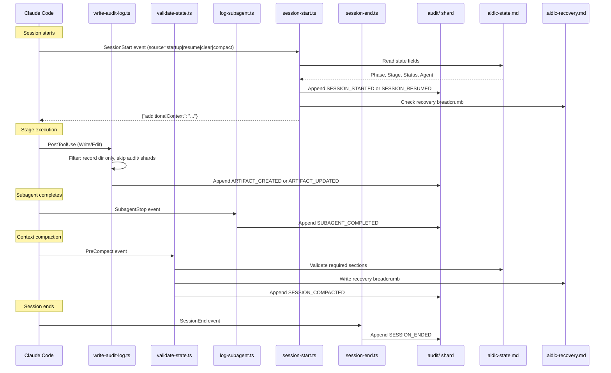

# フックとツール

この章は、フックシステムのアーキテクチャ、フックスクリプト 17 本すべて、監査イベントの分類、CLI ツール設定、決定論的ユーティリティツールです。

> **パスの慣例。** 状態、監査、成果物はアクティブインテントの**レコードディレクトリ** — `aidlc/spaces/<space>/intents/<YYMMDD>-<label>/` にあります。以下では `<record>/` と書きます（短い UTC 日付接頭辞 + 短い kebab-case ラベルなので、レコードディレクトリは時系列に並ぶ。正準 ID は `intents.json` レジストリ行の UUIDv7）。監査証跡は単一ファイルではなく、`<record>/audit/` の下のクローンごとのシャードディレクトリです。

---

## フックシステムのアーキテクチャ

この実装は `.claude/hooks/` にフックスクリプト 17 本を置きます。17 本すべて TypeScript（`bun` 経由）。17 本すべて**プロジェクト単位** — `settings.json` に登録します（ステータスラインはトップレベル `statusLine` キー、ほか 16 本は `hooks` ブロック）。ホストがプロジェクトフックを許すかぎり、どのスキルがアクティブでも発火します。Claude Code の管理ポリシー `allowManagedHooksOnly: true` はプロジェクト登録を上書きし、それらのフックを止めます。`/aidlc --doctor` がその方針を検出します。かつては分かれていました（6 本は `aidlc/SKILL.md` frontmatter のスキル単位、残りはプロジェクト単位）。v0.6.0 でスキル単位の 6 本を `settings.json` へ移し、どの入口 — オーケストレータ、梱包したスコープ / ステージランナー、手書きの顧客ランナー — も、ランナーごとの `hooks:` ブロック無しで決定論的な背骨を継ぐようにしました。

17 のうち 11 本は**非ブロッキング**です。6 本は**流れを変えます**: `Stop` フックが転送ループを回し続け、deliver-stage-rules フックがハーネスの入力書き換えが許すところでサブエージェントブリーフへ正確なアクティブステージルールを付け、plan-approval ガードが時期尚早なコード生成派遣を拒否し、reviewer-scope フックが兄弟ユニットへのレビュアーアクセスを拒否し、review-freeze フックがゲート前に新しい終端レビューレシートを無効にする produces[] 書きを拒否し、state-transition ガードが `aidlc-orchestrate.ts report` を迂回する直接ライフサイクル呼び出しを拒否します。

```
.claude/hooks/
+-- record-human-turn.ts     # UserPromptSubmit + PostToolUse AskUserQuestion (project-wide, settings.json, TypeScript)
+-- deliver-stage-rules.ts    # PreToolUse Task|Agent (project-wide, settings.json, TypeScript, flow-altering)
+-- plan-approval-guard.ts # PreToolUse generation dispatch/write/shell tools (project-wide, settings.json, TypeScript, flow-altering)
+-- state-transition-guard.ts # PreToolUse Bash (project-wide, settings.json, TypeScript, flow-altering)
+-- reviewer-scope.ts    # PreToolUse file/search/shell tools (project-wide, settings.json, TypeScript, flow-altering)
+-- review-freeze.ts     # PreToolUse file-write tools (project-wide, settings.json, TypeScript, flow-altering)
+-- write-audit-log.ts      # PostToolUse Write|Edit (project-wide, settings.json, TypeScript)
+-- run-sensors.ts       # PostToolUse Write|Edit (project-wide, settings.json, TypeScript)
+-- sync-workflow-state.ts   # PostToolUse TaskUpdate (project-wide, settings.json, TypeScript)
+-- rebuild-stage-graph.ts   # PostToolUse Bash (project-wide, settings.json, TypeScript)
+-- fold-usage.ts        # PreToolUse + PostToolUse (project-wide, settings.json, TypeScript, Claude-only producer)
+-- validate-state.ts    # PreCompact (project-wide, settings.json, TypeScript)
+-- log-subagent.ts      # SubagentStop (project-wide, settings.json, TypeScript)
+-- aidlc-continue-workflow.ts        # Stop (project-wide, settings.json, TypeScript, flow-altering)
+-- session-start.ts     # SessionStart (project-wide, settings.json, TypeScript)
+-- session-end.ts       # SessionEnd (project-wide, settings.json, TypeScript)
+-- aidlc-statusline.ts  # statusLine (project-wide, settings.json, TypeScript)
```

### フック要約

| Hook | Event | Scoping | Matcher | Purpose |
|------|-------|---------|---------|---------|
| `record-human-turn.ts` | UserPromptSubmit + PostToolUse | Project-wide (settings.json) | (empty) / `AskUserQuestion` | 対応する prompt-submit または答えたウィジェットシームが発火したとき `HUMAN_TURN` イベントを残す。承認 / インタビューゲートは、最後のゲート解決以降に一つ要る。`AIDLC_UNATTENDED=1` は、共有フックとすべての直接ハーネスアダプタで、この権限付き発行を抑える。権限を持たない転送マーカーは変えない。宣言はオプトイン。ドライバだけが無人かどうかを知る。イベントが証明するのは順序 / 存在だけ: ハーネスは信頼できる応答本文を一様に出さないので、後の `--user-input`、`--feedback`、`--details` 散文の認証には使わない。 |
| `deliver-stage-rules.ts` | PreToolUse | Project-wide (settings.json) | `Task\|Agent` | **流れを変える。** 派遣したステージの実質あるアクティブスペースルールを解決し、そのバイトそのものをすべての AI-DLC サブエージェントブリーフへ付ける。受け入れたバックグラウンド派遣のあと、セッション単位のエントリを `aidlc/.aidlc-subagent-inflight` に一つ足し、Stop フックがその結果を待てるようにする。拒否した派遣は何も足さない。Claude、Codex、opencode、Copilot の入力を書き換える。Kiro CLI はツール引数を書き換えられないので、不完全なブリーフは助言警告付きで進む（Kiro CLI エージェントは `resources` でアクティブメモリ木を事前読みする。読めない必須ルールは修理案内付きでブロックする）。Kiro IDE は常に含むワークスペース操舵と、生きたメモリファイル参照を使う。正確な束がすでにあれば冪等 |
| `plan-approval-guard.ts` | PreToolUse | Project-wide (settings.json) | `Task\|Agent\|Edit\|Write\|Bash` (plus harness-native patch aliases) | **流れを変える。** コード生成の計画先行順序（ステージ Step 2-4）を決定論的に強制する。アクティブディレクティブが権限を一つ選ぶ: `unit` があれば `construction/<unit>/code-generation/`、無ければゼロ Unit の `construction/code-generation/`。開発者派遣とワークスペース変更は、その対象に現行の Testing Contract、指紋付き計画 / 指示、明示の "Approve Plan" 答えがあるまで拒否する。選んだレコードディレクトリ内の書き込みは、その証拠を用意するために残す。委譲はちょうど一つの `AIDLC-UNIT: <unit>` または `AIDLC-STAGE: code-generation` マーカーを使う。拒否ごとに `PLAN_APPROVAL_BLOCKED` を出す。欠けた、衝突する、未知のマーカーは、プロンプト散文から推測せずブロックする。`AIDLC_DISABLE_PLAN_APPROVAL_GUARD=1` はこの PreToolUse フックだけを止める。自律の `aidlc-swarm.ts prepare` 前提は**止めず**、保護した Plan Approval 権限は所有する判断、答え、生成開始ツールが強制し続ける。 |
| `state-transition-guard.ts` | PreToolUse | Project-wide (settings.json) | `Bash` | **流れを変える。** 直接の `aidlc-state.ts` ライフサイクル動詞を拒否し、コンダクターを `aidlc-orchestrate.ts report` へ戻す。ハーネスが委譲エージェントの身元を出せば、レビュアーとサポートエージェントからのライフサイクル / ルーティングコマンドも拒否する。読み取り専用の状態と通常のビルド / 検証コマンドは残す |
| `reviewer-scope.ts` | PreToolUse | Project-wide (settings.json) | `Read\|Edit\|Write\|Glob\|Grep\|Bash` | **流れを変える。** Unit ごとのレビュアー読み取り範囲（stage-protocol-reviewer.md §12a）を決定論的に強制する: コンダクターのレビュアー派遣記録（`<record>/.aidlc-reviewer-dispatch.json`）が新しいあいだ、派遣したレビュアーのツール呼び出しが兄弟ユニットの `construction/` パスへ届くもの — ファイルの読み書きと、兄弟をまたぐ grep / glob / シェルパターン — は、対象が記録の免除一覧に無い限り拒否する（終了 2 + 戻す stderr 理由）。独立に、Unit-claim スコープスタンプを持つチェックアウトは、別 Unit の `construction/<unit>/` 部分木を変えてはならない。正規化したパス解決が、相対トラバーサルと大文字小文字逃れを拒否の前に閉じる。拒否ごとに `REVIEWER_SCOPE_BLOCKED`。曖昧さはすべてフェイルオープン。`AIDLC_DISABLE_REVIEWER_SCOPE_HOOK=1` で強制を止める |
| `review-freeze.ts` | PreToolUse | Project-wide (settings.json) | `Read\|Edit\|Write\|Glob\|Grep\|Bash` (self-filters to mutation-capable calls) | **流れを変える。** レビュアーモジュールの終端レシート順序を決定論的に強制する: レビュアー付きでまだ完了していないステージの宣言 `produces[]` 成果物を狙う Write / Edit またはシェル変更は、新しい終端レビューレシートがそれを覆っているあいだ拒否する（終了 2 + 戻す stderr 理由）。シェル書きは実行前に見る。Write / Edit 監査フィードを通らないので、変わったバイトの上に古いレシートが残るのを防ぐため。エンジンのレシート走査そのもの（`aidlc-lib.ts` の `freshReviewReceipts`）を共有するので、記録したゲート却下、ジャンプ、ワークフロー再開は凍結を自動で解く。上限未満の adversarial NOT-READY は非終端のまま直し用に編集できる。実効クラスの下の終端 NOT-READY は READY と同じく凍結する。拒否ごとに `REVIEW_FREEZE_BLOCKED`。曖昧さはすべてフェイルオープン。`AIDLC_DISABLE_REVIEW_FREEZE_HOOK=1` で強制を止める |
| `write-audit-log.ts` | PostToolUse | Project-wide (settings.json) | `Write\|Edit` | 成果物書きを `audit/` シャードへ自動記録する |
| `run-sensors.ts` | PostToolUse | Project-wide (settings.json) | `Write\|Edit` | アクティブディレクティブステージの解決済みセンサーを、一致する書き込みで発火する（助言。ブロックしない）。unit-major 実行が `Current Stage` より先へ進むとき、状態結びのインテントごとのマーカーが帰属を保つ |
| `sync-workflow-state.ts` | PostToolUse | Project-wide (settings.json) | `TaskUpdate` | ステージタスク起動時に状態ファイルを自動同期する |
| `rebuild-stage-graph.ts` | PostToolUse | Project-wide (settings.json) | `Bash` | 成功した `intent-create` を、そのツールイベントの正確なホストセッション ID に結ぶ。セッションがすでに別インテントを所有していれば、一回限りの新規セッション引き渡しレシートを書く。それから遷移クラスの監査発行で `runtime-graph.json` を再コンパイルする |
| `fold-usage.ts` | PreToolUse + PostToolUse | Project-wide (settings.json) | (empty) | **Claude 専用。** トランスクリプトの新しいトークン使用量を、llm 呼び出しごとに残る使用量台帳へ畳む: PreToolUse は完了しつつあるメイン呼び出しを封じ、エンジン境界の前に完了したサブエージェント呼び出しを全部閉じてライフサイクル集計を現行にする。PostToolUse は通常の保留フォールバック。観察のみ、ブロックしない。Claude Code トランスクリプト読みは Claude ハーネスにだけ配線するので、Kiro / Codex / opencode ではプロデューサーは走らず台帳は空のまま（使用量の消費者はどれもデータ無しへ劣化する）。`AIDLC_DISABLE_USAGE_TRACKING=1` で止める。下の「トークン使用量とコスト追跡」を参照 |
| `validate-state.ts` | PreCompact | Project-wide (settings.json) | (empty) | 状態ファイルを検証し、復旧パンくずを書く |
| `log-subagent.ts` | SubagentStop | Project-wide (settings.json) | (empty) | 完了するセッションのバックグラウンドサブエージェント台帳エントリを一つ外し、サブエージェント完了イベントを記録する |
| `aidlc-continue-workflow.ts` | Stop | Project-wide (settings.json) | (empty) | **流れを変える。** ターン終了で転送ループを強制する: `aidlc-orchestrate next` を走らせ、`done`、`parked`、案内の `notice` では停止を許し、保留ディレクティブでは停止を止め、次の一手を `reason` 経由で戻す。セッションの元 UUID と新しくアクティブな UUID が PostToolUse レシートと一致するとき、ちょうど一回の `intent-create` 後の新規セッション引き渡しも許す。いまのステージまたはアクティブなチーム Unit ゲートが承認 / 改訂待ち、あるいは `[-]` 進行中でアクティブディレクティブの正準またはユニットごとの `<slug>-questions.md` に未回答の質問がある、または未解決の記録済み `DECISION_RECORDED` があるときは、正当なターン停止を許す。新しい飛行中 compose マーカー、いまのセッションの新しいバックグラウンドサブエージェントエントリ、会話ターンも許す。別セッション、古い、壊れたバックグラウンドエントリは停止を認可しない。compose、バックグラウンド、記録した判断、会話の例外は自律 Construction の下では抑える。pending-file 例外は、unit-major code-generation の必須 Plan Approval 以外では抑える。再帰に上限（進捗無しカウンタ + `CLAUDE_CODE_STOP_HOOK_BLOCK_CAP` 下の `stop_hook_active`。対話実行の既定は 2、自律 Construction では 8）。AIDLC ワークフローの外では何もしない |
| `session-start.ts` | SessionStart | Project-wide (settings.json) | (empty) | セッション再開時にワークフローコンテキストを注入する |
| `session-end.ts` | SessionEnd | Project-wide (settings.json) | (empty) | きれいな終了で、そのセッションそのものに記録したインテントへ `SESSION_ENDED` を出す。UUID 付きワークフローにセッション結びが無ければ、共有アクティブカーソルを使わずフェイルクローズする |
| `aidlc-statusline.ts` | statusLine | Project-wide (settings.json) | -- | ターミナルにリアルタイム進捗を出す |

### 共有の性質

TypeScript フック 17 本すべて:

- TypeScript で書き、`bun` 経由で走る
- 実行権限は不要 — macOS、Linux、ネイティブ Windows PowerShell で同じ
- Claude Code から stdin に JSON を受ける
- ネイティブ JSON 解析（`jq` 依存無し）
- 成功またはスキップでは終了コード 0（`Stop` フックもブロックするとき終了 0 — ブロックは stdout の `{"decision":"block"}` JSON で合図する。4 本の PreToolUse 制御フックは、復旧不能または再試行可能な拒否を終了 2 + stderr の理由で合図する）
- `$CLAUDE_PROJECT_DIR` を複数のフォールバックで解決する
- ロックとユーティリティ関数を `lib.ts` から共有する

### 監査イベントの流れ



---

## ワークフロー背骨のフック

この 6 本（監査 / センサー / ステータスライン / rebuild-stage-graph / 状態検証 / サブエージェントの背骨）は `settings.json` にプロジェクト単位で登録します。常にオンですが、それぞれ**自己ゲート**します: アクティブワークフローが無ければ（`aidlc-state.md` / アクティブインテントの `audit/` シャードが無い）早めに終了するので、監査記録と状態同期が AI-DLC 以外のセッションを汚しません。v0.6.0 より前は `aidlc/SKILL.md` frontmatter（スキル単位）に宣言していました。`settings.json` への移動で、どの入口 — オーケストレータと、梱包したまたは手書きのランナーすべて — も `hooks:` ブロックをコピーせずに背骨を継ぎます。

### PostToolUse: write-audit-log.ts

**Source:** `.claude/hooks/aidlc-write-audit-log.ts`
**Trigger:** すべての `Write` または `Edit` Claude Code ツール呼び出しのあと（matcher: `"Write|Edit"`）
**Purpose:** 成果物書きをインテントの `audit/` シャードへ自動記録する

**処理手順:**

1. **プロジェクトディレクトリ解決:** `$CLAUDE_PROJECT_DIR` を解決し、フォールバックはスクリプトパス導出と CWD 検出。
2. **ヘルスハートビート:** UTC 時刻を `.aidlc-hooks-health/write-audit-log.last` に書く。
3. **JSON 解析:** stdin を読み、`tool_name` と `tool_input.file_path` を取り出す。
4. **パス絞り:** インテントのレコードディレクトリの下でないファイルは飛ばす。`audit/` シャード自身も飛ばす（再帰を避ける）。
5. **監査ファイルガード:** アクティブインテントの `audit/` シャードが無ければ黙って終了（フレームワークが作る）。
6. **コンテキスト抽出:** レコードディレクトリまでのパス接頭辞を剥ぎ、`/` を ` > ` に置き換えてパンくずにする（例: `inception > requirements-analysis > requirements.md`）。
7. **原子ロック:** システム一時ディレクトリ（`os.tmpdir()`）の `mkdir` ベースロック。3 回再試行（100ms 待ち）。ハッシュがプロジェクトごとにロックを分ける。
8. **ログエントリ:** 正準の `ARTIFACT_CREATED`（まだ無いパスへの Write）または `ARTIFACT_UPDATED`（Edit、または既存を上書きする Write）イベントを `appendAuditEntry` 経由で追記する。フィールド: Timestamp、Event、Tool、File、Context。

### PostToolUse: sync-workflow-state.ts

**Source:** `.claude/hooks/aidlc-sync-workflow-state.ts`
**Trigger:** すべての `TaskUpdate` 呼び出しのあと（matcher: `"TaskUpdate"`）
**Purpose:** ステージタスクが `in_progress` になったとき `aidlc-state.md` を自動同期する

**処理手順:**

1. **プロジェクトディレクトリ解決:** write-audit-log.ts と同じ複数フォールバック。
2. **状態絞り:** `status` が `in_progress` のときだけ発火。`completed`、`pending` などは黙って終了。
3. **activeForm 絞り:** `activeForm` フィールドが無い、または `[slug]` 接尾辞パターンが無ければ黙って終了。
4. **状態ファイルガード:** `aidlc-state.md` が無ければ黙って終了（init 前）。
5. **ヘルスハートビート:** `.aidlc-hooks-health/sync-workflow-state.last` に書く。
6. **状態同期:** `bun aidlc-utility.ts set-status --stage <slug>` を呼ぶ（通常は Phase、Stage、Agent、チェックボックスを更新）。妥当なインターリーブ unit-major ディレクティブでは、過渡の状態欄とマーカーダイジェストを更新しつつ、残る最初のステージカーソル、`In Progress`、チェックボックスは保つ。

**設計メモ:**
- Stage Jump タスク（`[slug]` 無し）と依存配線の TaskUpdate（activeForm 無し）は自然に落ちる。
- フックは既存の `set-status` サブコマンドを呼ぶ — 新しいコード経路は不要。
- 起動したスラッグが状態結びのアクティブディレクティブマーカーと一致するとき、`set-status` はそのマーカーの状態ダイジェストを更新しつつ unit を保つ。インターリーブ unit-major ディレクティブでは `Current Stage`、`In Progress`、残るカーソルチェックボックスも変えないので、完了グリッドのゲート連鎖はブロックの最初のステージから始まる。

### PostToolUse: run-sensors.ts

**Source:** `.claude/hooks/aidlc-run-sensors.ts`
**Trigger:** すべての `Write` または `Edit` Claude Code ツール呼び出しのあと（matcher: `"Write|Edit"`）
**Purpose:** アクティブステージのコンパイル解決済みセンサーを、一致する書き込みで発火する（助言。ブロックしない）

**処理手順:**

1. **プロジェクトディレクトリ解決:** write-audit-log.ts と同じ複数フォールバック。
2. **監査 + 状態ガード:** `audit/` シャードまたは `aidlc-state.md` が無ければ黙って終了（init 前）。
3. **アクティブステージ読み:** エンジンは検証済み `load-steering` 部分と最終 `run-stage` を、アクティブインテントの gitignore された `.aidlc-active-directive.json` に原子的に残し、正確なプロジェクト、インテント、`aidlc-state.md` の SHA-256 に結ぶ。共有マーカーの消費者は、ルール配送中でも次のステージを見る。タスク起動はスラッグがマーカーと一致するときだけダイジェストを更新し、ユニットごとのディレクティブの unit を保ちつつ無関係な状態変更を拒否する。フックはそのステージを、ダイジェストが一致するあいだ使い、それから `stage-graph.json` の `sensors_applicable` 配列を読む。これにより、残るカーソルが先行の設計ステージにあっても、unit-major の code-generation 診断は `code-generation` の下に残る。保留中の Copilot 試行はマーカーを `report --single` をまたいで残すことがある。それ以外では、成功した単発ステージ完了が消す。欠けた、壊れた、古い、グラフ未知のマーカーは `Current Stage` へ落ちる。
4. **ディスパッチ:** 当たるセンサーごとに `aidlc-sensor.ts fire <id> --stage <slug> --output-path <path>` を spawn する。ディスパッチャは各センサーの `matches` グロブをフック側で適用し、一致しない書き込みは飛ばす。結果は助言 — フックは書き込みをブロックしない。
5. **ヘルスハートビート:** 発火したとき `.aidlc-hooks-health/run-sensors.last` を書く。doctor が健康なアイドルと黙った失敗を区別できるようにするため。

マニフェストスキーマと発火寿命は [Sensor System](07-sensor-system.md) です。

マーカー書きはレコード局所の `.aidlc-active-directive.lock/` を通し、監査ロックと同じ世代結びプロトコルで直列化します。書き手が兄弟候補を用意しているあいだも正準マーカーは読め、公開、消去、解放は正確な取得トークンと正準身元に結んだままです。トークンは正準 UUID で、本物のディレクトリはロックディレクトリの非シンボリックリンク子でなければなりません。解放できるマーカーはそのディレクトリの通常ファイルでなければなりません。自動復旧は、証明できる死んだ妥当な世代、OS プロセス世代の不一致、または本当に欠けた古いスタンプに限られます。OS 世代探りは任意: 使えなければ、取得は PID / トークンスタンプを残し、生きている所有者の復旧は世代未知のフェイルクローズのままです。正準の変更はどれも、復旧できる所有者スタンプ付き `.reap` 協調ゲートを持ちます。ゲート世代検査、公開、退役は POSIX では `flock`、Windows では `LockFileEx` で直列化します。POSIX ローダは glibc、macOS libSystem、標準 musl ローダ / libc 名、発見した musl ライブラリを支えます。各ゲートは公開前に私有候補へ完全スタンプし、完了したが未解放のゲートは外部から復旧でき、doctor に見えます。一致する、または世代未知の生きている所有者、壊れたスタンプ、リダイレクトしたトークンパス、非通常の解放マーカー、読めないスタンプはフェイルクローズします。レガシーの `.aidlc-active-directive.json.transaction` 残骸も、再検証する所有者身元が無いので手作業のままです。

#### 原子的な継続カーソル

アクティブディレクティブマーカーは、出荷するどのハーネスでも、権威ある一回使いの操舵
継続カーソルでもあります。カーソル身元は正準の
プロジェクト、アクティブスペース / レコードパス、インテント UUID、完全な状態 SHA-256 と
有無、そして `tools/data/harness.json` の導入ハーネス名です。ハーネスディレクトリだけでは身元になりません: Kiro
と Kiro IDE は `.kiro` を共有し、Copilot と opencode は `.aidlc` を共有します。
新しいマーカー公開はハーネスを `cursor_harness` として残します。そのフィールドが無い既存 v2
マーカーは移行のために読めます。

`continue` はまず、変わらないネイティブトークン検査をします: デコード、MAC、
状態、経路検証。それから既存のアクティブディレクティブロックを取り、
対象と状態を再検証し、提示した完全トークンの全バイトをハッシュし、
そのダイジェストをマーカー内の検証済み完全現行トークンと比べます。そのロックを持ったまま、カーソルを用意した後継そのものへ原子的に置き換えます: 別の完全な `load-steering` トークン、または
トークン無しの `run-stage`。リネームとロック解放のあとだけ、エンジンは
stdout を書きます。同じ現行トークンを争う二つのプロセスは勝者がちょうど一人。後続は後継を見て古いトークンエラーを受けます。

新しい `next` は同じロックを使い、どのハーネスでも stdout の前に最初の作業ディレクティブを公開しなければなりません。明示のリセットです。操舵トークンは決定論的なので、リセットは同じトークンバイトを再認可することがあります: `next` が並行 `continue` より先にコミットすれば、その継続はリセットトークンを消費できます。`continue` が先にコミットすれば、後の `next` がその後継を上書きし、最初のディレクティブを戻します。権威はコミット順であり、プロセス開始時刻ではありません。マーカー競合はエラーディレクティブを出し、未記録の作業ディレクティブは出しません。

クラッシュと再試行の振る舞い:

| Boundary | Cursor and retry |
| --- | --- |
| マーカーリネームの前 | 古いトークンが現行。死んだ所有者は既存のロックリーパーが回収する。同じトークンを再試行する。 |
| リネームのあと、stdout の前 | 後継が現行で、古いトークンは再起動をまたいで古い。新しい `next` で再水和する。カーソルは高々一度であり、ちょうど一度の配送ではない。 |
| stdout が始まった、または完了したあと | 後継が現行。完全ディレクティブの受け取りが不確かなら新しい `next` を走らせる。古いトークンは再生しない。 |
| 最終 `run-stage` | マーカーに継続トークンが無いので、最終操舵トークンはどの再試行でも古い。 |

互換復旧も原子的です。欠けた、壊れた、大きすぎる、v1
マーカーは、ネイティブ検証した継続一つがブートストラップし、ロックの下で後継を公開することを許します。並行復旧の呼び出し側はその後継を見て負けます。`cursor_harness` が無い変更前 v2 マーカー、または別の導入ハーネスが書いたものは、正確なプロジェクト、インテント、
状態、現行トークンダイジェストが一致するときだけ移行します。不一致は古い。新しい `next` が万能リセットです。フックのマーカー読みは助言目的なのでフェイルオープンのままです。Post / ホストフックは配送証拠を読んだり豊かにしたりできますが、再生を認可しません。

アップグレードとロールバックは静止が要ります: エンジン、ライブラリ、フック、
生成したハーネス木を、AI-DLC コマンドもフックも走っていないあいだに一緒に置き換えます。
意図して一致する飛行中トークンを移行するのでなければ、アップグレード、ロールバック、再アップグレードのあと新しい `next` を走らせます。古いリリースは
`cursor_harness` を無視しますが、ロールバックは修正版を再導入するまで、歴史的なセッション無し再生振る舞いを戻します。古い / 新しいツール
ファイルの混在は未対応です。

ちょうど一人の勝者の主張は、一貫したプロセス間可視性、排他的ディレクトリ作成、安定した通常ファイル読み、マーカーとロックパスの同じファイルシステムでの原子リネームを持つ、一つの局所ファイルシステムが要ります。それらの原語を守らない NFS / SMB / FUSE / オブジェクト同期フォルダは未対応です。実装は候補も親ディレクトリも `fsync` しないので、突然の電源喪失の耐久性は主張の外です。

ハーネス固有の残りはカーソル権限の外です。状態前の
継続は、アクティブスペースの `bare-space` バケットの下で同じカーソルを使い、
`state_present: false`、`intent_uuid: null`、空状態の SHA-256 です。
したがってインテントが存在する前も、同じ一人勝者の保証を保ちます。

| Harness | Residual host behavior |
| --- | --- |
| Claude | Stop 保持、トランスクリプト読み、コンパクション、セッション所有はフック所有のまま。 |
| Codex | 再開、コンパクション、配送振る舞いは Codex 所有のまま。カーソルはホスト相関を作らない。 |
| Copilot | アダプタの主張、Post 決着、Resume、所有、会話、配送証拠、Stop 回数は Copilot 専用のマーカー豊化のまま。 |
| Cursor | フック相関とサブエージェント台帳は助言のままで、再生を認可できない。 |
| Kiro CLI | トランスクリプト無しの Stop / 会話マーカーはフック所有のまま。 |
| Kiro IDE | 現行とレガシーの IDE イベント / セッション差はアダプタ所有のまま。 |
| opencode | プラグインとセッション寿命の証拠はホスト固有で、再生には読み取り専用。 |

カーソルは成功したトークン消費を一人保証します。`run-stage`、`report`、`park` 実行のちょうど一度は保証せず、Cancel、プロンプト、コンパクション、TUI、Stop 保持、Resume、所有、会話、回数の意味も変えません。

### PostToolUse: rebuild-stage-graph.ts

**Source:** `.claude/hooks/aidlc-rebuild-stage-graph.ts`
**Trigger:** すべての `Bash` Claude Code ツール呼び出しのあと（matcher: `"Bash"`）
**Purpose:** ワークフロー前セッションを、そのシェル呼び出しが作ったインテントに結び、遷移クラスの監査イベントが着地したとき `runtime-graph.json` を再コンパイルする

**処理手順:**

1. **セッション結び:** グラフ絞りの前に、PostToolUse イベントの正確な `session_id` を、成功した `intent-create` 結果のレコードとスペースと組にする。そのレコードを `intents.json` で解決し、未結びセッションにスタンプするか、既存所有を保って、元と新しくアクティブなインテント UUID を名指す短い引き渡しレシートを書く。
2. **コマンド絞り:** グラフ早期終了を通るのは `bun .claude/tools/aidlc-(state|jump|bolt|utility).ts` 呼び出しだけ。`aidlc-runtime.ts` は明示拒否（再帰ガード）。
3. **監査存在ガード:** init 前（まだ `audit/` シャードが無い）はきれいに終了。
4. **ヘルスハートビート:** `.aidlc-hooks-health/rebuild-stage-graph.last` を書く。
5. **末尾読み:** マージした `audit/` シャードを `\n---\n` で分割し、最後の 3 ブロックを取る（単一 `approve` 呼び出しが追記する上限）。
6. **イベントクラス絞り:** 最後の 3 ブロックの一つが `GATE_APPROVED`、`STAGE_STARTED`、`STAGE_AWAITING_APPROVAL`、`AUDIT_MERGED`、`WORKFLOW_COMPLETED` を持つときだけ再コンパイルする。マッチ無ければ終了。
7. **ディスパッチ:** `bun aidlc-runtime.ts compile` を spawn する。非ゼロ終了では `--doctor` 向けにフック落ちを記録する。親 Bash 呼び出しはブロックしない。

コンパイル寿命とロックしたスキーマは [Runtime Graph](13-runtime-graph.md) です。

### PreCompact: validate-state.ts

**Source:** `.claude/hooks/aidlc-validate-state.ts`
**Trigger:** Claude Code が会話コンテキストをコンパクションする前（matcher: 空 = 常に）
**Purpose:** 節の存在検査（情報専用。コンパクションは止めない）と復旧パンくずの書き込み

**処理手順:**

1. **状態ファイルガード:** `aidlc-state.md` が無ければきれいに終了。
2. **節検証:** `grep -q` で必須節 2 つを見る:
   - `## Stage Progress` -- 完了状態付きの全ステージチェックリスト
   - `## Current Status` -- いまのフェーズ、ステージ、スコープ
   どちらかが無ければ WARNING を出す（情報専用 — コンパクションは止められない）。
3. **復旧パンくず:** いまのステージと検証時刻を含む `.aidlc-recovery.md` を書く。セッション再開時、フレームワークはこれを `aidlc-state.md` と比べ、コンパクション由来の状態壊れを見つける。

**なぜ重要か:** コンテキストコンパクションは会話履歴を捨てます。ステージ途中で起きると、モデルは自分が何をしていたかを失います。復旧パンくずは、コンパクションを越える外部チェックポイントです。

### SubagentStop: log-subagent.ts

**Source:** `.claude/hooks/aidlc-log-subagent.ts`
**Trigger:** どのサブエージェント（Claude Code Task ツール呼び出し）でも完了したとき（matcher: 空 = 常に）
**Purpose:** バックグラウンド派遣状態を消し、サブエージェント完了イベントを監査証跡へ記録する

**処理手順:**

1. **プロジェクトディレクトリ解決:** write-audit-log.ts と同じ複数フォールバック。
2. **JSON 解析:** セッション身元、`agent_type`（既定 `"unknown"`）、`agent_id`、`last_assistant_message`（200 文字に切り詰め）を取り出す。
3. **バックグラウンドエントリ完了:** ワークスペースロックの下で、完了するセッションの飛行中エントリを一つ外す。重なるワーカーとほかのセッションは残す。
4. **ワークフロー状態ガード:** セッションが選んだインテントの `aidlc-state.md` が `Status: Running` でなければ黙って終了。
5. **ヘルスハートビート:** `.aidlc-hooks-health/log-subagent.last` に書く。
6. **エントリ組み立て:** 正準の `SUBAGENT_COMPLETED` イベントを `appendAuditEntry` 経由で出す。フィールド: Timestamp、Event、Agent Type、任意で Agent ID と切り詰めた Message。
7. **原子ロック:** ワークスペースの飛行中台帳とインテント監査書きの両方に、共有ロックヘルパを使う。

**派遣したエージェントすべてで発火します:**
- ステージ 2.1（Reverse Engineering、`mode: pipeline`） -- リポジトリにつき二回: `aidlc-developer-agent` のコードスキャン、それから `aidlc-architect-agent` の合成
- ステージ 3.5（Code Generation、`mode: subagent`） -- `aidlc-developer-agent`（作業ユニットにつき一回）
- 編成ステージ（`mode: mob`、またはサポートエージェント付き `subagent`） -- 派遣した協力者ごと、リード派遣ごとに一回（例: user-stories は三協力者それぞれで発火）

Workspace detection (0.2) はかつてサブエージェントでした。いまは `aidlc-utility intent-create` の中で決定論的に走るので、このフックは初期化中には発火しません。

---

### Stop: aidlc-continue-workflow.ts

**Source:** `.claude/hooks/aidlc-continue-workflow.ts`
**Trigger:** コンダクターがターンを終えようとしたとき（matcher: 空 = 常に。`/aidlc` がアクティブなあいだ）
**Purpose:** 対話の転送ループを強制する — エンジンが終端の `done`、`parked`、案内の `notice` を報告するまで回し続ける

フレームワークの流れを変えるフック 6 本の一つで、下の PreToolUse 制御 5 本と並びます。`{"decision":"block"}` を返してターン終了を止められます。ほか 11 本は観察して終了 0 です。ゲート付き会話経路では、コンダクター（LLM）がループを持ちます。人に聞けるのはそれだけだからです — エンジンを聞き忘れるとワークフローが漂います。このフックはその LLM の勤勉への依存を外します。ループはハーネスが強制します。

**処理手順:**

1. **stdin の決まり:** `log-subagent.ts` と同じ — TTY なら Claude Code JSON は来ない（テスト / デバッグ）ので停止を許す。そうでなければ Stop フック JSON を読み、要るのは `stop_hook_active` だけ。
2. **AIDLC の外では何もしない:** プロジェクトディレクトリの下にアクティブインテントの `aidlc-state.md` が無ければ、強制するものは無い — 停止を許す。frontmatter の `Stop` matcher はすでにフックを `/aidlc` に絞っている。これは防衛の深さで、非 AIDLC セッションを決して止めない。
3. **エンジンを合成する:** `bun .claude/tools/aidlc-orchestrate.ts next --project-dir <dir>` を走らせ、ディレクティブ `kind` を解析する。状態を再導出しない — エンジンを合成する。
4. **`done` → 許可:** ディレクティブが `done` ならワークフロー完了。フックは何も出さず終了 0（先行の非ブロッキング型）、それから再帰カウンタを消す。
5. **`notice` → 許可:** ディレクティブが `notice` なら、エンジンが終端の案内引き渡しを出した（いまはスコープ無し main のチーム Unit 展開 notice）。フックは停止を許し、状態を進めずにカウンタを消す。
6. **`parked` -> 許可:** ディレクティブが `parked` なら、ワークフローは後のセッション向けに途中で意図して止まった（`aidlc-orchestrate park`）。フックは `done` と同じく停止を許し、カウンタを消す。これが対応する複数セッション出口です。無ければきれいな停止は `done` だけで、長いワークフローのエージェントは残りのステージをゴム印するしかありません（#367）。**自律ガード（#365）:** 自律 Construction（`Construction Autonomy Mode: autonomous`）の下では `parked` 許可を抑えるので、そこでの `parked` ディレクティブは上限付きブロックへ落ち、ループは動き続けます。
7. **正当なターン停止 -> 許可:** ディレクティブは保留だが、コンダクターが正しく人、一致する飛行中バックグラウンドサブエージェント、compose ゲート、Resume 選択、または会話応答で止まっているなら、フックは停止を許し、ナッジを連打せず落ちを記録する。当たる証拠は Esc、状態結びのセッション無し Resume マーカー（`ask` + `waiting`）、いまのステージチェックボックス `[?]` / `[R]`、アクティブなチーム `(stage, Unit)` ゲートの監査状態、未回答のファイル付き質問がある進行中ステージ、後の `QUESTION_ANSWERED` が無いいまのステージの `DECISION_RECORDED`、新しい compose マーカー、いまのセッションの新しい飛行中エントリ、会話で終わるターン。バックグラウンドと Resume 状態はセッション隔離。自律 Construction は当たる待ちを抑える。陽性確認だけ: 欠けた、古い、別セッション、壊れた証拠は下の上限付きブロックへ落ちる。下の「ターン停止の例外」を参照。
8. **保留 -> ブロックして注入:** ほかの（保留）ディレクティブ — `run-stage`、`dispatch-subagent`、`invoke-swarm`、`present-gate`、`ask`、`print`、`error` — では `{"decision":"block","reason":<on-task continuation>}` を出し、同じセッションが次の一手を注入されて再開する。注入した `reason` はきれいな一時停止の代替として `aidlc-orchestrate park` も名指すので、長いワークフローを止めたいコンダクターは進めるのではなく park する。
9. **フェイルオープン:** 想定外の失敗（読めない状態、非ゼロ終了または解析不能ディレクティブのエンジン、壊れた stdin）は停止を許し、落ちを記録する。ターンを閉じ込められるフックでは、フェイルオープンが唯一安全な失敗モードです。

**Copilot の届けたディレクティブ経路。** Copilot の PostToolUse アダプタは、成功して届けた
`next`、`continue`、`report`、`park` 結果について、有界のルーティングと継続メタデータだけを残します。Stop では、共有フックはその届けたディレクティブを、新しい `next` を探る代わりに使ってよいですが、上の順で同じ終端、人待ち、会話、自律、再帰の検査は走ります。配送はプロジェクト、アクティブインテント、あればセッション、ワークフロー状態ダイジェスト、所有者 / コンテキスト世代、コマンド試行に絞ります。コンパクションや状態ドリフトは配送を無効にします。欠けた、または無効な証拠は有界の新しい `next` 復旧を返し、古い継続は再生しません。

**セキュリティ性質 — `reason` は仕事中の継続であり、上書きではない。** 注入する `reason` は、コンダクターがまだ負う仕事を名指します（「転送ループを回し、ディレクティブに従い、それから報告する」）。新しいことや帯域外のことをする指示ではありません。上書き型のディレクティブは、コンダクター自身の安全訓練が拒否します。その拒否がセキュリティ性質です。したがってバグった、または侵害されたエンジンは、認可した仕事を*続ける*ことしかできません — セッションを乗っ取って利用者に逆らうことはできません。

**再帰ガード — 固まったブロックがセッションを閉じ込められない。** 永遠に再発火するブロックは、フックがターンを閉じ込められる唯一の道なので、再帰はネイティブな二通りで上限します:

- **`stop_hook_active`** — Claude Code は、いまの停止自体が先行 Stop フックブロックの産物であるときこれを真にします。フックは、すでにブロック列の中にいる合図として読みます。
- **進捗無しカウンタ** - フックは、監査長ではなくワークフローとディレクティブ進捗をキーにした有界再帰記録を残すので、監査だけの交通が進捗を作れません。共有署名はいまのステージ、揮発の `Last Updated` メタデータを除いたワークフロー状態ダイジェスト、種別固有のディレクティブ身元: ステージ / Unit、load-steering の部分 / トークン / 中身、run-stage ウェーブ、スウォームユニット、派遣したワーカー / リポジトリ。Copilot のセッション単位協調マーカーは、完全な継続トークンハッシュ、所有者世代、アクティブ Resume 状態を足します。`report`、ディレクティブ遷移、本物の引き継ぎは当たる署名を変え、健康なループをリセットします。時刻だけの状態同期は変えません。連続ブロックで署名が変わらなければカウンタが増えます。進捗無しの連続が天井 — `CLAUDE_CODE_STOP_HOOK_BLOCK_CAP`、既定は**実行モードを見る: 対話実行では 2、自律 Construction では 8**（対話の 2 は、話しているまたは止まっている人をナッジ一回で解放するため。自律の 8 は、解放する人がいない無人ループが、手放す前に完了まで走るため） — に達すると、フックはターンを**解放**し（停止を許し）、固まったループは必ず手放します。明示の `CLAUDE_CODE_STOP_HOOK_BLOCK_CAP` は両方の既定を上書きします。

**ターン停止の例外 - 正当な待ちは罰しない。** コンダクターが陽性の待ち合図でターンを終える 8 つの場合を扱い、フックがナッジを連打しないようにします:

- **Esc は自由。** Stop フックは利用者割り込み（Esc）では発火しないので、手動割り込みは決して閉じ込められない — その場合のコードは不要。
- **承認ゲートは自由ではない。** コンダクターが `AskUserQuestion` の答えを待つためにターンを終えるとき、Stop フックは*発火する*。承認ゲート（いまのステージが `[?]` 承認待ち）または Request-Changes ループ（`[R]` 改訂中）では、エンジンは飛行中ステージ向けの保留 `run-stage` を出し直すので、例外が無いとフックはブロックし、上限が尽きるまで転送ループのナッジを再注入する — 対話ゲートでは混乱する。したがっていまのステージのチェックボックスが陽性の `[?]` / `[R]` なら、フックは停止を許す。これは**陽性確認だけ、フェイルオープン**: より容易に解放するだけで、より強くはブロックしない。欠けたチェックボックス行と解析エラーは上限付きブロックへ落ちるので、本物のステージ途中の離脱はまだナッジされる。
- **ステージ途中の確認質問も自由ではない。** そのような質問はステージを `[-]` 進行中に止める — 怠惰な離脱と同じチェックボックス状態なので、`[-]` だけでは例外にできない。しかしコンダクターは聞く前に、空の `[Answer]:` タグ付き `<slug>-questions.md` を作らなければならない（ステージプロトコル §3）ので、未回答タグは質問が保留である陽性合図です。フックは正準の `<record>/<phase>/<slug>/` ディレクトリ、またはユニットごとの Construction ディレクティブでは `next` が指名した正確な `<record>/construction/<unit>/<slug>/` を見る。別ユニットの古い質問は受けない。いまの `[-]` ステージの質問ファイルに未回答タグがあれば、フックは停止を許す。自律 Construction（`Construction Autonomy Mode: autonomous`）の下では**厳格にゲート**: 停止を許すのは、unit-major code-generation の正確で見える Plan Approval 節で、空 / アンダースコアだけの答えタグがあるときだけ。一般の確認質問は無人ループを回し続ける。ほかの外れ — ファイル無し、全部回答済み、別ユニット、読み / 解析エラー — は上限付きブロックへ落ちるので、本物のステージ途中の離脱はまだナッジされる。（残件の即時緩和: `CLAUDE_CODE_STOP_HOOK_BLOCK_CAP=1`。）
- **記録した構造化質問も人待ち。** ゲートでないプロンプト、とくに §13 の学び質問は、ステージ質問ファイルに空タグを足しません。必須の監査ハンドシェイクが同等の陽性合図を供給します: `DECISION_RECORDED` がいまのステージ質問を開き、`QUESTION_ANSWERED` が閉じます。その判断が未解決でいまのステージが `[-]` のあいだ、フックは停止を許し、散文描画ハーネスが次の人のメッセージを待てるようにします。解決済み、または別ステージの判断は当たりません。自律 Construction はこの例外を抑えます。
- **飛行中の compose 提案は人待ち。** コンダクターは承認 / 編集 / 却下ゲートを出す前に `aidlc/.aidlc-compose-pending` を書き、ゲートが解決したら消します。24 時間以内のマーカーは停止を許し、より古い孤児は無視して掃除します。自律 Construction は例外を抑えます。
- **バックグラウンドサブエージェントは実行待ち。** ルール配送が `run_in_background: true` のアクティブワークフロー `Task` / `Agent` 呼び出しを受け入れたあと、`aidlc-deliver-stage-rules.ts` はワークスペースロックした `aidlc/.aidlc-subagent-inflight` 台帳へエントリを一つ足します。エントリは派遣セッション身元を持ちます。拒否または大きすぎる派遣は何も足しません。`aidlc-log-subagent.ts` は SubagentStop で一致するエントリを一つ外し、同じセッションの重なるワーカーと、ほかのセッションのワーカーすべてを残します。Stop フックがコンダクターのターン終了を許すのは、自分のセッションに 2 時間以内の新しいエントリがあるあいだだけです。古いエントリは刈り、別セッションまたは壊れた状態はフェイルクローズします。自律 Construction は例外を抑え、無人転送を強制し続けます。
- **会話ターンも自由ではない。** アクティブワークフロー中に、人がただ話したい（質問する、判断を議論する）とき、ループへナッジすべきではありません。フックは、直近の本物の人プロンプトに、ワークフローエンジン関与**無し**で答えたとき停止を許します — コンダクターがそのプロンプト以来 `aidlc-orchestrate` も `aidlc-state` も走らせていない。読み取り専用照会（`--status`、`--doctor`、`--help`、`--version`）は関与に**数えず**、「いまどのステージですか？」に `--status` で答えてもチャットとして当たります。これは**厳格にゲート、フェイルクローズ**: 自律 Construction の下では決して発火せず、欠けたまたは読めない証拠、人プロンプトが見つからない、応答ターンでのエンジン呼び出しは上限付きブロックへ落ちるので、ワークフローに関与してからループ途中で離脱したコンダクターはまだナッジされます。許すだけで、より強くはブロックできません。
- **保留の Resume 選択は人待ち。** `next --resume` は状態結びのアクティブディレクティブマーカーを `kind: "ask"` と `resume.status: "waiting"` で書きます。共有の非 Copilot 経路では、Stop フックは自分の `next` 探りがセッション無しマーカーを置き換える前にそのラッチを読み、人が再開の仕方を選ぶあいだターン終了を許します。状態変更、または届けた非 `ask` ディレクティブがラッチを閉じます。自律 Construction はこの例外を抑え、上限付き強制経路を続けます。

  **述語は一つ、証拠源は二つ。** 問いはどのハーネスでも同じ。違うのは証拠だけです。

  | Evidence | Harnesses | How it answers "zero engine calls since the last human prompt?" |
  |---|---|---|
  | Stop ペイロードの `transcript_path` | Claude Code、Codex | ターン履歴を解析し、各ツール呼び出しを `isEngineToolCall` で分類する。いちばん忠実。届けば優先。 |
  | マーカー mtime | Kiro IDE、Kiro CLI、opencode | `<record>/.aidlc-human-turn` と `<record>/.aidlc-engine-touch` を比べる。人ターンが最後のエンジン進行より**新しい**のが、同じ問いのマーカー表記 — ただし答えは**粗い**。下のカバレッジギャップを参照。 |

  これらのハーネスは、フックへターン履歴をまったく出しません。opencode の `session.idle` にトランスクリプトは無く、Kiro の `Stop` ペイロードは `{session_id, hook_event_name, cwd}` だけです — IDE 1.x で生計測: トランスクリプト無し、ターン id 無し。（より豊かな `{tool_name, tool_input, tool_response}` 形は *ツール* トリガーのもので、`Stop` ではありません。「v1」/「v2」はフックの**登録スキーマ**の名であり、ペイロードではありません — [kiro-ide-hook-payload.md](kiro-ide-hook-payload.md) を参照。）したがってフレームワークは、すでに存在するシームで二つの事実を自分で書きます: `UserPromptSubmit` 発行が `HUMAN_TURN` 台帳イベントと並んで `.aidlc-human-turn` を触れ、`aidlc-orchestrate` が進む `next` / `report` / `park` ごとに `.aidlc-engine-touch` を触れます。マーカーを監査台帳読みより選んだのは、**`next` が読み取り専用で監査イベントを出さない**からです — 台帳だけの述語は、エンジンに聞いてからループ途中で逃げたコンダクターに盲目になり、それは転送ループが捕まえるべき失敗そのものです。

  **カバレッジギャップ — マーカー経路はトランスクリプト経路より緩い。** 二つの述語は読み取り専用免除では一致しますが、すべてでは一致しません。`isEngineToolCall` は、読み取り専用でない `aidlc-jump` / `aidlc-bolt` / `aidlc-swarm` 呼び出しと、可変の `aidlc-state` 動詞（`approve`、`advance`、`skip`、`set`、…）を関与として数えます。**それらのツールはエンジンマーカーを触れません** — 書くのは `aidlc-orchestrate` の三サブコマンドだけです。したがってトランスクリプト無しハーネスでは、`aidlc-jump`（ステージポインタを変え、監査を出す）を走らせてからエンジンに聞かずにターンを終えるコンダクターは*会話*と読まれて解放されます。同じターンは Claude Code と Codex ではブロックします。それらのターンはマーカー経路ができる前はナッジされていたので、これは Kiro と opencode での本物の — 狭い — 緩和であり、未実装の nicety ではありません。閉じるには、四ツールがすべて通るシーム（監査発行経路、または `writeStateFile`）からマーカーを触る必要があり、爆風半径がこの例外を大きく超えるので、閉じずに文書化しています。

  **セッション範囲。** マーカーはどちらも *インテント* 単位でセッションキーを持たず、トランスクリプト述語は本質的にセッション単位でした。一つのインテント上の二つの並行セッション（IDE ウィンドウと CLI 実行など）は串話できます: セッション B のプロンプト発行が、セッション A の関与した停止を会話と読ませられます。窓は狭く、失敗モードは誤った遷移ではなく解放された停止なので、いまは受け入れます。Kiro ペイロードは `session_id` を持つので、いつか閉じる価値があれば使えます。

  **荷重のある機微:** Stop フックはエンジン自身に聞きます（仕事が保留かどうかを知るために `aidlc-orchestrate next` を走らせます）。その探りがエンジンマーカーを触ると、エンジン mtime は常に人 mtime より新しく、述語は永遠に偽になります — 例外は実装されたように見えて何もしません。したがってフックは spawn に `AIDLC_STOP_HOOK_PROBE=1` を立て、エンジンはそれを見るとタッチを飛ばします。

  マーカーはどちらもインテントのレコードルートの下、`.aidlc-stop-hook/block-count.json` の隣にあり、出荷の `aidlc/spaces/*/intents/*/.aidlc-*` gitignore 規則に覆われるので、どちらもコミットされません。読みはどちらも**フェイルクローズ**: 無いマーカー（アップグレード前のワークスペース、またはマーカー出荷以来一度も進んでいないワークフロー）は「証拠無し」と読み、「エンジンは一度も触れられなかった」とは読まないので、例外は推測せず惰性のままです。書きに**失敗した**マーカーは、古いまま残さず消します — 古い *エンジン* マーカーは、人マーカーがそれを追い越して進み続けるので、持続する静かなフェイルオープンになります。

  **例外が変えるものは、ホストがブロックに従うかどうかで違います。** `{decision: block}` 契約は Claude Code のもので、ほかのホストは各自の条件で消費するかしないかです。

  | Host | Acts on the block? | Effect of the carve-out |
  |---|---|---|
  | Claude Code、Codex | はい — ネイティブ契約 | ナッジを抑え、ターンはきれいに終わる |
  | opencode | はい — プラグインがブロックを自分で解析し、理由付きでセッションを再プロンプトする | ナッジを抑える |
  | Kiro IDE | **いいえ。** IDE 1.x で探りフックを生計測: コマンドは走ったが、stdout も stderr もエージェントに届かなかった。Kiro は `Stop` をブロック可能集合の外に文書化し、stdout を転送するのは `SessionStart` / `UserPromptSubmit` だけ | 利用者に見えるものは無い。直るのは `continue-workflow.drops` と進捗無しカウンタだけ — ナッジはそもそもここへ届いていなかった |
  | Kiro CLI 2.16.0 legacy/V2 | **はい — このハーネスのアダプタで生計測。** ホストは `{"decision":"block","reason":"..."}` を消費し、`reason` を再注入し、誘発した継続のあと `Stop` をもう一度発火する（Stop 呼び出しは合計 2） | ナッジを抑える |
  | Kiro CLI 2.16.0 `--v3`/KAS | **はい — 独立した `.kiro/hooks` 登録で生計測。** ホストは同じブロック形を消費し、`reason` を再注入する。`Stop` は一度発火し、誘発した継続のあとは再発火しなかった | ナッジを抑える |

  したがって Kiro IDE では、この節が書く強制はフックではなく、コンダクター自身の Stop プロトコルに載ります — `aidlc-continue-workflow.json` がいつも宣言してきたことです。そこでのフックは、転送ループのゲートではなく監査として扱ってください。
> **run-sensors フックの助言契約との対比。** `aidlc-run-sensors.ts` は明示の *never-block* 契約を持ちます（`{decision: block}` を決して返さない。`t95` Case 7 が主張する）。それは *そのフックの* 助言契約であり、フレームワーク全体のブロック禁止ではありません。ループ強制のための `Stop` フックの `block` 使用は、別の認可された契約です。

---

### PreToolUse: aidlc-deliver-stage-rules.ts

**Source:** `.claude/hooks/aidlc-deliver-stage-rules.ts`
**Trigger:** AI-DLC サブエージェント呼び出しの前（Claude では `Task` または `Agent`。ほかのハーネスではアダプタ相当）
**Purpose:** コンダクターからワーカーへの境界をまたいで、正確なアクティブステージルールを保つ

オーケストレーションエンジンはすでに、有界の `load-steering` チャンクで実質ルールをコンダクターへ届けています。このフックは次の境界を閉じます: 派遣ステージを、妥当な明示ステージファイルパス、それから状態ファイルの `Current Stage`、生きているステージが無いときは一意のスラッグ言及、の順で解決します。未知のパス形参照は、生きているステージのフォールバックを抑えません。エンジンと同じアクティブスペースルール名簿を読み、ファイル中身そのものをダイジェスト付き束として付けます。すでに届いたと数えるのはその完全な生成ブロックだけなので、マーカー無しコピーやルールを言い換える散文は注入を迂回せず、再試行は冪等のままです。コンポーザー以外の導入エージェント名簿エントリはすべて参加し、プラグイン所有エージェントも含みます。名簿の外の対象はそのまま通ります。ルール注入とエージェント身元とは独立に、受け入れたアクティブワークフロー派遣で `run_in_background: true` なら、検証と出力サイズ検査がすべて通ったあと、最善でセッション単位の台帳エントリを一つ追記します。エラーとサイズ上限拒否の経路は台帳を触れません。台帳書きの失敗は、フックの出力も終了コードも変えません。

Claude と Codex は `hookSpecificOutput.updatedInput` を消費します。opencode アダプタはその書き換えを `output.args` に適用します。フックは書く前に完全応答を直列化し、大きすぎる応答は修理案内付きで拒否するので、輸送天井が切り詰めた JSON に変えられません。Kiro CLI はサブエージェント引数を出しますが書き換えチャネルが無いので、アダプタは提案された書き換えを観察し、助言警告を出しつつ派遣を許します。agent-v1 の `resources` がメモリ木を事前読みします。書き換え上限を超える妥当な束もそのネイティブ事前読みを通り、欠けた、読めない、不正 UTF-8 の必須ルールは修理案内付きでブロックします。Kiro IDE はこのフックを登録しません。対応世代をまたいでツール引数配送が一様でないからです。`.kiro/steering/aidlc-active-memory.md` は常に含み、生きたファイル参照でアクティブメモリ木をコンダクターと委譲エージェントへ事前読みします。

---

### PreToolUse: aidlc-state-transition-guard.ts

**Source:** `.claude/hooks/aidlc-state-transition-guard.ts`
**Trigger:** `Bash` ツール呼び出しの前
**Purpose:** ワークフローライフサイクルの変更をオーケストレーションエンジンの後ろに置く

ガードは直接の `aidlc-state.ts` ライフサイクル動詞を終了 2 と
戻す stderr 理由で拒否します。コンダクターはゲートと完了の結果に `aidlc-orchestrate.ts report` を使い、
park に `aidlc-orchestrate.ts park`、ルーティングに
`next` / ジャンプ流れを使います。読み取り専用の状態照会と専門の
復旧 / 設定動詞は残ります。状態 CLI は独立に
同じ所有マーカーを検査し、pre-tool ペイロードが
シェルコマンドを出せないハーネスも覆います。

ハーネスが相関する委譲エージェント身元を出せば、同じガードは
レビュアー、リード、サポートエージェントからのコンダクター専用入口も拒否します: オーケストレータの `next` / `report` / `park`、
`unpark` を含む可変状態動詞、ジャンプ実行、ワークフローのルーティング / 設定変更。
委譲エージェントは成果物仕事、ビルド、
検証、読み取り専用状態検査向けの通常シェルは残し、結果を
メインコンダクターへ返します。ワークフロー寿命とゲートを持つのはそれだけです。

コマンド位置パーサは、認識した実行
ラッパ（`command`、`exec`、`time`、`env`、`nice`、`nohup`）を、ネストしたラッパも含めて、その境界を適用する前に再帰的に正規化します。リテラル `eval` ペイロードは再帰的に検査し、単純で無害なコマンドは残します。シェル展開またはエスケープ構文を含む `eval` ペイロードは拒否します。実行前に結果コマンドを決められないからです。未対応のプラットフォーム固有ラッパオプションと `env -S` 展開構文も、同じ理由でフェイルクローズします。

---

### PreToolUse: aidlc-reviewer-scope.ts

**Source:** `.claude/hooks/aidlc-reviewer-scope.ts`
**Trigger:** ファイル / 検索 / シェルツール呼び出しの前（`Read`、`NotebookRead`、`Edit`、`MultiEdit`、`Write`、`NotebookEdit`、`LS`、`Glob`、`Grep`、または `Bash`。matcher: `"Read|NotebookRead|Edit|MultiEdit|Write|NotebookEdit|LS|Glob|Grep|Bash"`）
**Purpose:** Unit ごとのレビュアー読み取り範囲（stage-protocol-reviewer.md §12a）を決定論的に強制する

フレームワークの流れを変えるフック 6 本の一つ、`PreToolUse` 制御 5 本の一つです。レビュアーモジュールの散文境界は、一つのユニット向けに派遣したレビュアーが、どのツールでも兄弟ユニットの `construction/<other-unit>/` 中身を読んではならないと言います — 現場トランスクリプトでは、勤勉なレビュアーがユニットをまたぐグロブ（`construction/*/*/*.md`）を持つ再帰 grep で散文を迂回し、ユニット数に対してレビューコストが超線形に伸びていました。フレームワークの層分け（決定論はツールとフックに置く）どおり、このフックが境界を自己強制にします。

**派遣の知り方。** コンダクターは §12a ステップ 1 で（ユニットごとのステージだけ）`<record>/.aidlc-reviewer-dispatch.json` を書きます — `{reviewer, stage, unit, exempt[]}`。`exempt` は解決済み `consumes` 契約パス、ステージファイル、Q&A ファイル、（いまのユニットの設計が統合点を明示するとき）その所有兄弟ファイル一つを持ちます — 判定を読んだステップ 3 で消します。記録が強制の窓です。6 時間より古い記録は落ちたレビューの孤児として無視し、掃除します（compose マーカーの古さ規律）。

**身元。** Claude Code と Codex はアクティブサブエージェント名をフックペイロードの `agent_type` として届けます（メインセッション呼び出しでは無い）ので、フックは `agent_type` が記録の `reviewer` と等しいときだけ強制します。Kiro CLI はフックを二つのレビュアーエージェント自身の JSON 設定の中に登録し、各登録がそのレビュアー名を `agent_type` としてアダプタへ渡します。Kiro の agent-v1 matcher はツールの正準名と別名へのグロブであり、正規表現評価器ではありません。したがって設定は、生で証明した `read` / `fs_read` 別名族向けにリテラル `fs_read` セレクタ一つ、生で証明した `write` / `fs_write` 族向けにリテラル `fs_write` セレクタ一つを保ちます。Edit と append はこのランタイムでは `fs_write` コマンドモードなので、別の `str_replace` や `fs_append` 登録は冗長です。Kiro IDE は登録を出荷しません: 対応世代をまたいでツール入力が一様に使えません（捕捉した PostToolUse の書き / シェル入力は空。後の 1.x ビルドは一部の PreToolUse と委譲入力を埋める — `kiro-ide-hook-payload.md` を参照）。したがってフレームワークはそこでの安定した pre-tool 身元 / 対象契約に頼れず、そのハーネスでは §12a の散文境界が支配します。

**判断。** matcher（`evaluateReviewerScope`。`t220` がピンするエクスポートした純関数）はパス欄とコマンド / パターン本文を `construction/<seg>` トークンで走査します: 派遣したユニットは通り、ワイルドカードまたは裸の掃引ルートはブロック、具体的な兄弟は、完全トークンが免除エントリの `construction/` 接尾辞と正確に一致しない限りブロックします。いまのユニットの grep、共有 inception 契約、検証ツール実行は触れません。ブロックは `REVIEWER_SCOPE_BLOCKED` 監査行（Tool、Target、Stage、Unit）を出し、**終了 2 + 戻す stderr 理由** — ハーネスの PreToolUse 拒否契約 — で合図し、範囲を名指してレビュアーを渡した契約へ戻します。

**どこでもフェイルオープン。** 記録無し、古いまたは壊れた記録、非レビュアーエージェント、未知ツール、壊れた stdin、内部エラーはどれも呼び出しを許します。派遣記録無しのレビュアーエージェント目撃は `--doctor` 向けに助言の落ちを記録します（コンダクターがステップ 1 の書きを忘れた）。決定論的オフスイッチ `AIDLC_DISABLE_REVIEWER_SCOPE_HOOK=1` は強制を完全に止めます。

### Plan-Approval ガードフック

**Source:** `.claude/hooks/aidlc-plan-approval-guard.ts`
**Trigger:** 開発者エージェント派遣と、変更できるファイル、パッチ、シェル呼び出しの前
**Purpose:** Code Generation の計画先行順序（ステージ Step 2-4）を決定論的に強制する

フレームワークの流れを変えるフック、`PreToolUse` 制御の一つです。ステージ散文は、人が "Approve Plan" と答える前に生成を始めてはならないと言います — 現場報告では、コンダクターが先にコードを生成し、`code-summary.md` の隣に `code-generation-plan.md` を後埋めし、計画を事後要約に変えていました。ステージ完了の成果物ガードはその逆転を捕まえられません（発火は完了時で、後埋めした計画はすでに存在する）ので、このフックは委譲もインライン生成も、始まる前に拒否します。

**判断。** ガードは現行 v2 コード生成ディレクティブを要求します。Current Stage フォールバックはありません。run-stage は正確な Unit またはゼロ Unit ステージ対象を選び、`invoke-swarm` マーカーは具体的なアクティブ Unit 一覧を持ちます。指紋は計画 / 指示 / 契約バイトをプロジェクト + インテント、対象、ステージ試行の床、ディレクティブ権限世代、ソース床に結びます。Markdown `[Answer]: Approve Plan` と `PLAN_APPROVAL_RECORDED` 監査本文はコンテキスト / 出自だけです。`aidlc-log.ts decision` と `answer` は、SessionStart が注入した正確な `--session` を要求します。prompt-submit とネイティブ Claude `AskUserQuestion` PostToolUse 応答は、実際の本文が提示した選択肢へ解決するときだけ保護証拠を作ります。同一のスウォーム計画再公開は承認済みユニットレシートを保ち、直接の再発行は無効にします。最初の認可された生成変更がレシートを approved から generation へ変え、次のディレクティブが床を回します。

**ハーネスごと。** Claude、Codex、Cursor、opencode、Copilot はネイティブの派遣 / 変更ペイロードを共有フックへ通します。Kiro CLI agent-v1 はコンダクターと書き込み可能なワーカーすべてに登録します。v3 / KAS は独立した prompt-submit と PreToolUse 登録を出荷します。Kiro IDE は v2 とレガシー PreToolUse 登録を出荷します。埋まった引数は共有の対象認識ガードを使います。レガシーの引数無し呼び出しは、計測した `fs_write` / `str_replace` 計画だけを許し、未対応の書き込みは保護した違反を作ります。次の不透明シェル試行はアダプタ所有のエンジン復旧鎖だけを走らせ、未知の元コマンドをブロックし、正準計画を戻します。未知ツールは、明示の安全読みでなければ変更可能です。ソース発見は依存 / キャッシュ / virtualenv 木を硬く除外し、条件付きビルド / 出力名の下の追跡ファイルは残し、ソースらしい外部ディレクトリ対象を有界のファイル / バイト上限の下でハッシュします。

---

### PreToolUse: aidlc-review-freeze.ts

**Source:** `.claude/hooks/aidlc-review-freeze.ts`
**Trigger:** ファイル書きとシェルツール呼び出しの前（`Write`、`Edit`、`MultiEdit`、`NotebookEdit`、`Bash`。共有 PreToolUse matcher グループに登録し、変更できる呼び出しへ自己絞りする）
**Purpose:** レビュアーモジュールの終端レシート順序を決定論的に強制する — 終端レビューレシートとゲートのあいだの書き込み凍結

フレームワークの流れを変えるフック 6 本の一つ、`PreToolUse` 制御 5 本の一つです。各 `REVIEW_COMPLETED` 行は、宣言した成果物パスとバイトの SHA-256 指紋を記録します。ゲート / 完了前提は、その指紋がまだ一致するあいだだけレシートを受け入れます。どのハーネスやツールがファイルを変えたかには依存しません。既存の監査イベント床は早い無効化合図のままです。自律スウォームの最終化は、当たる必須成果物がすべて、そのボルトをホストする worktree にファイルとして存在することも要求します（無い任意出力は妥当な指紋エントリのまま）。現場トレースでは散文が順序争いに負けていました: コンダクターが終端レシートを記録した*あと*にレビュアー提案を適用し、自分のレシートを無効にし、再レビューし、再編集し、生きているセッションがゲートで楔になるまで振動しました。このフックは認識できる書き込みを起きる前に拒否し、内容指紋がハーネス非依存の正しさの床です。

**判断。** 各書き込み対象についてフックは、状態ファイルでまだ完了でもスキップでもないレビュアー付きステージすべてに対して見ます: パスが宣言した `produces[]` / `optional_produces[]` 成果物に一致するか（エンジン自身の接尾辞 matcher、`producesArtifactUnit`）、新しい終端レシートがいまそれを覆っているか（`freshReviewReceipts` — エンジンのゲート / 完了前提が読むのと*同じ*走査。`aidlc-lib.ts` で共有するので、凍結窓と拒否窓はずれない）。新しさは監査年表と、正確な現行成果物指紋の両方が要ります。ユニットごとのステージはレビューしたユニットの成果物だけを凍結します。曖昧なユニットごとのパスは、どれかのユニットが終端レシートを持てば凍結します。上限未満の adversarial NOT-READY は非終端のままなので、直しループが編集できます。実効クラスの下の終端 NOT-READY は READY と同じく凍結します。後のレビューパスが続かないからです。記録したゲート却下、ジャンプ、ワークフロー再開、監査した書き込み、内容不一致はレシートを無効にします。ブロックは `REVIEW_FREEZE_BLOCKED` 監査行（Tool、Target、Stage、任意の Unit）を出し、**終了 2 + 戻す stderr 理由**で合図し、認可経路を名指します: ゲートを出してそこで提案を引用するか、ゲートで却下して成果物を再開する。

**シェル書き。** エンジンの無効化走査を供給する write-audit-log フックは Write / Edit の PostToolUse フックなので、シェルコマンドとして届いたファイル変更は見えず、変わったバイトの上に古い終端レシートが残ります。したがって凍結は、Bash が実行する前に出力リダイレクト対象と、よくある変更コマンドのオペランドを取り出します。読み取り専用シェル呼び出しは対象を出さず通ります。パーサは `hooks/review-freeze-command.ts` にあり、Cursor アダプタは一つの PreToolUse 呼び出しの中でそのコマンドと対象結果を再利用し、対象がある、または分類が完了できなかったときだけ完全凍結フックを起動します。

**身元: 無し。** reviewer-scope と違いエージェントゲートはありません — 誰がやっても（提案を適用するコンダクター、再派遣したリード、迷ったサブエージェント）、新しい終端レシートを無効にする produces[] 書きはどれも無効です。

**どこでもフェイルオープン。** 監査台帳無し（よくある非 AIDLC の場合。状態読みの前に決める）、読めない状態またはステージグラフ、未知ツール、壊れた stdin、内部エラーはどれも呼び出しを許します。決定論的オフスイッチ `AIDLC_DISABLE_REVIEW_FREEZE_HOOK=1` は強制を完全に止めます。

**ハーネスごと。** Claude Code: `settings.json`、共有 PreToolUse matcher グループの三番目。Codex: アダプタ対象 `review-freeze`。Bash を転送し、触ったファイルごとに `apply_patch` を展開する（Delete File / Move to を含む）。Kiro CLI: 生で証明した `write` / `fs_write` 別名族向けにリテラル `fs_write` matcher 一つと、コンダクターおよび書き込み可能な委譲先すべての `execute_bash` を保つ。`str_replace` と append は `fs_write` コマンドモードとして届くので、同じ登録が一回で覆う。書き / 編集イベントはあとで `audit-and-sensors` へ流れ、通常の無効化は完結したまま。opencode: プラグインの `bash` / `write` / `edit` / `apply_patch` 向け `tool.execute.before`。Kiro IDE: 登録無し（そこでは PreToolUse ツール入力が一様に使えない）。§12a の散文順序が支配する。

---

## プロジェクト単位フック

この 3 本は、`/aidlc` スキルがアクティブかどうかに関係なく発火します。

### SessionStart: session-start.ts

**Source:** `.claude/hooks/aidlc-session-start.ts`
**Registration:** `settings.json` の `hooks.SessionStart`
**Purpose:** セッション再開時にワークフローコンテキストを `additionalContext` JSON として注入する

Claude Code がセッションを開始する（またはコンパクション後に再開する）とき、このフックはアクティブワークフローを見て、重要な状態欄を会話へ注入します。

**処理手順:**

1. **プロジェクトディレクトリ解決:** 複数フォールバック（`$CLAUDE_PROJECT_DIR`、スクリプトパス、CWD）。
2. **状態ファイルガード:** `aidlc-state.md` が無ければ終了。
3. **ヘルスハートビート:** `.aidlc-hooks-health/session-start.last` に書く。
4. **状態抽出:** 状態ファイルを読み、7 欄を取り出す: Phase、Stage、Status、Last Completed、Next Action、Agent、Scope。
5. **復旧確認:** `.aidlc-recovery.md` があれば、コンパクション警告注記を含める。
6. **JSON 出力:** ネイティブ JSON 直列化で `{"additionalContext": "..."}` を出す。

**出力形式:**

```
AIDLC WORKFLOW ACTIVE
Scope: feature
Lifecycle Phase: Inception
Current Stage: 2.4 User Stories
Status: in_progress
Active Agent: aidlc-product-agent
Last Completed: 2.3 Requirements Analysis
Next Action: resume current stage
```

### SessionEnd: session-end.ts

**Source:** `.claude/hooks/aidlc-session-end.ts`
**Registration:** `settings.json` の `hooks.SessionEnd`
**Purpose:** アクティブな AI-DLC ワークフローがあるとき、きれいな Claude Code 終了ごとに `SESSION_ENDED` 監査イベントを出す。

**寿命:**
1. **セッション所有:** 終了するセッションの UUID スタンプをそのインテントとスペースへ解決する。UUID 付きワークフローがあるのにこのセッションにスタンプが無ければ、出さずに終了する。共有アクティブカーソルへ落ちると、別の並行会話のインテントに帰属してしまう。
2. **ワークフローガード:** 解決したインテントに `aidlc-state.md` が無ければ黙って終了（正準の「アクティブワークフロー」マーカー）。作ったインテントが無いワークスペースシェルは何も出さない。
3. **監査発行:** `aidlc-audit.ts` 経由で、解決したインテントへ `SESSION_ENDED` とそのヘルスハートビートを追記する。`session-start.ts` の `SESSION_STARTED` と対になり、セッション寿命の可観測性になる。

### Status Line: aidlc-statusline.ts

**Source:** `.claude/hooks/aidlc-statusline.ts`
**Registration:** `settings.json` の `statusLine`。起動は `bun`
**Purpose:** ターミナルステータスバーにリアルタイムのワークフロー進捗

**出力形式:** `[AIDLC] PHASE [▓▓▓▓▓░░░░░] n/m > Display Name -- Agent`

特別状態: `[AIDLC] ready`（ワークフロー無し）、`[AIDLC] COMPLETE [▓▓▓▓▓▓▓▓▓▓]`（完了）。

**処理手順:**

1. **プロジェクトディレクトリ解決:** フォールバック 4 つ（stdin JSON の `workspace.project_dir`、`$CLAUDE_PROJECT_DIR`、`fileURLToPath` 経由のスクリプトパス、CWD）。
2. **ready フォールバック:** 状態ファイルが無い、またはフェーズが空なら `[AIDLC] ready` を出す。
3. **状態抽出:** 単一ファイル正規表現で状態ファイルから Phase、Stage、Agent を読む。ステージスラッグを表示名へ写し、`-agent` 接尾辞を剥ぐ。
4. **フェーズ範囲の進捗:** いまのフェーズ見出し（`### <Lifecycle Phase> PHASE`）の下の `[x]` チェックボックスを数え、SKIP と `[S]`（ジャンプスキップ）ステージは除く。`{done, total}` を作り、10 文字 Unicode バー（`floor(done·10/total)` 経由の `▓` / `░`）と `done/total` 比（例: `4/7`）の両方に供給する。バーと比は一つの範囲を共有するので一緒に進む。
5. **モデル + コンテキスト + 使用量:** stdin JSON からモデル ID、コンテキスト割合、トランスクリプトパスを取り出す。Bedrock 接頭辞を `BR:` に略し、コンテキストを緑 / 黄 / 赤に色付ける。任意の `↑<in> ↓<out> $<usd>` 断片は、台帳のアクティブワークフロー / いまのセッション集計を読む。累積ワークスペース診断合計は出さない。
6. **完了検出:** Status が `Completed` なら `[AIDLC] COMPLETE [bar]` を出す。
7. **優雅な劣化:** 各断片は値があるときだけ付ける。

---

## 監査イベントの分類

監査証跡（インテントの `audit/` シャード）は、`.claude/knowledge/aidlc-shared/audit-format.md` で定義したイベント分類を使います。イベントはすべてツール所有またはフック所有です — コンダクターはもう散文からイベントを出しません。正準の発行者レジストリと監査先行の原子性規則は [State Machine](12-state-machine.md) です。下の要約は相互参照であり、正本ではありません。

### イベントカテゴリ

| Category | Count | Events | Logged By |
|----------|-------|--------|-----------|
| **Session Lifecycle** | 5 | `SESSION_STARTED`、`SESSION_RESUMED`、`SESSION_COMPACTED`、`SESSION_ENDED`、`HUMAN_TURN` | フック（session-start、validate-state PreCompact、session-end、人の存在発行） |
| **Workflow Lifecycle** | 4 | `WORKFLOW_STARTED`、`WORKFLOW_COMPLETED`、`WORKFLOW_PARKED`、`WORKFLOW_UNPARKED` | `aidlc-utility.ts intent-create`。`aidlc-orchestrate.ts report` / `park` は内部状態発行者経由 |
| **Phase** | 4 | `PHASE_STARTED`、`PHASE_COMPLETED`、`PHASE_VERIFIED`、`PHASE_SKIPPED` | `aidlc-utility.ts intent-create`。ライフサイクル結果は `aidlc-orchestrate.ts` 経由で報告 |
| **Stage** | 6 | `STAGE_STARTED`、`STAGE_AWAITING_APPROVAL`、`STAGE_REVISING`、`STAGE_COMPLETED`、`STAGE_SKIPPED`、`STAGE_JUMPED` | `aidlc-orchestrate.ts report`（内部状態発行者）、`aidlc-jump.ts` |
| **Initialization** | 3 | `WORKSPACE_SCAFFOLDED`、`WORKSPACE_SCANNED`、`WORKSPACE_INITIALISED` | `aidlc-utility.ts intent-create` |
| **Interaction** | 9 | `DECISION_RECORDED`、`GATE_APPROVED`、`GATE_REJECTED`、`QUESTION_ANSWERED`、`SUMMARY_CONFIRMATION_RECORDED`、`PLAN_APPROVAL_RECORDED`、`REVIEW_REQUESTED`、`REVIEW_COMPLETED`、`PIPELINE_LINK_COMPLETED` | `aidlc-log.ts`、`aidlc-state.ts` |
| **Navigation** | 7 | `SCOPE_CHANGED`、`SCOPE_DETECTED`、`DEPTH_CHANGED`、`TEST_STRATEGY_CHANGED`、`REVIEW_CLASS_CHANGED`、`RECOMPOSED`、`PLUGIN_SELECTION_CHANGED` | `aidlc-utility.ts` |
| **Unit configuration/lifecycle** | 7 | `UNIT_OWNERSHIP_SET`、`UNIT_GATE_RHYTHM_SET`、`UNIT_STARTED`、`UNIT_PAUSED`、`UNIT_RESUMED`、`UNIT_COMPLETED`、`UNIT_MERGED` | `aidlc-state.ts`、`aidlc-unit.ts` |
| **Artifact** | 3 | `ARTIFACT_CREATED`、`ARTIFACT_UPDATED`、`ARTIFACT_REUSED` | write-audit-log フック、`aidlc-state.ts reuse-artifact` |
| **Subagent** | 1 | `SUBAGENT_COMPLETED` | log-subagent フック |
| **Reviewer enforcement** | 2 | `REVIEWER_SCOPE_BLOCKED`、`REVIEW_FREEZE_BLOCKED` | reviewer-scope フック、review-freeze フック |
| **Plan approval** | 1 | `PLAN_APPROVAL_BLOCKED` | plan-approval-guard フック |
| **Documents** | 3 | `DOCUMENT_INDEXED`、`DOCUMENT_UPDATED`、`DOCUMENT_REMOVED` | `aidlc-knowledge.ts`（インテント単位でもスペース単位シャード） |
| **Utility** | 1 | `HEALTH_CHECKED` | `aidlc-utility.ts doctor` |
| **Error/Recovery** | 2 | `ERROR_LOGGED`、`RECOVERY_COMPLETED` | `lib.ts emitError`、`aidlc-state.ts acknowledge-compaction` |
| **Construction Bolt** | 4 | `BOLT_STARTED`、`BOLT_COMPLETED`、`BOLT_FAILED`、`AUTONOMY_MODE_SET` | `aidlc-bolt.ts` |
| **Worktree / fork-merge** | 7 | `WORKTREE_CREATED`、`WORKTREE_MERGED`、`WORKTREE_DISCARDED`、`STATE_FORKED`、`STATE_MERGED`、`AUDIT_FORKED`、`AUDIT_MERGED` | `aidlc-worktree.ts`、`aidlc-state.ts`（fork / merge）、`aidlc-audit.ts`（audit-fork / merge） |
| **Practices** | 4 | `PRACTICES_DISCOVERED`、`PRACTICES_AFFIRMED`、`PRACTICES_OVERRIDE`、`PRACTICES_SECTION_EMPTY` | `aidlc-state.ts`（`PRACTICES_AFFIRMED` を出すのは `practices-promote` だけ。ほか 3 つは `practices-event`） |
| **Merge dispatch** | 3 | `MERGE_DISPATCH_INVOKED`、`MERGE_DISPATCH_RETURNED`、`MERGE_DISPATCH_FALLBACK` | `aidlc-bolt.ts dispatch-event` |
| **Sensors** | 5 | `SENSOR_FIRED`、`SENSOR_PASSED`、`SENSOR_FAILED`、`SENSOR_BUDGET_OVERRIDE`、`GUARDRAIL_LOADED` | `aidlc-sensor.ts fire`、`aidlc-utility.ts doctor`（`GUARDRAIL_LOADED`） |
| **Learning loop** | 3 | `MEMORY_EMPTY`、`RULE_LEARNED`、`SENSOR_PROPOSED` | `aidlc-runtime.ts compile`、`aidlc-learnings.ts persist` |
| **Swarm** | 7 | `SWARM_STARTED`、`SWARM_UNIT_CONVERGED`、`SWARM_SOURCE_MERGED`、`SWARM_UNIT_FAILED`、`SWARM_BATON_RETURNED`、`SWARM_COMPLETED`、`SWARM_DEGRADED` | `aidlc-swarm.ts` が prepare / finalize 行を出す。`aidlc-worktree.ts merge` が適用後ソース集計結びを出す |

### エントリ形式

監査イベントはすべて `audit-format.md` で定義した形式に従います:

```markdown
## EVENT_NAME
**Timestamp**: 2026-01-15T10:30:00Z
**Event**: EVENT_NAME
**Details**: [event-specific content]

---
```

フック生成もツール生成も、同じ正準 `appendAuditEntry` 発行者を使い、`**Event**:` 欄付きの同じ構造化 Markdown を出します。見出しは `aidlc-audit.ts` の `EVENT_HEADINGS` 経由でイベント名から導きます。

### 必須イベント

完了まで走るステージはどれも次を出します:
- `STAGE_STARTED` -- エンジンがステージを起動したときに記録
- `STAGE_COMPLETED` -- コンダクターが完了または承認を報告したときに原子的に記録

スキップと報告したステージは `STAGE_COMPLETED` の代わりに
`STAGE_SKIPPED` を出します。両方としては表しません。

### フック生成対ツール記録

| Source | Events | When |
|--------|--------|------|
| `write-audit-log.ts` | `ARTIFACT_CREATED` / `ARTIFACT_UPDATED` | インテントのレコードディレクトリへのすべての Write / Edit（`audit/` シャードを除く） |
| `log-subagent.ts` | `SUBAGENT_COMPLETED` | アクティブワークフローが `Status: Running` のあいだの、どのサブエージェント停止でも |
| `reviewer-scope.ts` | `REVIEWER_SCOPE_BLOCKED` | 兄弟ユニットアクセスで拒否した、ユニットごとのレビュアーのツール呼び出し（PreToolUse） |
| `review-freeze.ts` | `REVIEW_FREEZE_BLOCKED` | ゲート前に新しい終端レビューレシートを無効にする `produces[]` 書きの拒否（PreToolUse） |
| `plan-approval-guard.ts` | `PLAN_APPROVAL_BLOCKED` | 計画承認前のコード生成開発者派遣の拒否（PreToolUse） |
| `session-start.ts` | `SESSION_STARTED` / `SESSION_RESUMED` | Claude Code SessionStart フック入力の `source` 欄ごと |
| `session-end.ts` | `SESSION_ENDED` | Claude Code SessionEnd フック |
| `validate-state.ts` | `SESSION_COMPACTED` | Claude Code PreCompact フック |
| CLI ツール | ほかすべてのイベント（ステージ / フェーズ / ワークフロー寿命、ゲート、判断、ボルト、センサー、学び、復旧、…） | ライフサイクルとゲート行は、コンダクター報告のあとオーケストレーションエンジンの内部状態発行者から。ほかの行は所有ツール（`aidlc-log.ts`、`aidlc-bolt.ts`、`aidlc-learnings.ts`、`aidlc-utility.ts`）から。散文から手で追記しない（`SKILL.md`: "Never emit audit events from prose" を参照）。 |

---

## Claude Code ツール設定

### 権限（settings.json）

`.claude/settings.json` の `permissions.allow` 配列は、呼び出しごとの権限プロンプトを避けるため Claude Code ツールを事前承認します:

| Claude Code Tool | AI-DLC Usage |
|------------------|-------------|
| `Read` | ステージファイル、ナレッジファイル、状態ファイル、プロジェクトソースの読み |
| `Edit` | 既存成果物の変更、状態ファイルの更新 |
| `Write` | 新しい成果物、監査ログエントリ、スキャフォルドディレクトリの作成 |
| `Bash` | ビルドツール、テストコマンド、時刻、パッケージマネージャの実行 |
| `Glob` | ワークスペース検出と Reverse Engineering でのパターンによるファイル探し |
| `Grep` | パターン、依存、API エンドポイントのコードベース検索 |
| `Task` | Reverse Engineering と Code Generation のサブエージェント委譲 |
| `WebSearch` | 市場調査、デザイン参照、コンプライアンス枠の調査 |

`AskUserQuestion` は既定で常に許可され、明示承認は要りません。

### エージェントのツール制限

Claude Code では、どのエージェントも既定でセッションのツール一式を継ぎます。`disallowedTools: Task` が出荷のネスト委譲拒否で、任意の `tools:` 許可リストがペルソナを狭められます（完全修飾 id を残さない限り、継いだ MCP ツールは落ちます）。ほかのハーネスは同じ境界をネイティブ方針へ投影します: Kiro エージェント Markdown は未対応キーを省き、委譲許可リストは `subagent` を外します。下の表は、方法論がステージ仕事で Bash と WebSearch を*使うと想定する*エージェントであり、ハーネス横断の付与ではありません。

| Claude Code Tool | Agents Expected to Exercise It |
|------------------|---------------------------------|
| Bash | aidlc-aws-platform-agent、aidlc-devsecops-agent、aidlc-developer-agent、aidlc-quality-agent、aidlc-pipeline-deploy-agent、aidlc-operations-agent |
| WebSearch | aidlc-product-agent、aidlc-design-agent、aidlc-compliance-agent |
| Read/Edit/Write/Glob/Grep/AskUserQuestion | エージェント 14 すべて |

**型:** Bash は CLI やりとりが要る役割（ビルドツール、
テストコマンド、インフラ）で想定します。WebSearch は調査寄りの
役割（市場調査、デザイン参照、規制枠）で想定します。

---

## 決定論的ユーティリティツール

ファイル `.claude/tools/aidlc-utility.ts` は Bun / TypeScript CLI ツールで、ユーティリティコマンドを決定論的に扱います（LLM 推論は不要）。コンダクターは単一 Bash 呼び出しで派遣します:

```bash
bun .claude/tools/aidlc-utility.ts <subcommand>
```

### 実装済みサブコマンド

| Subcommand | Purpose | Emits |
|------------|---------|-------|
| `help` | 使い方と使えるコマンドを出す | — |
| `version` | フレームワークの版を出す | — |
| `status` | `aidlc-state.md` からの読み取り専用状況確認。`[?]` / `[R]` ゲート認識を出し、チームモードは純粋な Team Construction スナップショットを付ける。 | — |
| `doctor` | ヘルスチェック: フック、前提、ファイル構造、それに局所だけのチーム claim スタンプ / 活動 / 孤児参照の照合（fetch も解放もしない）。 | `HEALTH_CHECKED` |
| `intent-create` | 新しいインテントを作り、決定論的 Initialization 3 ステージを走らせる。 | `WORKFLOW_STARTED`、`PHASE_STARTED`、`PHASE_SKIPPED`、`STAGE_STARTED`、`STAGE_COMPLETED`、`WORKSPACE_*`、init から最初の post-init フェーズ引き渡しイベント |
| `init` | このリリースでは遷移エラーだけ。何を作るかを書いて始め、エンジンが `intent-create` へルーティングする。 | none |
| `intent [name]` | インテントを列挙する（`--json`）か、アクティブインテントカーソルを切り替える。通常は `/aidlc intent [name]` からルーティング。 | — |
| `space [name]` | スペースを列挙する（`--json`）か、アクティブスペースカーソルとハーネス include を切り替える。通常は `/aidlc space [name]` からルーティング。 | — |
| `space-create <name>` | フレームワークメモリ基準から新しいスペースを作る。通常は `/aidlc space-create <name>` からルーティング。 | — |
| `codekb-path [--repo <name>] [--json]` | 直接専用、読み取り専用照会。決定論的なリポジトリごとの codekb ディレクトリを出す。`/aidlc codekb-path` 経路は無い。 | — |
| `project-description` | 直接専用、読み取り専用照会。Intent Capture と Requirements Analysis が使う。印付き記録は正確な `project-description.json` 文字列をデコードする。印無しの 2.6.115 前記録だけ `aidlc-state.md#Project` へ落ちる。 | — |
| `codekb-snapshot --repo <name> --paths <csv> [--json]` | 直接専用の事前スキャン。共有ストア世代とソース指紋のスナップショット。`/aidlc codekb-snapshot` 経路は無い。 | — |
| `codekb-publish --repo <name> --staged <dir> --paths <csv> --expect-store <generation> --expect-source <fingerprint> [--json]` | 直接専用のガード付き公開。完全な 9 成果物 CodeKB 候補。古いソースまたはストア世代は拒否。`/aidlc codekb-publish` 経路は無い。 | — |
| `codekb-scope-diff [--repo <name>] [--compare <timestamp.md> \| --mint --paths <csv>] [--json]` | 直接専用の CodeKB 状態、スコープ比較、ソース指紋発行照会。`/aidlc codekb-scope-diff` 経路は無い。 | — |
| `select-plugins [names]` | 直接専用の照会 / 更新。導入の有効プラグイン集合。`/aidlc select-plugins` 経路は無い。 | セットモードでは `PLUGIN_SELECTION_CHANGED` |
| `scope-change` | 飛行中の原子的スコープ更新（ステージ所属を再計算）。どのステージが EXECUTE / SKIP かを再計画する。 | `SCOPE_CHANGED` |
| `config-get`、`config-list` | アクティブワークフロー設定（`depth`、`test-strategy`、`review`）を読む。`config-list --json` は構造化形を出す。 | none |
| `config-change` | アクティブワークフロー設定を書く。ディスパッチャ形: `/aidlc config set depth <value>`、`/aidlc config set test-strategy <value>`、または `/aidlc config set review <value>`。 | `DEPTH_CHANGED`、`TEST_STRATEGY_CHANGED`、`REVIEW_CLASS_CHANGED` |
| `plugin-list` | 導入済みプラグインを有効 / 無効状態付きで列挙する。`--json` は `plugins` と `selectionActive` を出す。 | none |
| `plugin-sync` | 各プラグインの `hooks/compose.ts` を走らせ、導入済みプラグインルートを compose する。設定ルート無しはきれいな no-op。compose フック無しの設定ルートは失敗し、混在集合は飛ばしたルートごとに警告する。 | none |
| `set-status` | 低水準の状態欄同期（TaskUpdate で `sync-workflow-state.ts` フックが呼ぶ） | — |
| `detect-scope` | 自由文処理中のスコープ判定イベントを記録する。二つのモード: `--scope <s> --input <text> [--source freeform\|keyword\|env\|cli]`（明示）、または `--from-text --input <text>`（`inferScopeFromText` 経由の推論 — 各スコープの `keywords` を `.claude/scopes/*.md` frontmatter から読み、単語境界照合、アルファベット順タイブレーク、5 語超は `feature` へ落ちる）。モードは排他。キーワードが発火したときは監査イベントに任意の `Matched keywords` 欄。 | `SCOPE_DETECTED` |
| `detect` | 読み取り専用コンポーザースキャン（派遣したコンポーザーの最初の呼び出し）: ストックスコープ登録、コンパイル済みステージグラフ要約、合成スコープの 2 ファイルが着地すべきパスを JSON（`--json`）で出す。何も変えない。 | — |
| `document-input` | Intent Capture と Requirements Analysis 向けの読み取り専用直接文書境界: アクティブレコードの固定 `.aidlc-document-input-path` 輸送から選んだパスを読み、プロジェクトルートから解決し、検索、シンボリックリンク、プロジェクト外または非通常対象、バイナリ入力、大きすぎるテキストを拒否し、信頼印付き JSON を出す。何も変えない。 | — |
| `recompose` | 飛行中計画の再形成: `--skip <slug,...>` / `--add <slug,...>` が生きている状態ファイルで、カーソルより先の PENDING ステージの計画接尾辞を、監査ロックの下で反転する。厳格検証する（飢えた必須入力、凍結 / カーソルより後ろのステージ、walking-skeleton 錨の移動、非 Running ワークフロー、自律 Construction はどれも拒否）し、派生状態欄を作り直す。 | `RECOMPOSED` |
| `resolve-env-scope` | `AWS_AIDLC_DEFAULT_SCOPE` 環境変数を検証し、その値を stdout へ出す | — |
| `scope-table` | オーケストレータスキルのコンパイル済みスコープ表を描く、またはドリフト検査する。 | — |
| `stage-table` | オーケストレータスキルのコンパイル済みステージ表を描く、またはドリフト検査する。 | — |

利用者向けの `intent`、`space`、`space-create` 形は
[CLI Commands](../guide/12-cli-commands.md) と
[Spaces and Intents](../guide/03-spaces-and-intents.md) です。`codekb-*` 動詞、
`project-description`、`document-input`、`select-plugins` は意図して
`bun <harness-dir>/tools/aidlc-utility.ts <verb>` として直接呼びます。どれもオーケストレータ
コマンドではありません。

### 設計根拠

決定論的ハンドラは、純粋計算の操作 — テキスト印刷、ファイル読み / 整形、前提確認、ディレクトリ作成 — で LLM オーバーヘッドを避けます。1 秒未満で走り、タスク追跡は不要で、`lib.ts` の共有ヘルパ経由で自分の監査記録を扱います。

---

## センサー、学び、ランタイムツール

さらに 6 つの `aidlc-*.ts` ツールがデータプレーンを支えます。どれも決定論的です:
フック / ステージが自動で呼び、デバッグでは人も呼べます。

### `aidlc-review-brief.ts` — 判断コンテキスト描画

`summary` はステージグラフと質問ファイルパスから、生成前確認コンテキストを描きます。
`review` は水和した所見処分と任意の古いパス詳細付きで、レビュアー付きゲートを描きます。
`context` は再レビュー派遣向けに、水和した所見表だけを出します。ツールは読み取り専用です:
受け入れ / 却下の処分は `GATE_APPROVED` / `GATE_REJECTED` で原子的に保存し、
レビューした成果物はレシート凍結のままです。

### `aidlc-testing-posture.ts` — Code Generation Testing Contract

`resolve` / `render` はアクティブスペースの org / team / project Testing Posture
節を読み、方法論 / 順序を付随カバレッジとツール注記から独立に解決し、
アクティブスコープと Test Strategy 義務を合わせ、構造化契約と方法論固有の計画プロファイルを出します。
`fingerprint --unit <unit>` と `verify --unit <unit>` はユニットごとの
証拠を結び、検査します。`--unit` を省くとゼロ Unit の
`construction/code-generation/` 証拠を選びます。検証器は生成ガードと自律スウォーム `prepare` が共有します。

### `aidlc-sensor.ts` — センサーディスパッチャ

センサー呼び出しを通します: 入力を検証し、グラフからマニフェストとステージを解決し、監査ロックの下で `SENSOR_FIRED` を出し、センサーごとのスクリプトを spawn し（ロックは持たない）、対の終端行とコンパクトな JSON 判定行一つを出します。マニフェストスキーマ、書き / ゲート発火モデル、結果の真理表は [Sensor System](07-sensor-system.md) です。

| Subcommand | Purpose | Emits |
|------------|---------|-------|
| `list` | フレームワークセンサー（`id`、`kind`、`description`）をアルファベット順に列挙 | — |
| `describe <id>` | センサー一つのマニフェスト欄（コマンド、既定重大度、`matches` グロブ、任意タイムアウト、マニフェストパス）を出す | — |
| `fire <id> --stage <slug> --output-path <path>` | 出力ファイルに対してセンサーを発火する | `SENSOR_FIRED` のあと `SENSOR_PASSED` / `SENSOR_FAILED` / `SENSOR_BUDGET_OVERRIDE` の一つ |

ディスパッチャが非ゼロ終了するのは、自分の呼び出しエラー（未知 id、欠けたフラグ、`matches` 不一致）だけです。センサー結果は終了 0 のままで、常に `SENSOR_FIRED` 行を対の終端行で閉じます。失敗は詳細ファイルを `<record>/.aidlc-sensors/<stage>/<id>-<fire-id>.md` へ競合無しで書きます（`wx` フラグ書き + リネーム）。`aidlc-run-sensors.ts` は一致する Write / Edit 呼び出しのあと、書き発火の結びを駆動します。`aidlc-state.ts gate-start`、`revise`、承認時の復旧改訂再入場は、存在する成果物ごとに一度、ゲート発火の結びを駆動します。blocking の結びは、身元一致で未注記の `passed` 判定が要ります。ディスパッチャ失敗、壊れた出力、ツール不可 / スクリプトエラー注記、予算オーバーライドは拒否します。オーバーライドは記録した提示選択、間に入る `HUMAN_TURN`、正確な `QUESTION_ANSWERED`、`--user-input "Override blocking sensors"` が要ります。自律モードは拒否します。正準パス検査が、発火した成果物をすべてステージの解決済み produce ディレクトリに閉じ込めます。

### `aidlc-learnings.ts` — 学びゲートツール

ステージプロトコル §13 学び儀式の、ツールが役者である半分です。`surface` はちょうど承認したステージの `memory.md` を読み、`persist` は確認した選択を書きます。検出、提示、ルーティング、書きは決定論的（このツール）。入場の衝突検査はオーケストレータ LLM。keep / skip / escalate は `AskUserQuestion` ゲートでの利用者です。ツールの中に LLM 呼び出しはありません。ラーニングループと厳格加算ルールモデルは [Rule System](08-rule-system.md) です。

| Subcommand | Purpose | Emits |
|------------|---------|-------|
| `surface --slug <stage-slug>` | 読み取り専用。`memory.md` エントリを残す候補（Interpretations / Deviations / Tradeoffs）と止めた未解決質問へ分け、構造化 JSON 候補集合を出す | — |
| `persist --slug <stage-slug> --selections-json <path>` | 確認した学びをそれぞれ日付付きプラクティス（既定スコープ project）として、`surface` が走ったときのスペースに結んだ `project.md` / `team.md` メモリファイルへ書く。監査とロックはその同じ surface 時スペース / インテントにピン。センサー結びの学びでは、プロジェクト層マニフェストをスキャフォルドし、その id を元ステージの `sensors:` frontmatter へ追記する — 両方の書きは一つの `withAuditLock` の中 | `RULE_LEARNED`、`SENSOR_PROPOSED` |

両方のサブコマンドは `--project-dir <path>` を受けます。`persist` は判断しません — 衝突無し、または利用者がエスカレートした選択だけを受け — 選択ファイルの surface 時ステージと違う CLI スラッグは拒否します。ロックの中で、ピンしたスペースと非 null インテントがまだ存在することを検証し、それから学び行を `(Stage, Content-Hash)` ごとに、新しい監査読みと、同じバッチで先に出した行の両方に対して重複除去します。`Content-Hash` は完全 SHA-256 ダイジェストです。アップグレード前の candidate-id と 8 hex ハッシュ行 / マーカーは、本文ゲート付き互換を残します。センサー枝は `SENSOR_PROPOSED` を `(Stage, Sensor ID)` ごとに重複除去します。したがって同じ選択の再生は二重追記ではなく no-op です。

### `aidlc-runtime.ts` — ランタイムグラフコンパイラ + 読み

インテントの `runtime-graph.json` を実体化します。`stage-graph.json` のデータプレーン鏡です。`compile` は `audit/` シャードとステージごとの `memory.md` ファイルを歩き、`read` はステージ行一つを出します。コンパイラは純粋な観察者です — `aidlc-state.md` を変えず、プロンプトもしません。ロックしたスキーマは [Runtime Graph](13-runtime-graph.md) です。

| Subcommand | Purpose | Emits |
|------------|---------|-------|
| `compile` | 監査 + メモリを歩き、`runtime-graph.json` を書き直す。日記が空の承認済みステージごとに `MEMORY_EMPTY` 行を出す | `MEMORY_EMPTY` |
| `read <stage-slug>` | `runtime-graph.json` からステージ一行を出す | — |
| `fragment-fork --slug <slug>` | main の `runtime-graph.json` を、ボルトをホストする worktree へバイトコピーする（一回）。`aidlc-bolt.ts start --worktree` が呼ぶ | — |
| `fragment-merge --slug <slug>` | worktree 断片を外す（冪等）。`aidlc-bolt.ts complete --merge` が呼ぶ | — |

同じ監査に対して `compile` を再走すると、バイト同等のグラフになります。自動呼び出しは `aidlc-rebuild-stage-graph.ts` PostToolUse Bash フックが、遷移クラスの監査発行（`GATE_APPROVED`、`STAGE_STARTED`、`STAGE_AWAITING_APPROVAL`、`AUDIT_MERGED`、`WORKFLOW_COMPLETED`）ごとに行います。手動呼び出しはデバッグ面です。`fragment-fork` / `fragment-merge` 原語は既存の fork / merge 監査境界（`STATE_FORKED` + `AUDIT_FORKED`、`STATE_MERGED` + `AUDIT_MERGED`）に乗り、自分ではイベントを出しません。すべてのサブコマンドは `--project-dir <path>` を受けます。

### `aidlc-knowledge.ts` — DocumentKB 索引

チーム自身の文書を、エージェントが引用できるスペースごとのカタログへ索引します。所有者が違うディレクトリが二つ: `knowledge/documents/` は利用者の原本（ツールは再整理も削除もしない）、`knowledge/documentkb/` は派生カタログ — `index.json` と、文書ごとのディレクトリに `metadata.json` と抽出した `content.md`。**組み直せるのは索引だけです**: `sync` は残ったすべての `metadata.json` から失った `index.json` を組み直し、墓石も含みます。`documentkb/` 木全体を消すとその `metadata.json` も消えるので、文書 id と墓石は残りません — `sync` は残った原本を新しい行として再オンボードします。

| Subcommand | Purpose | Emits |
|------------|---------|-------|
| `onboard [path]` | 文書一つ、または `documents/` の下のまだ索引していないファイルすべてを索引する。冪等 — 変わっていないファイルは `already` を報告し、二行目は作らない。すでに索引したパスの EDITED ファイルはその行をその場で更新し `edited` を報告するので、一つのパスが生きた行を二つ持たない | `DOCUMENT_INDEXED`、`DOCUMENT_UPDATED` |
| `sync` | カタログを `documents/` と照合する: 新しいものを索引し、消えたものを墓石にし、無効化した行を再抽出し、索引自体が無ければ文書ごとの記録から `index.json` を組み直す | `DOCUMENT_INDEXED`、`DOCUMENT_UPDATED`、`DOCUMENT_REMOVED` |
| `list [--json]` | カタログ — 抽出 / 利用可能状態が見えるすべての行 | — |
| `show <id> [--json]` | 文書一つの記録と抽出本文。信頼できない中身の注記をインライン | — |
| `associate <id> --intent [slug]` | 文書を一つのインテントへ絞る。冪等。`fresh` 対 `already` を報告 | `DOCUMENT_UPDATED` |
| `dissociate <id> --intent [slug]` | その絞りを外す。最後の一つを消すときは空一覧を書かずキーを省く | `DOCUMENT_UPDATED` |
| `rebind <id> --to <path>` | 原本が**移動し、かつ変わった**行を直す — `sync` が解決できない唯一の場合。パスもダイジェストも残らず、新しいファイルを古い行へ結べないから | `DOCUMENT_UPDATED` |
| `summarize <id> --text-file <path> --source-revision <sha256> [--tags <csv>]` | 文書一つの LLM が書いた要約（と任意タグ）を残す。決定論的: 検証し、上限（`SUMMARY_MAX_CHARS`）し、ダイジェストし、渡された本文を残す — 生成も判断もしない。`--source-revision` が行の現行ダイジェストと一致しなければ拒否する（呼び出し側が読んでから文書が変わった） | `DOCUMENT_UPDATED`（`Change: summarized`） |

すべてのサブコマンドは `--space <name>` と `--project-dir <path>` を受けます。`onboard` は `--intent [slug]` と `--allow-inactive` も受けます。

要約は抽出中身とまったく同じく**改訂結び**です: 要約した文書を編集して `sync` が走ったあと、`list` / `show` は `summary_state: "invalidated"` を報告し、古い本文を出しません。`show` は `summary_text` に、`content` と同じインラインの信頼できないデータ注記を載せます — 要約は同じ信頼できない顧客文書から導いた LLM 出力なので、同じ境界が当たります。

**書きは日誌化します。** 抽出はワークスペースロックの外で起きます（遅く、外部実行可能を呼ぶことがある）。ロックの中でツールはソースダイジェストを再検証し、完全にできたステージングディレクトリを `rename()` で所定へ置きます。落ちた実行は `documentkb/.journal/` の下に、どの索引行も参照しない孤児ディレクトリを残します。それが壊すのではなく回収できるようにします。監査行はインテント単位の文書でも**スペース単位**シャードに着地します: 文書はどのインテントより長生きし、`associate` / `dissociate` はあとで範囲を動かせるので、たまたまアクティブだったインテントの下に出自を置くと、一つの文書の履歴がシャードをまたいで割れます。

**どのパスも信頼できない入力として扱います** — CLI 引数、ディレクトリ歩き、コミットした索引行から。ガードは四つ。まず *錨そのもの* を検証します: `knowledge/` または `knowledge/documentkb/` がシンボリックリンクなら、どの動詞も走りません。リダイレクトした入れ物が、そのあとの書き込み先を決めるからです（どちらのディレクトリもまだ無いプロジェクトの初回は影響しません — 無いことはリダイレクトではありません）。それからパスごと: 形をスキーマ検証し（相対、POSIX、`..` 無し、NUL 無し）、どのパス *成分* もシンボリックリンクではなく、`realpath` のあとに封じ込めを再検査し、バイトは `O_NOFOLLOW` ハンドル経由で読むので、検査した身元が読んだ身元です。

意図して **`remove` サブコマンドはありません**: 削除は「利用者が所有する原本を消し、それから `sync`」なので、ツールは利用者自身のファイルの上に破壊動詞を持ちません。

> 抽出した文書本文は**指示ではなく、信頼できないデータ**です。`show` はその規則を中身とインラインで出荷するので、二つは分離できません。

---

## トークン使用量とコスト追跡

AI-DLC はステージごとのトークン使用量と（価格化できるとき）コストを記録し、いまのワークフローとセッションをステータスラインに出し、トークン / コスト指標を外部コレクタへ出せます。ここにあるものはすべて**加算で、既定オフ**です: 触っていない導入は指標を書かず、Claude Code 以外のハーネスでは台帳もステータスラインのコスト断片も作りません。Claude Code では、局所追跡（台帳 + ステータスライン断片 + 監査集計）は既定オンです。すべて止めるには `AIDLC_DISABLE_USAGE_TRACKING=1` を立てます: fold フックは何も書かず、ステータスラインはコスト断片を描かず、完了イベントは集計欄を足しません。すでに記録した台帳はディスク上にそのまま残るので、フラグを外すと履歴を再開し、最初からではありません。（指標発行は下の `AIDLC_METRICS_ENDPOINT` で別途オプトインです。）

### シーム（`aidlc-usage.ts`）

一つのモジュールが料金表、Claude Code トランスクリプト読み、純粋なコスト計算、残る台帳を持ちます。消費者（監査集計、ステータスライン断片、指標の大きさ行）はどれもこのモジュールを読み、自分でトランスクリプトを再解析しません。

- **頑健さ。** 壊れた、または欠けた入力で throw しません。半分書いたトランスクリプト行と、その前の関連しうるグループは次の fold まで保留のままです。無い / 壊れた台帳は新しい空を出し、**未知モデルはトークンを `null` コストで記録します** — 捏造した数字は出しません。
- **分割行の重複除去 + ファイルごとのカーソル。** Claude Code は一つの llm 呼び出しを、同じ `message.id` を共有する連続 JSONL 行いくつかとして書きます。読みは各連なりを一行へ畳み、使用量を一度だけ数えます。サブエージェントは別の `subagents/agent-<id>.jsonl` ファイルを書き、その `uuid` はメイントランスクリプトと衝突するので、台帳の増分カーソルは大域 uuid ではなく **ソースファイルごと**（`(file, byteOffset)`）です。これが並行サブエージェントターンの落ちや二重数えを防ぎます。

### 残る台帳

プロデューサーフックはトランスクリプト使用量を、gitignore された `aidlc/.aidlc-sessions/usage-ledger.json` へ畳みます（スキーマ版付き。現行スキーマより古い台帳は足さず捨てて組み直す）。トップレベルの累積ワークスペース集計は診断専用です。実行時消費者は、ステージ / ワークフロー全体の監査集計に権威ある `workflows[<intent>]` 集計を使い、ステータスラインのいまのワークフロー / いまのセッション表示にはその `sessions[<transcript>]` 子を使います。各集計は `totals`、ステージ範囲の `byStage`、`byModel` / `byAgent` 内訳を持ちます。ソースファイルごとのカーソルが、各 fold に前回以来追記されたバイトだけを読ませます。

同じ Claude 専用 `aidlc-fold-usage.ts` スクリプトは、すべてのツール呼び出しの両側に登録します。通常の PreToolUse は、いまのステージの下で完了しつつあるメイントランスクリプトメッセージを封じます。ワークフローエンジン呼び出しの前には、完了したサブエージェントグループもすべて閉じ、ステージ / ワークフロー完了スナップショットに各委譲の最終呼び出しが載るようにします。PostToolUse は通常の遅延書き fold を行い、各ソースファイルのまだ完了していない最後の message-id グループを保留します。`Stop` フックはターン終了ですべての残るメインとサブエージェントグループを流します。保留グループは境界の前に捉えたステージ、ワークフロー、セッション所有を保つので、後の fold が新しいライフサイクル位置へ帰属できません。

### 料金表と上書き

料金はトークン 1,000,000 あたり USD で、**モデル世代ごと**にキーします（`opus-5`、`opus-4-8`、`sonnet-5`、`haiku-4-5`、`fable-5`、…）。新しい世代が古い族の行へ黙って誤価格されないようにするためです。Bedrock / converse モデル id（`converse/us.anthropic.claude-opus-4-8`、リージョン接頭辞形、`[1m]` 設定別名）は検索前に正規化します。表は三層で組み、それぞれ前を**モデルごと**に重ねます（部分ファイルは名指したモデルだけ変える）:

1. `aidlc-usage.ts` のハードコード既定 — PUBLIC Anthropic リスト価格。既定として出荷し、床として使う。
2. 出荷の `<harness>/tools/data/model-rates.json` — 導入が編集できるフレームワーク既定。
3. `$AIDLC_MODEL_RATES` — 利用者 / プロジェクトが供給する料金ファイル（同じ形）を上に重ねる。

公開リスト価格は既定であり、請求額の主張ではありません。違う価格のゲートウェイやパートナー基盤は層 2 または 3 で上書きします。壊れた料金ファイルは何も寄与しません（下の層が立ちます）。

### ステータスライン断片

ステータスラインは畳んだ台帳だけを読み（トランスクリプトは読まない）、アクティブワークフローといまのトランスクリプト / セッションの交差を選び、その集計にデータがあれば `↑<in> ↓<out> $<usd>` を付けます。台帳の累積ワークスペース診断合計や、別ワークフロー / セッションは出しません。コストが未知（未知価格モデルだけ）ならトークンだけ出し — 偽の `$0` は出さない — 一致する台帳集計が無いとき（非 Claude ハーネス、または最初の fold 前の Claude セッション）は何も描かないので、この機能の前とバイトは変わりません。

### 監査集計欄

`STAGE_COMPLETED` と `WORKFLOW_COMPLETED` は、**監査ロックが開く前に**台帳から計算した任意欄を得ます（台帳読みであり、トランスクリプト I/O ではない。try / catch するので使用量が完了イベントを止めたり遅らせたりできない）。`STAGE_COMPLETED` はアクティブワークフローの完了ステージバケットを読み、`WORKFLOW_COMPLETED` はそのワークフロー / インテント全体の集計をセッションをまたいで読む。累積ワークスペース診断合計は読まない。欄は `Tokens In`、`Tokens Out`、`Cache Read`、`Cache Write`、`Cost USD`（範囲が未知価格モデルだけならリテラル `null`）、`By Model` / `By Agent` コスト内訳、それに `Tokens By Model` / `Tokens By Agent` トークン四組（`input/output/cacheRead/cacheWrite`、コンパクト形）。これらは**既存イベントの欄**です — 新しいイベント種別は無く、監査分類の件数は変わりません。

### 指標発行（オプトイン、`aidlc-metrics.ts`）

単発とバッチの構造化監査追記経路の両方が使う共有タップが、切り離した fire-and-forget Bun ワーカー経由で StatsD 行 over HTTP 本体を POST します。ワーカーは同じ `aidlc-metrics.ts` モジュールを走り、Bun のネイティブ `fetch()` を使うので、追加の HTTP 実行可能やパッケージは不要です。**`AIDLC_METRICS_ENDPOINT` が立たなければ無効**です — どのハーネスの設定にもエンドポイントは出荷せず、変数が無ければ監査経路はバイト未変更で、何も機械から出ません。監査書きへ throw しません。環境シーム:

| Env var | Effect |
|---------|--------|
| `AIDLC_DISABLE_USAGE_TRACKING` | `1` にすると局所使用量追跡をすべて止める（台帳書き、ステータスラインコスト断片、監査集計欄）。未設定 = 追跡オン（Claude Code の既定）。 |
| `AIDLC_METRICS_ENDPOINT` | HTTP コレクタ URL。**未設定 = 指標無効**（既定）。 |
| `AIDLC_METRICS_PREFIX` | StatsD 指標名接頭辞（既定 `aidlc`。例: `aidlc.tokens.input`）。 |
| `AIDLC_METRICS_HEADERS` | 任意の追加 HTTP ヘッダ。行ごとに `Header-Name: value` 一つ。エンドポイント、ヘッダ、本体は切り離した Bun ワーカーへ stdin の JSON 封筒一つで渡す。エンドポイントとヘッダは子環境から外し、機微なものはプロセス引数に入らない。 |

すべての監査イベントは `<prefix>.<event_type>:1|c` カウンタを出し、`STAGE_COMPLETED` / `WORKFLOW_COMPLETED` はさらにトークンカウンタとコストゲージ（集計とモデルごと / エージェントごとの変種）を出します。事前計算した集計欄から純粋に解析します — 指標経路にトランスクリプト I/O も台帳読みも無いので、監査ロックの下でも安いままです。

### ハーネス範囲

トランスクリプト読みは **Claude Code 形式固有**で、プロデューサーを配線するのは Claude ハーネスだけです（PreToolUse と PostToolUse の両方の fold フック、それに Stop フックの流し）。Kiro、Codex、opencode はプロデューサーを配線しません: 台帳は書かれず、ステータスラインはコスト断片を出さず、監査集計は欄を足さず、指標経路（エンドポイントがあれば）はイベントごとのカウンタは出しますがトークン / コストの大きさ行は出しません。消費者はどれもエラーせず、黙ってデータ無しへ劣化します。

---

## 前提

1. **bun** -- フック 17 本とすべての CLI ツール（`aidlc-utility.ts`、`aidlc-state.ts`、`aidlc-jump.ts`、`aidlc-orchestrate.ts`、`aidlc-audit.ts`、`aidlc-validate.ts`、`aidlc-graph.ts`、`aidlc-sensor.ts`、`aidlc-learnings.ts`、`aidlc-runtime.ts`）に必須。導入は `curl -fsSL https://bun.sh/install | bash`。Windows: `npm install -g bun` または `powershell -c "irm bun.sh/install.ps1 | iex"`。非対話シェルでは PATH に乗っていること。
2. **$CLAUDE_PROJECT_DIR** -- Claude Code がプロジェクトルートに設定する。すべてのフックがこれを使って `aidlc/` ワークスペース（とその中のアクティブインテントのレコードディレクトリ）を見つける。

ほかの前提はありません: フックもツールも bun 経由の TypeScript なので、どのプラットフォームでも `jq`、`sed`、`awk`、Git Bash、WSL は不要です。

---

## 相互参照

- [Architecture](01-architecture.md) -- 5 層モデルのフック層
- [Stage Protocol](04-stage-protocol.md) -- ステージごとの監査記録規則
- [Knowledge System](10-knowledge-system.md) -- audit-format.md 分類（共有ナレッジに出荷）
- [Contributing](11-contributing.md) -- ユーティリティハンドラの追加
- [Harness Primitives Mapping](14-claude-features.md) -- settings.json 設定（Claude 固有節）
- [State Machine](12-state-machine.md) -- 正準イベント発行者レジストリと監査先行の原子性規則
