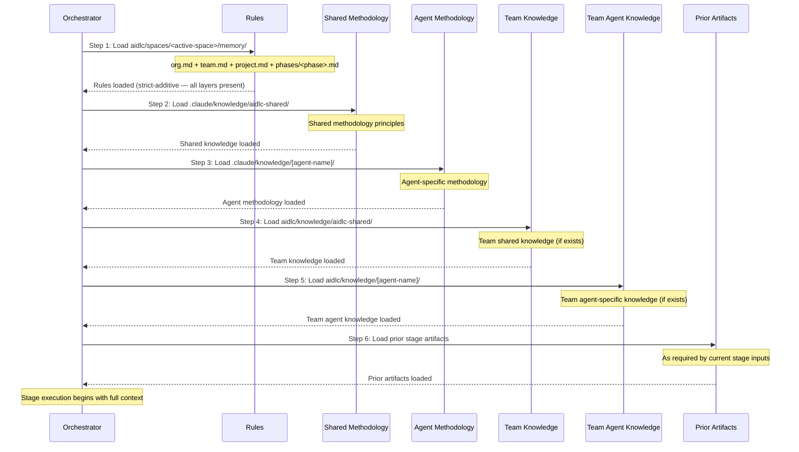

# ナレッジシステム

この章は二層のナレッジアーキテクチャです。方法論ナレッジがフレームワークにどう同梱されるか、チームナレッジがプロジェクトごとにどう管理されるか、6 段の読み込み順、テンプレート、ナレッジの足し方です。

---

## Two-Tier Architecture {#two-tier-architecture}

AI-DLC は、フレームワークの方法論とチームの寄せを分ける二層のナレッジシステムです:

**Tier 1: 方法論ナレッジ**（`.claude/knowledge/`） — フレームワーク同梱。共有原則とエージェントごとの方法論参照。フレームワークのアップグレードで更新。ワークフロー実行中は読み取り専用。

**Tier 2: チームナレッジ**（アクティブスペース — `aidlc/knowledge/`。`aidlc/spaces/<space>/knowledge/` の略） — 利用者が管理。会社固有の標準、方針、約束。スペースの `memory/`、`codekb/`、`intents/` の兄弟なので、そのスペースの全インテントで積み上がる。自由形式。ブートストラップ時は空。エンジンは最初の `/aidlc` で空の `aidlc/knowledge/` ディレクトリを作り、中身は種をまきません。固定のファイル集合はありません。

### Tier 1 Structure {#tier-1-structure}

```
.claude/knowledge/
+-- aidlc-shared/
|   +-- ai-dlc-principles.md       # Core methodology principles
|   +-- verification.md            # Phase boundary verification rules
|   +-- brownfield.md              # Brownfield safeguards
|   +-- audit-format.md            # 91-event audit taxonomy
|   +-- knowledge-readme-template.md  # Optional README template a team can copy into Tier 2
|   +-- state-template.md          # State file contract
+-- aidlc-product-agent/
|   +-- requirements-guide.md
|   +-- product-guide.md
|   +-- functional-design-guide.md
|   +-- requirements-elicitation.md
|   +-- prioritization-frameworks.md
|   +-- user-story-patterns.md
|   +-- market-research-methods.md
+-- aidlc-architect-agent/
|   +-- architecture-guide.md
|   +-- nfr-design-guide.md
|   +-- ddd-patterns.md
|   +-- architecture-patterns.md
|   +-- nfr-design-patterns.md
|   +-- adr-template.md
+-- aidlc-developer-agent/
|   +-- code-analysis-guide.md
|   +-- code-generation-guide.md
|   +-- code-generation-patterns.md
|   +-- api-design-guide.md
|   +-- data-modelling-patterns.md
|   +-- re-artifacts.md
+-- [... 8 more agent knowledge dirs]
```

### Tier 2 Structure {#tier-2-structure}

ブートストラップ時は空です。エンジンは裸の `aidlc/knowledge/` ディレクトリだけを作り、中には何も置きません — README も、エージェントごとのサブディレクトリもありません。下の `aidlc-shared/` とエージェントごとのディレクトリは、エージェントのペルソナが見る約束です。チームは中身があるものだけ作ります。

```
aidlc/knowledge/                    # empty at bootstrap; team-created subdirs
+-- aidlc-shared/                   # optional — loaded by every agent if present
|   +-- (user-added files)
+-- aidlc-product-agent/            # optional — loaded when that agent is active
|   +-- (user-added files)
+-- [... a directory per agent the team chooses to populate]
```

## DocumentKB Derived Catalog {#documentkb-derived-catalog}

DocumentKB は、Tier 2 ナレッジルートの下にある、スペース単位の派生カタログです:

```
aidlc/spaces/<space>/knowledge/
+-- documents/       # user-owned originals
+-- documentkb/      # tool-owned derived catalog
    +-- index.json
    +-- <document-id>/
        +-- metadata.json
        +-- content.md
        +-- summary.md    # present only once `knowledge summarize` has run
```

`aidlc-knowledge.ts` はカタログ変更を `documentkb/.journal/<transaction-id>/` の下にステージし、ワークスペースの監査ロックを持ったままコミットします。`documents/` の原本は、フレームワークが動かしたり消したりしません。抽出した本文と要約はリビジョンに結び、信頼しないデータとして扱います。`summarize <id> --text-file <path> --source-revision <sha256>` は、道具自身は決して生成しない LLM 執筆の要約文を残します。`source_revision` が行のダイジェストと一致しなくなった要約は、抽出と同じく `invalidated` と報告され、出されません。`list` または `show` が出すタグは、顧客の中身から LLM が書いた可能性もあるので、インラインの信頼しないデータの注を付けます。

文書ごとの `metadata.json` は、失われた `index.json` を立て直すのに要る行の同一性とソース事実を複製します。それが復旧の境界です。残った metadata レコードが ID と tombstone を戻します。`documentkb/` ツリー全体を消すと、立て直しの源が無くなり、復旧できません。

文書の出自は、それが説明するカタログ書き込みのあと、監査最後でスペース単位のシャード `aidlc/spaces/<space>/intents/audit/` へ出ます。DocumentKB の復旧と `--doctor --export` はそのシャードを明示的に読みます。通常のワークフロー権限の読み手は、アクティブインテントの監査シャードに範囲したままです。順序の例外と復旧の意味は [State Machine](12-state-machine.md#audit-last-for-derived-catalogs-document_indexed-document_updated-document_removed) です。

スキーマと検証の契約は `core/tools/aidlc-documentkb-schema.ts` が持ち、コマンドとトランザクション論理は `core/tools/aidlc-knowledge.ts` が持ちます。

---

## 6-Step Knowledge Loading Order {#6-step-knowledge-loading-order}

各ステージは、厳密な 6 段でナレッジを読みます。先に解決済みルール集合、それから共有方法論、エージェント固有の方法論、チームの寄せ、最後に上流ステージの成果物です。



| Step | Source | Tier | Managed By | Loaded |
|------|--------|------|-----------|--------|
| 1 | `aidlc/spaces/<active-space>/memory/` | -- | フレームワーク + 自己学習 | 最初 |
| 2 | `.claude/knowledge/aidlc-shared/` | 1 | フレームワーク | 早い |
| 3 | `.claude/knowledge/[agent]/` | 1 | フレームワーク | 早い |
| 4 | `aidlc/knowledge/aidlc-shared/` | 2 | チーム | 中盤 |
| 5 | `aidlc/knowledge/[agent]/` | 2 | チーム | 中盤 |
| 6 | 上流ステージの成果物 | -- | 動的 | 最後 |

> **Note:** 段 1–5 は `stage-protocol.md` 第 5 節が定義するエージェントナレッジの読み込みです。段 6（上流ステージの成果物）は、オーケストレータが実行時に足すコンテキストであり、ファイル読み込みの段ではありません。

### What Each Layer Contributes {#what-each-layer-contributes}

- ルール（段 1）が最初に載り、厳格加算の 5 層鎖（org → team → project → phase → stage）で解決されます — 当たるルールは全部コンテキストにあり、広い層は上書きされず、足されるだけです。[Rule System](08-rule-system.md)。
- フレームワーク方法論（段 2–3）がベースラインの振る舞いを与えます。
- チームナレッジ（段 4–5）が組織固有の文脈を足します。
- 上流成果物（段 6）がワークフロー固有の文脈を与えます。

---

## Template System {#template-system}

### Knowledge README Template {#knowledge-readme-template}

`.claude/knowledge/aidlc-shared/knowledge-readme-template.md` は、チームが Tier 2 ディレクトリへコピーして文書化できる任意の README テンプレートを同梱します。エンジンは足場も種まきもしません — スペース単位の `aidlc/knowledge/` ディレクトリは空で作られ、チームが好きなものを足します。テンプレートが説明すること:

- そのエージェント向けに足すファイルの種類
- よくある寄せファイルの例
- ファイルの載り方（エージェントが起動すると自動）
- 特別な命名規則は要らない — どの `.md` も載る

### State Template {#state-template}

エンジンは `.claude/knowledge/aidlc-shared/state-template.md` の契約に従って `aidlc-state.md` を生成します。テンプレートは必須の見出しとフィールドを定義します。具体的な Stage Progress 行は、コンパイル済みステージグラフとスコープ格子から出され、テンプレートに手で列挙しません。

---

## Adding Team Knowledge {#adding-team-knowledge}

会社固有のファイルをチームナレッジディレクトリへ足します:

```bash
# Team-wide standards (loaded by all agents)
aidlc/knowledge/aidlc-shared/company-coding-standards.md
aidlc/knowledge/aidlc-shared/company-architecture-principles.md

# Agent-specific standards (loaded only when that agent is active)
aidlc/knowledge/aidlc-architect-agent/company-architecture-patterns.md
aidlc/knowledge/aidlc-devsecops-agent/company-security-policy.md
aidlc/knowledge/aidlc-developer-agent/company-coding-conventions.md
aidlc/knowledge/aidlc-quality-agent/company-testing-standards.md
```

ファイルはエージェントが起動すると自動で載ります（読み込み順の段 4–5）。設定の変更は要りません。ディレクトリに置いたどの `.md` も載ります。

### Knowledge by Agent {#knowledge-by-agent}

> この表はスナップショットです。各エージェントの権威ある `display_name` + `examples` は、`core/agents/<slug>-agent.md` のエージェント frontmatter にあり、`core/tools/aidlc-lib.ts` の `loadAgents()` 経由でプログラムから出ます。新しいエージェントは先にそちらへ足し、同じ PR でこの表を更新してください。

| Directory | Purpose | Example Files |
|-----------|---------|---------------|
| `aidlc-shared/` | チーム全体の標準 | `coding-standards.md`、`api-conventions.md` |
| `aidlc-product-agent/` | プロダクト文脈 | `roadmap.md`、`personas.md` |
| `aidlc-design-agent/` | UX/UI 指針 | `design-system.md`、`accessibility.md` |
| `aidlc-delivery-agent/` | PM の約束 | `sprint-cadence.md`、`definition-of-done.md` |
| `aidlc-architect-agent/` | アーキテクチャ判断 | `tech-stack.md`、`infrastructure-preferences.md` |
| `aidlc-developer-agent/` | コーディングパターン | `db-conventions.md`、`error-handling.md` |
| `aidlc-quality-agent/` | テスト標準 | `test-strategy.md`、`coverage-requirements.md` |
| `aidlc-devsecops-agent/` | セキュリティ方針 | `security-baseline.md`、`compliance-rules.md` |
| `aidlc-aws-platform-agent/` | クラウド文脈 | `account-structure.md`、`service-limits.md` |
| `aidlc-compliance-agent/` | コンプライアンス規則 | `data-governance.md`、`audit-requirements.md` |
| `aidlc-pipeline-deploy-agent/` | CI/CD 標準 | `pipeline-standards.md`、`deployment-gates.md` |
| `aidlc-operations-agent/` | Ops ランブック | `monitoring.md`、`incident-response.md` |

---

## Cross-References {#cross-references}

- [Architecture](01-architecture.md) — 5 層模型のナレッジ層
- [Agent System](05-agent-system.md) — エージェント frontmatter と設定
- [Stage Protocol](04-stage-protocol.md) — エージェントペルソナ読み込みの節
- [Hooks and Tools](06-hooks-and-tools.md) — audit-format.md の分類（共有ナレッジに同梱）
