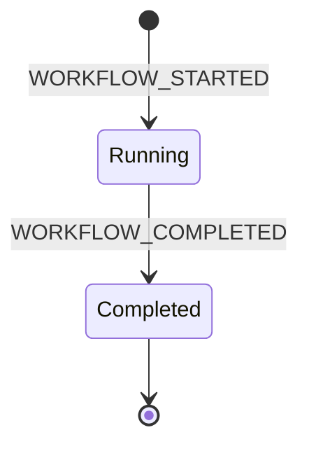
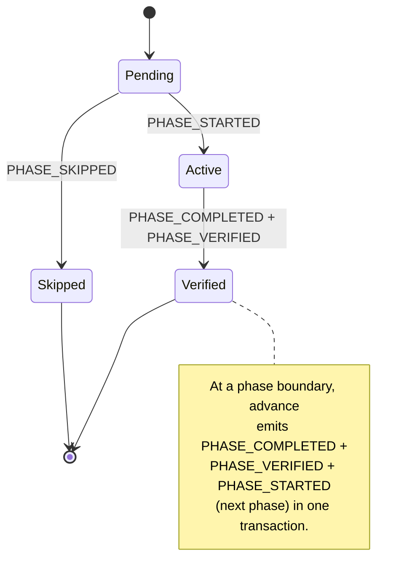
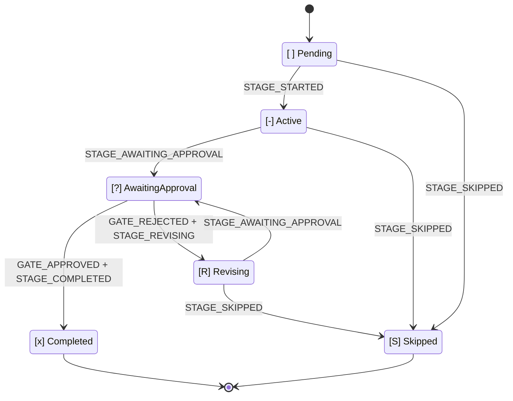

# 状態機械

この章は、AI-DLC の状態機械、監査イベントの分類、そして両者をつなぐ規則 — **状態遷移には、ツールが所有する発行元がちょうど一つある** — の正本です。表とコードの同期は、ドリフトテスト `tests/integration/t48-audit-event-emitters.test.ts` が強制します。文書とコードが食い違えば t48 が落ちます。

AI-DLC を動かす入れ子の状態機械は三つです。**ワークフロー**、**フェーズ**、**ステージ**。四つ目として独立した流れが、Claude Code のフックが出す **セッション** イベントを記録します。四つの流れはインテントの監査証跡（レコードディレクトリの `audit/` シャード。`<record>/` = `aidlc/spaces/<active-space>/intents/<YYMMDD>-<label>/`）を共有しますが、所有するコード経路は別です。別の関心として読み、タイムラインが互い違いに重なることだけ覚えてください。

> **北極星の不変条件:** TypeScript が決定論的な帳簿を持ち、LLM が判断を持つ。監査の発行はすべてツールかフックから出るので、発行経路に LLM の散文は入りません。MD ファイルを読んで `aidlc-audit.ts append <EVENT>` が散文の手順として出てきたら、それはバグです。
>
> **監査先行の原子性:** ツールは状態を変える**前に**監査行を出します。監査の発行が失敗したら、状態に触る前に throw します。だから `audit.md` と状態ファイルは食い違いません。失敗の型と、二つの例外 — 意図の監査（`WORKTREE_*`、`AUDIT_*`、`MERGE_DISPATCH_INVOKED`）と、監査**後**の DocumentKB カタログイベント（成果物が導出で、作り直せる）— は、章末の [「監査先行の原子性」](#audit-first-atomicity) にあります。

---

## なぜ状態機械が三つあるか

ワークフローはフェーズを通って完了し、フェーズはスコープ内のステージを通って完了し、ステージは承認ゲートが閉じたときに完了します。層ごとに決めることは違います。

- **ワークフロー** — 全体の仕事は走っているか、終わったか。
- **フェーズ** — このライフサイクルフェーズは進行中か、検証済みか、スコープが外したからスキップか。
- **ステージ** — 作業中か、人待ちか、差し戻し後の改訂中か、完了か。

一つの状態フィールドに潰すと、これらの判断が混ざります。分けると `/aidlc --status` は「このワークフローを止めているのは何か」を一読で答えられます。ワークフロー `Running`、フェーズ `Active`、ステージ `[?]` → 「\<stage\> の承認待ち」。

---

## ワークフロー機械



<!-- Text fallback: initial state transitions to Running on WORKFLOW_STARTED; Running transitions to Completed on WORKFLOW_COMPLETED; Completed is terminal. -->

**状態値:** `Running`、`Completed`。

ワークフローは最初のインテント作成（`aidlc-utility intent-create`。最初の `/aidlc` で自動、または `/aidlc-init`）で始まり、スコープ内最後のステージの承認ゲートが閉じたときに終わります。`Paused` も `Waiting for Approval` もありません。承認はステージの関心、一時停止に UX はありません。

ワークフローの `Running` は Claude Code のセッションをまたいで残ります。月曜に始めてセッションを止め、火曜に再開しても、ワークフローはまだ `Running` です。終わったのは*セッション*で、新しいセッションが始まっただけです。

| 遷移 | 引き金 | 発行元 |
|---|---|---|
| `[*] -> Running` | `aidlc-utility intent-create` | `tools/aidlc-utility.ts` |
| `Running -> Completed` | 最終ステージの結果が `aidlc-orchestrate.ts report` 経由で報告される | `tools/aidlc-state.ts`（内部発行） |

---

## フェーズ機械



<!-- Text fallback: initial state transitions to Pending; Pending transitions to Active on PHASE_STARTED; Pending transitions to Skipped on PHASE_SKIPPED; Active transitions to Verified on PHASE_COMPLETED + PHASE_VERIFIED. At a phase boundary, advance emits PHASE_COMPLETED + PHASE_VERIFIED + PHASE_STARTED (next phase) atomically, chaining Verified back to the next phase's Pending-to-Active transition. -->

**状態値:** `Pending`、`Active`、`Verified`、`Skipped`。

フェーズ状態は `aidlc-state.md` の `## Phase Progress` にあります。インテント作成がこの節を種まきします。`Initialization` は `Verified`（作成が init ステージをすべて終えてから引き渡す）、最初の post-init ステージのフェーズは `Active`、以降のフェーズはスコープが EXECUTE ステージを残さなければ `Skipped`（`PHASE_SKIPPED` 監査行がフェーズごとに 1 本）、そうでなければ `Pending`。フェーズ完了は境界で `PHASE_COMPLETED` と `PHASE_VERIFIED` を両方出し、次のフェーズへ `PHASE_STARTED` を出し、行の反転は同じ状態書き込みです。この節は表示専用です。ルーティングは `Lifecycle Phase` と Stage Progress のチェックボックスを読み、`/aidlc --status` のフェーズブロックは都度再計算します。

| 遷移 | 引き金 | 発行元 |
|---|---|---|
| 種まき（`Verified` / `Active` / `Pending` / `Skipped`） | `aidlc-utility intent-create` | `tools/aidlc-utility.ts` |
| `Active -> Verified` | フェーズ境界でのステージ完了 / スキップが `aidlc-orchestrate.ts` 経由で報告される; 前方の `aidlc-jump execute` | `tools/aidlc-state.ts`（内部発行）、`tools/aidlc-jump.ts` |
| `Pending -> Active`（境界） | 報告された結果のあとエンジンがルーティングする、または `aidlc-jump execute` | `tools/aidlc-state.ts`（内部発行）、`tools/aidlc-jump.ts` |
| `Pending -> Skipped`（飛び越え） | 前方の `aidlc-jump execute` がフェーズ全体を越える | `tools/aidlc-jump.ts` |
| `Verified/Active -> Pending` リセット | 後方の `aidlc-jump execute`（EXECUTE ステージを持つフェーズをリセット） | `tools/aidlc-jump.ts` |
| `Pending <-> Skipped` 再導出 | `aidlc-utility scope-change` / `recompose`（未到達の行だけ） | `tools/aidlc-utility.ts` |

init → post-init の引き渡しでは、`aidlc-utility intent-create` 自身が最後の init ステージのあと `PHASE_COMPLETED + PHASE_VERIFIED + PHASE_STARTED + STAGE_STARTED` を出します。作成と最初の `advance` のあいだで監査が黙らないようにです。

---

## ステージ機械



<!-- Text fallback: [ ] Pending transitions to [-] Active on STAGE_STARTED. [-] Active transitions to [?] AwaitingApproval on STAGE_AWAITING_APPROVAL. [?] AwaitingApproval transitions to [x] Completed on GATE_APPROVED + STAGE_COMPLETED, or to [R] Revising on GATE_REJECTED + STAGE_REVISING. [R] Revising transitions back to [?] AwaitingApproval on STAGE_AWAITING_APPROVAL (re-entry). Any of Pending / Active / Revising can transition to [S] Skipped via STAGE_SKIPPED. -->

**チェックボックス凡例（`aidlc-state.md` 内）:**

| チェックボックス | 状態 | 意味 |
|---|---|---|
| `[ ]` | `Pending` | 未着手 |
| `[-]` | `Active` | 進行中 |
| `[?]` | `AwaitingApproval` | ステージ作業は終わり、ゲート開放 — 止めているのは人 |
| `[R]` | `Revising` | 人がゲートを差し戻した — 再入場の前にステージを直している |
| `[x]` | `Completed` | 承認済みで完了 |
| `[S]` | `Skipped` | スコープ外、ジャンプでスキップ、または途中で切った |

`[?]` と `[R]` は、どちらも `[-]` に見える二つの状況を分けます。再開時、`[R]` はコンダクターに、ゲートへ入れ直す前に前回の成果物とフィードバックを出せ、と伝えます。ステージを最初からやり直させません。

| 遷移 | 引き金 | 発行元 |
|---|---|---|
| `Pending → Active` | 前回報告された結果のあとエンジンがルーティングする | `tools/aidlc-state.ts`（内部発行） |
| `Active → AwaitingApproval` | `aidlc-orchestrate.ts report --stage <slug> --result awaiting-approval`; レビュアー付きステージは、ゲートを開く前に新しい終端レシートが要る | `tools/aidlc-state.ts`（内部発行） |
| `AwaitingApproval → Completed` | `aidlc-orchestrate.ts report --stage <slug> --result approved --user-input "<exact choice>"` | `tools/aidlc-state.ts`（内部発行） |
| `AwaitingApproval → Revising` | `aidlc-orchestrate.ts report --stage <slug> --result rejected --user-input <text>` | `tools/aidlc-state.ts`（内部発行） |
| `Active → Revising` | ゲート開放の復旧が要るときの、同じ差し戻し報告 | `tools/aidlc-state.ts`（内部発行） |
| `Revising → AwaitingApproval` | `aidlc-orchestrate.ts report --stage <slug> --result revised`; レビュアー付きステージは、ゲート再入場の前に差し戻し後の新しい終端レシートが要る | `tools/aidlc-state.ts`（内部発行） |
| `{Active,Revising} → Skipped` | `aidlc-orchestrate.ts report --stage <slug> --result skipped --reason <text>` | `tools/aidlc-state.ts`（内部の routed-skip 発行） |
| `Pending → Skipped` | スコープ合成、または `aidlc-jump execute` | `tools/aidlc-utility.ts`、`tools/aidlc-jump.ts` |

`approved` 報告がゲート後の遷移を全部持ちます。`GATE_APPROVED + STAGE_COMPLETED` を出し、次のスコープ内ステージへルーティングし、`STAGE_STARTED` と境界の `PHASE_*` を出します。スコープ内最後のステージでは `PHASE_COMPLETED + PHASE_VERIFIED + WORKFLOW_COMPLETED` を出し、Status=Completed にします。コンダクターは報告の前後で状態ライフサイクル動詞を呼びません。

**ルーティング付きスキップ。** `report --result skipped` は、メインワークフローで、空でない明示 `--stage` と `--reason` があり、指名ステージが `execution: CONDITIONAL` で、`Current Stage` と等しく、Active または Revising のときだけ受け付けます。正当なスキップは完了証拠を負わないので、成果物・ユニットごと・編成証拠のガードより先に走ります。エンジンは内部スキップ遷移をルーティング印付きで呼びます。トランザクションは `[S]` を保ち、`STAGE_SKIPPED` をちょうど一つ出し、`STAGE_COMPLETED` は決して出さず、次のステージを始める（境界イベントを含む）かワークフローを完了します。先のルーティングが失敗したら、復旧はスキップ印とカーソルを同じステージに残すので、スキップイベントを複製せずにルートを再試行できます。`report --single --result skipped` は拒否します。

**成果物ガード（issue #366）。** ステージを `[x]` にするどの報告結果も、完了前に決定論的な成果物検査を走らせます。ディスク上の作業証拠なしに完了印は付きません。`produces[]` を宣言したステージは、アクティブインテントのレコードディレクトリか、ユニットごとの Construction ディレクトリの下に、その成果物が少なくとも一つ要ります。codekb ステージはより厳しいです。登録されたリポジトリディレクトリはすべて、宣言した `produces[]` 一式を含まなければなりません。単発 / 未記録のインテントは、解決した codekb ディレクトリ 1 つを使います。`workspace_requires: true` は、`aidlc/` とハーネスディレクトリの外にソース作業の証拠も要求します。失敗したら何も書きません。任意出力は対象外です。`produces_kinds` では、kind が必須集合をゼロに刈ったユニットは成果物を負いません。当たるユニットは厳格なままです。迂回は `AIDLC_SKIP_ARTIFACT_GUARD=1`。同じスイッチはレビューロガーの必須出力存在検査も迂回します。無しなら、ユニットごとのステージのステージ単位レビューは、権威ある各ユニットの当たる必須出力をすべて要求します。書いた Unit DAG が無く、いまの試行がマージ済み Bolt 行を持つときは、ステージ単位レビューの指紋は、そのマージ済みユニットをちょうど列挙します。Bolt マージは主張ではなく証明です。`aidlc-bolt complete --merge` は状態と監査のマージの前に `BOLT_COMPLETED` を出すので、slug 付き（worktree）試行がマージ済みになるのは、後続の一致する `AUDIT_MERGED` レシートがメインへのマージ列を確認したときだけです。名前だけの、worktree なし Bolt の `BOLT_COMPLETED` は終端のままです。マージ証拠待ちの完了は開いた経路に残り、slug なし完了は slug 付き試行を閉じられず、後の断片掃除の `BOLT_FAILED` は確認済みマージを消しません。`AUDIT_MERGED` 自身にレビュアー権限はありません。別監査シャードの同時刻行が、レビュー依頼・判定・レシートを曖昧にしません。開いた Bolt は普通のステージ単位フォールバック経路に残ります。Unit 成果物がまだメインツリーの外にあるからです。その Bolt をマージすると指紋の領域が変わり、以前のステージ単位レシートは意図的に無効になります。正確な pending 序数を `--retry-pending` で結び直すまでです。ユニットごとのレシートフィルタは、開いたユニットとマージ済みユニットの両方を認識します。古い試行がマージ済みで新しい試行が開いているとき、ユニットは両方の集合に属せます。マージ済み所属がゲート要求とステージ単位指紋を駆動し、和集合がレシートフィルタを駆動します。

**レビュアーゲートガード（issue #551）。** レビュアー付きステージは、設定したレビュアーに新しい終端 `REVIEW_COMPLETED` レシートがあるまで、`gate-start` や `revise` で `AwaitingApproval` に入れません。同じレシートは 4 つの完了経路すべてでも必須です。すでに開いたゲートの再報告は、重複遷移を書かずにこれらのガードを再実行します。`Active` から直接報告した差し戻しは、`STAGE_AWAITING_APPROVAL` 行を捏造せず `Revising` へ移ります。別のガードを意図的に隔離する合成遷移テストは `AIDLC_SKIP_REVIEWER_GATE_GUARD=1` をセットしてよいです。この迂回はゲート開放にだけ効き、`approve`、`advance`、`finalize`、`complete-workflow` には決して効きません。隣の要約確認テスト迂回は `AIDLC_SKIP_SUMMARY_CONFIRMATION_GUARD=1` です。

**編成証拠ゲート。** `mob` またはサポート付き `subagent` ステージでは、宣言したサポートエージェントの寄与ファイル（`<stage>/contributions/<agent-slug>.md`）が無い、または先頭行の `**Collaborator:**` 身元印が無いあいだ、報告経路は `awaiting-approval`、`revised`、`approved` を拒否します。編成が実際に集まった決定論的な証明です。落ち着いた自律スウォームは免除です（ユニットごとの収束台帳が証拠）。`report --single` はステージ単位の証拠だけを見ます。`mode: pipeline` では、同じ報告結果と、完了する直接遷移のすべてが、リード / サポートの各リンクについて、いまの試行の順序付き `PIPELINE_LINK_COMPLETED` レシートを要求します。複数リポジトリのリバースエンジニアリングは、スキャンしたリポジトリごとに鎖が完走している必要があります。いまの試行のリポジトリ範囲 `ARTIFACT_REUSED` 行で `Decision=keep` なら、再利用したリポジトリは免除です。隔離行は `Workflow: single-stage:<slug>` を持ち、グラフが宣言した Reverse Engineering 成果物一式がまだ有効でストアが `CURRENT` のあいだだけ受け付けます。`modify` / `redo` 行では受け付けません。差し戻し、ジャンプ、後のステージ開始はメインワークフローの証拠をリセットし、隔離の `--single` リンク行はそれを満たしません。迂回は `AIDLC_DISABLE_ENSEMBLE_EVIDENCE=1`。正当に走ったステージの寄与ファイルや飛行中のリンクレシートが失われたときの復旧専用です。

**ソース鮮度とユニットごとの帰属（#629/#646/#662）。** `workspace_requires` ステージでは、どの終端レビューもワークスペース全体の `Source Fingerprint` を運びます。いちばん新しい現代の結びは、通常、4 つの完了経路すべての外側の、レビュー後変異の境界です。ユニットごとのレシートは `Unit Source Fingerprint` を足し、そのユニットの厳格な `source-manifest.json` の生バイトと、exact / directory クレームのいまの中身を結びます。レシートは新しいものから評価するので、新しい検証済み請求者が、意図した共有パスの古いレシートを守れます。exact / directory クレームの、覆われていない編集・削除・新パスは、所有ユニットだけを無効にし、そのユニットの有界な `stale-receipt` 復旧に入ります。

`WORKFLOW_STARTED`、`STAGE_JUMPED`、`workspace_requires` の `STAGE_STARTED` は、内容アドレスのソース一覧ベースラインを記録します。当たるユニットがすべて新しい現代の証拠を持ったあと、完了はベースラインといまの一覧を比べ、新しいクレームの和集合の外で変わったアプリケーションソースパスを拒否します。ユニット主体の Construction は常にワークフロー / ジャンプ境界を使います。ソース作業が遅い `STAGE_STARTED` より先に起きうるからです。境界や最新請求者を決める同時刻のシャード横断行は、シャードファイル名順を信じず fail-close します。

差し戻しはレビューと run-floor の会計をリセットしますが、その完了ベースラインは置き換えません。そうしないと、差し戻し時点にあった未クレームパスが次の試行に祖父入れされるからです。前回の試行に検証済み `SWARM_SOURCE_MERGED` 鎖があるとき、`GATE_REJECTED` は最終の `Prior Accepted Source Fingerprint` だけを運びます。次の試行の最初のソースマージはその集約から始めなければならず、完了は元のステージ入場ベースラインとの比較を続けます。

グローバル境界の和解は、狭い有界が一つだけです。未クレームのベースライン変化 — 追加、変更、削除 — が完全に戻されたとき、完了が進めるのは、実効ベースラインスナップショットが存在して有効で、当たるユニットがすべて新しい現代のユニット結びをまだ持ち、ベースラインからいまへの差分に未クレームパスがゼロのときだけです。一時的な未クレーム変化が消えたことの証明です。普通のレビュー後編集、古い / レガシーのユニット結び、欠けた証拠、残った未クレーム差分は、いままでどおりグローバル優先の拒否経路です。

指紋と正規のパスごとの一覧は、リポジトリメタデータと Git 実行ファイルの有無に依存しない、有界なファイルシステム歩き 1 回から来ます。普通のアプリケーションバイトと無視されたアプリケーションバイト、外部ソースシンボリックリンク先、ワークスペース屋根のファイルは結びの対象です。フレームワーク状態、exact センサーキャッシュ、VCS メタデータ、依存 / キャッシュディレクトリまたはシンボリックリンク、未登録の `build/`、`coverage/`、`dist/`、`logs/`、`target/`、`tmp/` ディレクトリまたはシンボリックリンクは、ソース境界の外です。

条件付き生成出力ディレクトリの下の本物のソース（バイナリや拡張子なしソースを含む）は、ルートの `.aidlc-source-paths.json` で宣言できます。

```json
{"version":1,"paths":["dist/worker.js","build/source"]}
```

登録パスはエンコーディングに関係なく内容で結び、正規一覧と自律スウォームの Source Commit に入ります。絶対パス、横断、フレームワーク、センサーキャッシュ、依存 / キャッシュパスは拒否します。欠けた登録リポジトリは明示マーカーを寄与します。読めない、不安定、予算超過、壊れた境界は `unbindable` のままで fail-close します。

移行は意図的です。ベースラインの無いアップグレード前ワークフローは未クレーム検査を飛ばし、フィールド無しのユニットごとレシートは #629 のグローバル方針を保ちます。存在するが `unbindable`、欠けた、壊れた現代ベースライン / ユニットスナップショットは fail-close します。`AIDLC_SKIP_SOURCE_FRESHNESS=1` はグローバルとユニットごとの両方を迂回します。マニフェスト無し / 無効のレシートは `Unit Source Binding Bypass: true` を明示記録するので、完了時にもう一度スイッチが要ります。現代の Bolt では、finalize は落ち着いたスウォームのステージ単位免除が効く前に、証跡した base-to-worktree 足跡がレビュー済みマニフェストクレームの部分集合であることも検証します。

スウォーム足跡の検証と不変 Source Commit の作成は、同じ境界を使います。clean-filter の生バイト置換は、ファイルシステムに含まれた exact の通常パスに限るので、除外した生成ファイルやフレームワークファイルは整形後に再入場できません。新しいサブモジュールの復旧は、`finalize` 呼び出し全体で累積期限 30 秒と証明上限 32 を共有し、加えてコマンドごと、ref 数、refspec サイズ、再帰、実体化したチェックアウトの上限があります。`AIDLC_SKIP_SOURCE_FRESHNESS=1` は検査を無効にします。迂回した finalize は `Source Freshness Bypass: true` を記録し、マージは同じスイッチを繰り返さなければなりません。

**ゲート改訂のバックストップ。** コンダクターが開いたゲートで、差し戻しを先に報告せず成果物を直したとき、`approved` 報告は、ゲート後の人のターンのあとに成果物書きがあった監査証拠があるなら、欠けた `GATE_REJECTED` + `STAGE_REVISING` 対を完了前に和解します。埋め戻した行は `Recovered: true` を運びます。人のターンより前のレビュアー書きは数えません。レビュアー付きステージは、その復旧差し戻しのあと `[R]` を保ち、ゲートが再開できる前に新しいレビューと通常の `revised` 報告が要ります。迂回は `AIDLC_SKIP_REVISION_BACKSTOP=1`。

**Park（issue #365/#367）。** `aidlc-orchestrate park` はステージを進めずに `Parked` / `Parked At Stage` の実行時印を書きます（`aidlc-state.ts park` 経由。`WORKFLOW_PARKED` を出す）。続く素の `next` は終端の `parked` ディレクティブを再発行し、Stop フックがターンを終わらせるので、長いワークフローは残りステージをゴム印して `done` にせず、セッションをまたいで止められます。`/aidlc --resume` は印を消してから続けます（`unpark` が `WORKFLOW_UNPARKED` を出す）。無人の自律 Construction 実行（`Construction Autonomy Mode: autonomous`）は park を拒否します。ツールも Stop フックの `parked` 許可も自律モードでは断り、再開する人がいないままループが動き続けます。

### 改訂ループ

```
report awaiting-approval  →  [?] AwaitingApproval
          ↘ report rejected  →  [R] Revising  (Revision Count += 1)
                   ↓ report revised
                   [?] AwaitingApproval
                   ↘ report approved  →  [x] Completed
```

`Revision Count` は状態ファイルにあり、差し戻し報告のたびに増えます。コンダクターはこれで改訂ループの逃げ道を検出します（既定は 3 周でスキップを出す）。

改訂が `produces[]` 成果物を変え、ディレクティブにレビュアーが付いているステージでは、コンダクターは `revised` を報告する前に `stage-protocol-reviewer.md` §12a を再実行します（ステージプロトコル Part 0）。エンジンは `revised` 報告を受けてゲートを再開する前に、新しい終端レシートを検証します。

---

## セッションの流れ（フック所有、独立）

セッションイベントは Claude Code のフックが出します。AI-DLC ツールではありません。セッションは Claude Code の 1 会話、ワークフローは長く残るディレクトリ状態です。関係は多対多です。1 ワークフローが複数セッションにまたがり、1 セッションが複数ワークフローに触れられます。だから流れは設計どおり独立です。

| イベント | 発行元 | 引き金 |
|---|---|---|
| `SESSION_STARTED` | `hooks/aidlc-session-start.ts` | `SessionStart` で `source=startup` または `clear` |
| `SESSION_RESUMED` | `hooks/aidlc-session-start.ts` | `SessionStart` で `source=resume` |
| `SESSION_COMPACTED` | `hooks/aidlc-validate-state.ts` | `PreCompact` — コンパクション時点で出るので確実に取れます |
| `SESSION_ENDED` | `hooks/aidlc-session-end.ts` | `SessionEnd` |

セッションフックは発行前に、アクティブインテントの `aidlc-state.md`（`aidlc/spaces/<space>/intents/<YYMMDD>-<label>/` の下）を見ます。そのファイルが無い（cwd にアクティブな AI-DLC ワークフローが無い）ときは、どの監査ログにも書かず静かに終わります。セッションイベントはアクティブなワークフローのタイムラインに注釈を付けるためです。ワークフローの無いディレクトリのセッションには注釈先がありません。

### コンパクションの認識

`aidlc-state.ts resume` は監査の末尾を走査し、最新の `SESSION_COMPACTED` を探します。そのあとにステージ活動（`STAGE_STARTED`、`STAGE_COMPLETED`、`GATE_APPROVED`、`SESSION_RESUMED`、`RECOVERY_COMPLETED`）が無ければ、resume は `compaction_pending: true` を返し、コンダクターは進む前に三択（続ける / 見直す / やり直す）を出します。`RECOVERY_COMPLETED` は、人が選んだあと `acknowledge-compaction` が出します。活動ゲートを満たすので、以後のコンパクションは新しい境界を検出します。

---

## 監査イベントの分類

**91 イベント**を、下では 19 カテゴリに分けます（正本の `audit-format.md` レジストリは同じ 91 を 22 に割ります。分け方は見せ方で、イベント集合が不変です）。各イベントの発行元はツールかフックがちょうど一つです。例外は次リリース向けに先行登録したイベントで、Emitter 欄が `Reserved (v0.4.0 PR N)`、`Reserved (v0.5.0 PR N)`、`Reserved (v0.6.0 PR N)` と読むものです。ドリフトテストの前方検査は、消費 PR が発行元を出荷するまでこれらを飛ばします。ドリフトテスト `tests/integration/t48-audit-event-emitters.test.ts` が、この章の表とコードの前方 / 後方 / 三次 / 対 / MD-MD 一致を強制します。

### ワークフローの寿命

| イベント | 発行元 | 注記 |
|---|---|---|
| `WORKFLOW_STARTED` | `tools/aidlc-utility.ts` | どのインテント作成でも必須の最初のイベント |
| `WORKFLOW_COMPLETED` | `tools/aidlc-state.ts` |  |
| `WORKFLOW_PARKED` | `tools/aidlc-state.ts` | `park` — ワークフローを途中で止め、後のセッション向け。ステージは進まない |
| `WORKFLOW_UNPARKED` | `tools/aidlc-state.ts` | `unpark` — 明示 `--resume` 再入場で park 印を消す |

### フェーズの寿命

| イベント | 発行元 | 注記 |
|---|---|---|
| `PHASE_STARTED` | `tools/aidlc-utility.ts`、`tools/aidlc-state.ts`、`tools/aidlc-jump.ts` | 最初の発火は init。以後はステージツールのフェーズ境界 |
| `PHASE_COMPLETED` | `tools/aidlc-utility.ts`、`tools/aidlc-state.ts`、`tools/aidlc-jump.ts` | どの境界でも `PHASE_VERIFIED` と対 |
| `PHASE_VERIFIED` | `tools/aidlc-utility.ts`、`tools/aidlc-state.ts`、`tools/aidlc-jump.ts` | 常に `PHASE_COMPLETED` と対 |
| `PHASE_SKIPPED` | `tools/aidlc-utility.ts` | スコープ外フェーズにつき 1 本。インテント作成時に出す |

### ステージの寿命

| イベント | 発行元 | 注記 |
|---|---|---|
| `STAGE_STARTED` | `tools/aidlc-state.ts`、`tools/aidlc-utility.ts`、`tools/aidlc-jump.ts` | 内部ルートが `[ ]` → `[-]` にする |
| `STAGE_AWAITING_APPROVAL` | `tools/aidlc-state.ts` | `report --result awaiting-approval` / `revised` の内部発行。復旧行は `Recovered=true`。認可された blocking センサーオーバーライドはセンサー id、任意の詳細パス、評価理由を記録する |
| `STAGE_COMPLETED` | `tools/aidlc-state.ts`、`tools/aidlc-utility.ts` | 完了 / 承認報告の内部発行。スキップ報告とは決して対にしない |
| `STAGE_REVISING` | `tools/aidlc-state.ts` | 差し戻し報告のあと `GATE_REJECTED` と対の内部発行 |
| `STAGE_SKIPPED` | `tools/aidlc-state.ts`、`tools/aidlc-jump.ts` | `[S]` 遷移につきちょうど 1 本。メインワークフローの報告経路は先へ原子的にルーティングする |
| `STAGE_JUMPED` | `tools/aidlc-jump.ts` | `--stage` / `--phase` ジャンプの行き先 slug を記録。後方ジャンプは、変わった具体の上流成果物パスと、リセットで無効になった下流の成果物 / レビューパスも結ぶ |

### ゲート判断

| イベント | 発行元 | 注記 |
|---|---|---|
| `GATE_APPROVED` | `tools/aidlc-state.ts`、`tools/aidlc-unit.ts gate` | `--user-input` が選んだ文言そのものを取る。レビュアー付きゲートでは、同じ原子行がいま開いている所見すべての内容アドレス `Accepted risk` 処分を格納する。ユニットマージゲートは Pinned OID、Attempt Generation、Strategy、Target branch も結ぶ |
| `GATE_REJECTED` | `tools/aidlc-state.ts`、`tools/aidlc-unit.ts gate` | `--feedback` が差し戻し理由を取る。明示 `--reject-finding <review-artifact>#R-NN=<reason>` は内容アドレスの `Rejected: <reason>` 処分を格納する。一般の改訂フィードバックは所見を却下しない。ユニットマージゲートは同じピン済みトランザクションフィールドを結ぶ |

`Unit Ownership: team` の下では、これらの行はさらに `Unit`、`Gate Scope`、`Gate Stages` を運びます。ステージごとの承認はその `(stage, Unit)` だけを確定し、ユニット末尾の承認は Unit 鎖を確定します。Unit 付き差し戻しは、その Unit のライフサイクルとレビューレシートだけを床にします（ユニット末尾なら全 Gate Stages）。Unit 無しのレガシー行はステージ全体の振る舞いを保ちます。

### 人のやりとり

| イベント | 発行元 | 注記 |
|---|---|---|
| `DECISION_RECORDED` | `tools/aidlc-log.ts` | ゲート以外の `AskUserQuestion` の前に出る。選択肢を取る |
| `QUESTION_ANSWERED` | `tools/aidlc-log.ts` | ゲート以外の質問応答のあと。承認の選択は `report` が持つライフサイクルイベント |
| `SUMMARY_CONFIRMATION_RECORDED` | `tools/aidlc-log.ts` | 人が裏付けた統合要約レシート。新しい行は `Hash Scope: confirmed-content-v1` を運び、前文と見える Q\<n\> / フィードバック節（仮定判断後のフォローアップ質問を含む）の正規順を保つ。要約後の `Assumption Confirmation` 節とその中身はちょうど一つ除外する。同名の要約前節はハッシュ対象のまま。要約後のほかの見える Markdown または生 HTML 見出しは fail-close。ステージ固有の要約前見出しは有効のまま。スコープ無しレシートはレガシーのファイル全体検証を保ち、許可された追記のあと再確認が要る。公開監査追記からは予約済み |
| `PLAN_APPROVAL_RECORDED` | `tools/aidlc-log.ts` | 人が裏付けた Code Generation 計画レシート。インテント、ステージまたは Unit 対象、ディレクティブ世代、run floor、source floor、指紋、プロンプト、セッション応答、質問ダイジェストに結ぶ。保護された実行時状態が正。この行は出自だけ |
| `REVIEW_REQUESTED` | `tools/aidlc-log.ts` | コンダクターが `stage-protocol-reviewer.md` §12a のレビュアーを出すときに発火。ステージ必須の `review_artifact` スカラーが Markdown 追記の所有者を明示選択する。プラグインが足した出力と produces 順は変えられない。新しい `--unit` 依頼は、権威ある DAG のメンバか、いまの no-DAG 試行で一致する開いた / マージ確認済みのツール所有 Bolt 試行が証明した Unit を指名しなければならない。`AUDIT_MERGED` マージ証拠待ちの完了は、履歴無し Unit と同様に拒否する。安定したファイル身元スナップショット 1 つが、宣言した成果物すべて、正確な所有者バイト境界、`workspace_requires` ステージの依頼時ワークスペースソースを記録する。以前の付録があるとき、依頼は置換付録が正確に描かなければならない乱数 Review Challenge も記録して返す。stale-receipt 復旧は、成果物・ソース・両方のどれがスコープ付き書き込み停止を開いたかを記録するので、古い付録を外したあともその原因を戻すと窓が閉じる。`--retry-pending` は現代の結びがあるあと一度だけ受け付け、それらの成果物 / ソース身元とチャレンジを再利用する。有効なフィールドの薄いレガシー鎖（チャレンジ無しの pending 非空付録依頼を含む）は、歴史的な未結 Retry 印を含んでいても、完全成果物の正確な一致のあと `Upgrade: legacy-request` を一つ出してよい。その現代アップグレード行はリトライを消費し、新しいレビュアーディスパッチが要る。壊れた依頼行は無視するので、新しい依頼が序数を再利用できる |
| `REVIEW_COMPLETED` | `tools/aidlc-log.ts` | 一致する正のイテレーション依頼のあとだけ発火。一貫した成果物スナップショット 1 つが、依頼した接頭辞バイトとファイル身元をすべて保たなければならない。接尾辞全体は空白区切りと、一致する判定・Reviewer・Iteration 行をちょうど一つ含む終端 `## Review` H2 ちょうど一つ、依頼が出したときは一致する Request Challenge ちょうど一つでなければならない。Bun の Markdown パーサは、後続の Markdown または生 HTML の H1/H2、壊れた判定、衝突する描画所有フィールドを拒否する。フェンス / インラインコードと HTML コメント内のリテラル例は権限を持たず、list / blockquote / table 入れ物はトップレベル所有を作れない。依頼時と完了のソース指紋は Git 非依存の有界ファイルシステム身元、または安全に読めないときの `unbindable` を使い、一致しなければならない。当たるところではユニットごとの source-manifest 結びも一致しなければならない。壊れた完了行は pending 依頼を消費しない。`READY` は直ちに終端。advisory `NOT-READY` は通常フロー通過のあと終端。adversarial `NOT-READY` は `reviewer_max_iterations` でのみ終端。後の宣言出力またはソース書きで無効になった終端レシートは、別の復旧依頼を 1 回得る。どちらの復旧判定も終端で、二度目の無効化は人のリセットが要る。レガシーの等指紋レシートは読めるまま。ゲート開放とすべての完了経路は一致する終端レシートが要る。ユニットごとのステージは当たるユニットごとにレシート 1 本。マージ済み Bolt のある no-DAG ユニットごとステージは、新しいステージ単位レシート 1 本か、マージ済み全 Unit の新しいユニットごとレシートを受け付ける。失敗 / 破棄 Bolt は何も負わず、開いた Bolt は別のゲートブロックを足さない。マージ済み Unit が無ければ、Unit 無しのステージ単位レシートだけがフォールバックを満たす。自律 finalize はさらに、いまの成果物 / ソース結びと必須ファイルを要求する |
| `PIPELINE_LINK_COMPLETED` | `tools/aidlc-log.ts` | 宣言したパイプラインリンクが 1 本返ったあとに発火。`Stage`、`Link`、`Position k/N` を運ぶ。複数リポジトリ鎖は `Repo` も、隔離実行は `Workflow=single-stage:<slug>` も運ぶ。ツールはそのレシート範囲内の未宣言・重複・順不同リンクを拒否する。メインワークフローの gate-start、承認、advance、finalize、ワークフロー完了は隔離行を無視し、スキャンしたリポジトリのいまの試行リンクレシートをすべて要求する |

### ユニットの寿命（インラインのユニットごと Construction ステージ）

| イベント | 発行元 | 注記 |
|---|---|---|
| `UNIT_STARTED` | `tools/aidlc-state.ts` | `unit start` — エンジンがいまルーティングしている正確なステージ / Unit 対、権威ある DAG からの安全な Unit 識別子（安全なレガシー綴りを含む）、ほかに開いた Unit が無いこと |
| `UNIT_PAUSED` | `tools/aidlc-state.ts` | `unit pause` — `--reason` と `--next-action` が要る。エンジンは止めたユニットを先にルーティングし、明示再開まで hard-stop |
| `UNIT_RESUMED` | `tools/aidlc-state.ts` | `unit resume` — いま止まっているユニットだけ再開できる |
| `UNIT_COMPLETED` | `tools/aidlc-state.ts` | 直列の `unit complete` はアクティブユニットの必須成果物を検証する。ウェーブの `unit complete --wave` は、エンジンがそのエントリをまだ build-complete / review-settled として出していることを検証し、新しい Unit 日記エントリを決定論的マーカー付きで親日記へコピーし、レシートを最終成果物指紋に結び、単一アクティブチェックポイントを開かずにコミットする。ライフサイクル行はすべて、正確な境界イベント / 時刻 / 序数の `Run floor`（または fail-close のシャード横断曖昧トークン）を運ぶ。レシートモードは試行をまたいで有効のままなので、古い・変わった・曖昧・再開された・まだ fan-in していない Unit は、もう一度完了するまでゲートを塞ぐ |
| `UNIT_MERGED` | `tools/aidlc-state.ts` | メインがピン済み候補内容を着地させ、チームの監査シャードを受け取り、この Unit の導出行を折り込んだ。フィールドは行を Unit、オーナー、ピン済み候補 OID、マージコミット OID、試行世代に結ぶ |

チーム所有のユニット主体実行は、導出された `## Unit Progress` 表を状態に足します。エンジンはこれらのレシート、成果物、レビュー、Unit ゲート行、`UNIT_MERGED` レシートから、各 `next` で書き直します。正本ではなく、手で直したセルは無視します。ピン済みマージトランザクションまたは `UNIT_MERGED` レシートがあると、`merged` 列が、マージ結びの全行が着地するまでユニットごとブロックの確定を防ぎます。クレームだけのときは increment-2 投影のままで、この列はありません。

### スコープと設定

| イベント | 発行元 | 注記 |
|---|---|---|
| `SCOPE_DETECTED` | `tools/aidlc-utility.ts` | `detect-scope` サブコマンド。`Source` フィールドが出自を記録（freeform / keyword / env / cli） |
| `SCOPE_CHANGED` | `tools/aidlc-utility.ts` | アクティブワークフロー上の `scope-change` サブコマンド |
| `PLUGIN_SELECTION_CHANGED` | `tools/aidlc-utility.ts` | `select-plugins` の set モード。フィールド: `Previous Selection`、`New Selection` |
| `DEPTH_CHANGED` | `tools/aidlc-utility.ts` | `config set depth <value>` / `config-change --depth` |
| `TEST_STRATEGY_CHANGED` | `tools/aidlc-utility.ts` | `config set test-strategy <value>` / `config-change --test-strategy` |
| `UNIT_OWNERSHIP_SET` | `tools/aidlc-state.ts` | `set-unit-ownership team\|solo`。team はユニット主体が要る |
| `UNIT_GATE_RHYTHM_SET` | `tools/aidlc-state.ts` | `set-unit-gate-rhythm per-stage\|unit-end`。team モードのみ |
| `REVIEW_CLASS_CHANGED` | `tools/aidlc-utility.ts` | `config set review <value>` / `config-change --review` / 結合した `scope-change --review` が実行ごとのレビュー上書きをセットまたはクリアした |
| `RECOMPOSED` | `tools/aidlc-utility.ts` | `recompose` サブコマンド — 適応コンポーザーの飛行中計画の再形成（pending ステージ接尾辞が監査ロックの下で反転） |

### 成果物

| イベント | 発行元 | 注記 |
|---|---|---|
| `ARTIFACT_CREATED` | `hooks/aidlc-write-audit-log.ts` | 新規パスへの書き込み — `mtimeMs == birthtimeMs` の stat 検査で UPDATED と区別 |
| `ARTIFACT_UPDATED` | `hooks/aidlc-write-audit-log.ts` | 既存ファイルを上書きする Edit ツールまたは Write |
| `ARTIFACT_REUSED` | `tools/aidlc-state.ts` | `reuse-artifact` サブコマンド — keep / modify / redo 判断。任意の `Repo` が証拠を登録リポジトリ 1 つに範囲付け、任意の `--single` が開いた合成試行に結ぶ。ただしそのパイプライン免除を与えるのは、権威ある成果物一式が揃い、まだ `CURRENT` の隔離 Reverse Engineering ストアがある `keep` だけ |

### Construction ボルト

| イベント | 発行元 | 注記 |
|---|---|---|
| `BOLT_STARTED` | `tools/aidlc-bolt.ts` | 並行バッチ向けに CSV ボルト名を受け付ける。現代の `--worktree` 行は、worktree 作成時に証跡した不変 Base コミットと内容アドレスの raw 対応 Base Source Listing を伝播する |
| `BOLT_COMPLETED` | `tools/aidlc-bolt.ts` | 先行の `BOLT_STARTED` と対 |
| `BOLT_FAILED` | `tools/aidlc-bolt.ts`（`fail` + `abort`） | `--succeeded-siblings` が並行バッチの生存者を取る。`abort` は下位分類用に `Reason: aborted` フィールドを足す |
| `AUTONOMY_MODE_SET` | `tools/aidlc-bolt.ts` | `Construction Autonomy Mode` フィールドを原子的に更新。先にフィールド存在を検証（監査先行） |

### セッション

| イベント | 発行元 | 注記 |
|---|---|---|
| `SESSION_STARTED` | `hooks/aidlc-session-start.ts` | `source=startup` または `clear` |
| `SESSION_RESUMED` | `hooks/aidlc-session-start.ts` | `source=resume` |
| `SESSION_COMPACTED` | `hooks/aidlc-validate-state.ts` | PreCompact 時点で出す（次の SessionStart ではない）。重複を避ける |
| `SESSION_ENDED` | `hooks/aidlc-session-end.ts` | Claude Code からの `Reason` フィールドを含む |
| `HUMAN_TURN` | `hooks/aidlc-record-human-turn.ts`（+ ハーネスごとの prompt-submit アダプタ） | 観測した prompt-submit または answered-widget 継ぎ目につき 1 本。ドライバが `AIDLC_UNATTENDED=1` を宣言した場合を除く。承認 / インタビューゲートは、最後のゲート解決以降に 1 本要る。存在 / 鮮度の証拠であり、認証済み転写でも、後から呼び出し側が渡した判断文を人が書いた証明でもない |
| `SUBAGENT_COMPLETED` | `hooks/aidlc-log-subagent.ts` | SubagentStop フック経由でサブエージェント完了を記録 |
| `REVIEWER_SCOPE_BLOCKED` | `hooks/aidlc-reviewer-scope.ts` | ユニットごとのレビュアーのツール呼び出しが、兄弟ユニットの `construction/` パスへ手を伸ばしたとして拒否された（レビュアーモジュールの読み範囲境界）。拒否につき 1 行 |
| `REVIEW_FREEZE_BLOCKED` | `hooks/aidlc-review-freeze.ts` | ゲート前に新しい終端レビューレシート（有効クラス下の READY または終端 NOT-READY）を無効にするファイルツールまたはシェルの `produces[]` 書きが拒否された。拒否につき 1 行 |
| `PLAN_APPROVAL_BLOCKED` | `hooks/aidlc-plan-approval-guard.ts` | アクティブユニットまたはゼロ Unit ステージ対象に、いまの指紋付き計画、テスト指示、Testing Contract、明示承認、一致する worker-brief 印が無いため、コード生成の developer-agent ディスパッチまたはワークスペース変異が拒否された。拒否につき 1 行 |

### 診断とワークスペース

| イベント | 発行元 | 注記 |
|---|---|---|
| `HEALTH_CHECKED` | `tools/aidlc-utility.ts` | `--doctor` 実行 |
| `WORKSPACE_SCAFFOLDED` | `tools/aidlc-utility.ts` | init が新規ディレクトリ木を作った |
| `WORKSPACE_SCANNED` | `tools/aidlc-utility.ts` | ブラウンフィールドワークスペース検出が完了 |
| `WORKSPACE_INITIALISED` | `tools/aidlc-utility.ts` | 状態ファイルが実体化した |

### 文書

DocumentKB はスペース単位なので、インテント範囲の文書でも三つともスペース単位シャード 1 本に着地します。インテント UUID はイベントのフィールドであり、シャード選択子ではありません。

そのシャードは **`spaces/<space>/intents/audit/`** であり、`spaces/<space>/audit/` ではありません。`intents/` 区間は `intentsDir()` から継ぎます。スペース内のどのシャードもそこにあるからです。スペース単位シャードは、一段上のディレクトリではなく、インテントごとのレコードディレクトリの兄弟です。以前の版はこの行をより短いパスで書いていましたが、ディスク上にはありません。文書を onboard して書いたシャードを測った結果です。

ワークフロー権限の読み手は、解決したインテントのシャードだけを列挙します。スペース単位の出自が要る消費者は明示的に頼みます。`--doctor --export` がそうし、解決したインテントシャードの前にスペースシャードを読むので、ライフサイクル権限をインテント台帳の外へ広げずに文書イベントが見えます。

三つとも `tools/aidlc-knowledge.ts`（DocumentKB S1）が出荷します。イベントごとの発行動詞は各行にあります。`onboard`、`sync`、`associate`、`dissociate`、`rebind`、`summarize` がすべて発行します。

| イベント | 発行元 | 注記 |
|---|---|---|
| `DOCUMENT_INDEXED` | `tools/aidlc-knowledge.ts` | `onboard` と `sync` の新規文書枝から。顧客文書が DocumentKB に初めて入った。**監査後**（「導出カタログの監査後」参照）: カタログ書きがすべて成功したあとだけ出す |
| `DOCUMENT_UPDATED` | `tools/aidlc-knowledge.ts` | `associate`、`dissociate`、`rebind`、`summarize`（`Change: summarized`）、`onboard` の編集行枝、`sync` の移動 / 変更 / 再試行枝から。新しい版、再抽出、移動、要約公開、またはインテント関連の変更。通常の no-op は何も出さない。冪等な再試行は、以前の監査後呼び出しがカタログをコミットしたあと出自の前に失敗したことを検出すると、`Change: audit-repair` または欠けた関連差分を出してよい。新しい利用者変異ではなく、すでにコミットした状態を記録する。**監査後**（「導出カタログの監査後」参照）: カタログ書きがすべて成功したあとだけ出す |
| `DOCUMENT_REMOVED` | `tools/aidlc-knowledge.ts` | `sync` から。原本が無いので行を tombstone し、抽出内容を削除する。`metadata.json` tombstone は残すので、後の索引再構築が行を欠落として蘇らせない。**監査後**（「導出カタログの監査後」参照）: カタログ書きがすべて成功したあとだけ出す |

三つとも、文書がインテントに範囲付けされていても **スペース単位** 監査シャードに着地します。文書はどのインテントより長く生き、範囲はあとで動けるので、たまたまアクティブだったインテントの下に出自を置くと、1 文書の履歴がシャードに割れ、再構成できなくなります。

### エラーと復旧

| イベント | 発行元 | 引き金 |
|---|---|---|
| `ERROR_LOGGED` | `tools/aidlc-lib.ts`（どのツールの `error()` からも `emitError` 経由） | 非ゼロ終了のために `error(msg)` を呼ぶどのツール CLI も。最善努力 — cwd にワークフローが無ければ no-op。再帰をガード |
| `RECOVERY_COMPLETED` | `tools/aidlc-state.ts` | 人がコンパクション認識の AskUserQuestion に答えたあと、コンダクターが呼ぶ `acknowledge-compaction --choice <continue\|review\|restart>` |

### Worktree

v0.4.0 向け先行登録。3 つの `WORKTREE_*` 行は `aidlc-worktree.ts` と同梱（マイルストーン 7）。`STATE_*` はマイルストーン 9（状態 fork / merge）。`AUDIT_*` はマイルストーン 10（監査 fork / merge）。t48 の前方検査は、Emitter 欄がまだ `Reserved` と読む行を飛ばします。

| イベント | 発行元 | 引き金 |
|---|---|---|
| `WORKTREE_CREATED` | `tools/aidlc-worktree.ts` | ボルトごとの監査先行作成が、不変 Base コミット、`Base Source Listing`、持ち運び可能な作成リポジトリ選択子（`Repo`、ルートは `-`）を記録する。私有 worktree メタデータは正規 Git common-dir も結ぶ。スウォーム prepare はさらにインテント / Unit / バッチ / ステージ / floor 出自を押す（サブコマンド: `create`） |
| `WORKTREE_MERGED` | `tools/aidlc-worktree.ts` | ゲート承認でボルトの worktree がメインへマージされた（サブコマンド: `merge`） |
| `WORKTREE_DISCARDED` | `tools/aidlc-worktree.ts` | 中止したボルトの worktree を明示削除（サブコマンド: `discard`） |
| `STATE_FORKED` | `tools/aidlc-state.ts` | ボルト開始で状態ファイルを worktree へ fork（サブコマンド: `fork`） |
| `STATE_MERGED` | `tools/aidlc-state.ts` | ゲート承認で worktree の状態をメインへマージ。防御の深さとしてアルファベット slug のタイブレーク（サブコマンド: `merge`） |
| `AUDIT_FORKED` | `tools/aidlc-audit.ts`（`audit-fork`） | ボルト開始で監査ログを worktree へ fork。意図の監査 — 発行がバイトコピーより先 |
| `AUDIT_MERGED` | `tools/aidlc-audit.ts`（`audit-merge`） | ゲート承認で worktree の監査エントリをメイン監査へ追記。ボルト内のエントリ順は保ち、ボルト横断の順はマージ完了順 |

### プラクティス

v0.4.0 向け先行登録。発行元はマイルストーン 8（ステージ 2.2 practices-discovery）とマイルストーン 13（Construction オーケストレータ実行時）。

| イベント | 発行元 | 引き金 |
|---|---|---|
| `PRACTICES_DISCOVERED` | `tools/aidlc-state.ts` `practices-event --type discovered` | グリーンフィールドまたはブラウンフィールドのリード下書き + スポーク 3 + 人のインタビュー + リード統合が完了。下書きは確認待ち |
| `PRACTICES_AFFIRMED` | `tools/aidlc-state.ts` `practices-promote` | チームがプラクティスを承認。中身をインテントの `inception/practices-discovery/` から `aidlc/spaces/<active-space>/memory/team.md` と `project.md` へ昇格 |
| `PRACTICES_OVERRIDE` | `tools/aidlc-state.ts` `practices-promote`（書き込み失敗経路）と `tools/aidlc-state.ts` `practices-event --type override`（ボルト計画マーカー衝突経路） | 昇格が失敗してステージが承認待ちのまま、またはアクティブスペースの walking-skeleton 姿勢がいまのボルトのマーカーを上書きした |
| `PRACTICES_SECTION_EMPTY` | `tools/aidlc-state.ts` `practices-event --type empty` | コンダクターが読んだプラクティス節が空を返した。advisory のみ。org 既定へ落ちる |

### マージディスパッチ

v0.4.0 マイルストーン 1 で先行登録。発行元はマイルストーン 13 の新しい `aidlc-bolt dispatch-event` サブコマンド。コンダクターは各 aidlc-pipeline-deploy-agent ディスパッチを括ります。呼び出し前 INVOKED、成功 YAML 解析で呼び出し後 RETURNED、タイムアウト / 壊れた YAML / 低確信度で FALLBACK。

| イベント | 発行元 | 引き金 |
|---|---|---|
| `MERGE_DISPATCH_INVOKED` | `tools/aidlc-bolt.ts` `dispatch-event --event MERGE_DISPATCH_INVOKED` | コンダクターがチームプラクティス散文からマージ戦略を決めるため、Task 経由で aidlc-pipeline-deploy-agent を出した |
| `MERGE_DISPATCH_RETURNED` | `tools/aidlc-bolt.ts` `dispatch-event --event MERGE_DISPATCH_RETURNED` | エージェントが戦略、対象ブランチ、確信度、注記付きの解析済み YAML を返した |
| `MERGE_DISPATCH_FALLBACK` | `tools/aidlc-bolt.ts` `dispatch-event --event MERGE_DISPATCH_FALLBACK` | エージェントがタイムアウトしたか壊れた YAML を返した。コンダクターは org 既定へ落ちた — 重要な観測フック |

### センサー

センサーディスパッチャが 4 つの `SENSOR_*` イベントを出し、doctor が対カバレッジの `GUARDRAIL_LOADED` 行を出します。書き込み発火センサーは、一致パスの PostToolUse からディスパッチします。ゲート発火センサーは、初期、改訂、または approve-backstop 復旧のゲート入場前に、存在する宣言成果物につき一度ディスパッチします。blocking 結びは検証済み合格のときだけ進みます。所見、実行不可、壊れた / 不一致の判定、予算超過は拒否します。オーバーライドは、記録した提示選択肢、人のターン、正確な答えレシート、一致する `--user-input` が要ります。自律モードはオーバーライドできません。明示および発見した成果物パスは、正規にステージ produce ディレクトリへ閉じ込めます。書き込み発火センサーの blocking 宣言は、このリリースでは advisory のままです。

| イベント | 発行元 | 引き金 |
|---|---|---|
| `SENSOR_FIRED` | `tools/aidlc-sensor.ts` `fire` | ディスパッチャが一致する Write/Edit またはゲート境界ディスパッチから、ステージ出力に対してセンサーを呼んだ |
| `SENSOR_PASSED` | `tools/aidlc-sensor.ts` `fire` | センサーが完了し所見なし（ツール不可とスクリプトエラーのフォールスルーも含む。`Note` フィールドが区別する） |
| `SENSOR_FAILED` | `tools/aidlc-sensor.ts` `fire` | センサーが完了し所見あり。詳細ファイルは `<record>/.aidlc-sensors/<stage-slug>/<sensor-id>-<fire-id>.md`（インテントのレコードディレクトリ内） |
| `SENSOR_BUDGET_OVERRIDE` | `tools/aidlc-sensor.ts` `fire` | センサーが設定上限（三層上限モデルに従いレジストリ / 結び / 深度導出）を超え、打ち切られたか飛ばされた |
| `GUARDRAIL_LOADED` | `tools/aidlc-utility.ts` | ガードレールローダがアクティブワークフローのスコープ階層ガードレール集合を解決した（org → project → phase → stage）。doctor の対カバレッジ検査はこのイベントから読む |

### ラーニングループ

v0.5.0 マイルストーン 4 で先行登録。`MEMORY_EMPTY` 発行元はマイルストーン 8（`aidlc-runtime.ts compile`）。§13 Learnings Ritual は実行中にステージごとの memory.md を書きます。ステージ承認時、ランタイムグラフのコンパイルが memory.md を読み、四つの標準見出しの下に空でないエントリがゼロのステージへ `MEMORY_EMPTY` を出します。マイルストーン 12 のラーニングゲートツール（`aidlc-learnings.ts persist`）は、残した学びが `aidlc/spaces/<active-space>/memory/{project,team}.md` の日付付きプラクティスエントリになったとき `RULE_LEARNED` を出し、学びがセンサー結び（マニフェスト + 発信ステージの `sensors:` frontmatter）を入れたとき `SENSOR_PROPOSED` を出します。doctor は日記規律の観測のためにこれらの行を読みます。

| イベント | 発行元 | 引き金 |
|---|---|---|
| `MEMORY_EMPTY` | `tools/aidlc-runtime.ts` | ステージ承認のランタイムグラフコンパイルが、memory.md が無い、または §13 の四見出しの下に空でないエントリがゼロであることを見つけた |
| `RULE_LEARNED` | `tools/aidlc-learnings.ts` | ラーニングゲートが残した学びを、日付付きプラクティスエントリとして `aidlc/spaces/<active-space>/memory/{project,team}.md` へ永続化した |
| `SENSOR_PROPOSED` | `tools/aidlc-learnings.ts` | ラーニングゲートがプロジェクト層センサーマニフェストを足場し、発信ステージの `sensors:` frontmatter へ結んだ |

### スウォーム

スウォーム分類は 7 イベントです。6 つは状態無し審判 `aidlc-swarm.ts` から出ます。`prepare` は正確なステージ試行トークンを取り、worktree 作成メタデータへ押し、バッチを fork します。`finalize` はそのトークンがいまも現在であることを要求し、クレームした各 Unit を再検証し、宣言した正確なレコード成果物と結んだソースマニフェストをスナップショットし、それらのレコードと AIDLC メタデータをマージし、収束 / 失敗、バトン、バッチ行を出します。`SWARM_SOURCE_MERGED` はあとから `aidlc-worktree.ts merge` から出ます。不変のレビュー済みアプリケーションソースがメインに着地したあとです。耐久 worktree 出自を、正確ないまのボルト、バッチ、ステージ、run floor と相関し、ステージベースライン、前回試行の受け入れ差し戻し指紋、または前回のいまの試行集約からメインチェックアウトを結びます。選択子無しマージは、耐久作成権限から作成インテントを復旧します。明示不一致は必要な `--space` / `--intent` 復旧を指名し、権限パス比較はファイルシステム別名を正規化します。結び前のフィールド無し収束は歴史的なブランチマージ振る舞いを保ちます。現代の収束は、ソースマージ権限があるまでルーティングを進めません。`check` サブコマンドは advisory のままで何も出しません。コンダクターは `invoke-swarm` を、ステージ `mode` 列挙の横の直交ディレクティブ種として扱います。予約の `agent-team` モードは起動しません。

| イベント | 発行元 | 引き金 |
|---|---|---|
| `SWARM_STARTED` | `tools/aidlc-swarm.ts` | スウォーム審判 `prepare` が正確な試行、試行結びの Unit 義務集合一式を取り、依存でつながった Unit のバッチ 1 つを fork した |
| `SWARM_UNIT_CONVERGED` | `tools/aidlc-swarm.ts` | スウォーム Unit が再検証で緑かつ未改ざんで、宣言した正確なレコード成果物と結んだ `source-manifest.json` をメインレコードへコピーし、AIDLC メタデータをマージし戻した。行が明示 `Source Freshness Bypass: true` を運ばない限り、finalize は設定した Bolt 後レビュアーレシート、いまの `Source Fingerprint` と `Unit Source Fingerprint`、証跡した raw 対応 base-to-worktree 足跡をレビュー済みマニフェストクレームに対して検証してから、不変 `Source Commit` を記録する。迂回行はそれらの鮮度保証を省き、ソースマージでもう一度 `AIDLC_SKIP_SOURCE_FRESHNESS=1` が要る |
| `SWARM_SOURCE_MERGED` | `tools/aidlc-worktree.ts` | いまの試行の正確な不変レビュー済みソースが作成リポジトリに着地し、集約ソース指紋鎖を伸ばした。行はその不変 `Source Commit` と持ち運び可能な `Repo` 選択子を運ぶ。落ち着いた完了は、それが Unit の最新収束と一致すること、収束した Unit ごとに 1 行、最終メインチェックアウトの検証を要求する |
| `SWARM_UNIT_FAILED` | `tools/aidlc-swarm.ts` | スウォーム Unit が `finalize` 再検証に失敗した（未クレーム、クレームしたが赤、改ざん、または設定したレビュアーレシートが無い） |
| `SWARM_BATON_RETURNED` | `tools/aidlc-swarm.ts` | スウォーム Unit がオーケストレータ仲介の調整のためコンダクターへバトンを返した |
| `SWARM_COMPLETED` | `tools/aidlc-swarm.ts` | バッチ内の全 Unit が終わった（収束または失敗）。バッチ閉鎖 |
| `SWARM_DEGRADED` | `tools/aidlc-swarm.ts` | `AIDLC_USE_SWARM=1` が要求されたが Workflow ツールが使えなかった。コンダクターはサブエージェント床を走らせた |

分類のどのイベントも、本物の発行元に裏付けられるか、次の消費者向けに `Reserved (v0.4.0 PR N)` / `Reserved (v0.5.0 PR N)` / `Reserved (v0.6.0 PR N)` と印されます。ドリフトテストは両方を強制します。`Reserved` の早期スキップは、セルが文字どおり "Reserved" を含むあいだだけです。消費 PR は、発行呼び出しを出荷する同じコミットで、本物の発行元ファイルパスに置き換えます。

---

## 監査先行の原子性 {#audit-first-atomicity}

状態を変えるコマンドは、状態ファイルを変える**前に**監査行を出します。文書化した例外は二つです。下の意図の監査グループ（監査が先、副作用が後。発行前に結果を検査できない成果）と、DocumentKB カタログイベント（監査は**後** — 「導出カタログの監査後」参照）。帰結は二つです。

1. 監査の発行が失敗したら（ロックタイムアウト、ディスクエラー、無効なイベント種別）、ツールは状態に触る前に throw します。状態は前の値のまま、audit.md はきれいなままです。
2. 監査発行の*あと*に状態書きが失敗したら、監査には「意図」のエントリがありますが状態は動いていません。ドリフトは見え、診断できます。`--doctor` が表に出します。

`tests/unit/t17.test.ts` の `test("65: approve is audit-first ...")` が `approve` についてこれを証明します。audit.md を読み取り専用に chmod して監査失敗を強制し、状態ファイルが `[?]` のまま（`[x]` ではない）ことを断言します。同じ不変は `gate-start`、`reject`、`revise`、`skip`、`advance`、`complete-workflow`、`reuse-artifact`、`aidlc-bolt.ts set-autonomy`、`aidlc-state.ts fork` / `aidlc-state.ts merge`（v0.4.0 マイルストーン 9 の状態 fork / merge サブコマンド — 同等の chmod-the-lock-dir Part A と chmod-the-target-after-emit Part B の証明は `tests/unit/t76.test.ts`）にも持ちます。

状態 fork / merge は、意図的に下の意図の監査例外に入れていません。状態ファイルの再読みと再書きは冪等です（`git worktree add` は、発行と git のあいだの kill-9 のあと worktree が残るのと違う）。だから厳格な不変がきれいに効きます。成功した監査発行のあとの失敗した状態書きは、幽霊の `STATE_FORKED` 行になり、doctor（v0.4.0 マイルストーン 15）が worktree のレコードディレクトリ `aidlc-state.md` の存在と和解します。

### 導出カタログの監査後（`DOCUMENT_INDEXED`、`DOCUMENT_UPDATED`、`DOCUMENT_REMOVED`）

DocumentKB イベントは順を逆にします。`aidlc-knowledge.ts` はコミット中に集め、`index.json`、すべての `metadata.json`、すべての `content.md` 書きが成功した**あとだけ**出します。フレームワークで監査が状態のあとに来る唯一の場所であり、カタログが**導出**であることの意図した帰結です。

ワークフロー状態は正本です。`aidlc-state.md` は何も作り直せないので、失敗した書きの前に記録した監査行は幽霊エントリになり、`--doctor` が状態ファイルと和解できます。その診断できるドリフトのほうが良い取引です。DocumentKB カタログは逆です。ディスクから再構成できます。`sync` は生き残った文書ごとの `metadata.json` 記録（tombstone を含む）から失われた `index.json` を作り直します。だから二つの失敗の型はここでは対称ではありません。

- **監査が状態より先**（却下）: カタログが取らなかった版を主張する `DOCUMENT_UPDATED` 行。台帳の後の読み手 — `--doctor`、エクスポート、出自を引用するエージェント — は起きなかった変化に誤導され、再構築は偽の行を消しません。
- **監査が状態より後**（採用）: 台帳行の無いコミット済みカタログ変更。カタログ自身が正本のまま。冪等な再試行が欠けた導出メタデータを書き直し、すでにコミットしたソース / ダイジェスト / スコープを記述する修理行を出します。欠けた行は、起きなかった状態遷移を捏造せずに復旧できます。

欠けたエントリは起きたことを過小に言い、幽霊エントリは真実でないことを主張します。作り直せる導出成果物では、過小のほうが安全な失敗です。同じ理屈はどの正本状態ファイルにも延びないので、この例外はこれら 3 イベントに範囲付けし、一般化しません。

### 意図の監査の意味（`WORKTREE_*`、`AUDIT_*`、マージディスパッチの `MERGE_DISPATCH_INVOKED`）

意図の監査の意味は、発行前に結果を検査できない副作用に効きます。ディスク操作（worktree 作成 / 削除、監査バイトコピー）と LLM Task ディスパッチ（aidlc-pipeline-deploy-agent）を含みます。発行するツールは先に監査行を書き、それから副作用を行います。発行のあと副作用が失敗したら、ツールはメッセージに slug を埋め込んだ `emitError`（`[slug=<slug>]`）を呼びます。audit-fork / audit-merge ハンドラはさらに失敗に `[fork-emitted:<timestamp>]` を付け、`--doctor`（v0.4.0 マイルストーン 15）が「意図は記録されたが副作用は着地しなかった」とより早い失敗の型を区別できるようにします。`MERGE_DISPATCH_INVOKED` では、doctor の和解は孤児 INVOKED 行を、欠けた `MERGE_DISPATCH_RETURNED` または `MERGE_DISPATCH_FALLBACK` 相手へ slug + 時刻窓で合わせます（LLM Task 呼び出しには並べるディスク成果物が無いので相関タグは不要）。`appendAuditEntry` はディスク副作用失敗で `ERROR_LOGGED` エントリを記録します。doctor は観測時に監査ドリフトを和解します。

| イベント群 | 発行元 | 発行のあとに来る副作用 |
|---|---|---|
| `WORKTREE_CREATED`、`WORKTREE_MERGED`、`WORKTREE_DISCARDED` | `tools/aidlc-worktree.ts` | `git worktree add`、`git merge` + 掃除、`git worktree remove` + ブランチ削除 |
| `AUDIT_FORKED`、`AUDIT_MERGED` | `tools/aidlc-audit.ts` | メイン監査の `mkdir -p` + `copyFileSync`。worktree 監査差分のメイン監査への `appendFileSync` |
| `MERGE_DISPATCH_INVOKED` | `tools/aidlc-bolt.ts` `dispatch-event` | `Task(aidlc-pipeline-deploy-agent, ...)` LLM ディスパッチ — 副作用は LLM 呼び出しそのもの。成功は一致する `MERGE_DISPATCH_RETURNED` または `MERGE_DISPATCH_FALLBACK` の呼び出し後発行で観測する |

これはステージ遷移の厳格な監査先行不変からの意図した逸脱です。動機は kill-9 / OS クラッシュの窓で、ロールバック発行も `ERROR_LOGGED` も保証できないことです。パターンは上に挙げたイベントに限ります。`STATE_FORKED` / `STATE_MERGED`（マイルストーン 9）は意図的にこの例外を取りません。前節の厳格先行の根拠を見てください（状態書きは冪等なので、失敗した書きは回復不能な孤児状態ではなく、復旧できるドリフトとして表に出ます）。`MERGE_DISPATCH_RETURNED` / `MERGE_DISPATCH_FALLBACK` は呼び出し後発行（結果の監査であり意図ではない — 厳格先行）で、例外を取りません。ほかの状態変更コマンドはすべて、上の節どおり厳格先行のままです。

`SWARM_SOURCE_MERGED` は結果後の権限であり、意図の監査行ではありません。Git マージコミットが着地してもこの行を追記できないとき、ツールは worktree を保ち、再試行不可の手当て付きで `[merge-succeeded:<sha>]` を返します。再実行はソースを二度マージするので禁じます。ステージ試行をやり直すか、明示の人の承認のあとだけ `AIDLC_SKIP_SOURCE_FRESHNESS=1` を使ってください。行が着地し、あとの掃除だけが失敗したときは、同じ `aidlc-worktree merge` の再実行がその権限を検出し、掃除だけを行います。ソースを再適用せず、権限行を二度出しません。

### 禁じる型

LLM の散文から監査イベントを出さないでください。次の反パターンが、この再構成の理由です。

- SKILL.md の手順としての `bun .claude/tools/aidlc-audit.ts append WORKFLOW_STARTED ...` — ツールが内部で出す形に置き換え済み
- ステージファイルが書く `**Event**: STAGE_COMPLETED` の markdown ブロック — イベントはツールかフックの `appendAuditEntry` からだけ来る
- フックが書く自由形式の `## Artifact Update` 節 — 正規の `ARTIFACT_CREATED` / `ARTIFACT_UPDATED` に置き換え済み

公開 CLI は、このいちばん鋭い切片を機械的に強制します。`append` / `append-batch` は、エンジンのガードが認可証拠として読む権限付きレシートを拒否します（`STAGE_COMPLETED`、`HUMAN_TURN`、`GATE_APPROVED`、`GATE_REJECTED`、`QUESTION_ANSWERED`、`REVIEW_REQUESTED`、`REVIEW_COMPLETED`、`PIPELINE_LINK_COMPLETED`、`ARTIFACT_REUSED`、`SWARM_STARTED`、`SWARM_UNIT_CONVERGED`、`AUTONOMY_MODE_SET`、`UNIT_OWNERSHIP_SET`、`UNIT_GATE_RHYTHM_SET`、`UNIT_STARTED`、`UNIT_PAUSED`、`UNIT_RESUMED`、`UNIT_COMPLETED`、`UNIT_MERGED`、および 3 つの `DOCUMENT_*` 出自イベント — `aidlc-audit.ts` の `CLI_PROTECTED_EVENT_TYPES` 集合）。どのフィールド名も厳格な印字可能 1 行ラベル文法に一致しなければならず（`Event` は予約のまま）、値の行終端はエスケープされ、`append-raw` は分類イベント行や改行する見出しを拒否します。構造化レンダラが `Timestamp` と `Event` を排他所有するので、それが書くどのブロックもそれぞれちょうど一つ含みます。自由形式の `append-raw` ブロックはその保証の外です（発行元の `**Timestamp**:` 行を運び、`**Event**:` 行は無く、本文は原文のまま）。`Timestamp` は互換のため一般 `--field` 解析では受け付けますが、渡した値は意図的に無視します。park / unpark ほかの所有ツールは渡しません。歴史的シャードは書き直しません。ブロック認識の読み手に移行は不要です。平坦な読み手は `---` で割り、各ブロックの最初の発行元所有時刻を使うか、古い重複時刻フィールドを重複排除しなければなりません。所有ツールとフックはライブラリ import（`appendAuditEntry`）経由で発行し、床は触れません。所有発行元を模擬するテストフィクスチャは `AIDLC_ALLOW_DIRECT_AUDIT_EVENTS=1` をセットします。

`tests/integration/t48-audit-event-emitters.test.ts` のドリフトテストが、この章の表とコードのドリフトを捕えます。表のどのイベントも、宣言した発行元ファイルに一致する `appendAuditEntry(..., "EVENT", ...)` 呼び出しが要り、コードベースのどの発行呼び出し現場も表に現れなければなりません。テストは、削除したイベントの蘇生と、対の不変（例: `handleApprove` は `GATE_APPROVED` と `STAGE_COMPLETED` の両方を出さなければならない）も守ります。

---

## 同じコミット規則

状態機械の振る舞いを変えるときは、コードとこの章を**同じコミット**で更新してください。規則はドリフトテストで自分を捕えますが、あとからドリフトを直すコスト（3 ファイルをまたいで誰がどのイベントを持つかを追う）は、表を 1 つ更新するよりずっと高いです。

具体的には:

- イベントを足す → `aidlc-audit.ts` の `VALID_EVENT_TYPES` に足し、発行元を足し、上の適切な表に足す。
- イベントを消す → `VALID_EVENT_TYPES` から外し、発行元を外し、ここの行を外し、コードベースを grep して古い散文やテストを探す。
- 発行元ファイルを改名する → それを指すすべての表行の Emitter 列を更新する。

---

## 既知の限界

- **複数プロジェクトのセッション。** Claude Code はセッション内の `cd` でフックを発火しないので、プロジェクト A で `/aidlc` を走らせてからプロジェクト B へ `cd` しても、セッションフックは B の audit.md に対して再発火しません。セッションイベントは、すべてのワークスペース切り替えを完全には映さないことがあります。これは Claude Code の限界であり、AI-DLC の設計欠陥ではありません。

---

## 関連リファレンス

- [Orchestrator](03-orchestrator.md) — `/aidlc --status`、セッション検査、再開経路が状態機械の合図をどう消費するか。
- [Stage Protocol](04-stage-protocol.md) — ステージ単位の振る舞い契約。`[?]` / `[R]` 遷移を駆動する承認ゲート UX を含む。
- [Hooks and Tools](06-hooks-and-tools.md) — フック寿命、CLI ツール参照、監査イベントのカタログ。
- [Testing](09-testing.md) — ドリフトテストの動き方と、いつ走らせるか。

## ステージ結果の妥当性投影

完了チェックボックスは実行履歴を記録します。完了時に取ったランタイム成果物インスタンスと、結果がまだ一致することを証明しません。だから実行状態と結果の妥当性は別の概念です。

メインワークフローの各 `STAGE_COMPLETED` イベントは、スキーマ 3 の `Validation Basis` を運んでよいです。ランタイム解決は具体でインスタンス認識のままです。アクティブ Bolt DAG がユニットごとの成果物を展開し、`produces_kinds` がユニット kind をフィルタし、成果物語彙のファイル名対応が `build-test-results` → `test-results.md` のような衝突安全な名前を解決します。

監査レシートはコンパクトなままです。いまの投影はステージ単位であり、Unit 単位ではないからです。レシートが記録した各正規成果物について、生産者、必須フラグ、インスタンス / 存在件数、解決した path / unit / kind タプル上の構造ハッシュ、対応するファイル状態上の内容ハッシュを記録します。

通常の `next` ルーティングの前に、オーケストレータは追跡している各 basis を再計算します。不一致は完了ステージを `stale` として投影します。下流伝播は、完了した消費者が実際に記録した成果物入力を使い、静的な任意 `consumes` 宣言の可能なすべてではありません。だから欠けた任意入力は辺を作りません。あとで現れたら、消費者自身の集約 basis が変わり、stale になります。

basis は `STAGE_COMPLETED` が報告されたときに取ります。ステージが実行中にどのバイトを読んだかは証明しません。「観測した依存」は完了レシートに記録した入力です。取り込み前の変化はベースラインになり、あとの変化は検出できます。

スキーマ 2 以前のレシートは、通常の再完了まで未追跡のままです。スキーマ 2 は、かつてのゼロインスタンス解決とステージ単位のゼロ Unit 解決を区別できないので、advisory として扱うと、アップグレード後に変わっていない飛行中ワークフローを stale と報告しません。

`requires_stage` は無効化辺としては扱いません。いまの v2 スキーマは意味依存と順序の両方に使うからです。妥当性伝播に安全に参加させるには、明示の辺の種類が先に要ります。

投影は読み取り専用で advisory のままです。`next` は通常のディレクティブ種を保ち、stale、再検証、または利用不可の結果向けに機械可読の `stage_validity` フィールドを足します。未追跡だけの履歴は、毎回の `next` ではなく `/aidlc --status` に出ます。提案する復旧は `/aidlc --stage <earliest-affected-stage>` ですが、このリリースは強制しません。スキーマ 1、レシート無し、取り込み失敗の履歴は、通常の再完了がスキーマ 2 を書くまで未追跡 / fail-open のままです。範囲は AI-DLC Markdown 成果物の妥当性です。ソースコード、Git ツリー、CI、デプロイ、外部システムの妥当性は、別の所有と観測契約が要ります。

レシート検索は、選んだインテント監査の最新 `WORKFLOW_STARTED` イベントから始まります。強制再 init を支援したリリースの歴史的台帳は、それらのリリースでの強制再 init からの新しい境界を含むことがあります。その境界より前の完了は未追跡として読み、ステージがもう一度完了するまで fail-open します。

成果物解決は、ユニットごとのステージでは承認済みワークフロー計画に従います。Units Generation を飛ばしたとき（express と再形成したゼロ Unit 計画を含む）、妥当性は `<record>/construction/<stage>/` の下のステージ単位成果物インスタンス 1 つを解決し、Bolt DAG も古いユニットごとディレクトリも検査しません。Units Generation が走るときは、通常の Bolt DAG 展開とレガシー no-DAG ディレクトリフォールバックは変わりません。計画状態が欠けている、または曖昧なときは、偽のドリフトを報告せず、ブロックしない警告付きでレシート取り込みまたは検査を利用不可にします。
