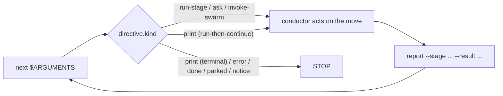

# オーケストレーションエンジンとスキルシステム

> 読者: Tier 2/3（チームで入れる人、フレームワークの貢献者）。

> **パスの慣例。** 以下の `<record>/` はアクティブインテントのレコードディレクトリ、`aidlc/spaces/<space>/intents/<YYMMDD>-<label>/`。インテントごとの状態と実行時ファイルがある場所です。

この章は、すべての `/aidlc` 実行を駆動するオーケストレーションの正本です。決定論的な**エンジン**（`aidlc-orchestrate.ts`）が「次は何か」に答え、薄い**コンダクター**（`skills/aidlc/SKILL.md`）がエンジンの答えに従い、両者をつなぐ**型付きディレクティブ契約**、ランナー生成器が出す**複数スキル**、どのステージが走るか決める**スコープの形**、並行 Construction を収束させる**スウォーム**の審判です。古い散文オーケストレータ（ルーティング論理をすべて `SKILL.md` 本文が持っていた）を置き換えます。相互リンクは [Orchestrator](03-orchestrator.md)（コンダクター自身の章）、[Runtime Graph](13-runtime-graph.md)（エンジンとスウォームが読む実行の正の鏡）、[State Machine](12-state-machine.md)（`report` がコミットする遷移）、[Hooks and Tools](06-hooks-and-tools.md)（決定論的な背骨。Stop フックを含む）です。

---

## 1. エンジンとコンダクター

切り替えは一つの関心を二つに割ります。**エンジン**は*ステージ間のルーティング*を持ちます — スコープ解決、フラグ優先はしご、ジャンプ方向の計算、再開と init のガード、ステージ順序、ゲート状態、ワークフロー完了。**コンダクター**は*エンジンが指名した一手の中の実行の質*を持ちます — ペルソナの枠、良い質問、ステージ日記、ステージ内の Keep / Modify / Redo ループ、ゲートで判断を人に出すこと。

エンジンの正本は `core/tools/aidlc-orchestrate.ts` で、各ハーネスへは `<harness-dir>/tools/aidlc-orchestrate.ts`（例: `.claude/tools/`）として出荷します。Bun CLI で、サブコマンドはちょうど 5 つです: `next`、`continue`、`report`、`park`、`team-board`。`continue` は内部の操舵輸送、`team-board` は読み取り専用の Team Construction 照会です。

| サブコマンド | 役割 | 状態を変えるか |
|------------|------|----------------|
| `next` | ワークフロー状態（アクティブインテントの `aidlc-state.md`、`aidlc/spaces/<space>/intents/<YYMMDD>-<label>/` の下）とコンパイル済みステージグラフ（`tools/data/stage-graph.json`）を読み、スコープと位置を解決し、型付きディレクティブ**ちょうど一つ**（JSON）を stdout へ出す。 | ワークフロー状態は変えない。`next --single` は作業を出す前に合成 `STAGE_STARTED` 監査境界だけを残す。通常のチームディスパッチャ読みは、gitignore された局所の claim 観察キャッシュと世代スタンプを更新することがある。Stop フックと route-check の探りは更新しない。すでにインテントがあるワークスペースへの無状態作成は、重複を作らずインテント選択プロンプトを出す。 |
| `report` | コンダクターがディレクティブに従ったあと、遷移をコミットする。ステージを意識したディスパッチャ。`--stage <slug>` が従ったディレクティブをピンするので、復旧した `Current Stage` が報告対象をずらさない。承認、却下、改訂、完了、スキップの結果を持ち、内部状態遷移を原子的に出し、明示報告したステージがまだ `[-]` なら承認前に欠けたゲートを開く。 | はい。 |
| `team-board` | ターミナルのメインディスパッチャと `/aidlc --status` が使う、純粋な Team Construction ボードを描く。内部照会面。fetch も状態 / キャッシュ変更もしない。 | いいえ。 |
| `park` | きれいなステージ間境界でアクティブなワークフローを止める。`Parked` 印を書き、以後の `next` が終端の `parked` ディレクティブを出すようにする。`/aidlc --resume` が印を消してからルーティングが再開する。 | はい。 |

`report --result skipped` はメインワークフローのライフサイクル結果であり、単発実行の結果ではありません。空でない明示 `--stage`、空でない `--reason`、指名ステージが `Current Stage` と等しいこと、ステージが active か revising であることが要ります。エンジンは `STAGE_SKIPPED` を一つ残し、`[S]` を保ち、`STAGE_COMPLETED` を出さずに次のステージを始める（またはワークフローを完了する）。`report --single --result skipped` は拒否します。コンダクターは対応する `aidlc-state.ts` ライフサイクル動詞を直接呼びません。

`next --stage <slug> --single` は先に `single-stage:<slug>` の下で `STAGE_STARTED` を残し、それから `single: true`、`gate: false`、`next_stage: null` の `run-stage` を出します。その型付き印が通常のゲート扱いを上書きします。コンダクターは本文、設定されたトポロジとレビュアーを走らせ、`report --single --stage <slug> --result completed` をちょうど一度呼びます。report は開いた開始境界を要求し、対応する `STAGE_COMPLETED` を残します。両方の行を捏造しません。隔離経路はワークフローの学びを走らせず、承認ゲートを開かず、メインワークフローの `next` も park も呼びません。返る `done` が隔離実行を終えます。

エンジンは設計どおり決定論的なコードです。ルーティングは決定論の関心なのでツールに置き、LLM の散文には置きません（経路文字列の組み立てを LLM に渡すと、ツール / エージェント / 人のテーゼが逆立ちします）。既存の決定論ライブラリを**合成**します。コンパイル済みグラフの `loadGraph()`、順序の `nextInScopeStage()` / `firstInScopeStageOfPhase()`、スコープ名集合の `validScopes()`、状態読みの `getField` / `parseCheckboxes`。非ハッピーパス（ジャンプ、インテント作成、スコープ / 設定変更、環境スコープ検証）は兄弟 CLI ツールをシェルアウトし、stderr をそのまま中継するので、利用者向けのエラー文言を組み立て直しません。明示再開は parked / 無状態のガードのあと、通常の継続へ落ちます。エンジンが合成せず*足す*のは、`(観察した状態 + グラフ) → ディレクティブ種別` の決定規則と、グラフノードの語彙名を正のレコードディレクトリパス（`aidlc/spaces/<space>/intents/<YYMMDD>-<label>/<phase>/<stage>/...`）へ変える成果物パス解決だけです。

どのディレクティブも印刷前に `aidlc-directive.ts` の凍結契約で検証します。壊れたディレクティブは非ゼロで終わり、コンダクターが従う嘘は出しません。

---

## 2. 型付きディレクティブ契約

`aidlc-directive.ts` は `kind` フィールドをキーにした、**11** 種の判別共用体です。各ディレクティブは自分の種が要るフィールドだけを持ち、種ごとの許可キー集合が強制します（集合の外のフィールドは未知キーとして拒否）。エンジンは**いま 9 種を出します**。2 種は文書化したプレースホルダで、後の波が配線するまでループの形を完結させます。

| `kind` | いま出すか | コンダクターがすること |
|--------|----------------|--------------------------|
| `print` | はい | `directive.message` が言うことをそのままやる — それが正です。形は三つ。**終端**（status / help / doctor / version のような読み取り専用ユーティリティを指名。走らせ、stdout をそのまま出し、止まる）、**走らせて続ける**（スコープ変更、ジャンプ `execute`、新しいワークスペースの `intent-create` のような可変ツールを指名。走らせ、ステップ 1 に戻る）、**走らせて止まる**（確認済み `--new-intent` 作成。`intent-create` を走らせ、止まり、`next` を再走せずハーネス固有の新規セッション流れで引き渡す）。変更は指名したツールにあり、`next` にはありません。 |
| `error` | はい | `directive.message` をそのまま出し、止まる。復旧も滑らかにしない — メッセージが利用者向けエラーです。 |
| `done` | はい | ワークフロー（または単発ステージ実行）が完了。完了要約を出し、止まる。 |
| `parked` | はい | ワークフローはきれいなステージ間境界（`directive.stage`）で途中停止し、後のセッション向けです。止まっていることと再開方法（`/aidlc --resume`）を伝え、止まる。`Parked` 印があるあいだの素の `next` で出ます（書くのは `aidlc-orchestrate park`）。ステージは進みません。Stop フックは `parked` を終端許可として扱うので、コンダクターは `done` までステージをゴム印せずに止められます（#367）。 |
| `notice` | はい | `directive.message` をそのまま出し、止まる。終端の案内引き渡しです。スコープ無しのメインで、チーム所有ユニットがほかで claim されているときに使います。ワークフローは進めず変えません。 |
| `load-steering` | はい | `rules_content` を順に適用し、アクティブステージのルール束として保持し、すぐ `aidlc-orchestrate continue <continue_token>` を呼ぶ。チャンク進捗は報告も語りもしない。 |
| `run-stage` | はい | 直前の `load-steering` 列が、実質あるアクティブスペースルールをすべて届けた。`inline_context_paths` は届いた中身ではなく、ブロックする読み込み一覧として扱う。必須エントリをすべて明示的に読み、中身を待ってから、ステージファイル / consumes を読み、日記を初期化し、本文を走らせ、モブサポートを出し、成果物を書く。モブは先にリードペルソナを載せる。`context_warnings` があれば見せ、読めるペルソナ / ナレッジ名簿で続ける。委譲トポロジでは、蓄積したルール束をすべてのエージェントブリーフへそのまま貼る。分岐は任意の `directive.single`、次に任意の `directive.wave`、次に任意の `directive.unit_gate`、そのあと通常の `directive.gate`。ユニットゲートはゲートだけの仕事で、本文 / レビュアーはすでに落ち着いており、報告に `--unit` が付く。ウェーブはエンジンが解決した完全なユニットエントリを持ち、対のレビュー証拠と `unit complete --wave` で各々を落ち着ける。ディレクティブはグラフノードから解決済みルーティングフィールドもそのまま運ぶ。 |
| `ask` | はい | ハーネスの構造化質問面で `directive.question` を描き、その型付き応答契約に従う。通常の ask は `report --user-input` で戻る。`ask_type: "new-work-routing"` は `response_route: "next"`、`new_work_description`、`proposed_scope` を運び、continue / 別作業 / 再形成の答えは `next` を通り、`report` は通らない。`ask_type: "unit-claim"` は `response_route: "claim"` と、claim できる・済み・依存で塞がれたユニット行を運ぶ。ユニットを選ぶと `/aidlc --claim <unit>` が走り、その結果で止まる。エンジン自身は人に聞かない — 手番をコンダクターへ委ねる。 |
| `invoke-swarm` | はい | エンジンが適格な Construction バッチをスウォームに渡した。コンダクターは `directive.units` のユニットを展開し、収束ループを回し、スウォームの審判に相談する（§6）。`autonomous` 付与の下の適格 Construction バッチだけで出る。 |
| `dispatch-subagent` | いいえ（エンジン将来のプレースホルダ） | 指名ステージをインラインではなく `Task` 呼び出しで走らせる*はず*。いまは出さない。先回り実装しない。 |
| `present-gate` | いいえ（エンジン将来のプレースホルダ） | ゲートの儀式を独立ディレクティブとして走らせる*はず*。いまゲート判断は `run-stage` の `gate` フィールドに折り込む。 |

**ゲートの番兵。** `run-stage` の `gate` は、決定論の場合はすべて真偽です（自動進行するブートストラップ Initialization ステージは `false`、ほかの EXECUTE ステージは `true`）。決定論でないのは一つです。最初の Construction ボルトのゲートは、チームの自由文 `## Walking Skeleton` プラクティスに依存し、パーサでは導けません。エンジンは文字列番兵 `GATE_UNRESOLVED`（`"unresolved"`）を出し、分類をコンダクターのナレッジ仕事へ委ねます。姿勢は `report --skeleton-stance <on|off|scope-dependent>` で返し、次の `next` が同じステージを、今度は決まった真偽ゲートで出し直します。

**コンダクターペルソナの配送。** コンダクターの実行品質憲章は `aidlc-common/conductor.md` に一度だけあります。どのスキルもパスでは参照しません。エンジンが読み、**ワークフロー最初の `run-stage` ディレクティブ**の `conductor_persona` フィールドへ中身を焼きます。コンダクターはそのフィールドを受け取ったら、実行全体でそのペルソナをまといます。フレームワークランナーも手書きも、スキルごとの勤勉なしで一つのペルソナに揃います。

---

## 3. 転送ループと Stop フック

`skills/aidlc/SKILL.md` が**コンダクター**です。エンジンのディレクティブに従う薄い転送ループです。制御構造はこれだけです。

```
Loop:
  1. directive = `bun .claude/tools/aidlc-orchestrate.ts next $ARGUMENTS`
  2. act on directive.kind
  3. `bun .claude/tools/aidlc-orchestrate.ts report --stage <directive.stage> --result <outcome> [--user-input "<text>"]` when the directive names a stage; omit `--stage` only for non-stage report round-trips.
  4. repeat unless directive.kind == done
```



図の文章説明: `next`（`$ARGUMENTS` をそのまま渡す）がディレクティブ一つを返します。コンダクターは `directive.kind` で分岐します。`run-stage`、通常の `ask`、`invoke-swarm`、走らせて続ける `print` では指名した一手をやり、`report` を呼び、それが `next` へ戻ります。型付き `new-work-routing` ask は宣言した `next` 経路でループし、型付き `unit-claim` ask は選んだユニットを `claim` へ通します。終端の `print`、`error`、`done`、`parked`、`notice` ではループを止めます。

`$ARGUMENTS` は最初の `next` へそのまま通ります。エンジンがフラグ（`--status`、`--stage`、`--scope`、`--depth`、自由文）をパースするので、コンダクターは事前パースも削りもしません。`next` は何も変えないので、ループが進むのは `report` が遷移をコミットしたときだけです。次の `next` は常に新しい状態を読みます。

対話経路ではコンダクターがループを持ちます。人に質問できるのはコンダクターだけだからです。ループを LLM の善良さに預けないため、**Stop フック**（`hooks/aidlc-continue-workflow.ts`）が決定論的に強制します。流れを変えるフック 6 のうちの一つです。deliver-stage-rules、plan-approval、state-transition、reviewer-scope、review-freeze が 5 つの PreToolUse 制御、残り 10 は advisory です。コンダクターが手番を終えようとすると、Stop フックは `aidlc-orchestrate next` を走らせます。まだディレクティブが残っていれば停止を止め、`reason` フィールド経由でディレクティブを差し戻します。言い方は**任務続行**です（まだ負っている仕事を指名する — ループを回す、従う、報告する。上書き形の指示は出さない。コンダクターの安全訓練が拒否するからです）。探りの `next` は claim 観察を更新しません。`done`、`parked`、案内の `notice` は停止を許します。`parked` は後のセッション向けの、支援された途中停止です。`notice` は書き込み無しのチーム展開引き渡しです。残っていても*止めない*場合もあります。**人待ちの切り出し**は、コンダクターが正しく人の上で止まっている（または単に雑談している）とき停止を許します — いまのステージが承認待ちの `[?]`、改訂中の `[R]`、進行中の `[-]` で正または正確なアクティブユニットの `<slug>-questions.md` に未回答の `[Answer]:` タグがある、または現ステージの `DECISION_RECORDED` のあとに `QUESTION_ANSWERED` が無い、または終える手番が会話だった（ハーネスの転写から、人の最後のプロンプトにワークフローエンジン呼び出し無しで答えた。読み取り専用の `--status` / `--doctor` 照会は関与に数えない）。記録した判断と会話の手番は自律 Construction では抑え、ファイル裏付けの質問も抑えます。ただし unit-major の code-generation の必須 Plan Approval 質問だけは手番を放します。会話の場合は Kiro では無効です。転写が無いので、対話上限が解放経路になります。そこで止めるとナッジが増えるだけです（陽性確認のみ。人待ち検査は fail-open、会話検査は fail-close。無状態と本物のステージ途中終了は止めます）。詰まったループがセッションを閉じ込めないよう、上限は二つです。Claude Code の `stop_hook_active` 信号と、`<record>/.aidlc-stop-hook/`（アクティブインテントのレコードディレクトリ）に残る無進捗カウンタ。連続無進捗ブロックが天井（`CLAUDE_CODE_STOP_HOOK_BLOCK_CAP`。既定は実行モード意識: **対話実行では 2、自律 Construction では 8**）に達するとフックは手放します。ワークフローが進むと位置署名が変わりカウンタは 0 に戻るので、健全なループは絞られません。アクティブなワークフローが無いとき、または予期しないエラーでは、フックは fail-open です。AI-DLC でないセッションは止めません。

---

## 4. 複数スキル、ランナー、共有の背骨

オーケストレータは多くのスキルの一つです。各ハーネスはスキルディレクトリ（`<harness-dir>/skills/`、例: `dist/claude/.claude/skills/`）の下に複数集合を出荷します。基底の `aidlc` オーケストレータ、走れるステージごとの**ステージランナー**（コアは `aidlc-<slug>`、プラグイン所有はプラグイン接頭辞付きの裸スラッグ）、`runner: true` スコープごとの**スコープランナー**（コアは `aidlc-<scope>`、プラグイン所有は裸の名前）、読み取り専用セッションスキル（`aidlc-session-cost`、`aidlc-replay`、`aidlc-outcomes-pack`）、`aidlc-init`。ルーティングと実行の知識はすべて、`core/aidlc-common/` に書いた**共有の背骨**に一度あります（出荷は `<harness-dir>/aidlc-common/`）。`conductor.md` ペルソナ、`protocols/`、`stages/{initialization,ideation,inception,construction,operation}/` のステージ 33。

ランナースキルは手書きせず、`tools/aidlc-runner-gen.ts` が生成します。

- **ステージランナー**は任意の糖です。各コア `/aidlc-<slug>`（またはプラグイン所有の `/<plugin>-<slug>`）は `/aidlc --stage <slug> --single`（それ無しでも動く）を打てるコマンドに包み、エンジンの `--single` モードでステージ一つを隔離実行し、メインワークフローの `Current Stage` は進めません。`next --single` が合成開始を持ち、出る `single: true` ディレクティブがワークフローの学びと承認ゲートを迂回し、`report --single` が対応する完了を持ってからランナーは `done` で止まります。スラッグ一覧は `loadGraph()` — コンパイル済みの正本一つ — から来るので、グラフに足したステージはここの編集なしでランナーへ流れます。ブートストラップの Initialization ステージは除外します（独立した `--single` の意味が無く、`--single` は拒否する）。Initialization フェーズ全体は `/aidlc-init` ランナー一つとして出荷し、エンジンの `intent-create` 一手を包みます。
- **スコープランナー**はすでに走れるコマンドを包みます。スコープファイルが定義を持ち、`runner: true` で既定の生成集合に入ります。それぞれ短いシェルで、固定スコープ・判定なしで `aidlc-orchestrate next --scope <scope>` を `done` まで駆動します。スコープ集合全体は `/aidlc --scope <name>` で届きます。ランナーは高頻度のものと、入ることを選んだプラグインスコープへの、打てる糖です。

二つのドリフト検査が、ディスク上のランナー集合をソースにピンします。ステージランナーは `aidlc-runner-gen.ts check`、スコープランナーは `scopes --check`。どちらも CI で走ります。ランナーに **`hooks:` ブロックはありません** — ワークフロー背骨のフックは `settings.json` にプロジェクト単位であるので、決定論的な背骨は継承でありコピーではありません。どのランナーも `conductor.md` を手で読みません。エンジンが最初の `next` でペルソナを届けます。

---

## 5. スコープの形

スコープはファイルで書くプリミティブです。センサーやエージェントを書くのと同じ筋記憶です。**`scope-mapping.json` はありません** — 出荷木から消しました。スコープの身元とステージ所属は、ファイルで書く二つの面に分かれ、コンパイル済みグリッドへ転置します。

1. **身元**はスコープごとに一つのファイル、`dist/claude/.claude/scopes/aidlc-<name>.md` — frontmatter（必須の `name` と `depth`、任意の `keywords`、`description`、`testStrategy`、`review_cap`、`runner`）と、スコープを説明する散文。出荷集合は `bugfix`、`classic`、`enterprise`、`express`、`feature`、`infra`、`mvp`、`poc`、`refactor`、`security-patch`、`workshop`。
2. **所属**は各ステージの `scopes:` frontmatter — そのステージが EXECUTE になるスコープの一覧。

`bun .claude/tools/aidlc-graph.ts compile`（`stage-graph.json` を出すのと同じコンパイル経路）がこれらを `tools/data/scope-grid.json` のグリッドへ転置します。`scope → {stages: {slug: EXECUTE|SKIP}}` マップで、エンジンはスコープ単位のルーティングすべてをこれから読みます。エンジンの `validScopes()` は、そのコンパイル済みグリッドから正のスコープ名集合を導きます。

スコープ追加は純粋な加算です。`.claude/scopes/aidlc-<name>.md` を置き、所属ステージの `scopes:` 一覧にタグし、再コンパイルし、`SKILL.md` の人が読む要約表を再生成する。ディスパッチ論理の編集は不要で、ドリフト検査がディスク上の集合のずれを防ぎます。

---

## 6. スウォームの審判、ドライバシーム、Bolt-DAG

**スウォーム**は、人が付与した自律の下で並行 Construction を収束させる方法です。生きた `/aidlc` セッションの中だけで発火するので、コンダクター（そのセッション）が展開と再試行ループを持ちます。`tools/aidlc-swarm.ts` は、コンダクターがループを持ちながら相談する決定論的な**審判**です。収束への三関心の分割です。コンダクターが展開と再試行判断（知識）を持ち、ツールが収束判定 + マージ + 監査（決定論）を持ち、人が自律を付与し失敗封筒でバトンを取り戻します（判断）。

審判は**無状態**です — 反復カウンタも残る進捗もありません。サブコマンドは三つです。

| サブコマンド | 役割 | 出すもの |
|------------|------|-------|
| `prepare --batch <n> --units <a,b,c> [--base <branch>] [--degraded-from <subagent\|ultracode>]` | 自律 Code Generation では、先に各ユニットのいまの指紋付き計画、テスト指示、Testing Contract、明示 Plan Approval を要求する。それからユニットごとに隔離 git worktree を分岐する（`aidlc-worktree create` + `aidlc-bolt start --worktree` の合成）。 | `SWARM_STARTED`（騒がしいダウングレードが報告されたときは `SWARM_DEGRADED` も）。 |
| `check <unit> --check-cmd <cmd> [--test-file <path>]` | 無状態の単一ユニット判定。プロジェクト自身の検査コマンドを走らせる（終了 0 = 緑。それが正の合図 — 働き手の自己主張は信じない）。保護ファイルを分岐 git ベースラインと改ざん防止比較する。`{converged, tampered, reason}` を出し、本当に収束したときだけ終了 0。 | なし（advisory。コンダクターの再試行判断の材料）。 |
| `finalize --batch <n> --units <a,b,c> --claimed <a,b> --check-cmd <cmd> [--test-file <path>] [--reasons <unit>=<reason>,…]` | 正のゲート。**claim したすべてのユニットで検査を再走**し、いまのステージがレビュアーを宣言していれば、ボルト開始後の対応する終端レシートを要求する。現代のソース付き worktree では、いまの大域 `Source Fingerprint`、いまの `Unit Source Fingerprint` とマニフェストバイト結び、証明した生を意識した `Base Source Listing`、ベースから worktree へのソース変更がすべてレビュー済みマニフェスト主張に含まれることも要求する。`AIDLC_SKIP_SOURCE_FRESHNESS=1` はそれらのソース検査だけを明示迂回する。収束行は迂回を残し、ソースマージはスイッチを繰り返す必要がある。赤、改ざん、未レビュー、古い、レビュー済み足跡の外の claim ユニットはマージ前に拒否する（嘘のコンダクターガード）。本物の通過は、宣言した正確なレコード成果物と結んだソースマニフェストをスナップショットして着地させ、直列 HOLD-MERGE ロックの下で AIDLC メタデータをマージする。コンダクターは次に相関する `aidlc-worktree merge` を走らせる。不変の `Source Commit` を消費し、`SWARM_SOURCE_MERGED` を出し、その権威が着地したあとは cleanup 冪等。現代のバッチルーティングと落ち着いた承認は、完全な集約鎖を要求する。終了は 0（レコード / メタデータの収束）か 2（失敗封筒）。 | `SWARM_UNIT_CONVERGED` / `SWARM_UNIT_FAILED` / `SWARM_BATON_RETURNED` / `SWARM_COMPLETED`。後のソースマージは `SWARM_SOURCE_MERGED` を出す。 |

これら 7 つの `SWARM_*` イベントは 91 種の監査分類の一部です（[State Machine](12-state-machine.md)）。終了 2 の封筒ではコンダクターがバトンを取り戻します。失敗は自律モードに関係なく常に止まり、人を再関与させます。

**ドライバシーム。** `AIDLC_USE_SWARM=1` はインライン Dynamic Workflow ドライバを選びます（コンダクターが `Workflow` を書き、その JS がユニットごとのパイプラインと反復上限を持つ）。未設定はサブエージェント床です（一つのメッセージで N 本の並行 `Task`、ユニットにつき一つ）。`=1` でも Workflow ツールが無ければ、コンダクターは**騒がしく床へ落ち**、`--degraded-from ultracode` を渡して審判が `SWARM_DEGRADED` を出すようにします。暴走のバックストップはツール内の上限ではなく、ハーネスの Stop フック天井です。この自律 Construction 経路では 8 ブロックです（§3）。

どの Code Generation 働き手も、通常経路と同じ承認済み契約を受けます。`AIDLC-UNIT`、`AIDLC-TESTING-CONTRACT`、計画全体、ユニットテスト指示全体。働き手は Testing Posture を独自に再解決しません。

**Bolt-DAG。** スウォームが展開するバッチは `runtime-graph.json` の `bolt_dag` ノードから来ます（[Runtime Graph](13-runtime-graph.md)）。units-generation の `unit-of-work-dependency.md` エッジブロックからパースします。ノードは `units`（各々 `depends_on` 一覧）と `batches` を持ちます — すべてのユニットの依存が前のバッチで満たされるトポロジレベルなので、バッチ内のユニットは並行展開できます。ノードがあるのは、ディスクに妥当なエッジブロックがあるときだけです。無い、壊れている、循環しているブロックはノード全体を省きます（ゲート時の required-sections センサーが上流を旗します）。

---

## 次の一歩

- **コンダクター自身の章** — 転送ループ、ゲートの儀式、学びの儀式の全体。[Orchestrator](03-orchestrator.md)。
- **エンジンとスウォームが読む実行の正の成果物** — `runtime-graph.json` と `bolt_dag` ノード。[Runtime Graph](13-runtime-graph.md)。
- **`report` がコミットする遷移** — ワークフロー / フェーズ / ステージ機械と 91 種の監査分類。[State Machine](12-state-machine.md)。
- **決定論的な背骨** — Stop フックと、ほかのフレームワークフックとツール。[Hooks and Tools](06-hooks-and-tools.md)。
- **日常のランナー** — 打てる `/aidlc-<stage>` と `/aidlc-<scope>`。User Guide の [スキルとランナーコマンド](../guide/17-skills.md)。
