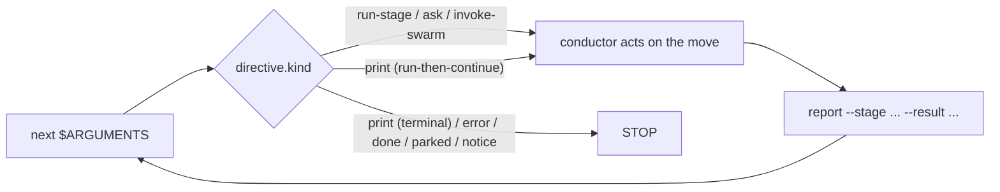

# オーケストレーションエンジンとスキルシステム

> 読者: Tier 2/3（チームで入れる人、フレームワークの貢献者）。

> **パスの慣例。** 以下の `<record>/` はアクティブインテントのレコードディレクトリ、`aidlc/spaces/<space>/intents/<YYMMDD>-<label>/`。インテントごとの状態と実行時ファイルがある場所です。

この章は、すべての `/aidlc` 実行を駆動するオーケストレーションの正本です。決定論的な**エンジン**（`aidlc-orchestrate.ts`）が「次は何か」に答え、薄い**コンダクター**（`skills/aidlc/SKILL.md`）がエンジンの答えに従い、両者をつなぐ**型付きディレクティブ契約**、ランナー生成器が出す**複数スキル**、どのステージが走るか決める**スコープの形**、並行 Construction を収束させる**スウォーム**の審判です。古い散文オーケストレータ（ルーティング論理をすべて `SKILL.md` 本文が持っていた）を置き換えます。相互リンクは [Orchestrator](03-orchestrator.md)（コンダクター自身の章）、[Runtime Graph](13-runtime-graph.md)（エンジンとスウォームが読む実行の正の鏡）、[State Machine](12-state-machine.md)（`report` がコミットする遷移）、[Hooks and Tools](06-hooks-and-tools.md)（決定論的な背骨。Stop フックを含む）です。

---

## 1. エンジンとコンダクター

切り替えは一つの関心を二つに割ります。**エンジン**は*ステージ間のルーティング*を持ちます — スコープ解決、フラグ優先はしご、ジャンプ方向の計算、再開と init のガード、ステージ順序、ゲート状態、ワークフロー完了。**コンダクター**は*エンジンが指名した一手の中の実行の質*を持ちます — ペルソナの枠、良い質問、ステージ日記、ステージ内の Keep / Modify / Redo ループ、ゲートで判断を人に出すこと。

エンジンの正本は `core/tools/aidlc-orchestrate.ts` で、各ハーネスへは `<harness-dir>/tools/aidlc-orchestrate.ts`（例: `.claude/tools/`）として出荷します。Bun CLI で、サブコマンドはちょうど 5 つです: `next`、`continue`、`report`、`park`、`team-board`。`continue` は内部の操舵輸送、`team-board` は読み取り専用の Team Construction 照会です。

| サブコマンド | 役割 | 状態を変えるか |
|------------|------|----------------|
| `next` | ワークフロー状態（アクティブインテントの `aidlc-state.md`、`aidlc/spaces/<space>/intents/<YYMMDD>-<label>/` の下）とコンパイル済みステージグラフ（`tools/data/stage-graph.json`）を読み、スコープと位置を解決し、型付きディレクティブ**ちょうど一つ**（JSON）を stdout へ出す。 | ワークフロー状態の変更も権威の変更もしない: `next` は Plan Approval のレシート、チャレンジ、フィンガープリントを決して発行、回転、消去しません。冪等でもあります — アクティブディレクティブ印が、この状態のこの正確なディレクティブをすでに残しているとき、そのディレクティブをそのまま返し何も書かないので、再質問がルール配送を再開したり承認を動かしたりしません。`next --single` は作業を出す前に合成 `STAGE_STARTED` 監査境界だけを残します。通常のチームディスパッチャ読みは、gitignore された局所の claim 観察キャッシュと世代スタンプを更新することがあります。Stop フックと route-check の探りは、助言のエンジンターン印を超えて何も書かず、どちらかからの残る書きは進まず大きく失敗します。すでにインテントがあるワークスペースへの無状態作成は、重複を作らずインテント選択プロンプトを出す。 |
| `report` | コンダクターがディレクティブに従ったあと、遷移をコミットする。ステージを意識したディスパッチャ。`--stage <slug>` が従ったディレクティブをピンするので、復旧した `Current Stage` が報告対象をずらさない。承認、却下、改訂、完了、スキップの結果を持ち、内部状態遷移を原子的に出し、明示報告したステージがまだ `[-]` なら承認前に欠けたゲートを開く。 | はい。 |
| `team-board` | ターミナルのメインディスパッチャと `/aidlc --status` が使う、純粋な Team Construction ボードを描く。内部照会面。fetch も状態 / キャッシュ変更もしない。 | いいえ。 |
| `park` | きれいなステージ間境界でアクティブなワークフローを止める。`Parked` 印を書き、以後の `next` が終端の `parked` ディレクティブを出すようにする。`/aidlc --resume` が印を消してからルーティングが再開する。 | はい。 |

`report --result skipped` はメインワークフローのライフサイクル結果であり、単発実行の結果ではありません。空でない明示 `--stage`、空でない `--reason`、指名ステージが `Current Stage` と等しいこと、ステージが active か revising であることが要ります。エンジンは `STAGE_SKIPPED` を一つ残し、`[S]` を保ち、`STAGE_COMPLETED` を出さずに次のステージを始める（またはワークフローを完了する）。`report --single --result skipped` は拒否します。コンダクターは対応する `aidlc-state.ts` ライフサイクル動詞を直接呼びません。

`next --stage <slug> --single` は先に `single-stage:<slug>` の下で `STAGE_STARTED` を残し、それから `single: true`、`gate: false`、`next_stage: null` の `run-stage` を出します。その型付き印が通常のゲート扱いを上書きします。コンダクターは本文、設定されたトポロジとレビュアーを走らせ、`report --single --stage <slug> --result completed` をちょうど一度呼びます。report は開いた開始境界を要求し、対応する `STAGE_COMPLETED` を残します。両方の行を捏造しません。隔離経路はワークフローの学びを走らせず、承認ゲートを開かず、メインワークフローの `next` も park も呼びません。返る `done` が隔離実行を終えます。

エンジンは設計どおり決定論的なコードです。ルーティングは決定論の関心なのでツールに置き、LLM の散文には置きません（経路文字列の組み立てを LLM に渡すと、ツール / エージェント / 人のテーゼが逆立ちします）。既存の決定論ライブラリを**合成**します。コンパイル済みグラフの `loadGraph()`、順序の `nextInScopeStage()` / `firstInScopeStageOfPhase()`、スコープ名集合の `validScopes()`、状態読みの `getField` / `parseCheckboxes`。非ハッピーパス（ジャンプ、インテント作成、スコープ / 設定変更、環境スコープ検証）は兄弟 CLI ツールをシェルアウトし、stderr をそのまま中継するので、利用者向けのエラー文言を組み立て直しません。明示再開は parked / 無状態のガードのあと、通常の継続へ落ちます。エンジンが合成せず*足す*のは、`(観察した状態 + グラフ) → ディレクティブ種別` の決定規則と、グラフノードの語彙名を正のレコードディレクトリパス（`aidlc/spaces/<space>/intents/<YYMMDD>-<label>/<phase>/<stage>/...`）へ変える成果物パス解決だけです。

どのディレクティブも印刷前に `aidlc-directive.ts` の凍結契約で検証します。壊れたディレクティブは非ゼロで終わり、コンダクターが従う嘘は出しません。

---

## 2. 型付きディレクティブ契約

`aidlc-directive.ts` は `kind` フィールドを鍵にした**11** のディレクティブ種別の判別共用体を定義します。各ディレクティブは、その種別が要るフィールドだけを運び、種別ごとの許可キー集合で強制します（種別の集合の外のフィールドは未知キーとして拒否）。エンジンは**きょう 9 種別を出します**。2 つは、後の波が配線するまでループを完備形に保つ、文書化したプレースホルダです。

| `kind` | きょう出すか | コンダクターがすること |
|--------|----------------|--------------------------|
| `print` | はい | `directive.message` が言うことを正確にやる — それが正本。形は 3 つ: **終端**（status/help/doctor/version のような読み取り専用ユーティリティを指名。走らせ、stdout をそのまま印字し、STOP）、**走らせて続ける**（スコープ変更、ジャンプ `execute`、新鮮なワークスペースの `intent-create` のような変更ツールを指名。走らせ、それからステップ 1 へ戻る）、**走らせて止まる**（確めた `--new-intent` 作成。`intent-create` を走らせ、STOP し、`next` を再走せずハーネス固有の新鮮セッション流れで渡す）。変更は指名したツールにあり、`next` にはありません。 |
| `error` | はい | `directive.message` をそのまま印字し STOP。復旧も滑らかにもしない — メッセージが利用者向けエラーです。 |
| `done` | はい | ワークフロー（または単発ステージ実行）が完了。完了要約を出して STOP。 |
| `parked` | はい | ワークフローがきれいなステージ間境界（`directive.stage`）で途中停止し、後のセッション向け。止まっていることと再開の仕方（`/aidlc --resume`）を伝え、STOP。`Parked` 印が立っているあいだの素の `next` で出ます（`aidlc-orchestrate park` が書く）。ステージは進みません。Stop フックは `parked` を終端許可として扱うので、コンダクターは `done` に達するためにステージをゴム印せず park します（#367）。 |
| `notice` | はい | `directive.message` をそのまま印字し STOP。終端の情報引き渡し。スコープ無しメインで、チーム所有の Unit がほかで claim されているときに使う。ワークフローを進めも変えもしません。 |
| `load-steering` | はい | `rules_content` を順に適用し、アクティブステージのルール束として保持し、すぐ `aidlc-orchestrate continue <continue_token>` を呼ぶ。チャンク進捗を報告も物語りもしない。 |
| `run-stage` | はい | 先行する `load-steering` 列が、実質のあるアクティブスペースルールをすべて届けた。`inline_context_paths` は届けた中身ではなく、ブロックする読み一覧として扱う: 必須エントリをすべて明示して読み、中身を待ってからステージファイル / consumes を読み、日記を初期化し、本文を走り、モブサポートを派遣し、成果物を書く。モブはリードペルソナを先に読む。`context_warnings` があれば見せ、読めるペルソナ / ナレッジ名簿で続ける。派遣トポロジでは、蓄積したルール束をすべてのエージェントブリーフへそのまま貼る。任意の `directive.single`、それから任意の `directive.wave`、それから任意の `directive.unit_gate`、それから通常の `directive.gate` で分岐する。Unit ゲートは、本文 / レビュアーがすでに落ち着き、報告に `--unit` を含むゲートだけの仕事。ウェーブはエンジンが解決した完全な Unit エントリを含み、対のレビュー証拠と `unit complete --wave` でそれぞれを落ち着ける。ディレクティブは、グラフノードから解決したルーティングフィールドもそのまま運ぶ。 |
| `ask` | はい | `directive.question` をハーネスの構造化質問面で描き、その型付き応答契約に従う。通常の ask は `report --user-input` で戻る。`ask_type: "new-work-routing"` は `response_route: "next"`、`new_work_description`、`proposed_scope` を運ぶので、続ける / 別仕事 / 再形の答えは `report` ではなく `next` を通る。`ask_type: "unit-claim"` は `response_route: "claim"` に加え、claim できる、claim 済み、依存でブロックされた Unit 行を運ぶ。Unit を選ぶと `/aidlc --claim <unit>` を走り、そのコマンドの結果で止まる。`ask_type: "guard-recovery"` は `response_route: "execute-remedy"`、拒否したステージと Unit、`reason_codes`、`remedies` を運ぶ。それぞれ閉じた `op` を持つ: コンダクターは `executableNow` が真の救済を出し、人を待ち、選んだ `command` を正確に実行するかその `action` に従う。空の `remedies` 一覧と `state_signature` は終端形で、人が答えるまでエンジン動作無しでそのまま描く（[Guard admission and recovery asks](12-state-machine.md#guard-admission-and-recovery-asks)）。エンジン自身は人に聞かず、ターンをコンダクターへ委ねる。 |
| `invoke-swarm` | はい | エンジンが適格な Construction バッチをスウォームへ与えた。コンダクターは `directive.units` のユニットを展開し、収束ループを走り、スウォーム審判に相談する（§6）。`autonomous` 付与の下の適格 Construction バッチだけが出す。 |
| `dispatch-subagent` | いいえ（エンジン将来のプレースホルダ） | 指名ステージをインラインではなく `Task` 呼び出しで走らせる*はず*。きょうは出さない。投機的に実装しない。 |
| `present-gate` | いいえ（エンジン将来のプレースホルダ） | ゲート儀式を自分のディレクティブとして走らせる*はず*。きょうゲート判断は `run-stage` の `gate` フィールドへ折り畳む。 |

**ゲート番兵。** `run-stage` の `gate` は、どの決定論ケースでも真偽です（自動進行するブートストラップ初期化ステージは `false`、ほかの EXECUTE ステージは `true`）。決定論でないケースが一つあります: 最初の Construction Bolt のゲートは、チームの自由形式 `## Walking Skeleton` プラクティス散文に依存し、どのパーサも導けません。エンジンは文字列番兵 `GATE_UNRESOLVED`（`"unresolved"`）を出し、分類をコンダクターのナレッジ仕事へ委ねます。それは `report --skeleton-stance <on|off|scope-dependent>` 経由で姿勢を返し、次の `next` が同じステージを、いま決まった真偽ゲート付きで再出します。

**コンダクターペルソナ配送。** コンダクターの実行品質憲章は `aidlc-common/conductor.md` に一度だけあります。どのスキルもパスでは参照しません。代わりにエンジンがそれを読み、**ワークフロー最初の `run-stage` ディレクティブ**の `conductor_persona` フィールドへ中身を焼き込みます。コンダクターがそのフィールドを受け取ると、実行全体のペルソナを採用します。これにより、フレームワークランナーも手書きも、スキルごとの勤勉無しで一つのペルソナに乗ります。

---

## 3. 転送ループと Stop フック

`skills/aidlc/SKILL.md` は**コンダクター**です。エンジンのディレクティブに従う薄い転送ループです。コントロール構造全体は:

```
Loop:
  1. directive = `aidlc engine orchestrate next $ARGUMENTS`
  2. act on directive.kind
  3. `aidlc engine orchestrate report --stage <directive.stage> --result <outcome> [--user-input "<text>"]` when the directive names a stage; omit `--stage` only for non-stage report round-trips.
  4. repeat unless directive.kind == done
```



図のテキスト説明: `next`（`$ARGUMENTS` をそのまま渡す）はディレクティブを一つ返します。コンダクターは `directive.kind` で分岐します。`run-stage`、通常の `ask`、`invoke-swarm`、走らせて続ける `print` ディレクティブでは指名した一手を行い `report` を呼び、それが `next` へ戻ります。型付き `new-work-routing` ask は宣言した `next` 経路を通ってループします。型付き `unit-claim` ask は選んだ Unit を `claim` へ経路します。終端の `print`、`error`、`done`、`parked`、`notice` ではループを止めます。

`$ARGUMENTS` は最初の `next` へそのまま通ります — エンジンがフラグ（`--status`、`--stage`、`--scope`、`--depth`、自由文）を解析するので、コンダクターは事前解析も剥ぎ取りもしません。`next` は何も変えないので、ループは `report` が遷移をコミットしたときだけ進み、次の `next` はいつも新鮮な状態を読みます。

対話経路ではコンダクターがループを持ちます。人に聞けるのはコンダクターだけだからです。ループを LLM の良い振る舞いに預けないため、**Stop フック**（`hooks/aidlc-continue-workflow.ts`）が決定論的に強制します。流れを変えるフック 6 つの一つです。deliver-stage-rules、plan-approval、state-transition、reviewer-scope、review-freeze が 5 つの PreToolUse 制御、残りの 10 フックは助言です。コンダクターがターンを終えようとすると、Stop フックは `aidlc-orchestrate next` を走ります。まだディレクティブが待ちなら、停止をブロックし、`reason` フィールド経由でディレクティブを差し戻します。**任務上の継続**として言い、まだ負っている仕事を指名します — ループを走る、従う、報告する — 上書き形の命令は決して言いません（コンダクターの安全訓練が拒否するからです）。探りの `next` 呼び出しは何も書きません: ディレクティブ公開も、claim 観察の更新も、Plan Approval 状態もありません。`done`、`parked`、情報の `notice` ディレクティブは停止を許します。`parked` は後のセッション向けの対応済み途中停止、`notice` は書き無しのチーム展開引き渡しです。待ちのケースのいくつかは*ブロックしません*: **人待ちの切り出し**は、コンダクターが正しく人の上に止まっている（または単にチャットしている）とき停止を許します — いまのステージが正に `[?]` 承認待ち、`[R]` 改訂中、`[-]` 進行中で正準または正確なアクティブユニットの `<slug>-questions.md` に未回答の `[Answer]:` タグがある、またはいまのステージの `DECISION_RECORDED` に後の `QUESTION_ANSWERED` が無い、または終えるターンが会話だった（人の最後のプロンプトがワークフローエンジン関与無しで答えられた。ハーネストランスクリプトから読む。読み取り専用照会と終端のワークスペース / 設定派遣は除外。状態依存の設定呼び出しは、[hook reference](06-hooks-and-tools.md) どおり一意に一致する終端結果が要る）。記録した判断と会話ターンは自律 Construction の下で抑えられます。ファイル裏付けの質問も抑えられますが、ユニット主体 code-generation の正確な必須 Plan Approval 質問はまだターンを解放します。会話ケースは、トランスクリプトを届けない Kiro では惰性です。そこでの対話上限は解放経路です。そこでブロックするとナッジをスパムするだけです（正の確認だけ。人待ち検査は fail-open、会話検査は fail-closed。無状態ケースと本物のステージ途中やめはまだブロック）。止まったループがセッションを閉じ込めないよう、境界は 2 つあります: Claude Code の `stop_hook_active` 信号、と `<record>/.aidlc-stop-hook/`（アクティブインテントのレコードディレクトリ内）に永続する無進捗カウンタ。連続の無進捗ブロックが天井（`CLAUDE_CODE_STOP_HOOK_BLOCK_CAP`。既定は実行モードを意識: **対話実行では 2、自律 Construction では 8**）に達するとフックは手放します。ワークフローが進むと位置署名が変わりカウンタは 0 に戻るので、健康なループは決して絞られません。アクティブなワークフローが無い、または予期しないエラーでは、フックは fail-open です — 非 AIDLC セッションを決してブロックしません。

---

## 4. 複数スキル、ランナー、共有背骨

オーケストレータは多くのスキルのうちの一つです。各ハーネスは、入れたスキルディレクトリ（`<harness-dir>/skills/`、例: `.claude/skills/`）の下に複数集合を出荷します。ベースの `aidlc` オーケストレータ、走れるステージごとの**ステージランナー**（コアステージは `aidlc-<slug>`、プラグイン所有ステージは裸のプラグイン接頭辞 slug）、`runner: true` スコープごとの**スコープランナー**（コアスコープは `aidlc-<scope>`、プラグイン所有スコープは裸の名前）、読み取り専用のセッションスキル（`aidlc-session-cost`、`aidlc-replay`、`aidlc-outcomes-pack`）、`aidlc-init`。ルーティングと実行の知識はすべて、`core/aidlc-common/` に書いた**共有背骨**（`<harness-dir>/aidlc-common/` として出荷）に一度だけあります: `conductor.md` ペルソナ、`protocols/`、`stages/{initialization,ideation,inception,construction,operation}/` の下のステージファイル 33。

ランナースキルは `tools/aidlc-runner-gen.ts` が生成し、決して手では書きません:

- **ステージランナー**はオプトインの糖です。各コア `/aidlc-<slug>`（またはプラグイン所有 `/<plugin>-<slug>`）は `/aidlc --stage <slug> --single`（それ無しでも動く）を、エンジンの `--single` モード経由で 1 ステージを隔離して走り、メインワークフローの `Current Stage` を決して進めない、打てるコマンドへ包みます。`next --single` が合成開始を持ち、出した `single: true` ディレクティブはワークフローの学びと承認ゲートを迂回し、`report --single` が対応する完了を持ってからランナーは `done` で止まります。slug 一覧は `loadGraph()` — コンパイル済みの正本一つ — から来るので、グラフに足したステージはここを直さずにランナーへ流れます。ブートストラップ初期化ステージは除外します（スタンドアロン `--single` の意味が無く、`--single` が拒否する）。初期化フェーズ全体は、エンジンの `intent-create` 一手を包む `/aidlc-init` ランナー 1 つとして出荷します。
- **スコープランナー**はすでに走れるコマンドを包みます。スコープファイルが定義を持ち、`runner: true` で既定の生成集合へオプトインします。それぞれ短いシェルで、検出無しの固定スコープで `aidlc-orchestrate next --scope <scope>` を `done` まで駆動します。スコープ集合全体は `/aidlc --scope <name>` 経由で到達できます。ランナーは高トラフィックのものと、オプトインしたプラグインスコープの打てる糖です。

ドリフトガード 2 つが、ディスク上のランナー集合を源へピンします: ステージランナーは `aidlc-runner-gen.ts check`、スコープランナーは `scopes --check`。どちらも CI で走ります。ランナーは **`hooks:` ブロックを持ちません** — ワークフロー背骨のフックは `settings.json` にプロジェクト単位で住むので、決定論的な背骨はコピーではなく継承です。どのランナーも `conductor.md` を手では読みません: エンジンが最初の `next` でペルソナを届けます。

---

## 5. スコープの形

スコープはファイルで書くプリミティブで、センサーやエージェントを書くのと同じ筋肉記憶です。**`scope-mapping.json` はありません** — 出荷木から外しました。スコープの身元とステージ所属は、ファイルで書いた面 2 つに分かれ、コンパイル済みグリッドへ転置します:

1. **身元**はスコープごとに 1 ファイル、`core/scopes/aidlc-<name>.md` に書き、`<harness-dir>/scopes/` へ投影します — frontmatter（必須の `name` と `depth`、任意の `keywords`、`description`、`testStrategy`、`review_cap`、`runner`）とスコープを説明する散文。出荷集合は `bugfix`、`classic`、`enterprise`、`express`、`feature`、`infra`、`mvp`、`poc`、`refactor`、`security-patch`、`workshop`。
2. **所属**は各ステージの `scopes:` frontmatter にあります — そのステージが EXECUTE であるスコープの一覧。

`aidlc engine graph compile`（`stage-graph.json` を出すのと同じコンパイル経路）がこれらを `tools/data/scope-grid.json` のグリッドへ転置します。`scope → {stages: {slug: EXECUTE|SKIP}}` マップで、エンジンはスコープ単位のルーティングすべてをこれから読みます。エンジンの `validScopes()` は、そのコンパイル済みグリッドから正のスコープ名集合を導きます。

スコープを足すのは純粋に加算です: `.claude/scopes/aidlc-<name>.md` を置き、所属ステージの `scopes:` 一覧にタグし、再コンパイルし、`SKILL.md` の人が読む要約表を再生成します。派遣論理の編集は不要で、ドリフトガードがディスク上の集合の分岐を止めます。

---

## 6. スウォーム審判、ドライバ継ぎ目、Bolt-DAG

**スウォーム**は、人が付与した自律の下で並行 Construction 仕事が収束する仕方です。生きた `/aidlc` セッションの中だけで発火するので、コンダクター（そのセッション）が展開と再試行ループを持ち、`tools/aidlc-swarm.ts` はコンダクターがループ自身を持ちながら相談する決定論的な**審判**です。これが収束へ当てた三関心の分割です。コンダクターが展開と再試行判断（ナレッジ）を持ち、ツールが収束判定 + マージ + 監査（決定論）を持ち、人が自律を付与し失敗封筒でバトンを取り戻します（判断）。

審判は**無状態**です — 反復カウンタも、永続する進捗もありません — サブコマンドは 3 つ:

| サブコマンド | 役割 | 出すもの |
|------------|------|-------|
| `prepare --batch <n> --units <a,b,c> [--base <branch>] [--degraded-from <subagent\|ultracode>]` | 自律 Code Generation では、先に各 Unit のいまのフィンガープリントした計画、テスト指示、Testing Contract、明示の Plan Approval を要求する。それから Unit ごとに隔離 git worktree を fork する（`aidlc-worktree create` + `aidlc-bolt start --worktree` を合成）。 | `SWARM_STARTED`（大きなダウングレードが報告されると `SWARM_DEGRADED` も）。 |
| `check <unit> --check-cmd <cmd> [--test-file <path>]` | 無状態の単一ユニット判定: プロジェクト自身の検査コマンドを走る（終了 0 = 緑。権威ある合図 — ワーカーの自己主張は決して信じない）に加え、保護ファイルを fork した git ベースラインと比べる改ざん防止比較。`{converged, tampered, reason}` を印字。本当に収束したときだけ終了 0。 | 無し（助言。コンダクターの再試行判断に知らせる）。 |
| `finalize --batch <n> --units <a,b,c> --claimed <a,b> --check-cmd <cmd> [--test-file <path>] [--reasons <unit>=<reason>,…]` | 権威あるゲート: **claim したすべてのユニットで検査を再走**し、いまのステージがレビュアーを宣言しているときは、Bolt 開始後のそのユニットの一致する終端レシートを要求する。現代のソースを運ぶ worktree では、いまの大域 `Source Fingerprint`、いまの `Unit Source Fingerprint` とマニフェストバイト結び、証した raw 意識の `Base Source Listing`、ベースから worktree へのソース変更すべてがレビューしたマニフェスト主張に含まれることも要求する。`AIDLC_SKIP_SOURCE_FRESHNESS=1` はそれらのソース検査だけを明示迂回する。収束行は迂回を残し、ソースマージはそのスイッチを繰り返さなければならない。赤、改ざん、未レビュー、古い、またはレビューした足跡の外の claim したユニットはマージ前に拒否する（嘘コンダクターガード）。それから本物の通過は、宣言した正確なレコード成果物と結んだソースマニフェストをスナップショットして着地させ、直列 HOLD-MERGE ロックの下で AIDLC メタデータをマージする。コンダクターは次に相関した `aidlc-worktree merge` を走らせなければならない。それは不変の `Source Commit` を消費し、`SWARM_SOURCE_MERGED` を出し、その権威が着地したあとクリーンアップ冪等である。現代のバッチルーティングと落ち着いた承認は、完全な集約チェーンを要求する。終了 0（レコード / メタデータ収束）または 2（失敗封筒）。 | `SWARM_UNIT_CONVERGED` / `SWARM_UNIT_FAILED` / `SWARM_BATON_RETURNED` / `SWARM_COMPLETED`。後のソースマージは `SWARM_SOURCE_MERGED` を出す。 |

これら 7 つの `SWARM_*` イベントは 98 種の監査分類の一部です（[State Machine](12-state-machine.md)）。終了 2 の封筒ではコンダクターがバトンを取り戻します。失敗は自律モードに関係なく常に止まり、人を再関与させます。

**ドライバ継ぎ目。** `AIDLC_USE_SWARM=1` はインライン Dynamic Workflow ドライバを選びます（コンダクターが、JS がユニットごとのパイプラインと反復上限を持つ `Workflow` を書く）。未設定はサブエージェント床を選びます（1 メッセージで N 並行 `Task` 呼び出し、ユニットごとに 1 つ）。`=1` だが Workflow ツールが無いとき、コンダクターは**大きく劣化**して床へ落ち、`--degraded-from ultracode` を渡すので審判は `SWARM_DEGRADED` を出します。暴走のバックストップはツール内の上限ではなく、ハーネスの Stop フック天井です。この自律 Construction 経路では 8 ブロックです（§3）。

どの Code Generation ワーカーも、通常経路と同じ承認済み契約を受けます: `AIDLC-UNIT`、`AIDLC-TESTING-CONTRACT`、完全な計画、完全なユニットテスト指示。ワーカーは Testing Posture を独立に再解決しません。

**Bolt-DAG。** スウォームが展開するバッチは `runtime-graph.json` の `bolt_dag` ノードから来ます（[Runtime Graph](13-runtime-graph.md)）。units-generation の `unit-of-work-dependency.md` 辺ブロックからパースします。ノードは `units`（それぞれ `depends_on` 一覧）と `batches` — 先行バッチがすべてのユニットの依存を満たすトポロジレベルなので、バッチのユニットは並行して展開できます — を運びます。ノードは、ディスク上に有効な辺ブロックがあるときだけ存在します。無い、壊れた、循環のブロックはノード全体を省略します（ゲート時の required-sections センサーが上流で旗を立てます）。

---

## Next Steps

- **コンダクター自身の章** — 転送ループ、ゲート儀式、学びの儀式の全体。[Orchestrator](03-orchestrator.md)。
- **エンジンとスウォームが読む実行の正の成果物** — `runtime-graph.json` とその `bolt_dag` ノード。[Runtime Graph](13-runtime-graph.md)。
- **`report` がコミットする遷移** — ワークフロー / フェーズ / ステージ機械と 98 種の監査分類。[State Machine](12-state-machine.md)。
- **決定論的な背骨** — Stop フックとほかのフレームワークフックとツール。[Hooks and Tools](06-hooks-and-tools.md)。
- **日々のランナーの使い方** — 打てる `/aidlc-<stage>` と `/aidlc-<scope>` コマンド。User Guide の [Skills and Runner Commands](../guide/17-skills.md)。
