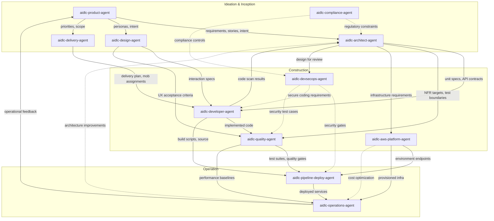

# エージェントリファレンス

AI-DLC のエージェント 14 体の技術リファレンスです。領域の専門家 11、レビュー専用 2、適応型ワークフローのコンポーザー 1。

設計思想と理由は [User Guide のエージェント章](../../guide/06-agents.md) です。

---

## 14 体（領域 11 + レビュアー 2 + コンポーザー）

| # | エージェント | 領域 |
|---|-------|--------|
| 1 | [aidlc-product-agent](product-agent.md) | 要件、スコープ、ユーザーストーリー、市場調査 |
| 2 | [aidlc-design-agent](design-agent.md) | UX/UI、ワイヤーフレーム、インタラクション設計、アクセシビリティ |
| 3 | [aidlc-delivery-agent](delivery-agent.md) | チーム編成、キャパシティ計画、デリバリ順 |
| 4 | [aidlc-architect-agent](architect-agent.md) | ドメイン設計、ドメインモデリング、NFR、分解 |
| 5 | [aidlc-aws-platform-agent](aws-platform-agent.md) | AWS インフラ、IaC、FinOps、環境プロビジョニング |
| 6 | [aidlc-compliance-agent](compliance-agent.md) | GRC、規制マッピング、データ分類、リスク |
| 7 | [aidlc-devsecops-agent](devsecops-agent.md) | 脅威モデリング、セキュリティパイプライン、セキュア設計レビュー |
| 8 | [aidlc-developer-agent](developer-agent.md) | コード生成、リバースエンジニアリング、実装案内 |
| 9 | [aidlc-quality-agent](quality-agent.md) | テスト戦略、受け入れ基準、性能検証 |
| 10 | [aidlc-pipeline-deploy-agent](pipeline-deploy-agent.md) | CI/CD パイプライン、デプロイ戦略、リリース実行 |
| 11 | [aidlc-operations-agent](operations-agent.md) | 可観測性、インシデント対応、フィードバックループ |
| 12 | aidlc-product-lead-agent | レビュー専用: 要件 / ユーザーストーリー / UX の品質ゲート（balanced ティア） |
| 13 | aidlc-architecture-reviewer-agent | レビュー専用: 技術設計の健全さ / 実装可能性ゲート（balanced ティア） |
| 14 | aidlc-composer-agent | 適応型ワークフロー合成: 仕立てたステージ計画と、残ステージの再形成を提案する |

---

## 共有設定

手で書く 14 エージェントは、共通の frontmatter ベースラインを共有します。Claude Code ではどれも `tools:` 許可リストを宣言しないので、どのエージェントも**セッションのツール一式**と用意された MCP ツールを継ぎ、ネストした委譲の拒否は `disallowedTools: Task` です。ほかのハーネスはその意図をネイティブ方針へ投影します。Kiro のエージェント Markdown は未対応のキーを省き、Kiro CLI JSON と Kiro IDE の `tools:` 付与は委譲先から `subagent` を外します。レビュー専用の 2 体はさらに `maxTurns: 60` を持ちます。ハーネスにレバーがあるところでネイティブに強制する硬いターン上限です。Claude Code では frontmatter キーが拘束します（サブエージェントはタスク途中で止まり、最終メッセージは無し）。opencode ではパッケージャがネイティブのエージェント単位 `steps: 60` へ投影します（ランナーは最後のテキスト専用手番を一つ許す — 要約は返せるが、ツール呼び出しでレビューは書けない）。Codex TOML ペルソナは数字を散文としてだけ運びます（TOML ペルソナに frontmatter が無いので、emit が引用を書き換える）。Cursor、Copilot、Kiro はエージェント単位の上限キーを露出していません（未知キーを許す .md 面には効かない `maxTurns:` キーは出荷する。kiro のエージェント JSON には載せない）。§12a の未完了試行ガードは、上限で切れたレビューを一度再ディスパッチし、それから静かに欠ける判定ではなく NOT-READY 所見にします。コンダクターはディスパッチのたびに既存の `## Review` 節を消すので、古い判定が欠けた判定の代用にはなりません。

### Claude Code のセッションツール一式

どの Claude Code エージェントも組み込みツールを継ぎます。含まれるものは次です。

| Claude Code ツール | 目的 |
|------------------|---------|
| Read | ファイルシステムから読む |
| Edit | ファイル内の正確な文字列置換 |
| Write | ファイルシステムへ書く |
| Glob | 速いファイルパターン照合 |
| Grep | ripgrep による内容検索 |
| AskUserQuestion | 対話のプロンプト（メインスレッドのステージだけ） |

### 共通で禁じる Claude Code ツール

| Claude Code ツール | 理由 |
|------------------|--------|
| Task | エージェントは委譲された働き手です。`Task` 呼び出しをするのはコンダクターです。Claude は `disallowedTools: Task` を強制し、ほかのハーネスはネイティブの拒否 / 許可リスト相当を使います。 |

### 各ペルソナが使うと方法論が期待するツール

Claude Code では、どのエージェントも継承で Bash と WebSearch に*届きます*。表は、方法論が**使うと期待する**ペルソナであり、エージェント単位の付与ではありません。Claude のペルソナを本当に狭めるなら、任意の `tools:` 許可リストを足します（継承 MCP は落ちるので、残すなら `mcp__<server>__<tool>` id も列挙します）。

| Claude Code ツール | 使うと期待される相手 |
|------------------|---------------------|
| Bash | aidlc-aws-platform-agent、aidlc-devsecops-agent、aidlc-developer-agent、aidlc-quality-agent、aidlc-pipeline-deploy-agent、aidlc-operations-agent |
| WebSearch | aidlc-product-agent、aidlc-design-agent、aidlc-compliance-agent |

### エージェントティア

| ティア | エージェント |
|------|--------|
| judgment | aidlc-architect-agent、aidlc-product-agent、aidlc-design-agent、aidlc-developer-agent、aidlc-quality-agent、aidlc-devsecops-agent、aidlc-compliance-agent、aidlc-aws-platform-agent、aidlc-composer-agent |
| balanced | aidlc-architecture-reviewer-agent、aidlc-product-lead-agent |
| templated | aidlc-delivery-agent、aidlc-pipeline-deploy-agent、aidlc-operations-agent |

出荷するどのエージェントも、書いた frontmatter に `tier:` を宣言します。パッケージャが各ハーネスのネイティブ model / effort キーへ投影します（Claude Code: judgment → `model: inherit` で effort ピンなし、balanced → `model: sonnet` + `effort: medium`、templated → `model: sonnet` + `effort: medium`）。だから judgment エージェントは、セッション自身のモデルと effort より下へは下がりません。templated になるのは、出力が型に従うことが主なときだけです — デリバリ計画、CI/CD YAML、可観測性とランブックの骨組み — 方法論はすでにエージェントのナレッジファイルにあります。

judgment の 9 体は一つの性質を共有します。仕事が複数拘束の推論を要求し、判断が下流へ波及します。アーキテクチャ境界、曖昧なインテントの解釈、UX のトレードオフ、濃い文脈下のコード合成、リスクに基づくテスト戦略、脅威の優先、規制の端、クラウドアーキテクチャのトレードオフがこの類です。balanced のレビュアー 2 体は、明示基準に対する新規入力を評価します。チェックリストが方法を符号化しているので、中型モデルの `medium` effort で足ります。balanced と templated は、いま Claude Code、Codex、opencode では投影が同じですが、片方だけ調律できるように分けてあります。Kiro、Cursor、Copilot ではどのティアもセッションのモデルと effort を継ぎます。投影表と `tier_cap` 上書きは [Agent System](../05-agent-system.md) です。

---

## エージェント要約表

| エージェント | リードステージ | サポートステージ | ティア | 使うと期待されるツール |
|-------|-------------|----------------|-------|------------------------------|
| [aidlc-product-agent](product-agent.md) | intent-capture、market-research、scope-definition、requirements-analysis、user-stories | rough-mockups、approval-handoff、refined-mockups | judgment | WebSearch |
| [aidlc-design-agent](design-agent.md) | rough-mockups、refined-mockups | user-stories、domain-design | judgment | WebSearch |
| [aidlc-delivery-agent](delivery-agent.md) | team-formation、approval-handoff、delivery-planning | scope-definition、units-generation | templated | -- |
| [aidlc-architect-agent](architect-agent.md) | feasibility、domain-design、units-generation、functional-design、nfr-requirements、nfr-design | intent-capture、reverse-engineering（合成）、delivery-planning | judgment | -- |
| [aidlc-aws-platform-agent](aws-platform-agent.md) | infrastructure-design、environment-provisioning | feasibility、domain-design、nfr-design、feedback-optimization | judgment | Bash |
| [aidlc-compliance-agent](compliance-agent.md) | （なし） | feasibility、nfr-requirements、infrastructure-design、environment-provisioning | judgment | WebSearch |
| [aidlc-devsecops-agent](devsecops-agent.md) | （なし） | practices-discovery、nfr-requirements、infrastructure-design、build-and-test、environment-provisioning | judgment | Bash |
| [aidlc-developer-agent](developer-agent.md) | reverse-engineering（コードスキャン）、code-generation | practices-discovery、user-stories、functional-design、deployment-execution | judgment | Bash |
| [aidlc-quality-agent](quality-agent.md) | build-and-test、performance-validation | practices-discovery、user-stories、nfr-requirements | judgment | Bash |
| [aidlc-pipeline-deploy-agent](pipeline-deploy-agent.md) | practices-discovery、ci-pipeline、deployment-pipeline、deployment-execution | （なし） | templated | Bash |
| [aidlc-operations-agent](operations-agent.md) | observability-setup、incident-response、feedback-optimization | （なし） | templated | Bash |

---

## エージェント比較マトリクス

次の二列の `Yes` は、方法論がその継承ツールを使うと期待することであり、アクセスの付与や剥奪ではありません。

| エージェント | Bash を使う期待 | WebSearch を使う期待 | ティア | リードステージ | サポートステージ | ステージ関与の合計 |
|-------|-------------------|------------------------|------|-------------|----------------|-------------------------|
| aidlc-product-agent | No | Yes | judgment | 5 | 3 | 8 |
| aidlc-design-agent | No | Yes | judgment | 2 | 2 | 4 |
| aidlc-delivery-agent | No | No | templated | 3 | 2 | 5 |
| aidlc-architect-agent | No | No | judgment | 7 | 3 | 10 |
| aidlc-aws-platform-agent | Yes | No | judgment | 2 | 5 | 7 |
| aidlc-compliance-agent | No | Yes | judgment | 0 | 4 | 4 |
| aidlc-devsecops-agent | Yes | No | judgment | 0 | 5 | 5 |
| aidlc-developer-agent | Yes | No | judgment | 2 | 4 | 6 |
| aidlc-quality-agent | Yes | No | judgment | 2 | 3 | 5 |
| aidlc-pipeline-deploy-agent | Yes | No | templated | 4 | 0 | 4 |
| aidlc-operations-agent | Yes | No | templated | 3 | 0 | 3 |

**所見:**
- aidlc-architect-agent のステージ関与が一番広いです（3 フェーズ・10 ステージ）。中核の設計権威としての役割を映します。
- 14 体全体では、9 体が `judgment` ティアで、5 体は Claude Code、Codex、opencode で一段下がります（`balanced` レビュアー 2 と `templated` 計画 3。Kiro、Cursor、Copilot ではどのティアもセッションのモデルと effort を継ぐので、そこでは誰も下がりません）。下がるエージェントは、明示チェックリストに対するレビューか、型が主の計画・CI/CD・ランブックです。上のマトリクスは領域の専門家 11 です。
- aidlc-compliance-agent は助言だけです（Ideation、Construction、Operation にまたがるサポート 4。リードなし）。
- 11 のうち 6 が、CLI 操作で Bash を使うと期待されます（インフラ、セキュリティ、開発、テスト、デプロイ、運用）。
- 3 体が、調査で WebSearch を使うと期待されます（プロダクト、デザイン、コンプライアンス）。

---

## フェーズ参加

どのエージェントがどのフェーズで動き、リード（L）かサポート（S）かを示します。

| エージェント | Initialization（フェーズ 0） | Ideation（フェーズ 1） | Inception（フェーズ 2） | Construction（フェーズ 3） | Operation（フェーズ 4） |
|-------|--------------------------|---------------------|---------------------|------------------------|---------------------|
| aidlc-product-agent | -- | L (intent-capture, market-research, scope-definition), S (rough-mockups, approval-handoff) | L (requirements-analysis, user-stories), S (refined-mockups) | -- | -- |
| aidlc-design-agent | -- | L (rough-mockups) | L (refined-mockups), S (user-stories, domain-design) | -- | -- |
| aidlc-delivery-agent | -- | L (team-formation, approval-handoff), S (scope-definition) | L (delivery-planning), S (units-generation) | -- | -- |
| aidlc-architect-agent | -- | L (feasibility), S (intent-capture) | L (domain-design, units-generation), S (reverse-engineering, delivery-planning) | L (functional-design, nfr-requirements, nfr-design) | -- |
| aidlc-aws-platform-agent | -- | S (feasibility) | S (domain-design) | L (infrastructure-design), S (nfr-design) | L (environment-provisioning), S (feedback-optimization) |
| aidlc-compliance-agent | -- | S (feasibility) | -- | S (nfr-requirements, infrastructure-design) | S (environment-provisioning) |
| aidlc-devsecops-agent | -- | -- | S (practices-discovery) | S (nfr-requirements, infrastructure-design, build-and-test) | S (environment-provisioning) |
| aidlc-developer-agent | -- | -- | L (reverse-engineering), S (practices-discovery, user-stories) | L (code-generation), S (functional-design) | S (deployment-execution) |
| aidlc-quality-agent | -- | -- | S (practices-discovery, user-stories) | L (build-and-test), S (nfr-requirements) | L (performance-validation) |
| aidlc-pipeline-deploy-agent | -- | -- | L (practices-discovery) | L (ci-pipeline) | L (deployment-pipeline, deployment-execution) |
| aidlc-operations-agent | -- | -- | -- | -- | L (observability-setup, incident-response, feedback-optimization) |

---

## エージェント協働マップ



### テキストフォールバック

```
aidlc-product-agent
  |-- requirements, stories --> aidlc-architect-agent
  |-- personas, intent -------> aidlc-design-agent
  |-- priorities, scope ------> aidlc-delivery-agent

aidlc-design-agent
  |-- interaction specs ------> aidlc-developer-agent
  |-- UX acceptance criteria -> aidlc-quality-agent

aidlc-architect-agent
  |-- unit specs, API contracts --> aidlc-developer-agent
  |-- NFR targets, test boundaries --> aidlc-quality-agent
  |-- infrastructure requirements --> aidlc-aws-platform-agent
  |-- design for review -----------> aidlc-devsecops-agent

aidlc-compliance-agent
  |-- regulatory constraints ....> aidlc-architect-agent
  |-- compliance controls .......> aidlc-devsecops-agent

aidlc-devsecops-agent
  |-- security gates ............> aidlc-pipeline-deploy-agent
  |-- secure coding requirements > aidlc-developer-agent
  |-- security test cases .......> aidlc-quality-agent

aidlc-delivery-agent
  |-- delivery plan, mob assignments --> aidlc-developer-agent

aidlc-developer-agent
  |-- code scan results --> aidlc-architect-agent
  |-- implemented code ---> aidlc-quality-agent
  |-- build scripts ------> aidlc-pipeline-deploy-agent

aidlc-quality-agent
  |-- test suites, quality gates --> aidlc-pipeline-deploy-agent
  |-- performance baselines ------> aidlc-operations-agent

aidlc-aws-platform-agent
  |-- environment endpoints --> aidlc-pipeline-deploy-agent
  |-- provisioned infra -----> aidlc-operations-agent

aidlc-pipeline-deploy-agent
  |-- deployed services --> aidlc-operations-agent

aidlc-operations-agent
  |-- operational feedback -------> aidlc-product-agent  (CLOSES THE LOOP)
  |-- architecture improvements .> aidlc-architect-agent
```

---

## 相互参照

- [Architecture Overview](../01-architecture.md)
- [Orchestrator](../03-orchestrator.md)
- [Agent System](../05-agent-system.md)
- [Stage Documentation](../04-stages/)
- [User Guide のエージェント章（思想と理由）](../../guide/06-agents.md)
- [SKILL.md（コンダクター）](../../../dist/claude/.claude/skills/aidlc/SKILL.md) — エンジンのディレクティブに従う転送ループ。人が読むステージグラフの鏡を持つ
