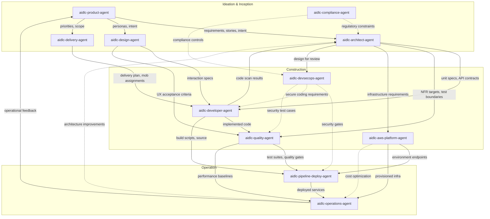

# エージェントリファレンス

AI-DLC のエージェント 14 の技術リファレンスです。領域の専門家 11、レビュー専用 2、適応型ワークフローのコンポーザー。

設計思想と理屈は [User Guide の Agents 章](../../guide/06-agents.md) です。

---

## エージェント 14（領域の専門家 11 + レビュアー 2 + コンポーザー）

| # | エージェント | 領域 |
|---|-------|--------|
| 1 | [aidlc-product-agent](product-agent.md) | 要件、スコープ、ユーザーストーリー、市場調査 |
| 2 | [aidlc-design-agent](design-agent.md) | UX/UI、ワイヤーフレーム、インタラクションデザイン、アクセシビリティ |
| 3 | [aidlc-delivery-agent](delivery-agent.md) | チーム編成、キャパシティ計画、デリバリー順序 |
| 4 | [aidlc-architect-agent](architect-agent.md) | ドメイン設計、ドメインモデリング、NFR、分解 |
| 5 | [aidlc-aws-platform-agent](aws-platform-agent.md) | AWS インフラ、IaC、FinOps、環境プロビジョニング |
| 6 | [aidlc-compliance-agent](compliance-agent.md) | GRC、規制の写像、データ分類、リスク |
| 7 | [aidlc-devsecops-agent](devsecops-agent.md) | 脅威モデリング、セキュリティパイプライン、セキュア設計レビュー |
| 8 | [aidlc-developer-agent](developer-agent.md) | コード生成、リバースエンジニアリング、実装案内 |
| 9 | [aidlc-quality-agent](quality-agent.md) | テスト戦略、受け入れ基準、性能検証 |
| 10 | [aidlc-pipeline-deploy-agent](pipeline-deploy-agent.md) | CI/CD パイプライン、デプロイ戦略、リリース実行 |
| 11 | [aidlc-operations-agent](operations-agent.md) | 観測、インシデント対応、フィードバックループ |
| 12 | aidlc-product-lead-agent | レビュー専用: 要件 / ユーザーストーリー / UX 品質ゲート（balanced ティア） |
| 13 | aidlc-architecture-reviewer-agent | レビュー専用: 技術設計の健全さ / 実装可能性ゲート（balanced ティア） |
| 14 | aidlc-composer-agent | 適応型ワークフロー編成: 寄せたステージ計画と保留ステージの再形を提案 |

---

## 共有設定

書いたエージェント 14 は共通の frontmatter 基準を共有します。Claude Code ではどれも `tools:` 許可リストを宣言しないので、どのエージェントも **セッションのツール一式** と供給された MCP ツールを継ぎ、入れ子委譲の拒否として `disallowedTools: Task` を持ちます。ほかのハーネスはその意図をネイティブ方針へ投影します。Kiro エージェント Markdown は未対応のキーを省き、Kiro CLI JSON と Kiro IDE の `tools:` 付与は委譲先から `subagent` を外します。レビュー専用 2 つは追加で `maxTurns: 60` を運びます。ハーネスにレバーがあるところではネイティブに強制される硬いターンの止めです。Claude Code では frontmatter キーが拘束します（サブエージェントはタスクの途中で止まり、最終メッセージは無し）。opencode ではパッケージャがネイティブのエージェントごとの `steps: 60` へ投影します（ランナーは最後のテキストのみターンを 1 回与えます。要約は返せますが、ツール呼び出しはレビューを書けません）。Codex TOML ペルソナは数字を散文としてだけ運びます（TOML ペルソナに frontmatter は無いので、emit が引用を書き換えます）。Cursor、Copilot、Kiro はエージェントごとの cap キーを出しません（惰性の `maxTurns:` キーは未知キーを許す .md 面にはそれでも出荷されます。kiro エージェント JSON は決して受け取りません）。§12a の不完全試行ガードは、cap で切れたレビューを、黙って欠けた判定ではなく、一度再試行した派遣とそのあと NOT-READY 所見に変えます。コンダクターはどの派遣の前にも既存の `## Review` 節を消すので、古い判定が欠けたものの代わりに立てることはありません。

### Claude Code セッションのツール一式

どの Claude Code エージェントも組み込みツールを継ぎます。含むもの:

| Claude Code ツール | 目的 |
|------------------|---------|
| Read | ファイルシステムからファイルを読む |
| Edit | ファイル内の正確な文字列置換 |
| Write | ファイルシステムへファイルを書く |
| Glob | 速いファイルパターン一致 |
| Grep | ripgrep による内容検索 |
| AskUserQuestion | 対話の利用者プロンプト（メインスレッドのステージのみ） |

### 共通で禁じる Claude Code ツール

| Claude Code ツール | 理由 |
|------------------|--------|
| Task | エージェントは委譲された働き手として動きます。コンダクターが `Task` 呼び出しをします。Claude は `disallowedTools: Task` を強制し、ほかのハーネスはネイティブの拒否 / 許可リスト相当を使います。 |

### 各ペルソナが行使すると期待されるツール

Claude Code ではどのエージェントも継承で Bash と WebSearch に *届きます*。表は方法論がそれらを使うと **期待する** ペルソナを記録し、エージェントごとの付与ではありません。Claude ペルソナを本当に制限するには、任意の `tools:` 許可リストを足します（`mcp__<server>__<tool>` id も列挙しない限り継いだ MCP は落ちます）。

| Claude Code ツール | 行使すると期待される対象 |
|------------------|---------------------|
| Bash | aidlc-aws-platform-agent、aidlc-devsecops-agent、aidlc-developer-agent、aidlc-quality-agent、aidlc-pipeline-deploy-agent、aidlc-operations-agent |
| WebSearch | aidlc-product-agent、aidlc-design-agent、aidlc-compliance-agent |

### エージェントティア

| ティア | エージェント |
|------|--------|
| judgment | aidlc-architect-agent、aidlc-product-agent、aidlc-design-agent、aidlc-developer-agent、aidlc-quality-agent、aidlc-devsecops-agent、aidlc-compliance-agent、aidlc-aws-platform-agent、aidlc-composer-agent |
| balanced | aidlc-architecture-reviewer-agent、aidlc-product-lead-agent |
| templated | aidlc-delivery-agent、aidlc-pipeline-deploy-agent、aidlc-operations-agent |

同梱のエージェントはどれも書いた frontmatter に `tier:` を宣言します。パッケージャはそれを各ハーネスのネイティブモデル / effort キーへ投影します（Claude Code: judgment → `model: inherit` で effort ピン無し、balanced → `model: sonnet` + `effort: medium`、templated → `model: inherit` で effort ピン無し）。だから judgment と templated エージェントはセッション自身のモデルと effort を継ぎます。エージェントが templated なのは、出力が主にパターン追従 — デリバリー計画、CI/CD YAML、観測とランブックの足場 — で、方法論がすでにエージェントのナレッジファイルに符号化されているときだけです。ティアは `aidlc config models` の Writing up グループのままです。プロジェクトは以前の格下げを、インストールごとの明示選択として記録できます。

judgment エージェント 9 つが共有する性質: 仕事は下流へ波及する判断の多制約推論を要します。アーキテクチャ境界、曖昧な意図の解釈、UX のトレードオフ、密な文脈の下でのコード合成、リスクベースのテスト戦略、脅威の優先、規制の端、クラウドアーキテクチャのトレードオフは全部この類です。balanced レビュアー 2 つは明示した基準に対して新しい入力を評価します。チェックリストが方法を符号化するので、セッション effort の中サイズモデルで足ります。同梱の balanced 基準は Claude Code、Codex、opencode で medium effort をピンします。Kiro、Cursor、Copilot では全ティアがセッションのモデルと effort を継ぎます。投影表と `tier_cap` 上書きは [Agent System](../05-agent-system.md) です。

---

## エージェント要約表

| エージェント | リードステージ | 支援ステージ | ティア | 行使すると期待されるツール |
|-------|-------------|----------------|-------|------------------------------|
| [aidlc-product-agent](product-agent.md) | intent-capture、market-research、scope-definition、requirements-analysis、user-stories | rough-mockups、approval-handoff、refined-mockups | judgment | WebSearch |
| [aidlc-design-agent](design-agent.md) | rough-mockups、refined-mockups | user-stories、domain-design | judgment | WebSearch |
| [aidlc-delivery-agent](delivery-agent.md) | team-formation、approval-handoff、delivery-planning | scope-definition、units-generation | templated | -- |
| [aidlc-architect-agent](architect-agent.md) | feasibility、domain-design、units-generation、functional-design、nfr-requirements、nfr-design | intent-capture、reverse-engineering（合成）、delivery-planning | judgment | -- |
| [aidlc-aws-platform-agent](aws-platform-agent.md) | infrastructure-design、environment-provisioning | feasibility、domain-design、nfr-design、feedback-optimization | judgment | Bash |
| [aidlc-compliance-agent](compliance-agent.md) | （無し） | feasibility、nfr-requirements、infrastructure-design、environment-provisioning | judgment | WebSearch |
| [aidlc-devsecops-agent](devsecops-agent.md) | （無し） | practices-discovery、nfr-requirements、infrastructure-design、build-and-test、environment-provisioning | judgment | Bash |
| [aidlc-developer-agent](developer-agent.md) | reverse-engineering（コードスキャン）、code-generation | practices-discovery、user-stories、functional-design、deployment-execution | judgment | Bash |
| [aidlc-quality-agent](quality-agent.md) | build-and-test、performance-validation | practices-discovery、user-stories、nfr-requirements | judgment | Bash |
| [aidlc-pipeline-deploy-agent](pipeline-deploy-agent.md) | practices-discovery、ci-pipeline、deployment-pipeline、deployment-execution | （無し） | templated | Bash |
| [aidlc-operations-agent](operations-agent.md) | observability-setup、incident-response、feedback-optimization | （無し） | templated | Bash |

---

## エージェント比較マトリクス

次の 2 列の `Yes` は、方法論がそのペルソナに継いだツールを使うと期待するという意味です。アクセスを付与も保留もしません。

| エージェント | Bash 期待使用 | WebSearch 期待使用 | ティア | リードステージ | 支援ステージ | ステージ関与合計 |
|-------|-------------------|------------------------|------|-------------|----------------|-------------------------|
| aidlc-product-agent | No | Yes | judgment | 5 | 3 | 8 |
| aidlc-design-agent | No | Yes | judgment | 2 | 2 | 4 |
| aidlc-delivery-agent | No | No | templated | 3 | 2 | 5 |
| aidlc-architect-agent | No | No | judgment | 7 | 3 | 10 |
| aidlc-aws-platform-agent | Yes | No | judgment | 2 | 5 | 7 |
| aidlc-compliance-agent | No | Yes | judgment | 0 | 4 | 4 |
| aidlc-devsecops-agent | Yes | No | judgment | 0 | 5 | 5 |
| aidlc-developer-agent | Yes | No | judgment | 2 | 4 | 6 |
| aidlc-quality-agent | Yes | No | judgment | 2 | 3 | 5 |
| aidlc-pipeline-deploy-agent | Yes | No | templated | 4 | 0 | 4 |
| aidlc-operations-agent | Yes | No | templated | 3 | 0 | 3 |

**観察:**
- aidlc-architect-agent がいちばん広いステージ関与です（3 フェーズ横断で 10 ステージ）。中心の設計権威としての役割を映します。
- エージェント 14 全体では、9 が `judgment` ティア、3 が継ぐ `templated` ティア、`balanced` レビュアー 2 つだけが Claude Code、Codex、opencode で下がります。Kiro、Cursor、Copilot では全ティアがセッションのモデルと effort を継ぎます。上のマトリクスは領域の専門家 11 をカバーします。
- aidlc-compliance-agent は純粋に助言として動きます（Ideation、Construction、Operation 横断で支援 4、リードステージ無し）。
- 11 のうち 6 が CLI やりとりに Bash を使うと期待されます（インフラ、セキュリティ、開発、テスト、デプロイ、オペレーション）。
- 3 エージェントが調査タスクに WebSearch を使うと期待されます（プロダクト、デザイン、コンプライアンス）。

---

## フェーズ参加

この表は、どのエージェントがどのフェーズでアクティブか、そのフェーズでリード（L）か支援（S）かを示します。

| エージェント | Initialization（フェーズ 0） | Ideation（フェーズ 1） | Inception（フェーズ 2） | Construction（フェーズ 3） | Operation（フェーズ 4） |
|-------|--------------------------|---------------------|---------------------|------------------------|---------------------|
| aidlc-product-agent | -- | L（intent-capture、market-research、scope-definition）、S（rough-mockups、approval-handoff） | L（requirements-analysis、user-stories）、S（refined-mockups） | -- | -- |
| aidlc-design-agent | -- | L（rough-mockups） | L（refined-mockups）、S（user-stories、domain-design） | -- | -- |
| aidlc-delivery-agent | -- | L（team-formation、approval-handoff）、S（scope-definition） | L（delivery-planning）、S（units-generation） | -- | -- |
| aidlc-architect-agent | -- | L（feasibility）、S（intent-capture） | L（domain-design、units-generation）、S（reverse-engineering、delivery-planning） | L（functional-design、nfr-requirements、nfr-design） | -- |
| aidlc-aws-platform-agent | -- | S（feasibility） | S（domain-design） | L（infrastructure-design）、S（nfr-design） | L（environment-provisioning）、S（feedback-optimization） |
| aidlc-compliance-agent | -- | S（feasibility） | -- | S（nfr-requirements、infrastructure-design） | S（environment-provisioning） |
| aidlc-devsecops-agent | -- | -- | S（practices-discovery） | S（nfr-requirements、infrastructure-design、build-and-test） | S（environment-provisioning） |
| aidlc-developer-agent | -- | -- | L（reverse-engineering）、S（practices-discovery、user-stories） | L（code-generation）、S（functional-design） | S（deployment-execution） |
| aidlc-quality-agent | -- | -- | S（practices-discovery、user-stories） | L（build-and-test）、S（nfr-requirements） | L（performance-validation） |
| aidlc-pipeline-deploy-agent | -- | -- | L（practices-discovery） | L（ci-pipeline） | L（deployment-pipeline、deployment-execution） |
| aidlc-operations-agent | -- | -- | -- | -- | L（observability-setup、incident-response、feedback-optimization） |

---

## エージェント協働図



### テキスト代替

```
aidlc-product-agent
  |-- requirements, stories --> aidlc-architect-agent
  |-- personas, intent -------> aidlc-design-agent
  |-- priorities, scope ------> aidlc-delivery-agent

aidlc-design-agent
  |-- interaction specs ------> aidlc-developer-agent
  |-- UX acceptance criteria -> aidlc-quality-agent

aidlc-architect-agent
  |-- unit specs, API contracts --> aidlc-developer-agent
  |-- NFR targets, test boundaries --> aidlc-quality-agent
  |-- infrastructure requirements --> aidlc-aws-platform-agent
  |-- design for review -----------> aidlc-devsecops-agent

aidlc-compliance-agent
  |-- regulatory constraints ....> aidlc-architect-agent
  |-- compliance controls .......> aidlc-devsecops-agent

aidlc-devsecops-agent
  |-- security gates ............> aidlc-pipeline-deploy-agent
  |-- secure coding requirements > aidlc-developer-agent
  |-- security test cases .......> aidlc-quality-agent

aidlc-delivery-agent
  |-- delivery plan, mob assignments --> aidlc-developer-agent

aidlc-developer-agent
  |-- code scan results --> aidlc-architect-agent
  |-- implemented code ---> aidlc-quality-agent
  |-- build scripts ------> aidlc-pipeline-deploy-agent

aidlc-quality-agent
  |-- test suites, quality gates --> aidlc-pipeline-deploy-agent
  |-- performance baselines ------> aidlc-operations-agent

aidlc-aws-platform-agent
  |-- environment endpoints --> aidlc-pipeline-deploy-agent
  |-- provisioned infra -----> aidlc-operations-agent

aidlc-pipeline-deploy-agent
  |-- deployed services --> aidlc-operations-agent

aidlc-operations-agent
  |-- operational feedback -------> aidlc-product-agent  (CLOSES THE LOOP)
  |-- architecture improvements .> aidlc-architect-agent
```

---

## 関連

- [Architecture Overview](../01-architecture.md)
- [Orchestrator](../03-orchestrator.md)
- [Agent System](../05-agent-system.md)
- [Stage Documentation](../04-stages/)
- [User Guide の Agents 章（思想と理屈）](../../guide/06-agents.md)
- [SKILL.md（コンダクターの書いたソース）](../../../harness/claude/skills/aidlc/SKILL.md) — エンジンディレクティブに動く転送ループ。人が読むステージグラフの鏡を運ぶ
