# AI-DLC ワークフローの図

この文書は、AI-DLC（AI-Driven Development Life Cycle）の方法論を可視化する Mermaid 図をすべて載せます。各節は短い説明のあとに図です。図はエンジンとコンダクター（`aidlc-orchestrate.ts` + `SKILL.md`）、ステージプロトコル（`stage-protocol.md`）、ステージファイル、エージェント定義から起こしています。

> **Note:** これらの図は、関係するリファレンス章にもインラインで入っています。このファイルは、全図を一箇所に集めた索引です。図中の `<record>/` は、アクティブなインテントのレコードディレクトリ、`aidlc/spaces/<space>/intents/<YYMMDD>-<label>/` です。
>
> - Diagrams 1 and 7: [Architecture](01-architecture.md)
> - Diagram 8: [Orchestrator](03-orchestrator.md) -- Session Management section
> - Diagram 9: [Orchestrator](03-orchestrator.md) -- Scope Routing section
> - Diagram 10: [Knowledge System](10-knowledge-system.md)
> - Diagram 11: [Stage Protocol](04-stage-protocol.md) -- Approval Gates section
> - Diagram 12: [Orchestrator](03-orchestrator.md) -- State Tracking section

---

## 1. End-to-End Lifecycle

AI-DLC の方法論は、仕事を 5 つの連続するフェーズに分けます。各フェーズの境には検証ゲートがあり、次のフェーズへ進む前に通らなければなりません。ライフサイクル全体は 5 フェーズにまたがる 33 ステージで、実際に走るステージはスコープが決めます。

```mermaid
graph LR
    subgraph INITIALIZATION["INITIALIZATION (0.1-0.3)"]
        Z1["Workspace Scaffold"]
        Z4["State Init"]
        Z1 -.->|"3 stages"| Z4
    end

    subgraph IDEATION["IDEATION (1.1-1.7)"]
        I1["Intent Capture"]
        I7["Approval & Handoff"]
        I1 -.->|"7 stages"| I7
    end

    subgraph INCEPTION["INCEPTION (2.1-2.9)"]
        N1["Reverse Engineering"]
        N7["Delivery Planning"]
        N1 -.->|"9 stages"| N7
    end

    subgraph CONSTRUCTION["CONSTRUCTION (3.1-3.7)"]
        C1["Functional Design"]
        C7["CI Pipeline"]
        C1 -.->|"3.1–3.5 stage-major per Unit; 3.6–3.7 once after all Units"| C7
    end

    subgraph OPERATION["OPERATION (4.1-4.7)"]
        O1["Deployment Pipeline"]
        O7["Feedback & Optimization"]
        O1 -.->|"7 stages"| O7
    end

    Z4 -->|"auto-proceed"| I1
    I7 -->|"Verification Gate 1"| N1
    N7 -->|"Verification Gate 2"| C1
    C7 -->|"Verification Gate 3"| O1
    O7 -.->|"Feedback Loop"| I1

    style INITIALIZATION fill:#f3e5f5,stroke:#9c27b0,color:#000
    style IDEATION fill:#e8f5e9,stroke:#4caf50,color:#000
    style INCEPTION fill:#e3f2fd,stroke:#2196f3,color:#000
    style CONSTRUCTION fill:#fff3e0,stroke:#ff9800,color:#000
    style OPERATION fill:#fce4ec,stroke:#e91e63,color:#000
```

---

## 2. Ideation Flow

Ideation フェーズは、ビジネスインテントを捉え、実現性を検証し、スコープを定め、チームを組み、ラフモックを作り、承認用のイニシアチブブリーフを出します。ALWAYS のステージはどのスコープでも走り、CONDITIONAL のステージは一部のスコープで飛ばします（例: poc、bugfix、refactor は Market Research を飛ばす）。実線の矢印は ALWAYS の経路、破線は CONDITIONAL の経路です。

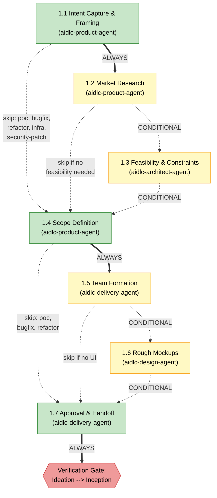

---

## 3. Inception Flow

Inception フェーズは、コードベースを分析し（brownfield プロジェクト）、チームのプラクティスを発見し、要件を引き出し、ユーザーストーリーとモックを作り、アプリケーションアーキテクチャを設計し、実装ユニットへ分解し、デリバリーを計画します。ステージ 2.1（Reverse Engineering）はパイプライン（2 段チェーン）で走り、六角形で示します。先に developer サブエージェントがコードをスキャンし、続けて architect サブエージェントが結果を合成して成果物を書きます。

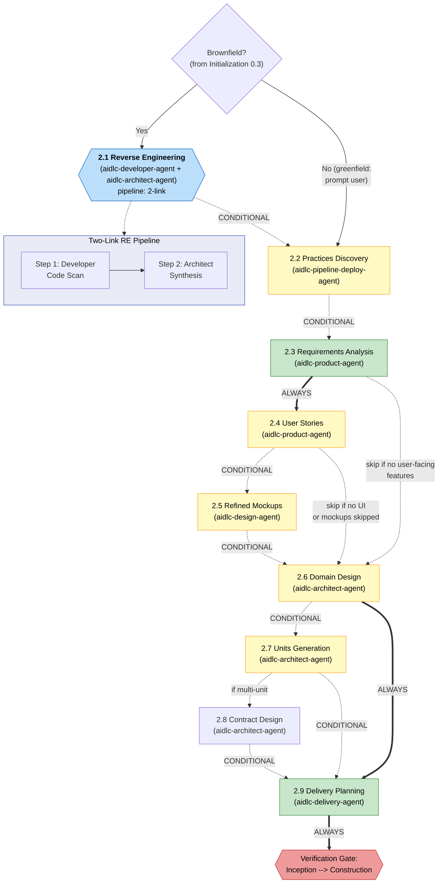

---

## 4. Construction Flow

Construction フェーズの **既定ウォークは stage-major** です。対象のステージを全ユニットに走らせてから、次のステージへ。実行時バッチは `unit-of-work-dependency.md`（2.7）から出ます。`bolt-plan.md` は 2.9 の計画成果物であり、ウォークの正本ではありません。ウォーキングスケルトンのゲートは、対象になる最初の Construction EXECUTE ステージです。あとのユニットは DAG が許せば並行バッチで走れます。ユニットごとのステージがすべて落ち着いたあと、ステージ 3.6（Build and Test）と 3.7（CI Pipeline）が一度走ります。ステージ 3.5（Code Generation）はサブエージェントで走り、六角形で示します。

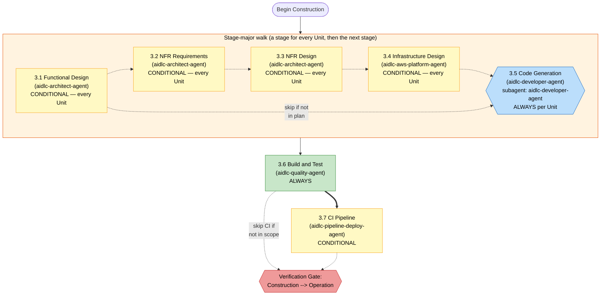

---

## 5. Operation Flow

Operation フェーズは、デプロイ、環境プロビジョニング、可観測性、インシデント対応、性能検証、フィードバックを扱います。7 ステージすべて CONDITIONAL です（mvp と poc ではフェーズごと飛ばすことがあります）。ステージはすべてインラインです。ステージ 4.7 が終端で、承認されるとワークフロー完了、または新しい Ideation サイクルを始められます。

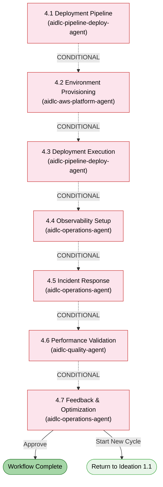

---

## 6. Agent Collaboration Map

エージェントは全 14。領域エージェント 11、レビュー専用 2、適応型ワークフローのコンポーザー 1 です。この図は意図して、領域エージェント 11 とその主な成果物の流れだけを扱います。レビュー専用エージェントは、プロダクトとアーキテクチャの独立した点検をします。コンポーザーは適応型のステージ計画を提案し、形を変えます。詳細は [Agent Reference](agents/README.md) と [Reviewer Invocation](04-stage-protocol.md#reviewer-invocation) です。

コンダクター（SKILL.md）は、エンジンの指示どおりに各エージェントを呼び出します。エージェント同士が直接呼び合うことはありません。情報は、インテントのレコードディレクトリ（`aidlc/spaces/<space>/intents/<YYMMDD>-<label>/`）に置いた成果物を通って流れます。図の終点は、aidlc-operations-agent から aidlc-product-agent へ戻るフィードバックループです。

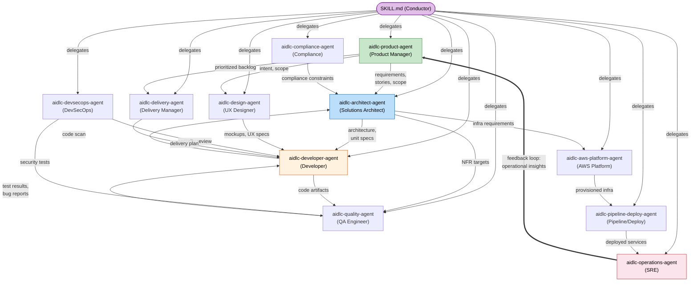

---

## 7. Execution Model

この実装は、ステージの実行モードを 4 つ使います。**Inline** はオーケストレータの会話のなかで直接走ります（人がやりとりできる）。**Subagent** は Claude Code の Task ツール経由でエージェント 1 体に委譲します（ステージがサポートエージェントを宣言していればハブ＆スポーク）。**Pipeline** はエージェントを順に鎖つなぎし、各リンクが成果物を進めます（出荷例は Reverse Engineering）。**Mob** はサポートエージェント全員を並行ラウンドで集めます（出荷例は User Stories）。

```mermaid
flowchart LR
    subgraph INLINE["Mode 1: Inline"]
        direction TB
        IN1["Orchestrator reads\nstage file"]
        IN2["Load agent persona\n+ knowledge"]
        IN3["Execute stage steps\ndirectly in conversation"]
        IN4["User interaction\navailable"]
        IN5["Approval gate\n(AskUserQuestion)"]
        IN1 --> IN2 --> IN3 --> IN4 --> IN5
    end

    subgraph SUBAGENT["Mode 2: Subagent (simple)"]
        direction TB
        SA1["Orchestrator reads\nstage file"]
        SA2["Prepare context:\nartifacts + persona"]
        SA3["Task tool call\n(subagent_type specified)"]
        SA4["Subagent executes\n(no user interaction)"]
        SA5["Return structured\nsummary to orchestrator"]
        SA6["Orchestrator presents\ncompletion + approval"]
        SA1 --> SA2 --> SA3 --> SA4 --> SA5 --> SA6
    end

    subgraph TWOSTEP["Mode 3: Pipeline (2-link RE chain)"]
        direction TB
        TS1["Orchestrator reads\nRE stage file"]
        TS2["Task: aidlc-developer-agent\ncode scan"]
        TS3["Developer returns\nscan results"]
        TS4["Task: aidlc-architect-agent\nsynthesis"]
        TS5["Architect produces\n9 artifacts"]
        TS6["Orchestrator presents\ncompletion + approval"]
        TS1 --> TS2 --> TS3 --> TS4 --> TS5 --> TS6
    end

    subgraph MOB["Mode 4: Mob (parallel rounds)"]
        direction TB
        MB1["Orchestrator reads\nstage file"]
        MB2["Lead drafts the\nartifacts inline"]
        MB3["Parallel Tasks: all\nsupport agents, blind"]
        MB4["Each writes its\ncontribution file"]
        MB5["Lead integrates;\nobjection triage\n(judgment -> human,\nknowledge -> round 2)"]
        MB6["Orchestrator presents\ncompletion + approval"]
        MB1 --> MB2 --> MB3 --> MB4 --> MB5 --> MB6
    end

    style INLINE fill:#e8f5e9,stroke:#4caf50,color:#000
    style SUBAGENT fill:#e3f2fd,stroke:#2196f3,color:#000
    style TWOSTEP fill:#fff3e0,stroke:#ff9800,color:#000
    style MOB fill:#f3e5f5,stroke:#9c27b0,color:#000
```

---

## 8. Session Resume Flow

利用者が `/aidlc` を呼ぶと、オーケストレータはアクティブなインテントの `aidlc-state.md` を探します。あれば再開の選択肢を 4 つ出します。無ければ最初のインテントを作ります。オーケストレータは `.aidlc-recovery.md` も見て、コンテキスト圧縮による状態破損の可能性を拾います。

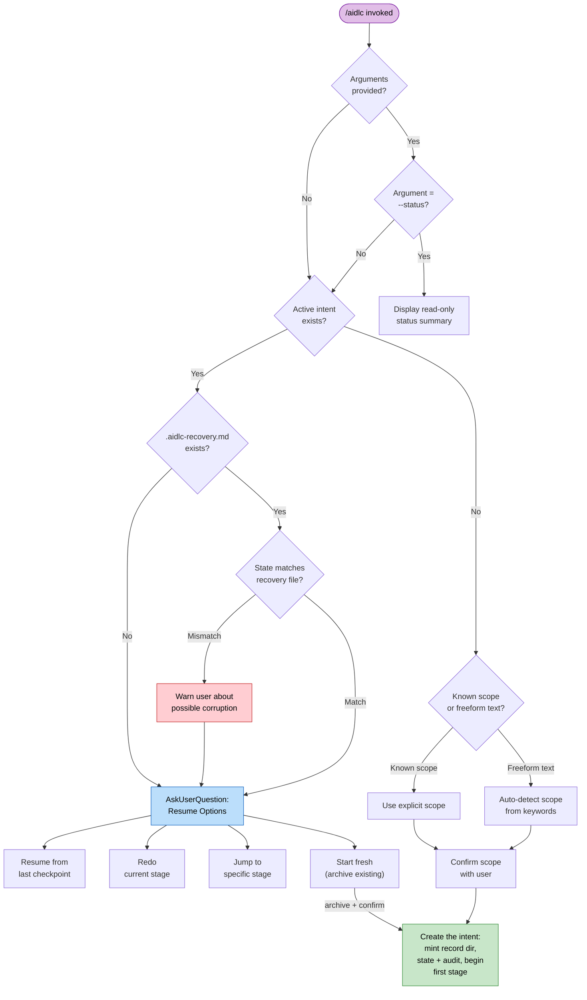

---

## 9. Scope Routing

> スコープの振り分け表: [Orchestrator Reference -- Scope Mapping](03-orchestrator.md#scope-to-stage-mapping) を見てください。

---

## 10. Knowledge Loading Order

各ステージは、ナレッジを厳密な 6 段の順で読みます。ガードレールが先、続けて共有方法論、エージェント固有のナレッジ、チームのカスタム、最後に先行ステージの成果物です。下のシーケンス図は、どのステージ起動でも同じ読み込み順です。

> **Note:** Steps 1-5 は `stage-protocol.md` 第 5 節が定めるエージェントナレッジの読み込みです。Step 6（先行ステージの成果物）は、オーケストレータが実行時に足す文脈であり、ファイル読み込みの段ではありません。

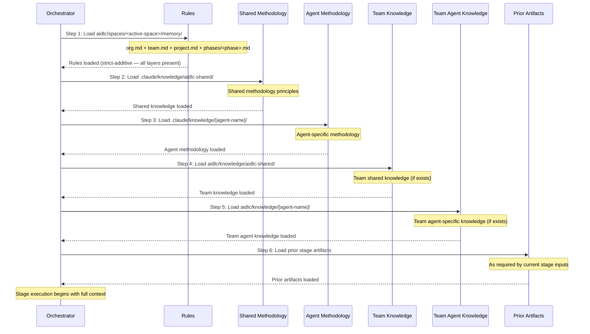

---

## 11. Approval Gate Flow

Initialization の 3 ステージを除き、どのステージも承認ゲートで終わります。ゲートの監査証跡は report が持ちます。`report --result awaiting-approval` が質問を出す前に保持ゲート（`STAGE_AWAITING_APPROVAL`）を記録し、`report --result approved|rejected` が応答をそのまま記録します（`GATE_APPROVED` / `GATE_REJECTED`）。`aidlc-log.ts decision` / `answer` は使いません。改訂が 3 周すると、「Accept as-is」の逃げ道が開きます。Ideation と Inception のステージでは、以前飛ばしたステージを足す条件付きの第 3 選択肢が出ることがあります。

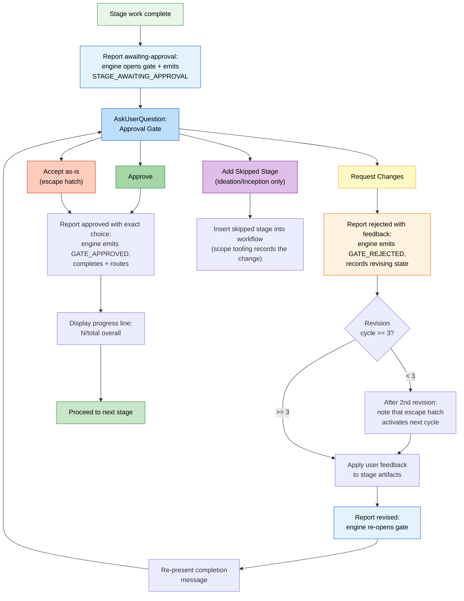

---

## 12. State Tracking

`aidlc-state.md` は各ステージをチェックボックス表記で追います。`[ ]`（未着手）、`[-]`（進行中）、`[?]`（承認待ち）、`[R]`（改訂中）、`[x]`（完了）、`[S]`（スキップ）。遷移はエンジンが持ち、コンダクターはチェックボックスを直さず結果を報告します。図には skip、redo、jump の脇経路も出します。

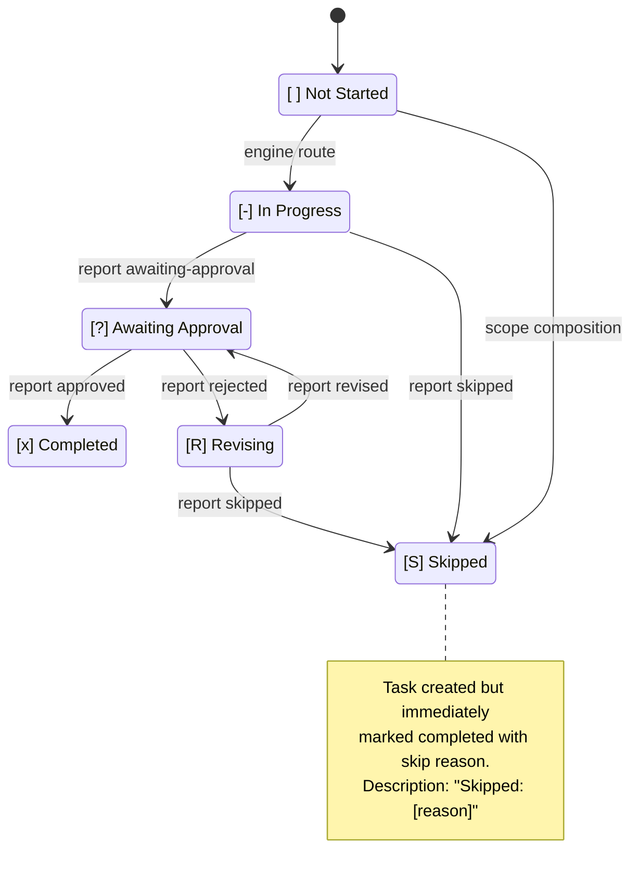

```mermaid
flowchart TD
    subgraph NORMAL["Normal Flow"]
        direction LR
        NS1["[ ] Not Started"]
        IP1["[-] In Progress"]
        AW1["[?] Awaiting Approval"]
        CO1["[x] Completed"]
        NS1 -->|"engine route"| IP1
        IP1 -->|"report gate open"| AW1
        AW1 -->|"report approved"| CO1
    end

    subgraph SKIP["Skip Flow"]
        direction LR
        NS2["[ ] Not Started"]
        SK2["[S] Skipped"]
        NS2 -->|"scope composition"| SK2
    end

    subgraph REDO["Redo Flow"]
        direction LR
        CO3["[x] Completed\nor [-] In Progress"]
        NS3["[ ] Not Started"]
        IP3["[-] In Progress"]
        CO3 -->|"user requests redo\n(delete artifacts)"| NS3
        NS3 -->|"re-execute stage"| IP3
    end

    subgraph JUMP["Jump Flow"]
        direction LR
        IP4["[-] In Progress\n(stage A)"]
        NS4["[ ] Not Started\n(stage B)"]
        IP4B["[-] In Progress\n(stage B)"]
        IP4 -->|"user requests jump\n(warn about skipped stages)"| NS4
        NS4 -->|"begin target stage"| IP4B
    end

    style NORMAL fill:#e8f5e9,stroke:#4caf50,color:#000
    style SKIP fill:#fff9c4,stroke:#f9a825,color:#000
    style REDO fill:#e3f2fd,stroke:#2196f3,color:#000
    style JUMP fill:#fce4ec,stroke:#e91e63,color:#000
```

---

## Summary of Execution Modes by Stage

この参照表は、全ステージを実行モードとリードエージェントへ対応づけます。すばやく探すための一覧です。

| Stage | Name | Mode | Lead Agent |
|-------|------|------|------------|
| 0.1 | Workspace Scaffold | inline (auto-proceed) | orchestrator |
| 0.2 | Workspace Detection | inline (auto-proceed, deterministic scanner) | orchestrator |
| 0.3 | State Init | inline (auto-proceed) | orchestrator |
| 1.1 | Intent Capture | inline | aidlc-product-agent |
| 1.2 | Market Research | inline | aidlc-product-agent |
| 1.3 | Feasibility | inline | aidlc-architect-agent |
| 1.4 | Scope Definition | inline | aidlc-product-agent |
| 1.5 | Team Formation | inline | aidlc-delivery-agent |
| 1.6 | Rough Mockups | inline | aidlc-design-agent |
| 1.7 | Approval & Handoff | inline | aidlc-delivery-agent |
| 2.1 | Reverse Engineering | pipeline (2-link) | aidlc-developer-agent + aidlc-architect-agent |
| 2.2 | Practices Discovery | subagent | aidlc-pipeline-deploy-agent |
| 2.3 | Requirements Analysis | inline | aidlc-product-agent |
| 2.4 | User Stories | mob | aidlc-product-agent |
| 2.5 | Refined Mockups | inline | aidlc-design-agent |
| 2.6 | Domain Design | inline | aidlc-architect-agent |
| 2.7 | Units Generation | inline | aidlc-architect-agent |
| 2.8 | Contract Design | inline | aidlc-architect-agent |
| 2.9 | Delivery Planning | inline | aidlc-delivery-agent |
| 3.1 | Functional Design | inline | aidlc-architect-agent |
| 3.2 | NFR Requirements | inline | aidlc-architect-agent |
| 3.3 | NFR Design | inline | aidlc-architect-agent |
| 3.4 | Infrastructure Design | inline | aidlc-aws-platform-agent |
| 3.5 | Code Generation | subagent (aidlc-developer-agent) | aidlc-developer-agent |
| 3.6 | Build and Test | inline | aidlc-quality-agent |
| 3.7 | CI Pipeline | inline | aidlc-pipeline-deploy-agent |
| 4.1 | Deployment Pipeline | inline | aidlc-pipeline-deploy-agent |
| 4.2 | Environment Provisioning | inline | aidlc-aws-platform-agent |
| 4.3 | Deployment Execution | inline | aidlc-pipeline-deploy-agent |
| 4.4 | Observability Setup | inline | aidlc-operations-agent |
| 4.5 | Incident Response | inline | aidlc-operations-agent |
| 4.6 | Performance Validation | inline | aidlc-quality-agent |
| 4.7 | Feedback & Optimization | inline | aidlc-operations-agent |
