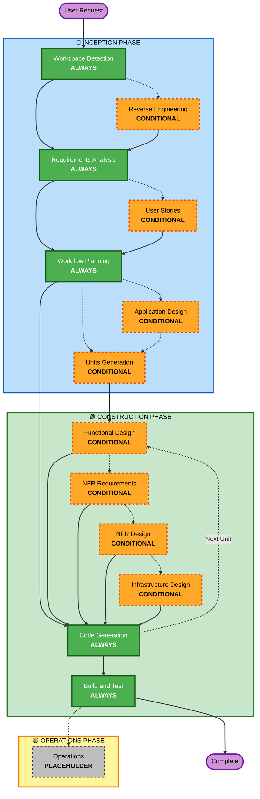

# AI-DLCアダプティブワークフロー概要

**目的**：AIモデルおよび開発者がワークフロー全体の構造を把握するための技術リファレンス。

**注意**：類似した内容が welcome-message.md（ユーザー向けウェルカムメッセージ）および README.md（ドキュメント）にも存在する。この重複は意図的であり、各ファイルの目的が異なるためである：
- **このファイル**：AIモデルのコンテキスト読み込みのためのMermaid図を含む詳細な技術リファレンス
- **welcome-message.md**：ASCII図を含むユーザー向けウェルカムメッセージ
- **README.md**：リポジトリの人間が読むためのドキュメント

## 3フェーズのライフサイクル：
• **INCEPTION PHASE（インセプション）**：計画とアーキテクチャ（ワークスペース検出＋条件付きフェーズ＋ワークフロー計画）
• **CONSTRUCTION PHASE（コンストラクション）**：設計、実装、ビルドとテスト（ユニットごとの設計＋コード生成＋ビルドとテスト）
• **OPERATIONS PHASE（オペレーションズ）**：将来のデプロイメントおよびモニタリングワークフローのプレースホルダー

## アダプティブワークフロー：
• **ワークスペース検出**（常時）→ **リバースエンジニアリング**（ブラウンフィールドのみ）→ **要件分析**（常時、適応的深度）→ **条件付きフェーズ**（必要に応じて）→ **ワークフロー計画**（常時）→ **コード生成**（常時、ユニットごと）→ **ビルドとテスト**（常時）

## 動作の仕組み：
• **AIが分析する**：リクエスト、ワークスペース、複雑さを分析して必要なステージを決定する
• **常時実行されるステージ**：ワークスペース検出、要件分析（適応的深度）、ワークフロー計画、コード生成（ユニットごと）、ビルドとテスト
• **すべての他のステージは条件付き**：リバースエンジニアリング、ユーザーストーリー、アプリケーション設計、ユニット生成、ユニットごとの設計ステージ（Functional Design、NFR Requirements、NFR Design、Infrastructure Design）
• **固定シーケンスなし**：ステージは特定のタスクに適した順序で実行される

## チームの役割：
• **質問ファイルに回答する**：[Answer]: タグと選択肢（A、B、C、D、E）を使用して専用の質問ファイルに回答する
• **オプションEを利用可能**：提示された選択肢が合わない場合は「Other」を選択して独自の回答を記述する
• **チームとして取り組む**：各フェーズを確認・承認してから次へ進む
• **集合的に決定する**：必要に応じてアーキテクチャアプローチについて共同で判断する
• **重要**：これはチームの取り組みである―各フェーズに関連するステークホルダーを参加させること

## AI-DLC 3フェーズワークフロー：

**ステージの説明：**

**🔵 INCEPTION PHASE** - 計画とアーキテクチャ
- Workspace Detection：ワークスペースの状態とプロジェクト種別を分析する（常時）
- Reverse Engineering：既存のコードベースを分析する（条件付き - ブラウンフィールドのみ）
- Requirements Analysis：要件を収集・検証する（常時 - 適応的深度）
- User Stories：ユーザーストーリー(user stories)とペルソナを作成する（条件付き）
- Workflow Planning：実行計画を作成する（常時）
- Application Design：高レベルのコンポーネント識別とサービス層設計（条件付き）
- Units Generation：作業単位(unit of work)へ分解する（条件付き）

**🟢 CONSTRUCTION PHASE** - 設計、実装、ビルドとテスト
- Functional Design：ユニットごとの詳細なビジネスロジック設計（条件付き、ユニットごと）
- NFR Requirements：NFRの決定と技術スタックの選択（条件付き、ユニットごと）
- NFR Design：NFRパターンと論理コンポーネントの組み込み（条件付き、ユニットごと）
- Infrastructure Design：実際のインフラサービスへのマッピング（条件付き、ユニットごと）
- Code Generation：パート1（計画）とパート2（生成）からなるコード生成（常時、ユニットごと）
- Build and Test：すべてのユニットのビルドと包括的なテストの実行（常時）

**🟡 OPERATIONS PHASE** - プレースホルダー
- Operations：将来のデプロイメントおよびモニタリングワークフローのプレースホルダー（PLACEHOLDER）

**主要な原則：**
- フェーズは価値をもたらす場合にのみ実行される
- 各フェーズは独立して評価される
- INCEPTION PHASE は「何を」「なぜ」に焦点を当てる
- CONSTRUCTION PHASE は「どのように」とビルド・テストに焦点を当てる
- OPERATIONS PHASE は将来の拡張のためのプレースホルダー
- シンプルな変更は条件付きのINCEPTIONステージをスキップすることがある
- 複雑な変更はINCEPTIONとCONSTRUCTIONの完全な処理を受ける
