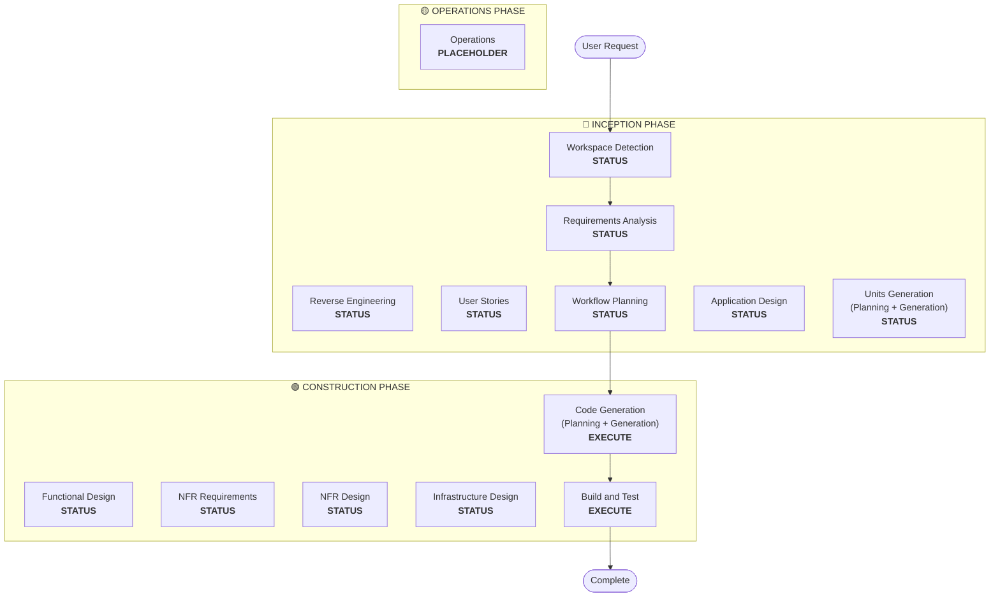

# ワークフロープランニング

**目的**: 実行するフェーズを決定し、包括的な実行計画を作成する

**常に実行**: このフェーズは、要件とスコープを理解した後、常に実行される。

## ステップ1: すべての事前コンテキストを読み込む

### 1.1 リバースエンジニアリング成果物の読み込み（ブラウンフィールドの場合）
- architecture.md
- component-inventory.md
- technology-stack.md
- dependencies.md

### 1.2 要件分析の読み込み
- requirements.md（インテント分析を含む）
- requirement-verification-questions.md（回答付き）

### 1.3 ユーザーストーリーの読み込み（実行された場合）
- stories.md
- personas.md

## ステップ2: 詳細なスコープと影響の分析

**完全なコンテキスト（要件 + ストーリー）が揃ったので、詳細な分析を実行する：**

### 2.1 変換スコープの検出（ブラウンフィールドのみ）

**ブラウンフィールドプロジェクトの場合**、変換スコープを分析する：

#### アーキテクチャの変換
- **単一コンポーネントの変更** vs **アーキテクチャの変換**
- **インフラストラクチャの変更** vs **アプリケーションの変更**
- **デプロイメントモデルの変更**（Lambda→Container、EC2→Serverless など）

#### 関連コンポーネントの特定
変換に対して、以下を特定する：
- 更新が必要な**インフラストラクチャコード**
- 変更が必要な **CDK スタック**
- **API Gateway** の設定
- **ロードバランサー**の要件
- 必要な**ネットワーキング**の変更
- **モニタリング/ログ**の適応

#### クロスパッケージの影響
- 更新が必要な **CDK インフラストラクチャ**パッケージ
- バージョン更新が必要な**共有モデル**
- エンドポイント変更が必要な**クライアントライブラリ**
- 新しいテストシナリオが必要な**テストパッケージ**

### 2.2 変更影響の評価

#### 影響領域
1. **ユーザー向けの変更**: ユーザー体験に影響するか？
2. **構造的変更**: システムアーキテクチャを変更するか？
3. **データモデルの変更**: データベーススキーマやデータ構造に影響するか？
4. **API の変更**: インターフェースやコントラクトに影響するか？
5. **非機能要件の影響**: パフォーマンス、セキュリティ、スケーラビリティに影響するか？

#### アプリケーション層の影響（該当する場合）
- **コードの変更**: 新しいエントリーポイント、アダプター、設定
- **依存関係**: 新しいライブラリ、フレームワークの変更
- **設定**: 環境変数、設定ファイル
- **テスト**: ユニットテスト、統合テスト

#### インフラストラクチャ層の影響（該当する場合）
- **デプロイメントモデル**: Lambda→ECS、EC2→Fargate など
- **ネットワーキング**: VPC、セキュリティグループ、ロードバランサー
- **ストレージ**: 永続ボリューム、共有ストレージ
- **スケーリング**: オートスケーリングポリシー、キャパシティプランニング

#### オペレーション層の影響（該当する場合）
- **モニタリング**: CloudWatch、カスタムメトリクス、ダッシュボード
- **ログ**: ログ集約、構造化ログ
- **アラート**: アラーム設定、通知チャネル
- **デプロイメント**: CI/CD パイプラインの変更、ロールバック戦略

### 2.3 コンポーネント関係のマッピング（ブラウンフィールドのみ）

**ブラウンフィールドプロジェクトの場合**、コンポーネント依存関係グラフを作成する：

```markdown
## Component Relationships
- **Primary Component**: [Package being changed]
- **Infrastructure Components**: [CDK/Terraform packages]
- **Shared Components**: [Models, utilities, clients]
- **Dependent Components**: [Services that call this component]
- **Supporting Components**: [Monitoring, logging, deployment]
```

関連する各コンポーネントについて：
- **変更タイプ**: Major、Minor、Configuration-only
- **変更理由**: 直接依存、デプロイメントモデル、ネットワーキング
- **変更優先度**: Critical、Important、Optional

### 2.4 リスク評価

リスクレベルを評価する：
1. **低**: 局所的な変更、容易なロールバック、よく理解されている
2. **中**: 複数のコンポーネント、中程度のロールバック、一部不明点あり
3. **高**: システム全体への影響、複雑なロールバック、大きな不明点あり
4. **クリティカル**: 本番環境クリティカル、困難なロールバック、高い不確実性

## ステップ3: フェーズの決定

### 3.1 ユーザーストーリー — 実行済みかスキップか？
**実行済み**: 次の判断に進む
**未実行 — 以下の場合は実行する**：
- 複数のユーザーペルソナがある
- ユーザー体験への影響がある
- 受け入れ基準が必要
- チームコラボレーションが必要

**以下の場合はスキップする**：
- 内部リファクタリング
- 明確な再現手順があるバグ修正
- 技術的負債の削減
- インフラストラクチャの変更

### 3.2 アプリケーション設計 — 以下の場合は実行する：
- 新しいコンポーネントやサービスが必要
- コンポーネントメソッドとビジネスルールを定義する必要がある
- サービス層の設計が必要
- コンポーネントの依存関係を明確にする必要がある

**以下の場合はスキップする**：
- 既存のコンポーネント境界内の変更
- 新しいコンポーネントやメソッドがない
- 純粋な実装の変更

### 3.3 作業単位の生成 — 以下の場合は実行する：
- 新しいデータモデルやスキーマ
- API の変更や新しいエンドポイント
- 複雑なアルゴリズムやビジネスロジック
- 状態管理の変更
- 複数のパッケージに変更が必要
- Infrastructure-as-Code の更新が必要

**以下の場合はスキップする**：
- 単純なロジックの変更
- UI のみの変更
- 設定の更新
- 直接的な実装

### 3.4 非機能要件の実装 — 以下の場合は実行する：
- パフォーマンス要件
- セキュリティの考慮事項
- スケーラビリティの懸念
- モニタリング/オブザーバビリティが必要

**以下の場合はスキップする**：
- 既存の非機能要件のセットアップで十分
- 新しい非機能要件がない
- 非機能要件への影響がない単純な変更

## ステップ4: アダプティブな詳細度に関する注意

**アダプティブ深度の説明については [depth-levels.md](../common/depth-levels.md) を参照**

実行される各ステージについて：
- 定義されたすべての成果物が作成される
- 成果物内の詳細レベルは問題の複雑性に適応する
- モデルが問題の特性に基づいて適切な詳細度を決定する

## ステップ5: マルチモジュール調整分析（ブラウンフィールドのみ）

**複数のモジュール/パッケージを持つブラウンフィールドの場合**、依存関係を分析して最適な更新戦略を決定する：

### 5.1 モジュール依存関係の分析
- ビルドシステムの依存関係と依存関係マニフェストを確認する
- ビルド時依存関係とランタイム依存関係を特定する
- モジュール間の API コントラクトと共有インターフェースをマッピングする

### 5.2 更新戦略の決定
依存関係の分析に基づいて決定する：
- **更新順序**: 依存関係のためにどのモジュールを先に更新する必要があるか
- **並列化の機会**: 同時に更新できるモジュールはどれか
- **調整要件**: バージョンの互換性、API コントラクト、デプロイメントの順序
- **テスト戦略**: モジュールごとのテスト vs 統合テスト
- **ロールバック戦略**: 途中で失敗した場合のリカバリー計画

### 5.3 調整計画の文書化
```markdown
## Module Update Strategy
- **Update Approach**: [Sequential/Parallel/Hybrid]
- **Critical Path**: [Modules that block other updates]
- **Coordination Points**: [Shared APIs, infrastructure, data contracts]
- **Testing Checkpoints**: [When to validate integration]
```

影響を受ける各モジュールについて特定する：
- **更新優先度**: 先に更新しなければならない vs 後で更新できる
- **依存関係の制約**: 何に依存しているか、何がそれに依存しているか
- **変更スコープ**: Major（破壊的）、Minor（互換性あり）、Patch（修正）

## ステップ6: ワークフロービジュアライゼーションの生成

以下を示す Mermaid フローチャートを作成する：
- 順序通りのすべてのフェーズ
- 各条件付きフェーズの EXECUTE または SKIP の判断
- 各フェーズの状態に適したスタイリング

**スタイリングルール**（フローチャートの後に追加）：
```
style WD fill:#4CAF50,stroke:#1B5E20,stroke-width:3px,color:#fff
style CG fill:#4CAF50,stroke:#1B5E20,stroke-width:3px,color:#fff
style BT fill:#4CAF50,stroke:#1B5E20,stroke-width:3px,color:#fff
style US fill:#BDBDBD,stroke:#424242,stroke-width:2px,stroke-dasharray: 5 5,color:#000
style Start fill:#CE93D8,stroke:#6A1B9A,stroke-width:3px,color:#000
style End fill:#CE93D8,stroke:#6A1B9A,stroke-width:3px,color:#000

linkStyle default stroke:#333,stroke-width:2px
```

**スタイルガイドライン**：
- 完了済み/常に実行: `fill:#4CAF50,stroke:#1B5E20,stroke-width:3px,color:#fff`（白テキストの Material Green）
- 条件付き EXECUTE: `fill:#FFA726,stroke:#E65100,stroke-width:3px,stroke-dasharray: 5 5,color:#000`（黒テキストの Material Orange）
- 条件付き SKIP: `fill:#BDBDBD,stroke:#424242,stroke-width:2px,stroke-dasharray: 5 5,color:#000`（黒テキストの Material Gray）
- 開始/終了: `fill:#CE93D8,stroke:#6A1B9A,stroke-width:3px,color:#000`（黒テキストの Material Purple）
- フェーズコンテナ: 明るい Material カラーを使用（INCEPTION: #BBDEFB、CONSTRUCTION: #C8E6C9、OPERATIONS: #FFF59D）

## ステップ7: 実行計画ドキュメントの作成

`aidlc-docs/inception/plans/execution-plan.md` を作成する：

```markdown
# Execution Plan

## Detailed Analysis Summary

### Transformation Scope (Brownfield Only)
- **Transformation Type**: [Single component/Architectural/Infrastructure]
- **Primary Changes**: [Description]
- **Related Components**: [List]

### Change Impact Assessment
- **User-facing changes**: [Yes/No - Description]
- **Structural changes**: [Yes/No - Description]
- **Data model changes**: [Yes/No - Description]
- **API changes**: [Yes/No - Description]
- **NFR impact**: [Yes/No - Description]

### Component Relationships (Brownfield Only)
[Component dependency graph]

### Risk Assessment
- **Risk Level**: [Low/Medium/High/Critical]
- **Rollback Complexity**: [Easy/Moderate/Difficult]
- **Testing Complexity**: [Simple/Moderate/Complex]

## Workflow Visualization



**注意**: STATUS プレースホルダーを実際のフェーズステータス（COMPLETED/SKIP/EXECUTE）に置き換え、適切なスタイリングを適用すること

## Phases to Execute

### 🔵 INCEPTION PHASE
- [x] Workspace Detection (COMPLETED)
- [x] Reverse Engineering (COMPLETED/SKIPPED)
- [x] Requirements Analysis (COMPLETED)
- [x] User Stories (COMPLETED/SKIPPED)
- [x] Execution Plan (IN PROGRESS)
- [ ] Application Design - [EXECUTE/SKIP]
  - **Rationale**: [Why executing or skipping]
- [ ] Units Generation - [EXECUTE/SKIP]
  - **Rationale**: [Why executing or skipping]

### 🟢 CONSTRUCTION PHASE
- [ ] Functional Design - [EXECUTE/SKIP]
  - **Rationale**: [Why executing or skipping]
- [ ] NFR Requirements - [EXECUTE/SKIP]
  - **Rationale**: [Why executing or skipping]
- [ ] NFR Design - [EXECUTE/SKIP]
  - **Rationale**: [Why executing or skipping]
- [ ] Infrastructure Design - [EXECUTE/SKIP]
  - **Rationale**: [Why executing or skipping]
- [ ] Code Generation - EXECUTE (ALWAYS)
  - **Rationale**: Implementation planning and code generation needed
- [ ] Build and Test - EXECUTE (ALWAYS)
  - **Rationale**: Build, test, and verification needed

### 🟡 OPERATIONS PHASE
- [ ] Operations - PLACEHOLDER
  - **Rationale**: Future deployment and monitoring workflows

## Package Change Sequence (Brownfield Only)
[If applicable, list package update sequence with dependencies]

## Estimated Timeline
- **Total Phases**: [Number]
- **Estimated Duration**: [Time estimate]

## Success Criteria
- **Primary Goal**: [Main objective]
- **Key Deliverables**: [List]
- **Quality Gates**: [List]

[IF brownfield]
- **Integration Testing**: All components working together
- **Operational Readiness**: Monitoring, logging, alerting working
```

## ステップ8: 状態追跡の初期化

`aidlc-docs/aidlc-state.md` を更新する：

```markdown
# AI-DLC State Tracking

## Project Information
- **Project Type**: [Greenfield/Brownfield]
- **Start Date**: [ISO timestamp]
- **Current Stage**: INCEPTION - Workflow Planning

## Execution Plan Summary
- **Total Stages**: [Number]
- **Stages to Execute**: [List]
- **Stages to Skip**: [List with reasons]

## Stage Progress

### 🔵 INCEPTION PHASE
- [x] Workspace Detection
- [x] Reverse Engineering (if applicable)
- [x] Requirements Analysis
- [x] User Stories (if applicable)
- [x] Workflow Planning
- [ ] Application Design - [EXECUTE/SKIP]
- [ ] Units Generation - [EXECUTE/SKIP]

### 🟢 CONSTRUCTION PHASE
- [ ] Functional Design - [EXECUTE/SKIP]
- [ ] NFR Requirements - [EXECUTE/SKIP]
- [ ] NFR Design - [EXECUTE/SKIP]
- [ ] Infrastructure Design - [EXECUTE/SKIP]
- [ ] Code Generation - EXECUTE
- [ ] Build and Test - EXECUTE

### 🟡 OPERATIONS PHASE
- [ ] Operations - PLACEHOLDER

## Current Status
- **Lifecycle Phase**: INCEPTION
- **Current Stage**: Workflow Planning Complete
- **Next Stage**: [Next stage to execute]
- **Status**: Ready to proceed
```

## ステップ9: 計画をユーザーに提示する

```markdown
# 📋 Workflow Planning Complete

I've created a comprehensive execution plan based on:
- Your request: [Summary]
- Existing system: [Summary if brownfield]
- Requirements: [Summary if executed]
- User stories: [Summary if executed]

**Detailed Analysis**:
- Risk level: [Level]
- Impact: [Summary of key impacts]
- Components affected: [List]

**Recommended Execution Plan**:

I recommend executing [X] stages:

🔵 **INCEPTION PHASE:**
1. [Stage name] - *Rationale:* [Why executing]
2. [Stage name] - *Rationale:* [Why executing]
...

🟢 **CONSTRUCTION PHASE:**
3. [Stage name] - *Rationale:* [Why executing]
4. [Stage name] - *Rationale:* [Why executing]
...

I recommend skipping [Y] stages:

🔵 **INCEPTION PHASE:**
1. [Stage name] - *Rationale:* [Why skipping]
2. [Stage name] - *Rationale:* [Why skipping]
...

🟢 **CONSTRUCTION PHASE:**
3. [Stage name] - *Rationale:* [Why skipping]
4. [Stage name] - *Rationale:* [Why skipping]
...

[IF brownfield with multiple packages]
**Recommended Package Update Sequence**:
1. [Package] - [Reason]
2. [Package] - [Reason]
...

**Estimated Timeline**: [Duration]

> **📋 <u>**REVIEW REQUIRED:**</u>**  
> Please examine the execution plan at: `aidlc-docs/inception/plans/execution-plan.md`

> **🚀 <u>**WHAT'S NEXT?**</u>**
>
> **You may:**
>
> 🔧 **Request Changes** - Ask for modifications to the execution plan if required
> [IF any stages are skipped:]
> 📝 **Add Skipped Stages** - Choose to include stages currently marked as SKIP
> ✅ **Approve & Continue** - Approve plan and proceed to **[Next Stage Name]**
```

## ステップ10: ユーザーの応答を処理する

- **承認された場合**: 実行計画の次のステージに進む
- **変更が要求された場合**: 実行計画を更新して再確認する
- **ユーザーがステージの強制追加/除外を希望する場合**: 計画をそれに応じて更新する

## ステップ11: インタラクションのログ記録

`aidlc-docs/audit.md` に記録する：

```markdown
## Workflow Planning - Approval
**Timestamp**: [ISO timestamp]
**AI Prompt**: "Ready to proceed with this plan?"
**User Response**: "[User's COMPLETE RAW response]"
**Status**: [Approved/Changes Requested]
**Context**: Workflow plan created with [X] stages to execute

---
```
