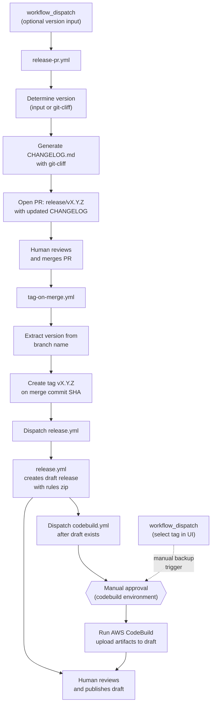
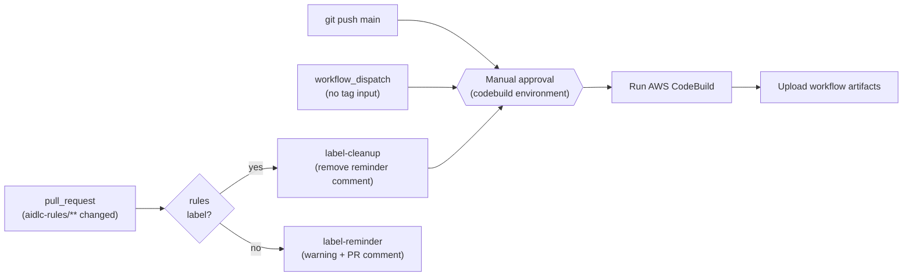
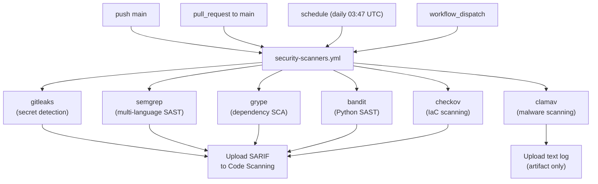
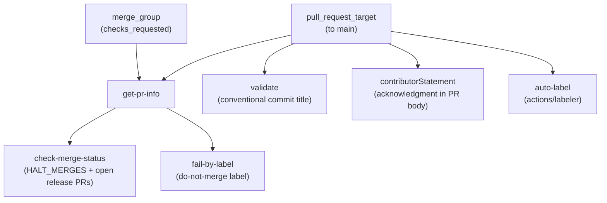

# 管理者ガイド

このガイドでは、`awslabs/aidlc-workflows` リポジトリの CI/CD インフラ、GitHub ワークフロー、保護された環境、シークレット、変数、権限、およびリリースプロセスについて説明します。

**対象読者:** リポジトリ管理者、メンテナー、およびこのリポジトリで作業する AI コーディングエージェント。

**関連ドキュメント:**

- [開発者ガイド](DEVELOPERS_GUIDE.md) — ローカルでのビルド実行 (CodeBuild + `act`)
- [コントリビューションガイドライン](../CONTRIBUTING.md) — コントリビューションのプロセスと規約
- [README](../README.md) — ユーザー向けのセットアップと使用方法

---

## 目次

- [リポジトリの概要](#リポジトリの概要)
- [CI/CD アーキテクチャ](#cicd-アーキテクチャ)
- [ワークフローリファレンス](#ワークフローリファレンス)
  - [リリース PR ワークフロー](#リリース-pr-ワークフロー-release-pryml)
  - [タグリリースワークフロー](#タグリリースワークフロー-tag-on-mergeyml)
  - [CodeBuild ワークフロー](#codebuild-ワークフロー-codebuildyml)
  - [リリースワークフロー](#リリースワークフロー-releaseyml)
  - [プルリクエスト検証ワークフロー](#プルリクエスト検証ワークフロー-pull-request-lintyml)
  - [セキュリティスキャナーワークフロー](#セキュリティスキャナーワークフロー-security-scannersyml)
- [保護された環境](#保護された環境)
- [シークレットと変数](#シークレットと変数)
- [権限モデル](#権限モデル)
- [セキュリティ態勢](#セキュリティ態勢)
  - [セキュリティ検出事項の要件](#セキュリティ検出事項の要件)
- [コードオーナーシップ](#コードオーナーシップ)
- [リリースプロセス](#リリースプロセス)
- [変更ログの設定](#変更ログの設定)
- [固定バージョンの更新](#固定バージョンの更新)

---

## リポジトリの概要

このリポジトリは、**AI-DLC(AI駆動開発ライフサイクル)** の方法論を `aidlc-rules/` 配下の一連の Markdown ルールファイルとして公開します。CI/CD インフラは以下を担当します。

- **AWS CodeBuild** による継続的インテグレーション（評価とレポーティング）
- **GitHub Releases** によるリリース配布（ルールファイルの ZIP 圧縮）
- **git-cliff** による変更ログ生成（changelog-first: リリース前に更新し、タグ付きコミットに含まれる）

```text
awslabs/aidlc-workflows/
├── .github/
│   ├── CODEOWNERS
│   ├── ISSUE_TEMPLATE/           # バグ・機能・RFC・ドキュメントのテンプレート
│   ├── labeler.yml               # 自動ラベル規則（パス → ラベルのマッピング）
│   ├── pull_request_template.md  # コントリビューター宣言文付き PR テンプレート
│   └── workflows/
│       ├── codebuild.yml         # AWS CodeBuild による CI
│       ├── pull-request-lint.yml # PR 検証（タイトル、ラベル、マージゲート）
│       ├── release.yml           # タグプッシュ時の GitHub Release
│       ├── release-pr.yml        # リリース前の変更ログ PR
│       ├── security-scanners.yml # セキュリティスキャンスイート（6 スキャナー）
│       └── tag-on-merge.yml      # リリース PR マージ時の自動タグ付け
├── .claude/
│   └── settings.json             # 共有 Claude Code プロジェクト設定
├── aidlc-rules/                  # 配布可能な成果物
│   ├── aws-aidlc-rules/          # コアワークフロールール
│   └── aws-aidlc-rule-details/   # フェーズ別の詳細ルール
├── cliff.toml                    # git-cliff 変更ログ設定
├── docs/
│   ├── ADMINISTRATIVE_GUIDE.md   # このファイル
│   └── DEVELOPERS_GUIDE.md       # ローカルビルド手順
└── scripts/
    └── aidlc-evaluator/          # 評価フレームワーク（開発中）
```

---

## CI/CD アーキテクチャ

6 つのワークフローが 2 つの独立したパイプライン、1 つのセキュリティスキャンスイート、および 1 つのプルリクエスト検証ゲートを構成しています。

### パイプライン 1: リリース（changelog-first）



リリースフローは **changelog-first** です。CHANGELOG はタグが作成される*前*に更新されるため、タグ付きコミットには常に自身の変更ログエントリが含まれます。このフローには 3 つの人間による確認ポイントがあります。

1. **リリース PR のマージ** — 変更ログを確認し、自動タグ付けをトリガーする
2. **CodeBuild 環境の承認** — ビルド用の AWS 認証情報へのアクセスを制御する
3. **ドラフトリリースの公開** — 成果物を確認し、リリースを公開する

`tag-on-merge.yml` は、タグを作成した後に `gh workflow run --ref vX.Y.Z` を使って `release.yml` と `codebuild.yml` を明示的にディスパッチします。このディスパッチは**逐次実行**されます。`release.yml` が先に実行され、`codebuild.yml` が成果物をアップロードする前にドラフトリリースが存在することを確認するために完了を待ち合わせます。これは、`GITHUB_TOKEN` で作成したタグが `on: push: tags` イベントをトリガーしないためです。ただし `workflow_dispatch` はこの制限から免除されています。どちらのワークフローも、手動タグプッシュのフォールバックとして `push: tags: v*` を保持しています。`codebuild.yml` ワークフローはビルドを開始する前に `codebuild` 保護環境による**手動承認**が必要です。アップロードステップはすべてのリリース状態に対して弾力的に対応します。

- **ドラフトが存在する場合**（通常ケース）— `release.yml` が約 30 秒でドラフトを作成し、CodeBuild は数分かかるため、成果物のアップロード時にはドラフトが準備済みです
- **リリースがまだ存在しない場合**（CodeBuild が先に完了した場合）— ビルド成果物を含むドラフトを作成し、後から `release.yml` が更新します
- **すでに公開済みの場合**（再実行時）— 成果物の置き換えを試み、変更不可の場合は適切に警告します

**バックアップ戦略:** タグでトリガーされた CodeBuild の実行が失敗またはブロックされた場合、管理者は `workflow_dispatch` を使ってワークフローを手動でディスパッチし、GitHub UI のブランチ/タグセレクターで `v*` タグを選択できます。`github.ref` が選択したタグに解決されるため、アップロードステップが自動的に有効になります。

### パイプライン 2: 継続的インテグレーション



### パイプライン 3: セキュリティスキャン



6 つのスキャナーのジョブはすべて並列で実行されます。ClamAV を除く各スキャナーは SARIF レポートを生成し、GitHub Code Scanning（Security タブ）とダウンロード可能なワークフロー成果物の両方にアップロードします。すべてのスキャナーは**遅延失敗パターン**を使用しており、スキャンが完了するまで実行され、結果が常にアップロードされた後に、設定されたしきい値を超える検出があった場合にのみジョブが失敗します。詳細は [セキュリティスキャナーワークフロー](#セキュリティスキャナーワークフロー-security-scannersyml) のリファレンスを参照してください。

### パイプライン 4: プルリクエスト検証



`pull-request-lint.yml` は `main` を対象とするすべての PR およびマージキューのチェックで実行されます。4 つのゲート（コンベンショナルコミット形式の PR タイトル、PR テンプレートのコントリビューター宣言文、設定可能なマージ停止メカニズム、do-not-merge ラベルチェック）を強制し、変更されたファイルパスに基づいてラベルを自動適用します。このワークフローは `pull_request` ではなく `pull_request_target` を使用しているため、ベースブランチのコンテキストで実行されます。PR コードをチェックアウトまたは実行するステップがなく、`auto-label` ジョブが API からファイルパスのみを読み取る `actions/labeler` を使用しているため、この設定は安全です。

---

## ワークフローリファレンス

### リリース PR ワークフロー (`release-pr.yml`)

| プロパティ      | 値                                                |
| --------------- | ------------------------------------------------- |
| **ファイル**    | `.github/workflows/release-pr.yml`                |
| **トリガー**    | `workflow_dispatch`（オプションの `version` 入力付き） |
| **環境**        | *(なし)*                                          |
| **ランナー**    | `ubuntu-latest`                                   |

**目的:** git-cliff を使ったコンベンショナルコミットから更新された `CHANGELOG.md` を生成し、`aidlc-rules/VERSION` にリリースバージョンを書き込み、`release/vX.Y.Z` ブランチで PR を開きます。これは changelog-first リリースフローの最初のステップです。`aidlc-rules/VERSION` の更新により、PR が `aidlc-rules/` に触れるため、`codebuild.yml` のパスフィルターと `rules` 自動ラベルがトリガーされます。

**ジョブ: `release-pr`（"Create Release PR"）**

| ステップ | 名前                     | アクション                                                                                                                                                                                    |
| -------- | ------------------------ | --------------------------------------------------------------------------------------------------------------------------------------------------------------------------------------------- |
| 1        | コードのチェックアウト   | `actions/checkout`（git-cliff のための `fetch-depth: 0` 付き）                                                                                                                               |
| 2        | git-cliff のインストール | `orhun/git-cliff-action` で CLI を利用可能にする                                                                                                                                              |
| 3        | バージョンの決定         | `inputs.version`（semver 検証付き）または自動検出のための `git-cliff --bumped-version` を使用。最新タグからのパッチバンプにフォールバック                                                     |
| 4        | タグの非存在確認         | 対象タグがすでに存在する場合は早期に失敗する                                                                                                                                                  |
| 5        | 変更ログの生成           | `--tag vX.Y.Z` 付きの `orhun/git-cliff-action` で `CHANGELOG.md` を生成                                                                                                                      |
| 6        | リリース PR の作成       | `aidlc-rules/VERSION` にバージョンを書き込み、ブランチが存在しないことを確認してコミット、`release/vX.Y.Z` ブランチをプッシュし、PR を開く（リポジトリに `release` と `rules` ラベルが存在する場合は付与） |

**バージョン検出:** バージョンが指定されている場合、有効な semver（`MAJOR.MINOR.PATCH`）である必要があります。`v0.2.0` と `0.2.0` の両方が受け入れられます。バージョンが指定されていない場合、`git-cliff --bumped-version` がコンベンショナルコミットプレフィックスから次のバージョンを決定します。`cliff.toml` の `[bump]` 設定でルールを制御します（例: `feat` → マイナーバンプ、破壊的変更 → メジャーバンプ）。コンベンショナルコミットが見つからない場合、最新タグからのパッチバンプにフォールバックします。タグが全く存在しない場合は、警告を出力してクリーンに終了します（PR は作成されません）。

**外部アクション（SHA 固定）:**

| アクション               | バージョン | SHA                                        |
| ------------------------ | ---------- | ------------------------------------------ |
| `actions/checkout`       | v6.0.1     | `8e8c483db84b4bee98b60c0593521ed34d9990e8` |
| `orhun/git-cliff-action` | v4.7.0     | `e16f179f0be49ecdfe63753837f20b9531642772` |

---

### タグリリースワークフロー (`tag-on-merge.yml`)

| プロパティ    | 値                                                    |
| ------------- | ----------------------------------------------------- |
| **ファイル**  | `.github/workflows/tag-on-merge.yml`                  |
| **トリガー**  | `pull_request: types: [closed]`                       |
| **条件**      | PR がマージされ、かつブランチ名が `release/v` で始まる |
| **環境**      | *(なし)*                                              |
| **ランナー**  | `ubuntu-latest`                                       |

**目的:** リリース PR がマージされた際にマージコミットにバージョンタグを自動的に作成し、その後 `release.yml`（完了を待ち合わせ）に続いて `codebuild.yml` をディスパッチします。

**ジョブ: `tag`（"Create Release Tag"）**

| ステップ | 名前                                   | アクション                                                                                        |
| -------- | -------------------------------------- | ------------------------------------------------------------------------------------------------- |
| 1        | タグの作成                             | ブランチ名からバージョンを抽出し、タグが存在しないことを確認して GitHub API 経由でタグを作成する  |
| 2        | リリースワークフローのディスパッチと待機 | `gh workflow run release.yml --ref $TAG --repo $REPO` を実行し、`gh run watch` で完了を待ち合わせる |
| 3        | CodeBuild ワークフローのディスパッチ   | `gh workflow run codebuild.yml --ref $TAG --repo $REPO`（ドラフトリリースが存在した後に実行）    |

**タグの作成:** `gh api repos/.../git/refs` を使って軽量タグを作成します。

**ワークフローのディスパッチ:** `GITHUB_TOKEN` で作成したタグは、他のワークフローで `on: push: tags` イベントをトリガーしません。これを回避するため、`tag-on-merge.yml` は `gh workflow run --ref $TAG` を通じて `release.yml` と `codebuild.yml` を明示的にディスパッチします。`workflow_dispatch` イベントはこの `GITHUB_TOKEN` の制限から免除されています。`--ref` がタグに設定されているため、ディスパッチされた両方のワークフローは `github.ref = refs/tags/vX.Y.Z` を参照します（実際のタグプッシュと同一です）。ディスパッチは**逐次実行**されます。`release.yml` が先に実行され（`gh run watch` で監視）、`codebuild.yml` が成果物のアップロードを試みる前にドラフトリリースが存在することを確認します。リリースの実行が見つからないか失敗した場合、`codebuild.yml` はフォールバックとしてディスパッチされます。

**セキュリティ:** ブランチ名 `release/vX.Y.Z` はコマンドインジェクションを防ぐため、環境変数（直接の補間ではなく）を通じて渡されます。ジョブレベルの `if` 条件は `github.event.pull_request.merged == true` を使用して、マージされた PR のみがタグ付けをトリガーすることを確認します。

---

### CodeBuild ワークフロー (`codebuild.yml`)

| プロパティ      | 値                                                                                                                                                                                                                |
| --------------- | ----------------------------------------------------------------------------------------------------------------------------------------------------------------------------------------------------------------- |
| **ファイル**    | `.github/workflows/codebuild.yml`                                                                                                                                                                                 |
| **トリガー**    | `push`（`main` へ）、`push` タグ `v*`、`pull_request`（`main` へ、ラベルゲート・パスフィルター付き）、`workflow_dispatch`（`tag-on-merge.yml` によるディスパッチまたは手動 — リリースビルドをトリガーするには UI でタグを選択） |
| **環境**        | `codebuild`（保護済み、手動承認）                                                                                                                                                                                 |
| **ランナー**    | `ubuntu-latest`                                                                                                                                                                                                   |
| **同時実行**    | `{workflow}-{event_name}-{ref}` でグループ化、進行中の実行をキャンセル                                                                                                                                            |

**目的:** AWS CodeBuild プロジェクトを実行し、S3 からプライマリおよびセカンダリ成果物をダウンロードし、GitHub Actions キャッシュに保存し、ワークフロー成果物としてアップロードし、`v*` タグからトリガーされた場合は GitHub Release に添付します。

**PR ラベルゲート:** `pull_request` イベントでは、`aidlc-rules/**` 配下のファイルが変更された場合（`paths` フィルター経由）にのみワークフローが実行され、`build` ジョブは PR に `rules` ラベルが存在する場合（`contains(github.event.pull_request.labels.*.name, 'rules')` 経由）にのみ実行されます。`rules` ラベルは `pull-request-lint.yml` の `auto-label` ジョブによって自動的に適用されます（[プルリクエスト検証ワークフロー](#プルリクエスト検証ワークフロー-pull-request-lintyml)を参照）。トリガーには `types: [opened, synchronize, reopened, labeled]` が含まれているため、ラベル付き PR への後続のプッシュで自動的にビルドが再トリガーされます。`push`、`workflow_dispatch`、タグイベントはラベルチェックを完全にバイパスします。

**ジョブ: `label-reminder`**（PR のみ、`rules` ラベルなし）

| ステップ | 名前                             | アクション                                                                                    |
| -------- | -------------------------------- | --------------------------------------------------------------------------------------------- |
| 1        | rules ラベルの欠如について警告   | Actions のサマリーに表示される `::warning::` アノテーションを出力する                        |
| 2        | PR へのコメント                  | 一度だけ PR コメントを投稿する（冪等 — リマインダーコメントがすでに存在する場合はスキップ）  |

このジョブは、`aidlc-rules/**` が変更されたが `rules` ラベルが付いていない `pull_request` イベントでのみ実行されます。評価パイプラインがトリガーされなかったことをメンテナーやレビュワーに警告します。コメントは HTML コメントマーカー（`<!-- rules-label-reminder -->`）を使って PR ごとに 1 回のみ投稿され、重複を防ぎます。通常の運用では、`pull-request-lint.yml` の `auto-label` ジョブが `rules` ラベルを自動的に適用するため、このジョブはフォールバックの安全ネットとして機能します。

**ジョブ: `label-cleanup`**（PR のみ、`rules` ラベルあり）

| ステップ | 名前                          | アクション                                                                              |
| -------- | ----------------------------- | --------------------------------------------------------------------------------------- |
| 1        | ラベルリマインダーコメントの削除 | `label-reminder` の PR コメントを検索して削除する（存在しない場合は no-op）              |

このジョブは `rules` ラベルが適用された際に実行され、`codebuild` 環境の承認ゲートを待たずにリマインダーコメントをすぐに削除します。

**ジョブ: `build`**

| ステップ | 名前                              | 条件                      | アクション                                                          |
| -------- | --------------------------------- | ------------------------- | ------------------------------------------------------------------- |
| 1        | キャッシュの一覧表示              | *(常時)*                  | 既存のプロジェクトキャッシュの `gh cache list`                      |
| 2        | キャッシュの確認                  | *(常時)*                  | `lookup-only: true` 付きの `actions/cache/restore`                  |
| 3        | AWS 認証情報の設定                | キャッシュミス            | `aws-actions/configure-aws-credentials`（OIDC）                     |
| 4        | CodeBuild の実行                  | キャッシュミス            | インライン buildspec 付きの `aws-actions/aws-codebuild-run-build`   |
| 5        | ビルド ID                         | キャッシュミス（常時）    | CodeBuild ビルド ID を出力                                          |
| 6        | CodeBuild 成果物のダウンロード    | キャッシュミス            | S3 からプライマリ + セカンダリ成果物をダウンロード                  |
| 7        | CodeBuild 成果物の一覧表示        | キャッシュミス            | ダウンロードした ZIP ファイルを一覧表示して検査する                  |
| 8        | 古いレポートキャッシュの削除      | キャッシュミス            | ブランチの一致するキャッシュのうち最も古い 3 件を削除する           |
| 9        | レポートをキャッシュに保存        | キャッシュミス            | `{project}-{branch}-{sha}` をキーとした `actions/cache/save`        |
| 10       | プライマリ成果物のアップロード    | `!env.ACT`                | `{project}.zip` の `actions/upload-artifact`                        |
| 11       | 評価成果物のアップロード          | `!env.ACT`                | `evaluation.zip` の `actions/upload-artifact`                       |
| 12       | トレンド成果物のアップロード      | `!env.ACT`                | `trend.zip` の `actions/upload-artifact`                            |
| 13       | リリースへの成果物のアップロード  | `v*` タグからトリガー時   | ビルド成果物を GitHub Release（ドラフトまたは公開済み）に添付する   |

**キャッシュ戦略:** キャッシュキー `{project}-{branch}-{sha}` により、同じブランチの同じコミットが二度ビルドされることはありません。キャッシュヒット時は、ステップ 3〜9 が完全にスキップされます。

**インライン buildspec:** ワークフローは外部ファイルを参照する代わりに完全な `buildspec-override` を埋め込んでいます。buildspec の内容:

- `gh` CLI（dnf 経由）と `uv`（Python パッケージマネージャー）をインストールする
- ビルドコンテキストを決定する：リリース（タグ付き）、プレリリース（デフォルトブランチ）、またはプレマージ（フィーチャーブランチ）
- `.codebuild/` 配下にプレースホルダーの評価とトレンドレポートファイルを作成する
- プライマリ成果物（`.codebuild/` 配下の全ファイル）と 2 つのセカンダリ成果物（`evaluation`、`trend`）を出力する

**成果物アップロードの互換性:** `actions/upload-artifact` v6 が [`act`](https://github.com/nektos/act) ローカルランナーと非互換なため、アップロードステップは `!env.ACT` でゲートされています。

**外部アクション（すべて SHA 固定）:**

| アクション                              | バージョン | SHA                                        |
| --------------------------------------- | ---------- | ------------------------------------------ |
| `actions/cache/restore`                 | v5.0.3     | `cdf6c1fa76f9f475f3d7449005a359c84ca0f306` |
| `aws-actions/configure-aws-credentials` | v6.0.0     | `8df5847569e6427dd6c4fb1cf565c83acfa8afa7` |
| `aws-actions/aws-codebuild-run-build`   | v1.0.18    | `d8279f349f3b1b84e834c30e47c20dcb8888b7e5` |
| `actions/cache/save`                    | v5.0.3     | `cdf6c1fa76f9f475f3d7449005a359c84ca0f306` |
| `actions/upload-artifact`               | v6.0.0     | `b7c566a772e6b6bfb58ed0dc250532a479d7789f` |

---

### リリースワークフロー (`release.yml`)

| プロパティ    | 値                                                                                                                      |
| ------------- | ----------------------------------------------------------------------------------------------------------------------- |
| **ファイル**  | `.github/workflows/release.yml`                                                                                         |
| **トリガー**  | `workflow_dispatch`（`tag-on-merge.yml` によるディスパッチ）、`v*` に一致するタグへの `push`（手動タグプッシュのフォールバック） |
| **環境**      | *(なし)*                                                                                                                |
| **ランナー**  | `ubuntu-latest`                                                                                                         |

**目的:** ディスパッチされたとき、またはバージョンタグがプッシュされたときに、`aidlc-rules/` の ZIP ファイル付きの**ドラフト** GitHub Release を作成します。CodeBuild の成果物を添付して公開前に確認できるよう、リリースはドラフト状態に保たれます。

**ジョブ: `release`（"Create Release"）**

| ステップ | 名前                    | 条件              | アクション                                                                                                                                                       |
| -------- | ----------------------- | ----------------- | ---------------------------------------------------------------------------------------------------------------------------------------------------------------- |
| 1        | コードのチェックアウト  | *(常時)*          | `fetch-depth: 0` 付きの `actions/checkout`                                                                                                                       |
| 2        | バージョンの抽出        | *(常時)*          | ガード: `GITHUB_REF` が `v*` タグでない場合は `::warning::` を出力して残りのステップをスキップ。それ以外の場合は `version`（`v` なし）と `tag`（`v` 付き）にパースする |
| 3        | リリース成果物の作成    | ref が `v*` タグ  | `zip -r ai-dlc-rules-v{VERSION}.zip aidlc-rules/`                                                                                                                |
| 4        | GitHub Release の作成   | ref が `v*` タグ  | `draft: true` と ZIP 添付付きの `softprops/action-gh-release`                                                                                                    |

**グレースフルスキップ:** タグではなくブランチからディスパッチされた場合（例: 誰かが `main` から手動でワークフローを実行した場合）、ジョブは失敗ではなく警告アノテーションを付けて正常に完了します。これにより、Actions UI での紛らわしい赤い X 表示を防ぎます。

**リリース名:** `AI-DLC Workflow v{VERSION}`（例: `AI-DLC Workflow v0.1.6`）

**外部アクション（SHA 固定）:**

| アクション                    | バージョン | SHA                                        |
| ----------------------------- | ---------- | ------------------------------------------ |
| `actions/checkout`            | v6.0.1     | `8e8c483db84b4bee98b60c0593521ed34d9990e8` |
| `softprops/action-gh-release` | v2.5.0     | `a06a81a03ee405af7f2048a818ed3f03bbf83c7b` |

---

### プルリクエスト検証ワークフロー (`pull-request-lint.yml`)

| プロパティ    | 値                                                                                                                                                |
| ------------- | ------------------------------------------------------------------------------------------------------------------------------------------------- |
| **ファイル**  | `.github/workflows/pull-request-lint.yml`                                                                                                         |
| **トリガー**  | `pull_request_target`（`main` へ、edited・labeled・opened・ready_for_review・reopened・synchronize・unlabeled）; `merge_group`（checks_requested） |
| **環境**      | *(なし)*                                                                                                                                          |
| **ランナー**  | `ubuntu-latest`                                                                                                                                   |
| **同時実行**  | `{workflow}-{event_name}-{ref}` でグループ化、進行中の実行をキャンセル                                                                            |

**目的:** マージ前にプルリクエストを検証します。コンベンショナルコミット形式の PR タイトル、コントリビューター確認文、マージ停止制御、および do-not-merge ラベルゲートを強制します。マージキューのチェックとしても実行されます。

**`pull_request_target` を使う理由:** このトリガーは PR ヘッドではなくベースブランチのコンテキストでワークフローを実行します。PR コードをチェックアウトまたは実行するステップがなく、ワークフローは PR メタデータ（タイトル、ラベル、本文）のみを検査するため、ここでは安全です。`pull_request_target` を使用することで、フォークからの PR であっても、ワークフローがリポジトリのシークレットとラベルにアクセスできます。

**ジョブ: `get-pr-info`**

| ステップ | 名前          | アクション                                                                                               |
| -------- | ------------- | -------------------------------------------------------------------------------------------------------- |
| 1        | PR 情報の取得 | イベントコンテキスト（`pull_request_target`）または API ルックアップ（`merge_group`）から PR 番号とラベルを抽出する |

下流のジョブに `pr_number` と `pr_labels` を出力します。`merge_group` イベントの場合、PR 番号は ref 名から抽出され、ラベルは GitHub API 経由で取得されます。`pull_request_target` イベントの場合、値はイベントペイロードから直接取得されます。

**ジョブ: `check-merge-status`（"Check Merge Status"）**

`get-pr-info` に依存します。上流のジョブが失敗した場合でも実行されるよう `if: always()` で実行されます。

| チェック              | 動作                                                                          |
| --------------------- | ----------------------------------------------------------------------------- |
| オープン中のリリース PR | 他の `release/` PR がオープンの場合はマージをブロックする（同時リリースの防止）  |
| `HALT_MERGES = 0`     | すべてのマージを許可（デフォルト）                                            |
| `HALT_MERGES = -N`    | すべてのマージをブロック                                                      |
| `HALT_MERGES = N`     | PR #N のみマージを許可                                                        |

**ジョブ: `fail-by-label`（"Fail by Label"）**

`get-pr-info` に依存します。`if: always()` で実行されます。PR に `do-not-merge` ラベル（`DO_NOT_MERGE_LABEL` 変数で設定可能）が付いている場合にチェックを失敗させます。

**ジョブ: `validate`（"Validate PR title"）**

`pull_request` および `pull_request_target` イベントでのみ実行されます（`merge_group` は除く）。`amannn/action-semantic-pull-request` を使って PR タイトルのコンベンショナルコミット形式を強制します。

許可されるタイプ: `fix`、`feat`、`build`、`chore`、`ci`、`docs`、`style`、`refactor`、`perf`、`test`。スコープはオプションです（`requireScope: false`）。

**ジョブ: `auto-label`（"Auto-label"）**

`pull_request_target` イベントでのみ実行されます。[`actions/labeler`](https://github.com/actions/labeler) v6.0.1 を使って、変更されたファイルパスに基づいてラベルを自動適用・削除します。ラベルルールは `.github/labeler.yml` で定義されています。

| ラベル          | パスパターン                                    | 説明                                                  |
| --------------- | ----------------------------------------------- | ----------------------------------------------------- |
| `rules`         | `aidlc-rules/**`                                | CodeBuild 評価パイプラインをトリガーする               |
| `documentation` | `**/*.md`（`aidlc-rules/**` を除く）            | ルール以外の Markdown ファイルの変更                  |
| `github`        | `.github/**`                                    | ワークフロー、テンプレート、または設定ファイルの変更  |

`sync-labels: true` を使用することで、PR の差分からマッチするファイルがなくなると（例: リベースでその変更が除外された後）、ラベルが自動的に削除されます。新しいラベルルールを追加するには `.github/labeler.yml` を編集するだけでよく、ワークフローの変更は不要です。

**ジョブ: `contributorStatement`（"Require Contributor Statement"）**

`pull_request` および `pull_request_target` イベントでのみ実行されます。ボットアカウント（`dependabot[bot]`、`github-actions[bot]`、`github-actions`、`aidlc-workflows`）はスキップされます。PR 本文に `.github/pull_request_template.md` のコントリビューター確認テキストが含まれていることを確認します。

> By submitting this pull request, I confirm that you can use, modify, copy, and redistribute this contribution, under the terms of the project license.

**外部アクション（SHA 固定）:**

| アクション                              | バージョン | SHA                                        |
| --------------------------------------- | ---------- | ------------------------------------------ |
| `actions/labeler`                       | v6.0.1     | `634933edcd8ababfe52f92936142cc22ac488b1b` |
| `amannn/action-semantic-pull-request`   | v6.1.1     | `48f256284bd46cdaab1048c3721360e808335d50` |
| `actions/github-script`                 | v8.0.0     | `ed597411d8f924073f98dfc5c65a23a2325f34cd` |

---

### セキュリティスキャナーワークフロー (`security-scanners.yml`)

| プロパティ    | 値                                                                                             |
| ------------- | ---------------------------------------------------------------------------------------------- |
| **ファイル**  | `.github/workflows/security-scanners.yml`                                                      |
| **トリガー**  | `push`（`main` へ）、`pull_request`（`main` へ）、`schedule`（毎日 03:47 UTC）、`workflow_dispatch` |
| **環境**      | *(なし)*                                                                                       |
| **ランナー**  | `ubuntu-latest`                                                                                |
| **同時実行**  | `{workflow}-{event_name}-{ref}` でグループ化、進行中の実行をキャンセル                         |

**目的:** 6 つの独立したセキュリティスキャナーを並列実行して、シークレット、脆弱性、設定ミス、マルウェアを検出します。すべての HIGH および CRITICAL の検出事項は、`main` へのマージ前に修正されるか、文書化されたリスク受容が必要です（[セキュリティ検出事項の要件](#セキュリティ検出事項の要件)を参照）。

**権限モデル:** ワークフローレベルで deny-all を設定し、各ジョブに `actions: read`、`contents: read`、`security-events: write` のみを付与します。

**ジョブ:**

| ジョブ     | スキャナー | 検出内容                                           | 失敗条件                                                     |
| ---------- | ---------- | -------------------------------------------------- | ------------------------------------------------------------ |
| `gitleaks` | Gitleaks   | git 履歴内のシークレット                            | `.gitleaks-baseline.json` にないシークレット                 |
| `semgrep`  | Semgrep    | セキュリティアンチパターン（全言語）                | いずれかの検出（PR: `--baseline-commit` による新規検出のみ）  |
| `grype`    | Grype      | 依存関係の既知 CVE                                  | HIGH または CRITICAL の CVE（`fail-on-severity: high`）      |
| `bandit`   | Bandit     | Python セキュリティ問題                             | 高い信頼度の検出                                             |
| `checkov`  | Checkov    | IaC の設定ミス（GitHub Actions、Dockerfile）        | スキップされたチェックを除くすべてのチェック失敗              |
| `clamav`   | ClamAV     | マルウェアおよびウイルス                            | いずれかの検出                                               |

**遅延失敗パターン:** すべてのスキャナーは終了コードを失敗させずにキャプチャし（`set +e`）、SARIF レポートを成果物として GitHub Code Scanning にアップロードした後、検出があった場合にジョブを失敗させます。これにより、結果は結果に関わらず常に保持されます。ClamAV は同じパターンに従いますが、SARIF の代わりにテキストログをアップロードします。

**設定ファイル:**

| ファイル                    | 目的                                                 |
| --------------------------- | ---------------------------------------------------- |
| `.bandit`                   | Bandit のターゲット、除外、信頼度レベル              |
| `.semgrepignore`            | Semgrep のパス除外                                   |
| `.gitleaks.toml`            | Gitleaks のルールセット拡張とパス許可リスト          |
| `.gitleaks-baseline.json`   | 既知の検出事項（テスト用認証情報）のベースライン      |
| `.grype.yaml`               | Grype の重大度しきい値と CVE 無視リスト              |
| `.checkov.yaml`             | Checkov のフレームワークとスキップするチェック        |

**バージョン固定:** ワークフローファイル内のすべてのスキャナーツールのバージョンと GitHub Actions は、再現可能なビルドを保証しサプライチェーン攻撃を防ぐために特定のバージョンまたはコミット SHA に固定されています。これらの固定は少なくとも四半期ごとに確認して更新する必要があります。更新手順については [固定バージョンの更新](#固定バージョンの更新) を参照してください。

詳細な修正方法と抑制手順については、[開発者ガイド — セキュリティスキャナー](DEVELOPERS_GUIDE.md#security-scanners) を参照してください。

---

## 保護された環境

| 環境          | 使用するワークフロー             | 目的                                          |
| ------------- | -------------------------------- | --------------------------------------------- |
| `codebuild`   | `codebuild.yml` ジョブ `build`   | CodeBuild 用の AWS 認証情報へのアクセスを制御する |

`codebuild` 環境は唯一の保護された環境です。以下が含まれています。

- `AWS_CODEBUILD_ROLE_ARN` シークレット（OIDC ベースの AWS ロール引き受けに必要）
- リポジトリ変数 `CODEBUILD_PROJECT_NAME`、`AWS_REGION`、`ROLE_DURATION_SECONDS`（あるいはリポジトリレベルで設定される場合があります）

環境の保護ルール（GitHub リポジトリ設定で設定）には、必要なレビュワーやデプロイブランチの制限が含まれる場合があります。

---

## シークレットと変数

### シークレット

| シークレット              | スコープ                      | 使用するワークフロー                                                           | 目的                                                                                                    |
| ------------------------- | ----------------------------- | ------------------------------------------------------------------------------ | ------------------------------------------------------------------------------------------------------- |
| `AWS_CODEBUILD_ROLE_ARN`  | 環境（`codebuild`）           | `codebuild.yml`                                                                | OIDC ベースの AWS STS ロール引き受け用の IAM ロール ARN                                                 |
| `GITHUB_TOKEN`            | 自動（GitHub 提供）           | `release.yml`、`release-pr.yml`、`tag-on-merge.yml`、`pull-request-lint.yml` | GitHub API 呼び出しの認証（リリース作成、PR 作成、タグ作成、ワークフローディスパッチ、PR 検証）          |

`codebuild.yml` ワークフローは、キャッシュ管理とリリース成果物のアップロードに `github.token`（`secrets.` プレフィックスなしでアクセスする自動トークン）も使用します。

### リポジトリ変数

| 変数                      | 使用するワークフロー         | デフォルト値        | 目的                                                              |
| ------------------------- | ---------------------------- | ------------------- | ----------------------------------------------------------------- |
| `CODEBUILD_PROJECT_NAME`  | `codebuild.yml`              | `codebuild-project` | AWS CodeBuild プロジェクト名                                       |
| `AWS_REGION`              | `codebuild.yml`              | `us-east-1`         | CodeBuild と STS の AWS リージョン                                 |
| `ROLE_DURATION_SECONDS`   | `codebuild.yml`              | `7200`              | STS セッション期間（秒）                                           |
| `DO_NOT_MERGE_LABEL`      | `pull-request-lint.yml`      | `do-not-merge`      | PR マージをブロックするラベル名                                    |
| `HALT_MERGES`             | `pull-request-lint.yml`      | `0`                 | マージゲート: `0` = 全許可、`-N` = 全ブロック、`N` = PR #N のみ   |

すべての変数は `${{ vars.VAR || 'default' }}` 構文で適切なデフォルト値を持っているため、変数を明示的に設定しなくてもワークフローは実行されます。

---

## 権限モデル

### ワークフローレベルの権限

| ワークフロー              | 権限                                        |
| ------------------------- | ------------------------------------------- |
| `codebuild.yml`           | 16 のすべてのスコープを明示的に `none` に設定 |
| `pull-request-lint.yml`   | 16 のすべてのスコープを明示的に `none` に設定 |
| `release.yml`             | 16 のすべてのスコープを明示的に `none` に設定 |
| `release-pr.yml`          | 16 のすべてのスコープを明示的に `none` に設定 |
| `security-scanners.yml`   | 16 のすべてのスコープを明示的に `none` に設定 |
| `tag-on-merge.yml`        | 16 のすべてのスコープを明示的に `none` に設定 |

### ジョブレベルの権限（オーバーライド）

| ワークフロー              | ジョブ                 | 権限                                                      | 理由                                                                                                           |
| ------------------------- | ---------------------- | --------------------------------------------------------- | -------------------------------------------------------------------------------------------------------------- |
| `codebuild.yml`           | `label-reminder`       | `pull-requests: write`                                    | `rules` ラベルがない場合にリマインダーコメントを投稿する                                                       |
| `codebuild.yml`           | `label-cleanup`        | `pull-requests: write`                                    | `rules` ラベルが適用された際にリマインダーコメントを削除する                                                   |
| `codebuild.yml`           | `build`                | `actions: write`、`contents: write`、`id-token: write`    | キャッシュ管理、リリース成果物のアップロード、AWS STS 用の OIDC トークン                                        |
| `pull-request-lint.yml`   | `auto-label`           | `contents: read`、`issues: write`、`pull-requests: write` | 変更されたファイルパスに基づいてラベルを適用・削除する。`issues: write` はまだ存在しないラベルの作成を許可する  |
| `pull-request-lint.yml`   | `get-pr-info`          | `contents: read`、`pull-requests: read`                   | API 経由で PR メタデータとラベルを読み取る                                                                      |
| `pull-request-lint.yml`   | `check-merge-status`   | `pull-requests: read`                                     | マージゲートチェックのために PR の状態を読み取る                                                                |
| `pull-request-lint.yml`   | `validate`             | `pull-requests: read`                                     | コンベンショナルコミット検証のために PR タイトルを読み取る                                                      |
| `pull-request-lint.yml`   | `contributorStatement` | `pull-requests: read`                                     | コントリビューター確認のために PR 本文を読み取る                                                                |
| `release.yml`             | `release`              | `contents: write`                                         | ドラフトリリースを作成して ZIP 成果物を添付する                                                                 |
| `release-pr.yml`          | `release-pr`           | `contents: write`、`pull-requests: write`                 | 変更ログを生成し、ブランチをプッシュして PR を開く                                                              |
| `tag-on-merge.yml`        | `tag`                  | `contents: write`、`actions: write`                       | API 経由でタグを作成し、リリースおよび CodeBuild ワークフローをディスパッチする                                  |

6 つのワークフローはすべて **deny-all-then-grant** パターンに従っています。すべての権限スコープはワークフローレベルで `none` に設定され、必要なスコープのみがジョブレベルで付与されます。これは最も厳格な設定であり、侵害されたステップによる権限昇格を防ぎます。`security-scanners.yml` は 6 つの各ジョブに `actions: read`、`contents: read`、`security-events: write` を付与します。

---

## セキュリティ態勢

| 制御                        | 実装内容                                                                                                                                                                                                                                                       |
| --------------------------- | -------------------------------------------------------------------------------------------------------------------------------------------------------------------------------------------------------------------------------------------------------------- |
| **サプライチェーン保護**    | すべての外部アクションが完全なコミット SHA に固定（変更可能なバージョンタグではない）                                                                                                                                                                          |
| **AWS 認証**                | `id-token: write` を使った OIDC ベースのロール引き受け — 静的な認証情報を保存しない                                                                                                                                                                             |
| **最小権限トークン**        | 6 つのワークフローすべてがワークフローレベルで 16 の権限スコープをすべて拒否し、ジョブレベルで必要なスコープのみを付与する                                                                                                                                      |
| **環境保護**                | `codebuild` 環境が潜在的なレビュワー/ブランチルールで AWS 認証情報のアクセスを制御する                                                                                                                                                                          |
| **セキュリティスキャン**    | 6 つの自動スキャナー（SAST、SCA、シークレット、IaC、マルウェア）が `main` へのすべてのプッシュ、すべての PR、および毎日実行されます。検出事項は GitHub Code Scanning に公開されます。すべての HIGH および CRITICAL の検出事項には修正または文書化されたリスク受容が必要です |
| **ラベルゲート CI**         | `codebuild.yml` は PR に `rules` ラベルを必要とし、`aidlc-rules/**` の変更に対してのみトリガーされるため、不要なビルドと環境承認プロンプトを防ぎます。ラベルは `pull-request-lint.yml` の `auto-label` ジョブによって自動的に適用されます                        |
| **同時実行制御**            | `codebuild.yml`、`pull-request-lint.yml`、`security-scanners.yml` は同じブランチの進行中の実行をキャンセルします                                                                                                                                                |
| **安全な PR トリガー**      | `pull-request-lint.yml` は `pull_request_target` を使用しますが、PR コードは決してチェックアウトしません — メタデータ（タイトル、ラベル、本文）のみを検査します                                                                                                  |
| **インジェクション安全入力** | `run:` ブロック内の `${{ }}` 式補間はゼロ — すべての動的な値（`github.ref_name`、`github.repository`、`env.*`、イベント入力）はステップレベルの `env:` または自動エクスポートされたワークフロー `env:` 変数を通じて渡されます                                    |
| **コードオーナーシップ**    | `.github/`（ワークフローを含む）は CODEOWNERS を通じて `@awslabs/aidlc-admins` のみが所有する                                                                                                                                                                   |
| **アカウントマスキング**    | AWS 認証情報設定内の `mask-aws-account-id: true`                                                                                                                                                                                                               |

### セキュリティ検出事項の要件

いずれかのスキャナーからの **HIGH** および **CRITICAL** のセキュリティ検出事項はすべて、PR を `main` にマージする前に**修正される**か、**文書化されたリスク受容**が必要です。これは以下に適用されます。

- **Bandit / Semgrep（SAST）:** 高重大度のコード検出は修正されるか、その検出が許容できる理由を説明した正当化を含むインラインコメント（`# nosec` / `# nosemgrep`）で抑制される必要があります
- **Grype（SCA）:** HIGH および CRITICAL の CVE は影響を受ける依存関係をアップグレードして解決する必要があります。修正が利用できない場合は、CVE、影響を受けるパッケージ、受容理由を含むエントリを `.grype.yaml` の `ignore` に追加してください
- **Gitleaks（シークレット）:** 検出されたシークレットはすぐにローテーションする必要があります。合成/テスト用認証情報のみをベースライン（`.gitleaks-baseline.json`）に追加できます
- **Checkov（IaC）:** 失敗したチェックは修正されるか、理由を含むインラインの `# checkov:skip=` コメントで抑制されるか、コメント付きで `.checkov.yaml` の `skip-check` に追加される必要があります
- **ClamAV（マルウェア）:** いずれかの検出は調査してファイルを削除する必要があります。抑制メカニズムは存在しません

**リスク受容プロセス:**

1. 開発者が明確な正当化を含む適切な抑制（インラインコメントまたは設定エントリ）を追加する
2. 抑制は通常の PR コードレビュープロセスの一部としてレビューされる
3. `@awslabs/aidlc-admins` または `@awslabs/aidlc-maintainers` のレビュワーがすべてのリスク受容を承認する必要がある
4. LOW および MEDIUM の検出事項は実用的な範囲で対処する必要がありますが、マージをブロックしません

スキャナーごとの詳細な修正方法と抑制手順については、[開発者ガイド — セキュリティスキャナー](DEVELOPERS_GUIDE.md#security-scanners) を参照してください。

---

## コードオーナーシップ

`.github/CODEOWNERS` で定義されています。

| パス                                          | オーナー                                                                       |
| --------------------------------------------- | ------------------------------------------------------------------------------ |
| `*`（デフォルト）                             | `@awslabs/aidlc-admins` `@awslabs/aidlc-maintainers`                           |
| `.github/`                                    | `@awslabs/aidlc-admins`                                                        |
| `.github/CODEOWNERS`                          | `@awslabs/aidlc-admins`                                                        |
| `aidlc-rules/`                                | `@awslabs/aidlc-admins` `@awslabs/aidlc-maintainers` `@awslabs/aidlc-writers` |
| `assets/`                                     | `@awslabs/aidlc-admins` `@awslabs/aidlc-maintainers` `@awslabs/aidlc-writers` |
| `scripts/`                                    | `@awslabs/aidlc-admins` `@awslabs/aidlc-maintainers`                           |
| `CHANGELOG.md`、`cliff.toml`、`LICENSE` など  | `@awslabs/aidlc-admins`                                                        |

**重要な含意:** `.github/`（ワークフロー、CODEOWNERS、Issue テンプレート）の変更を承認できるのは `@awslabs/aidlc-admins` のみです。

---

## リリースプロセス

リリースは **changelog-first** フローに従います。CHANGELOG はタグが作成される*前*に更新されるため、タグ付きコミットには常に自身の変更ログエントリが含まれます。プロセスには 3 つの人間による確認ポイントがあります（PR のマージ、CodeBuild の承認、リリースの公開）。

1. **GitHub Actions UI 経由でリリース PR ワークフローをディスパッチします:**
   - Actions → Release PR → Run workflow に移動する
   - オプションでバージョンを指定する（例: `0.2.0`）。空白のままにするとコンベンショナルコミットから自動的に決定される
   - `release-pr.yml` が `CHANGELOG.md` を生成し、`aidlc-rules/VERSION` にバージョンを書き込み、`release/v1.2.0` ブランチで `release` と `rules` ラベル付きの PR を開く

2. **リリース PR をレビューしてマージします:**
   - 変更ログの内容が正しいことを確認する
   - PR をマージする（`CHANGELOG.md` は彼らが所有しているため `@awslabs/aidlc-admins` の承認が必要）
   - `tag-on-merge.yml` がマージコミットにタグ `v1.2.0` を自動的に作成し、リリースおよびビルドワークフローをディスパッチする

3. **`release.yml` が自動的に実行されます**（`tag-on-merge.yml` が `--ref v1.2.0` でディスパッチ）:
   - `aidlc-rules/` を `ai-dlc-rules-v1.2.0.zip` に圧縮する
   - ZIP が添付された "AI-DLC Workflow v1.2.0" という名前の**ドラフト** GitHub Release を作成する

4. **`codebuild.yml` が自動的に実行されます**（`tag-on-merge.yml` によるディスパッチ; `codebuild` 環境の承認が必要）:
   - タグ付きコミットで CodeBuild を実行する
   - ビルド成果物をダウンロードする（プライマリ、評価、トレンド）
   - ドラフトリリースに成果物を添付する（まだ存在しない場合はドラフトを作成する）

5. **GitHub UI で "Publish release" をクリックしてリリースを公開します:**
   - 期待される成果物がすべて添付されていることを確認する（ルール ZIP + ビルド成果物）
   - リリースノートを確認し、必要に応じて編集する

**注意:** `codebuild` 保護環境のデプロイブランチルールを、タグでトリガーされるビルドが進行できるよう `v*` タグを許可するように更新する必要がある場合があります（`main` に加えて）。

---

## 変更ログの設定

`cliff.toml` で定義されています（`release-pr.yml` で使用）。

| 設定              | 値                                                    |
| ----------------- | ----------------------------------------------------- |
| **コミット形式**  | コンベンショナルコミット（`feat:`、`fix:`、`docs:` など） |
| **タグパターン**  | `v[0-9].*`                                            |
| **ソート順**      | 古い順                                                |

**コミットグループ:**

| プレフィックス | グループ名    |
| -------------- | ------------- |
| `feat`         | Features      |
| `fix`          | Bug Fixes     |
| `docs`         | Documentation |
| `perf`         | Performance   |
| `refactor`     | Refactoring   |
| `style`        | Style         |
| `test`         | Tests         |
| `build`        | CI/CD         |
| `ci`           | CI/CD         |
| `chore`        | Miscellaneous |

**フィルタリングされるコミット:**

| パターン                 | アクション                             |
| ------------------------ | -------------------------------------- |
| `docs: update changelog` | スキップ（以前のリリースフローからのノイズ） |

コンベンショナルでないコミットはフィルタリングされます（`filter_unconventional = true`）。

**バージョンバンプルール**（`[bump]` セクションで定義）:

| ルール                              | 効果                                             |
| ----------------------------------- | ------------------------------------------------ |
| `features_always_bump_minor = true` | `feat:` コミットがマイナーバージョンバンプをトリガーする  |
| `breaking_always_bump_major = true` | 破壊的変更がメジャーバージョンバンプをトリガーする |

これらのルールは、`release-pr.yml` で次のバージョンを自動決定する際に `git-cliff --bumped-version` が使用します。

---

## 固定バージョンの更新

ワークフローファイル内のすべてのスキャナーツール、GitHub Actions、およびコンテナイメージは特定のバージョンまたはコミット SHA に固定されています。これによりサプライチェーン攻撃が防止され、再現可能なビルドが確保されますが、セキュリティパッチや新機能に対応するための定期的なメンテナンスが必要です。

固定バージョンは**少なくとも四半期ごと**に確認して更新する必要があります。

<!-- TODO: Add step-by-step instructions for updating pinned versions, including:
  - How to check for latest versions of each scanner tool (PyPI, GitHub releases, Docker Hub)
  - How to look up commit SHAs for GitHub Actions (gh api repos/OWNER/REPO/git/ref/tags/TAG)
  - How to look up Docker image digests (docker manifest inspect)
  - How to verify the update works (run the workflow on a feature branch)
  - How to handle breaking changes in scanner tool upgrades
  - Consider automating this with Dependabot or Renovate
-->

エージェントのプリコミットチェックリスト（推奨）:

- npx markdownlint-cli2 --fix "**/*.md"  # Markdown リントの問題を自動修正する
- npx markdownlint-cli2 "**/*.md"    # リントエラーがないことを確認する
- uv run pytest                            # uv ラッパー経由でテストを実行する

エージェントは上記のチェックリストを実行し、変更をコミットしてプッシュする前にすべてのチェックが通ることを確認する必要があります。
